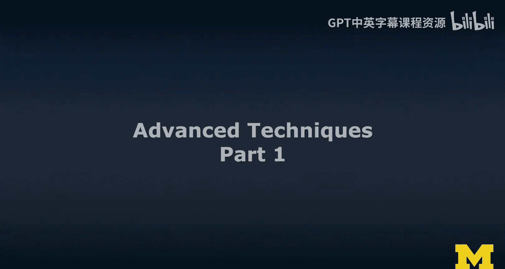
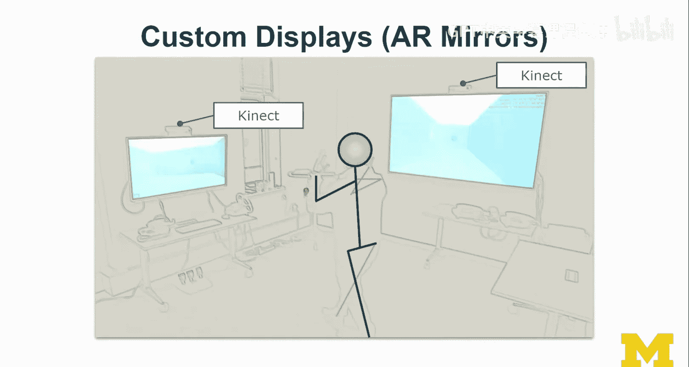
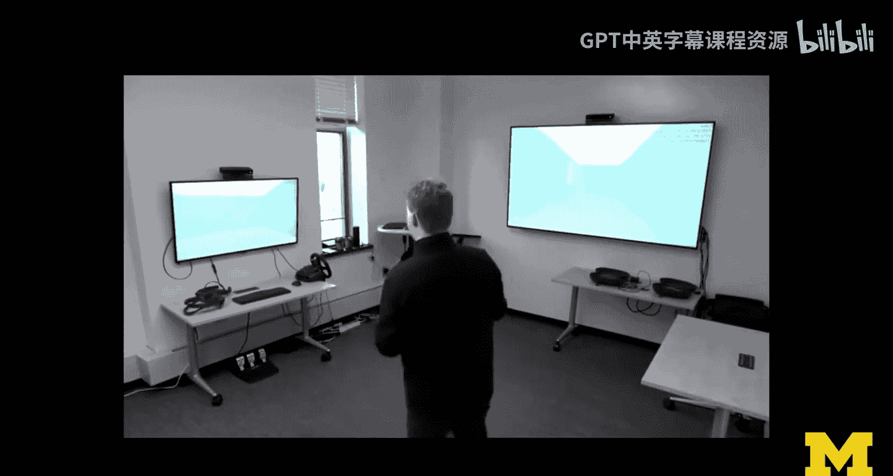
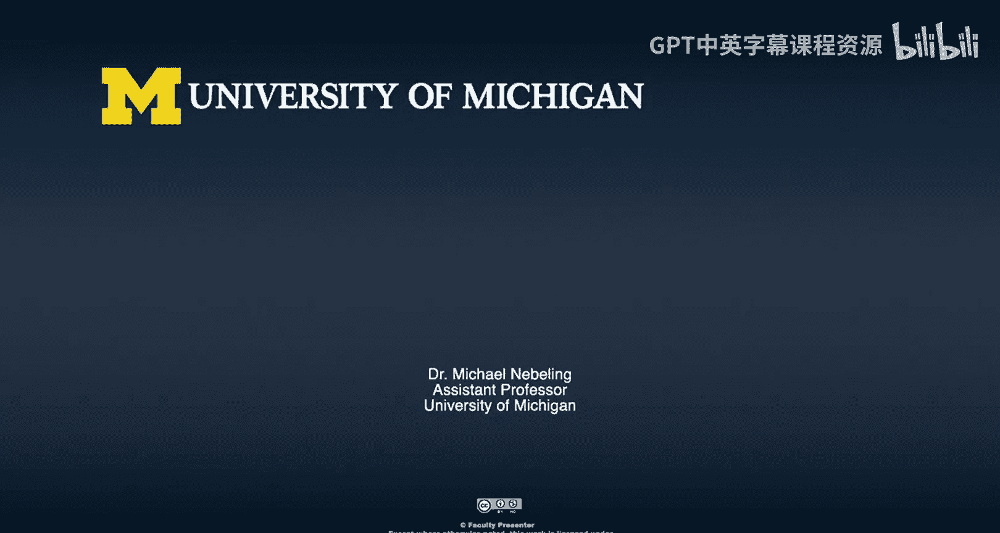

# 123：高级技术专题Ⅰ




在本节课中，我们将探讨一系列扩展现实（XR）领域的高级技术。这些技术超越了标准设备和软件开发工具包（SDK）的范畴，涵盖了虚拟现实（VR）和增强现实（AR）中的创新方法，以及一些跨领域的核心主题。

## 概述

我们将首先关注几个与VR高度相关的主题：程序化生成、重定向行走和自定义控制器。接着，我们会深入一些更高级的AR技术，包括三维重建、物体追踪和自定义显示器。最后，我们将讨论一些横跨VR与AR的交叉主题，例如可访问性、文本输入、多用户协作、自适应布局、渐进式XR以及混合现实捕捉与虚拟制作。

现在，让我们开始深入了解这些高级技术。

## VR高级技术

上一节我们概述了课程内容，本节中我们来看看几个专为VR设计的高级技术。

### 程序化生成

程序化生成的核心思想是，随着用户在物理空间中的移动和探索，系统动态地加载或生成更多的虚拟内容。这不仅仅是延迟加载，更是一种根据用户行为实时构建虚拟世界的方法。

例如，当用户在物理空间中朝某个方向行走时，系统可以即时生成一个迷宫供其探索。这种方法能极大地扩展有限物理空间内的虚拟体验范围。

### 重定向行走

重定向行走是一种利用人类感知特性，引导用户在有限物理空间内行走更远虚拟距离的技术。其原理基于一个简单的观察：人们倾向于朝自己注视的方向行走。

以下是其工作流程：
1.  **视觉提示**：系统在虚拟环境中呈现一个吸引用户注意力的视觉刺激（例如，一个突然出现的物体）。
2.  **视线调整**：用户的目光被该刺激吸引并随之调整。
3.  **路径偏移**：当用户注视该刺激并朝其行走时，系统 subtly（不易察觉地）旋转整个虚拟场景。
4.  **循环路径**：用户感觉自己是在朝一个固定目标直线行走，但实际上在物理空间中走的是一个弧形或圆形路径。

通过这种方式，用户可以在一个较小的物理房间内，体验到在广阔虚拟走廊中直线行走的感觉。

### 自定义控制器

虽然标准VR控制器能提供良好的通用体验，但对于某些特定活动（如打乒乓球或高尔夫），其手感和物理形态可能不够逼真。自定义控制器旨在解决这个问题。

以下是几种实现方式：

*   **触觉反馈**：利用控制器内置的振动马达，在虚拟交互（如击球）时提供力反馈，增强沉浸感。公式可简化为：`虚拟事件` -> `触发控制器振动` -> `增强真实感`。
*   **物理形态匹配**：制作一个在物理形状上完全匹配虚拟物体的控制器（例如，一个真实的乒乓球拍手柄），并将其进行仪器化改造，以便系统能够追踪它。这可能涉及集成惯性测量单元（IMU）或用于光学追踪的标记点。

一个自定义控制器的示例如下：
```python
# 伪代码示例：自定义控制器数据融合
def update_custom_controller():
    imu_data = read_imu() # 获取姿态和加速度
    visual_marker_position = track_camera() # 获取光学追踪位置
    fused_position = sensor_fusion(imu_data, visual_marker_position) # 数据融合
    return fused_position
```

## AR高级技术

在了解了VR的一些高级技巧后，本节我们将目光转向增强现实，看看如何让虚拟内容更智能地与真实世界融合。

### 三维重建与空间映射

三维重建是指AR设备实时扫描物理环境，并生成其三维模型（通常表现为密集的点云或网格）的过程。这个过程也称为空间映射。

其意义在于，系统能够“理解”周围环境的几何结构，从而允许虚拟物体与真实表面进行真实的遮挡、碰撞和放置。例如，虚拟物体可以稳稳地“放在”重建出的真实桌面上。

### 物体识别与追踪

仅有几何结构的三维重建还不够，系统还需要“理解”环境中是什么物体。这就是物体识别（或分割、分类）的任务。例如，系统需要将一组特定的点云识别为“桌子”、“椅子”或“乒乓球拍”。

一旦物体被识别，就可以对其进行追踪。这意味着系统能够持续更新该物体在三维空间中的位置和姿态。结合物体识别与追踪，可以实现强大的交互：例如，用一个被识别和追踪的真实乒乓球拍，去击打一个虚拟乒乓球，并让球根据真实拍面的运动速度和角度做出物理反弹。

## 跨VR/AR技术

无论是VR还是AR，一些核心的交互和系统设计挑战是共通的。本节我们将探讨这些跨领域的高级主题。

以下是几个关键的跨领域主题：

*   **可访问性**：目前，XR体验的可访问性（尤其针对视障、听障等用户）面临巨大挑战。主流开发工具和硬件并未将其作为设计核心，这限制了XR技术的普及范围。
*   **文本输入**：在沉浸式环境中高效输入文本仍是一个未完全解决的难题。我们需要为头戴式设备设计新的输入隐喻和交互方式。
*   **多用户协作**：支持多个用户在同一虚拟或增强空间中进行实时协作，是社交XR和远程办公应用的核心。
*   **自适应布局**：系统能够根据用户的物理环境（如房间大小、家具布局）自动调整虚拟内容的布局和呈现方式，以提供最佳体验。
*   **渐进式XR**：界面和体验能够根据任务需求、用户偏好或上下文，在AR与VR模式之间无缝切换或融合。例如，一个设计应用可能默认使用AR在真实桌面上查看模型，但一键即可切换到VR模式进行沉浸式内部漫游。
*   **混合现实捕捉与虚拟制作**：这项技术正在革新影视制作行业。它允许将真人表演与实时渲染的虚拟背景、角色和特效无缝合成，为内容创作提供了前所未有的灵活性。对于XR教学和演示而言，这也是展示沉浸式体验的绝佳工具。



## 总结





本节课我们一起学习了扩展现实领域的一系列高级技术。我们从VR的程序化生成、重定向行走和自定义控制器开始，探讨了如何拓展虚拟体验的边界。接着，我们深入研究了AR的三维重建、物体识别与追踪，这些技术是虚拟内容与真实世界智能交互的基础。最后，我们审视了可访问性、文本输入、协作、自适应布局、渐进式XR以及混合现实制作等横跨VR与AR的挑战与机遇。掌握这些概念，将帮助你构思和开发更具创新性、沉浸感和实用性的XR应用。