# 126：MRt危机案例研究 🧪

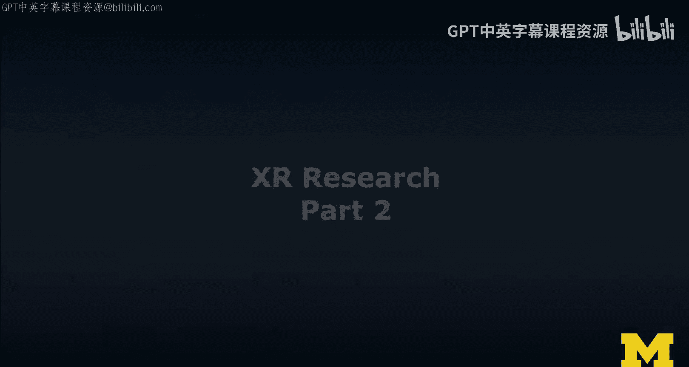

在本节课中，我们将通过一个具体的案例研究——MRt危机案例研究，来深入探讨XR开发中的关键问题。这个案例源自我们发表在CHI会议上的论文《AmRAt：混合现实分析工具包》。我们将以此为例，分析从原型设计到用户研究的完整流程，并聚焦于开发过程中遇到的几个核心挑战。

## 案例研究概述

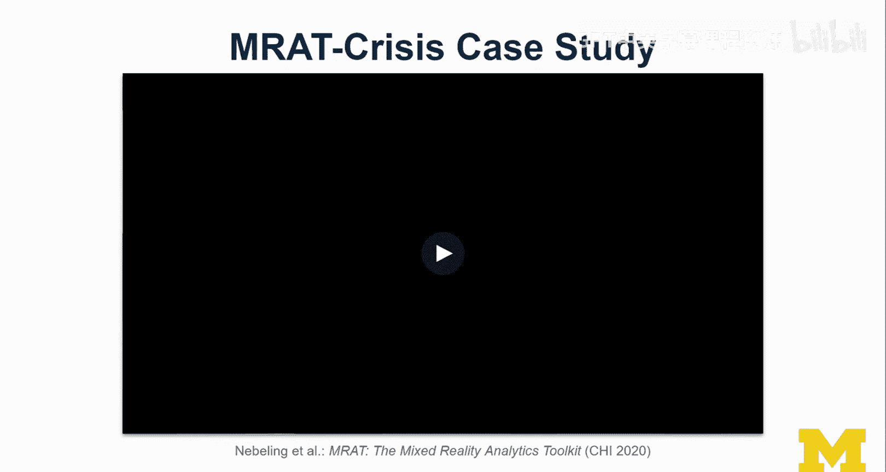

首先，让我们了解一下这个案例的背景。我们进行了一项用户研究，参与者被分成两组，在实验室环境中体验一个原型。这是一个协作式任务，参与者需要在一个模拟危机场景的“密室逃脱”房间中解决问题。他们佩戴着特制的T恤，并使用多种设备。研究的主要评估依据是他们完成任务的情况，而离开房间所用的时间是次要的。过程中，我们设置了一些障碍和规则，但有趣的是，参与者有时会“打破”规则，这本身也是研究的一部分。

上一节我们介绍了案例的基本情况，本节中我们来看看这个案例所涉及的四个主要议题。

以下是本案例研究将重点探讨的四个核心问题：
1.  **快速原型设计**：即使在以HoloLens为主要目标的复杂项目中，我们也经历了完整的原型迭代阶段。
2.  **空间网格**：HoloLens的空间映射功能非常强大，我们希望在实验中充分利用它，但这颇具挑战性。
3.  **标记设计**：参与者T恤上印有随机生成的Vuforia标记。我们尝试了多种自定义标记设计。
4.  **多用户、多设备协作**：这引出了关于协作的重要讨论。

接下来，我将带您浏览几个关键的原型阶段，并重点讲解原型设计的过程。

## 原型设计阶段

与任何项目一样，我们从物理原型开始。我让学生们阅读相关论文，并制作了非常酷的纸质原型，初步构思了如何增强实验室环境。

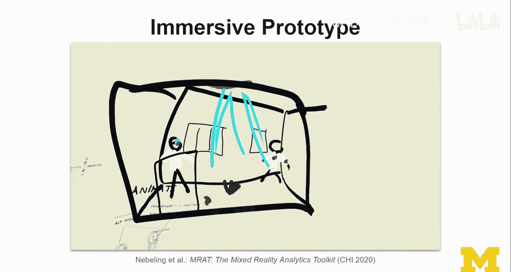

随后，我们进入了沉浸式原型阶段。我本人在Quill中创建了一个VR草图，向学生们展示我的想法。我也要求每位学生进行同样的练习，我们互相评审彼此的原型。我的设想是将房间进行改造，模拟火灾场景，并设置一个逃生门。

当然，最终的体验是AR体验。我们在Unity上花费了大量时间开发原型。它包含许多功能：启动模拟、倒计时、窗户爆炸（使用粒子系统实现颇具挑战）、外部燃烧的建筑、虚拟的伤亡人员，以及一个关键特性——**虚拟窗户**。

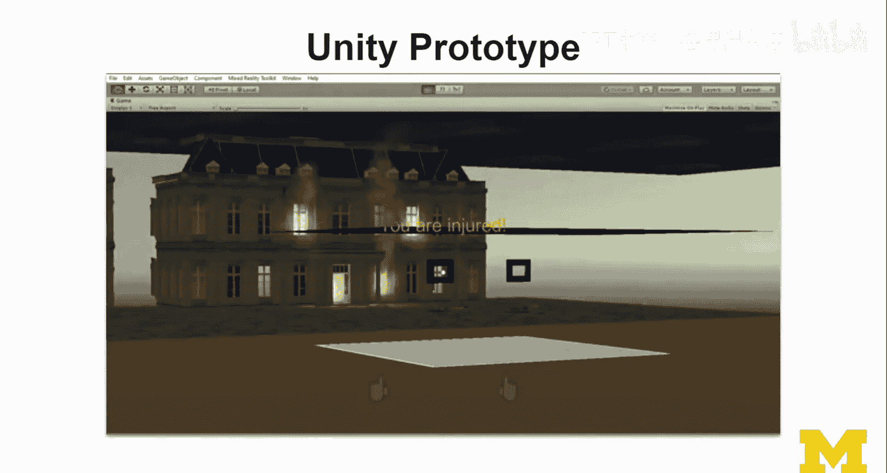

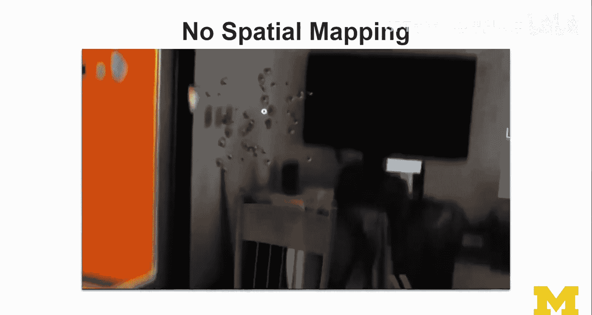

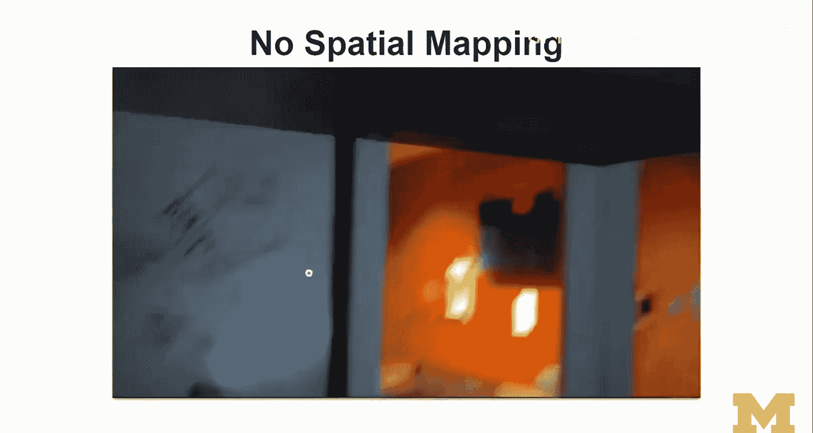

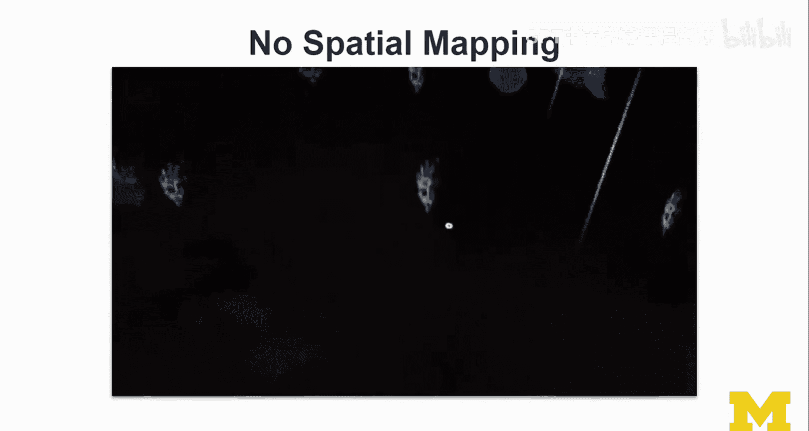

为了更清晰地展示最终体验的设计，让我们看看一个更高级的Unity原型。它包含了菜单和各种物品，其中一些是虚拟物体，一些是真实的物理物体。这是一段HoloLens的录制画面。

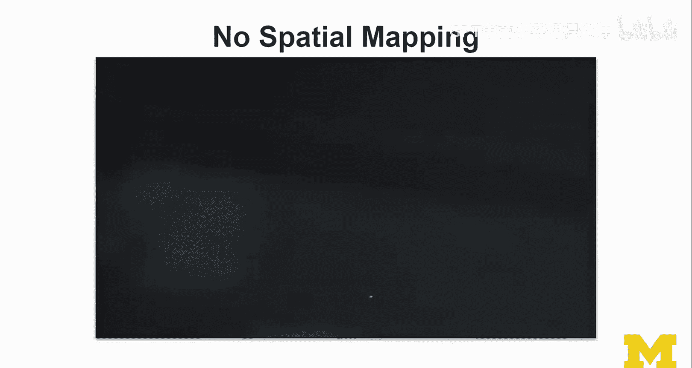

在这个版本中，我们没有启用空间映射，这导致了许多问题。我们想要一个多用户体验，并且希望体验能发生在不同的房间，而不是固定在我们的实验室。我们知道房间里会有人员走动，他们可能会彼此遮挡，或站在增强内容前面造成视觉上的穿模，例如让虚拟物体穿透他们的身体显示出来。

## 空间映射的挑战与解决方案

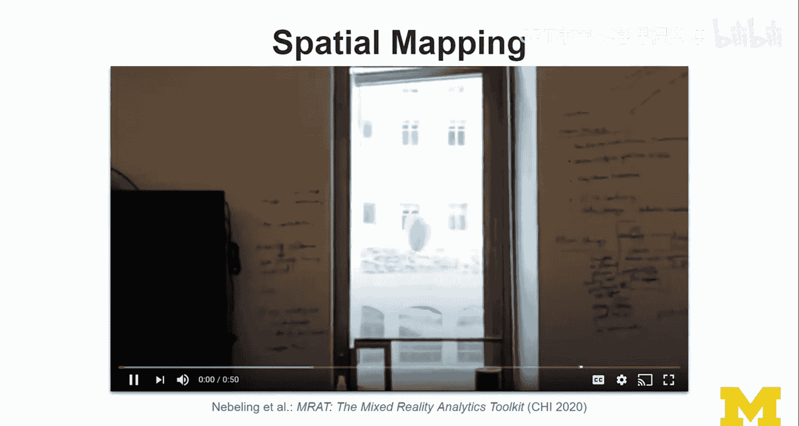

于是，我们启用了空间映射的原型。现在可以看到，系统正确地渲染了遮挡关系，一些物体确实在桌子下面，只有从特定角度才能看到。但您可能也注意到了一些性能问题。

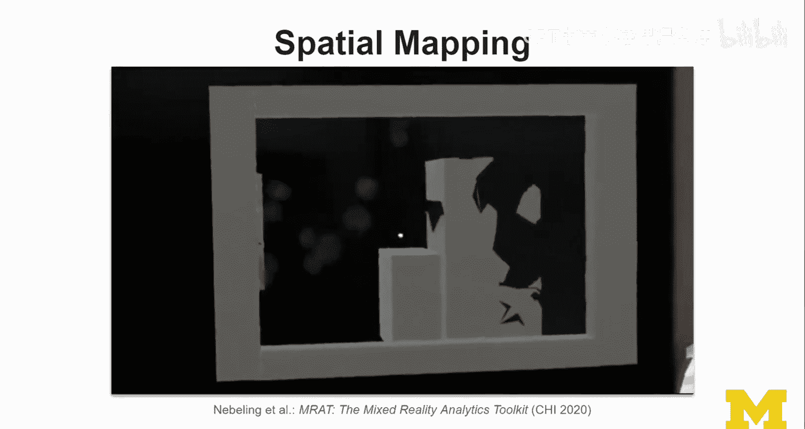

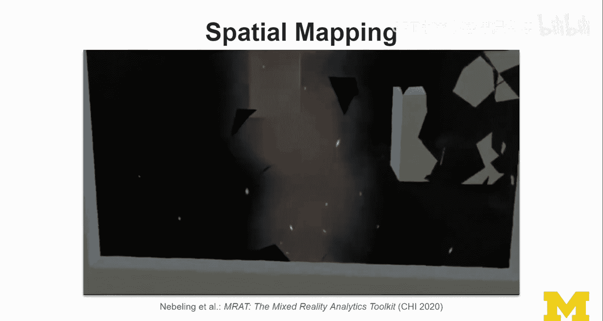

简而言之，尽管空间映射很酷，但它带来了性能挑战。我们有一个想法：如果想在HoloLens有限的视场角外展示一个巨大的建筑和爆炸效果，同时又要处理空间映射的性能问题，该怎么办？

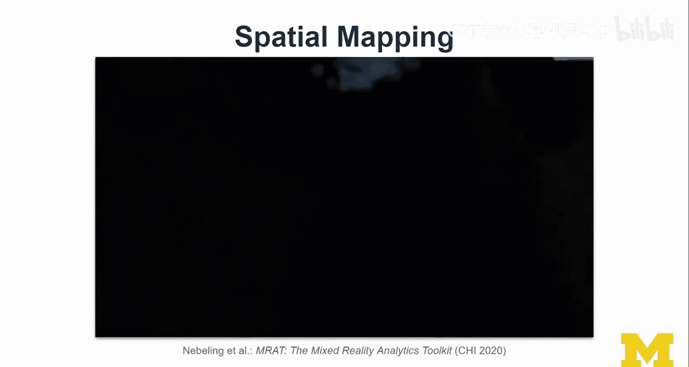

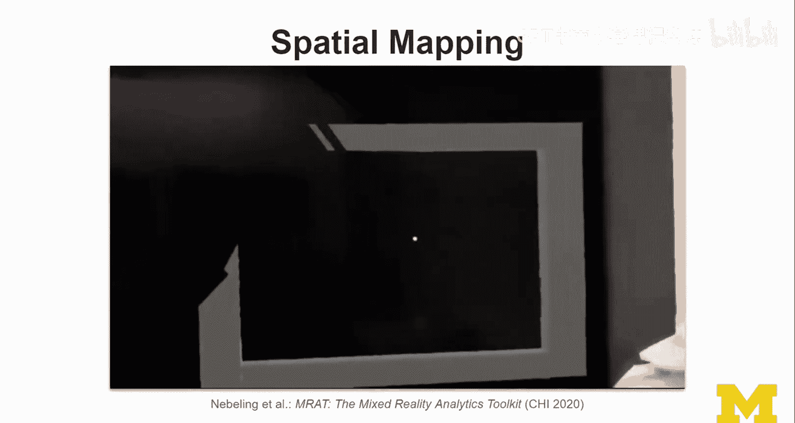

解决方案是创建**虚拟窗户**。既然用户永远无法同时看到整个建筑，我们何不通过“窗口”来展示外部场景呢？我们对此进行了一些实验，这有助于解决性能问题。

## 标记设计与多用户协作

现在，让我们把焦点从空间映射切换到标记设计。在MRt研究项目中，您可以看到不同类型的伤口（内容警告）。我们与护理专业的专业人士合作，她在人体模型上制作了这些伤口。早期的原型看起来还不够逼真。

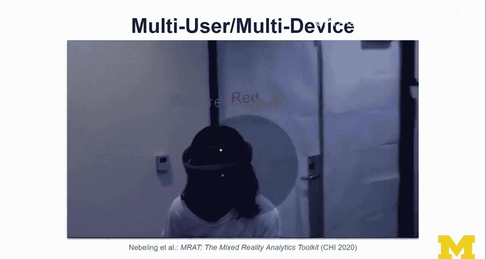

这段视频的重点是引入标记设计。我们花费时间创建了自己的标记，并最终采用了完全自定义的设计。这些标记内置了身份信息，这对于多用户体验至关重要。它们使我们能够精确知道模拟中谁受伤了、是何种伤情、位置在哪里。

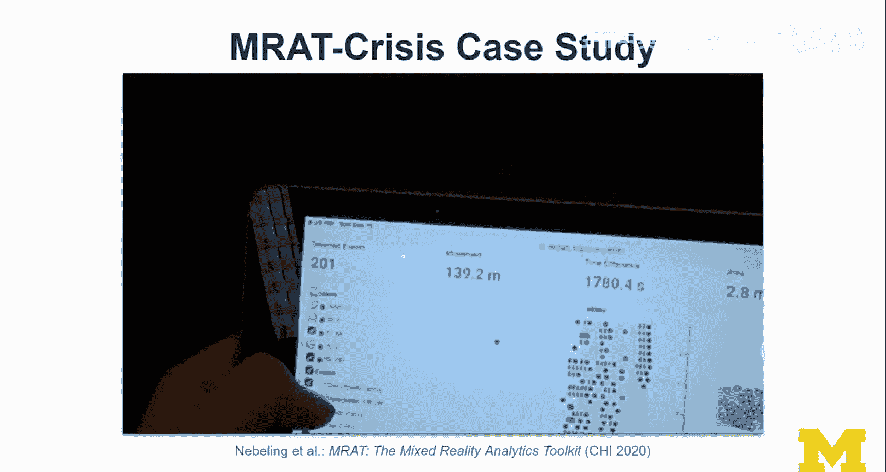

基于此，我们可以实现分诊场景。这是一个多设备体验，用户可以通过HoloLens或智能手机查看伤口，并使用Unity和Vuforia运行分诊协议，为人员分配分诊标签。

## 数据收集与可视化

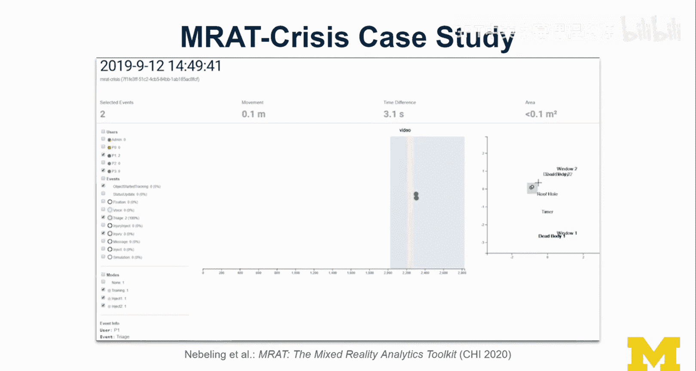

当我们实际进行用户研究时，会将参与者带入我们的应用。AmRAt工具包的核心功能是收集这些事件并允许过滤。使用这些设备进行研究时，可以收集大量额外数据，但问题在于如何可视化和理解这些数据。

我们尝试使用iPad等额外设备进行探索性分析。一旦收集到数据，就能以有趣的方式将其可视化。例如，在中心区域可以看到按步骤回放和一条时间线，右侧则显示平面图。我们可以过滤这些事件，并且任何过滤操作都可以立即在HoloLens上预览，从而回到研究进行的地点进行分析。

## 总结与反思

本节课中，我们一起学习了MRt危机案例研究的完整过程。我快速回顾了设计流程，谈到了我们必须解决的许多问题。当然，论文中还有更多细节。

关于空间映射，我们最终出于性能原因禁用了它，但通过引入剧情（如在窗外放置尸体并告知用户“远离窗户”），我们也能引导用户行为。这很有趣，因为参与者真的会融入故事。

在T恤标记方面，我们无法让房间非常暗，追踪仍然有些问题。我们使用的是较旧的Unity 2017版本，项目从2017年持续到2020年发表。这引出了另一个思考：为何研究周期如此之长？我们曾争论是否要升级到最新的混合现实工具包和HoloLens 2，但考虑到升级成本和对已有原型的影响，最终没有进行。这种在近两年时间里构建一个重大项目所产生的新问题，是在小型项目中不会遇到的。

总体而言，标记设计仍然非常有趣。我们尝试了荧光标记，希望它们能在黑暗中发光闪烁。这个研究项目融合了许多不同的想法，最终重点是通过案例研究来说明MRt工具的使用——该工具能收集数据，而为了未来进行更多研究，我们需要这样的工具来不仅收集，还能可视化数据。

在数据收集方面，我们需要智能且负责任。该项目中我处理的最后一个问题是：如何向人们展示伤口？我们设计了漫画风格、更逼真的风格等不同版本。设想是，不同年级的医学生可以使用它，高年级学生可能需要更真实的内容才能产生“这真是一场危机”的感觉。这里存在很酷的研究机会，例如让不同年级的学生共同完成体验。

最后，关于我们的混合现实版本是否比合作教师原本使用的课堂教学体验更好，是否提升了学习效果，论文中有更多讨论。目前还不能下定论。现在密歇根大学有一个大型XR计划来探索这个问题，虽然有一些研究提供了线索，但似乎每个人都在瞄准小型应用，因此尚无人能断言XR是否普遍改善了学习。也许未来几年，随着像MRt这样的工具出现，我们能在这方面取得更多进展。

这是一项令人印象深刻的学生工作。在此，我也要感谢他们相信这项工作并坚持与我一起完成，直到它最终作为最佳论文发表。接下来，我想结合这项工作和我们对XR开发及研发的更广泛理解，来谈谈什么是好的和不好的研究问题。