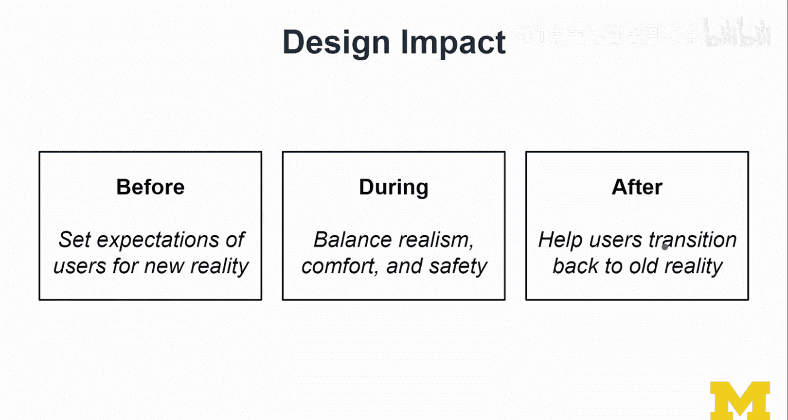
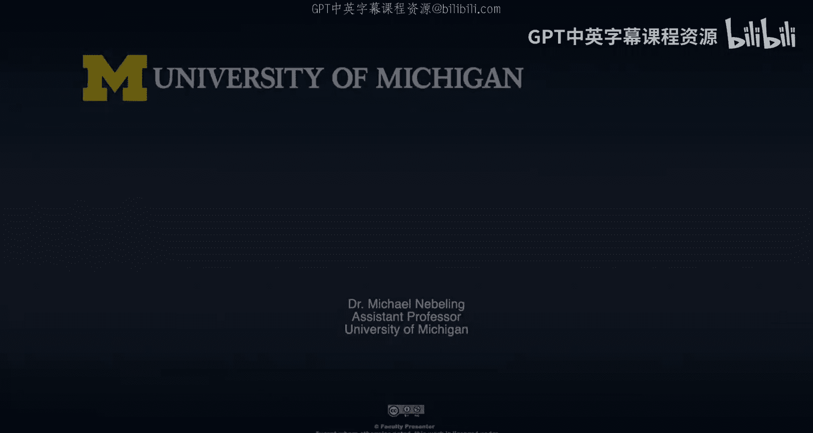

# 127：XR研究前沿（第三部分）📚

在本节课中，我们将探讨如何提出好的研究问题，并了解当前XR领域的主要研究课题。我们还将讨论研究中常被忽视的伦理、社会影响与设计责任。

---

## 好问题与坏问题 🤔

上一节我们讨论了研究的意义，本节中我们来看看如何提出有效的研究问题。在开展项目时，你可能会问自己一些问题，但并非所有问题都能引导出有价值的研究。

以下是一些常见的、但可能效果不佳的问题：

*   **“别人做过什么？”** 在研究中，这是一个很难回答的问题，因为你需要阅读大量文献才能确定。更好的方法是先从一个想法出发，制作原型并进行探索，之后再验证其新颖性。这是一种更具导向性的研究方式。
*   **“目前能做到什么？”** 这个问题过于宽泛和模糊。研究应具有长远眼光。更好的问题是：**这项技术未来将能实现什么？** 这能引导你探索未来，而非局限于现状。
*   **“有哪些唾手可得的成果？”** 这个问题的意图是寻找快速、简易的修补方案，但这并非思考研究的良策。可以将其重新表述为：**“有哪些悬而未决的关键问题？”** 这能帮助你关注真正重要的议题。
*   **“实现这个需要什么？”** 这个问题尚可，但更好的问法是：**“如果我们拥有了这个，会怎样？”** 这鼓励你深入思考技术的影响与可能性，而不仅仅是构建过程。
*   **“它酷在哪里？”** 这个问题可以接受，但更关键的是：**“它能实现什么以前无法做到的事？它能赋能更多人吗？”**
*   **“我们为谁设计？”** 这是一个好问题，但更好的方式是：**“我们如何与他们共同设计？”** 这意味着让用户参与设计过程，而非仅仅为他们设计。

思考如何与用户共同设计，而不仅仅是为他们设计，是进行研究的更好方式。

以上分享了我对XR研究的一些原则和思考，其中部分内容具有普适性。接下来，在第二部分，我们将更具体地探讨当前的研究课题。

---

## 当前XR研究的主要领域 🧭

AR与VR领域有许多共同且持续取得进展的研究课题。此外，还有一些更偏向VR或AR的特定方向。

以下是当前XR研究的一些核心领域：

*   **AR/VR共享课题**：这些是AR和VR共同关注并不断取得进展的领域。
*   **触觉反馈与移动（VR侧重）**：如何设计好的控制器，以及如何在VR中安全、自然地进行移动和追踪，仍是研究热点。
*   **AR侧的感知问题**：例如我多次提到的遮挡问题，此外还有其他涉及人类感知、计算机视觉和场景理解方面的挑战。

目前发表的许多XR研究论文都归属于以上类别。但我认为，我们需要看到更多关于**伦理与社会关切、可及性与公平性、隐私与安全**的研究。因为如今XR技术已不再局限于企业或实验室，正被更广泛的用户所使用。研究重心需要相应转移。

这些社会性课题的挑战在于，它们通常也需要很高的技术知识。不过，通过快速原型设计等方法（如本专项第二门课程所授），你可以着手探索这些领域。

---

## 伦理、社会影响与设计责任 ⚖️

在伦理方面，本课程虽有专门讲座涉及，但我们始终可以做得更好。以下是一些XR设计师应自问的关键问题：

*   当用户无法分辨虚实边界时，会产生什么影响？虽然这可能让你的应用看起来很酷，但这并非负责任的做法。
*   XR设计师的角色和责任究竟是什么？

本课程侧重于技术构建，对伦理的思考可能有所不足，我们不应忘记这一点。

最后，我们必须考虑设计的影响。你所做的一切都会对技术使用者产生影响，这种影响不仅在体验之后，更在体验之前。

以下是设计时必须平衡的几个方面：

*   **在用户体验前**：你需要为用户设定对即将进入的“新现实”的合理预期。
*   **在体验设计中**：你需要在追求逼真度和确保可信度之间取得平衡。同时，必须优先优化**舒适度与安全性**。如果为了追求“酷炫”而牺牲舒适与安全，那绝非明智之举。
*   **在用户体验后**：你需要帮助用户**平稳过渡回“旧现实”**。例如，在我们的危机模拟研究后，我们会对参与研究的师生进行汇报总结。不同用户的反应各异，对于儿童等群体尤其需要谨慎，已有研究表明儿童可能混淆虚拟与现实。未来，随着技术愈发逼真，这方面的研究将更为重要。

---

## 总结与展望 🎯

本节课中，我们一起学习了如何提出更好的研究问题，回顾了当前XR研究的主要技术领域，并重点探讨了常被忽视的伦理与社会责任。

协作（多用户、多设备协作）是一个高级课题，涉及网络技术和专门的设计，需要更多研究，因此我在此也提及它。

当然，仍有未覆盖的内容。本讲座旨在传达参与研究的意义：事实上，只要你从事XR相关工作，无论是否受过专业训练，你都在进行研究。这是一份需要被重视和清醒认识的责任。犯错可以理解，但需要以正确的方式对待。

如果你只学习了这门以开发为中心的课程，而从未深入思考可及性、伦理、隐私与安全，那是不够的。本课程的性质限制了我们在这些方面的深度探讨，但这节研究讲座或许能激发你对这些课题的兴趣。我邀请你学习本专项的其他课程，它们将完善你在此课程中塑造的技术能力，让你具备一些研究者的思维，这将是一个极好的附加收获。