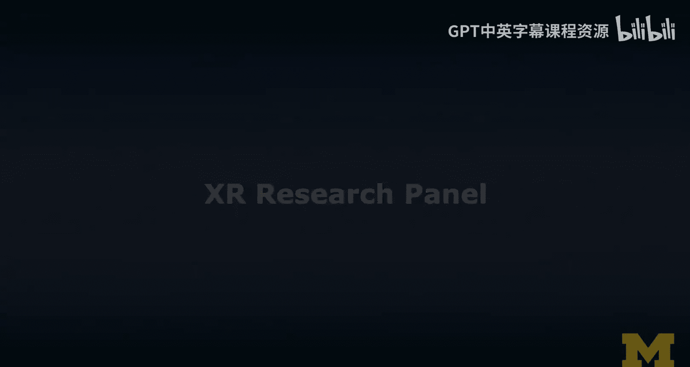
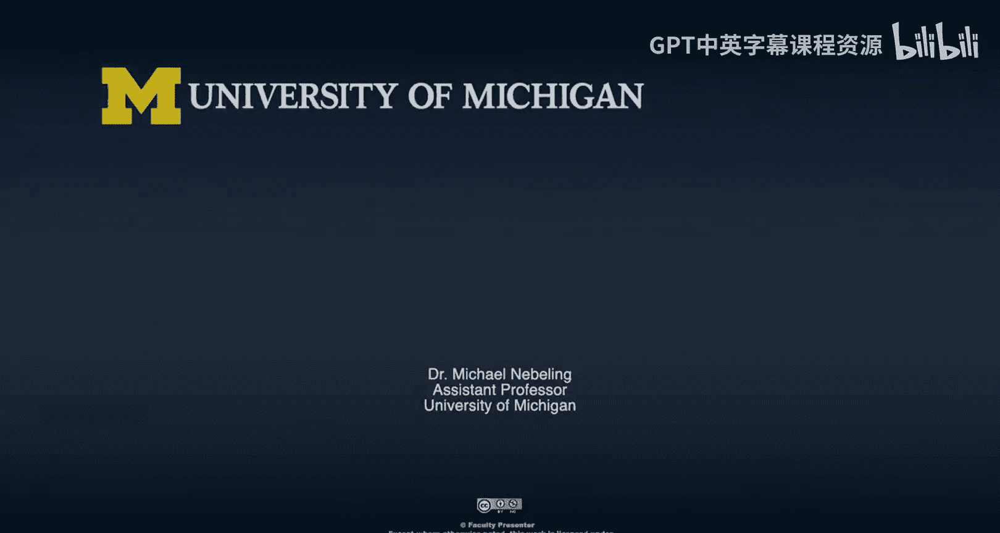

# 128：XR研究专家论坛

在本节课程中，我们将与几位来自密歇根大学交互实验室的研究专家进行对话，回顾他们过去几年在XR领域的研究项目，并探讨XR研究的现状、挑战与未来方向。通过他们的分享，我们可以了解如何开展XR研究以及组建研究团队。

---

## 概述

本节课程汇集了多位XR研究者的见解。我们将讨论几个具体的研究项目案例，例如混合现实分析工具包和360度原型设计方法。同时，我们也会探讨XR研究的热门话题、面临的挑战，并为初学者提供入门建议。

---

## 嘉宾介绍

以下是参与本次讨论的各位研究专家：

*   **Max**：2017年加入实验室进行博士后研究，现为德国某公司的用户体验经理。
*   **Katie Lewis**：2017年至2019年在交互实验室工作，完成了与Michael指导的硕士论文，现为IBM的用户体验研究员。
*   **Maria**：自2016年大一至2020年毕业一直在Michael的实验室工作，现将于埃森哲担任数字顾问。
*   **Shreya**：在实验室工作一年有余，硕士期间加入，即将于今年秋季开始攻读博士学位。

---

## 重点研究项目回顾

上一部分我们认识了各位研究者，接下来我们来看看他们主导或参与的一些具体XR研究项目。

### 项目一：混合现实可用性分析工具包

Max首先分享了一个名为“混合现实可用性分析工具包”的项目。这是一个系统性研究，旨在为混合现实应用提供首个技术性的可用性启发式评估和测试框架。该项目历时约三年，最终形成了一篇拥有14位合著者的论文。其核心价值在于，它为解决混合现实领域长期缺乏标准用户测试方法的问题迈出了重要一步。

**核心贡献**：`MR_Heuristics_Framework` （为MR应用提供了一套可复用的评估体系）

### 项目二：360度纸面原型设计

Katie介绍了“360度原型”项目。该项目专注于利用纸面草图创建交互式虚拟现实和增强现实原型。研究者通过手绘场景，并将其数字化，为设计师提供了一种低成本、快速测试AR/VR应用创意的方法。Katie利用其美术背景绘制的《星际迷航》场景，成为了该项目一个非常出色的展示案例。

**核心方法**：`Paper_Sketch -> Digital_Prototype -> VR/AR_Testing`

---

## XR研究的热点与挑战

在了解了具体项目后，我们进一步探讨当前XR研究领域的 broader 话题和面临的普遍挑战。

以下是讨论中提到的几个关键研究方向：

*   **社会与伦理影响**：隐私、身份认同、数据安全以及设计伦理是亟待深入研究的非技术性领域。
*   **可访问性**：包含两个层面：一是让XR界面本身对残障人士更友好；二是利用AR等技术增强人类的能力（如辅助视觉）。
*   **技术交叉融合**：XR与机器学习、计算机视觉等技术的结合具有巨大潜力，例如通过机器学习提升AR设备的环境语义理解能力。
*   **评估与用户研究**：由于XR技术对多数用户仍属新奇，进行用户研究时面临显著的学习曲线和“新奇效应”挑战，需要精心设计研究脚本和引导流程。

---

## 如何组建XR研究与设计团队

开展XR研究往往需要跨学科合作。那么，如果要启动一个XR项目，应该如何组建团队呢？

Max从工业界的角度给出了他的见解。他认为团队需要包含以下几类角色：

1.  **传统UX/UI设计师**：他们需要学习将二维平面设计思维转换到三维沉浸式空间。
2.  **开发人员**：需要明确XR设计产物的交付形式，以便进行开发实现。
3.  **研究人员/教育者**：负责对团队进行XR相关知识与方法的培训，帮助成员完成技能迁移。
4.  **数据与AI专家**：如果项目涉及机器学习，则需要专人确保数据收集、使用的安全与合规性。

---

## 给XR研究新手的建议

最后，我们为有意进入XR研究领域的学习者总结了一些宝贵的建议。

Shreya作为团队的新成员，分享了她的心得：在这样一个广阔且快速发展的领域，不必急于过早地专精于某个技术点（如成为Unity专家）。相反，应该先花时间建立广泛的理解，从各种来源（如电影、社交媒体、其他学科）汲取灵感，再逐步确定自己的研究方向。

Michael补充道，即使是导师也能从学生独特的生活经验和视角中获得启发。保持开放的学习心态和跨领域的探索精神，在XR研究中至关重要。

---

## 总结

本节课中，我们一起聆听了多位XR研究者的经验分享。我们回顾了如混合现实分析工具包和纸面原型设计等具体项目，探讨了社会伦理、可访问性、技术融合等研究热点，也了解了组建跨学科XR团队的方法。最后，我们认识到XR研究充满活力且边界模糊，鼓励初学者保持好奇，广泛涉猎，并勇于在交叉领域进行探索和创新。