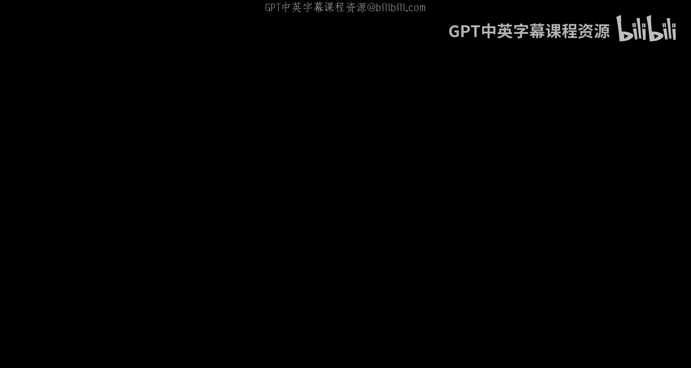
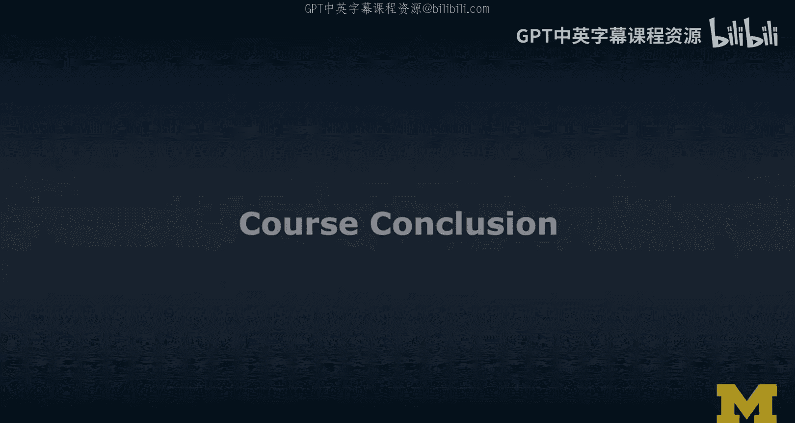
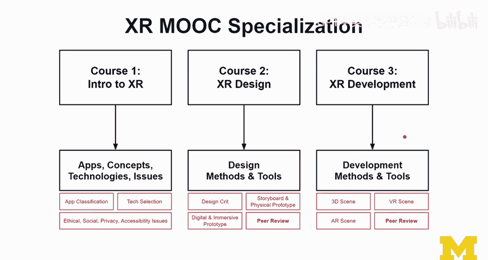
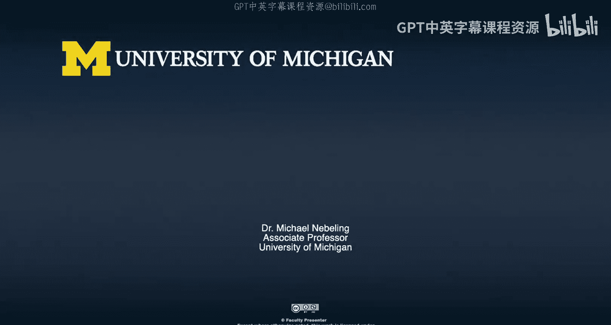

# 130：课程总结

在本课程中，我们学习了扩展现实（XR）开发的核心技术、平台与设计原则。现在，让我们一起来回顾所学内容，并思考如何应用这些知识。

## 课程回顾

上一节我们介绍了课程的整体结构，本节中我们来详细回顾各模块的核心内容。

### 开发平台与工具

我们学习了多种XR开发方法，重点涵盖了以下平台：
*   **WebXR**： 作为Web层之上的技术，用于将XR体验带到网页端。
*   **Unity**： 一个强大的跨平台游戏引擎，广泛用于XR内容开发。
*   **Unreal Engine**： 另一个主流的游戏引擎，以其高保真视觉效果著称。

### 虚拟现实（VR）内容创作

我们学习了构建VR场景所需的核心要素，以下是关键组成部分：
*   **3D模型与角色**： 故事的主要构成元素。
*   **灯光与阴影**： 用于营造氛围和提供视觉引导。
*   **环境与物理**： 创造可信的交互世界。
*   **空间音频**： 增强沉浸感的重要元素。
*   **菜单与平视显示器（HUD）**： 用户界面与信息展示方式。

### 虚拟现实（VR）交互设计

我们探讨了VR中的核心交互方式，主要包括：
*   **选择**： 如何让用户指定对象。
*   **操控**： 如何让用户移动、旋转或缩放对象。
*   **导航**： 用户在虚拟空间中的移动方式。
*   **菜单系统**： 提供功能选项的界面。

### 对象放置与场景设计

我们深入研究了对象在场景中的定位与组织，以下是关键概念：
*   **叙事性与非叙事性放置**： 对象存在于世界空间或屏幕空间。
*   **DOM放置**： 将对象置于文档对象模型中，使其不出现在3D场景。
*   **锚定**： 将对象附着于虚拟相机、控制器或手部等参考点。
*   **图层设计**： 将场景视为前景、中景、背景的合成，类似于电影构图。
*   **迭代设计**： 从草图、360度照片到3D原型逐步完善设计。

### 增强现实（AR）技术

我们学习了AR的实现原理，核心包括：
*   **基于标记的AR**： 使用特定图像（标记）进行跟踪和内容叠加。关键概念包括标记跟踪、标记丢失处理和扩展跟踪。
*   **无标记AR**： 系统通过识别环境中的特征点（如平面、空间映射）来建立跟踪和实现环境理解。
*   **设备差异**： 手持式AR与头戴式AR在设计上的不同，特别是针对有限的视场角（FOV）进行设计。

### 高级主题与研究

在课程最后，我们接触了一些前沿主题，为深入探索指明方向：
*   **高级VR/AR技术**： 如协作体验、自适应布局等。
*   **可访问性**： 确保XR体验能被更广泛的用户使用。
*   **渐进式XR**： 根据用户设备能力提供不同层级的体验。
*   **混合现实捕捉与虚拟制片**： 将真实与虚拟内容融合的生产技术。
*   **参与XR研究**： 了解该领域的研究问题、所需技能（如编程、用户体验研究、界面设计）以及如何贡献。

## 课程在专项中的位置

本课程是“面向所有人的扩展现实”专项的第三门课程，专注于开发。专项的完整知识体系包括：
*   **课程一（概念与议题）**： 涵盖XR应用、概念、技术及伦理、社会、隐私、安全、可访问性与公平性等重要议题。
*   **课程二（设计）**： 专注于设计思维、故事板、物理/数字/沉浸式原型设计及设计评审。
*   **课程三（开发）**： 即本课程，聚焦于技术实现。

结合这三门课程，你将获得关于XR技术、设计与开发的全面而均衡的背景知识。

## 总结与展望

本节课中，我们一起回顾了扩展现实开发课程的核心内容。我们从开发平台与工具入手，深入探讨了VR内容创作、交互设计、场景构建以及AR的关键技术。最后，我们展望了高级主题和参与XR研究的途径。

希望本课程为你打开了XR开发世界的大门。学习之旅并未结束，鼓励你继续探索、动手实践（特别是荣誉项目），并与社区中的其他学习者交流。期待看到你运用所学知识创造出精彩的XR体验。