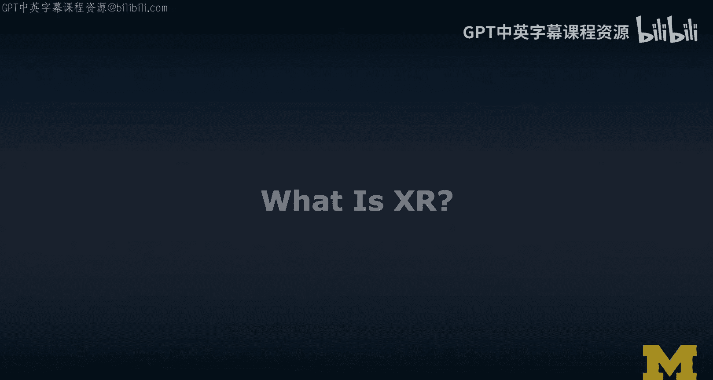
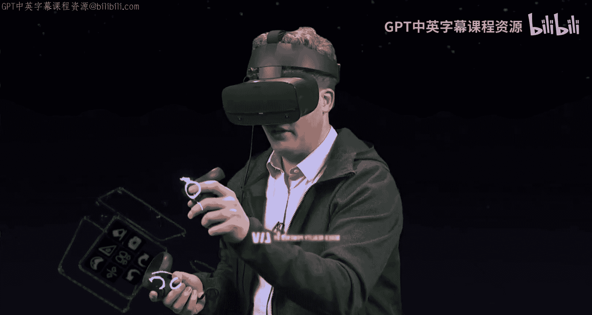
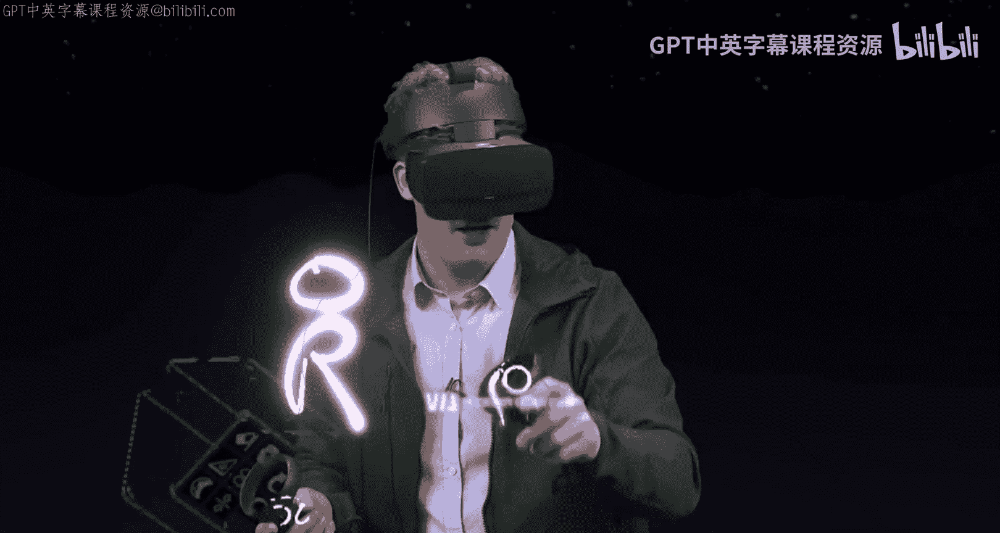
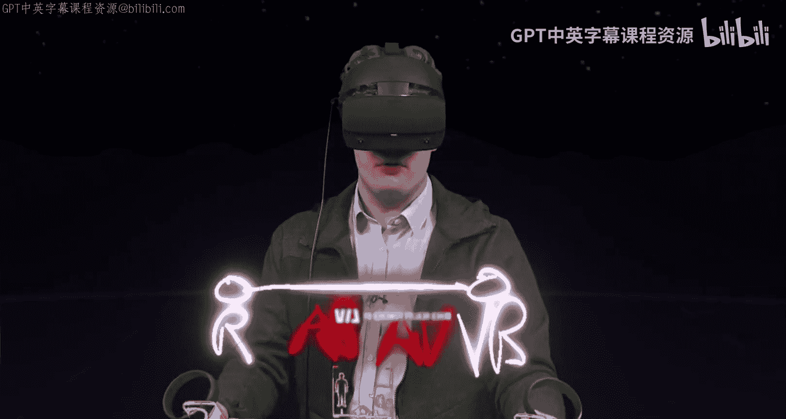
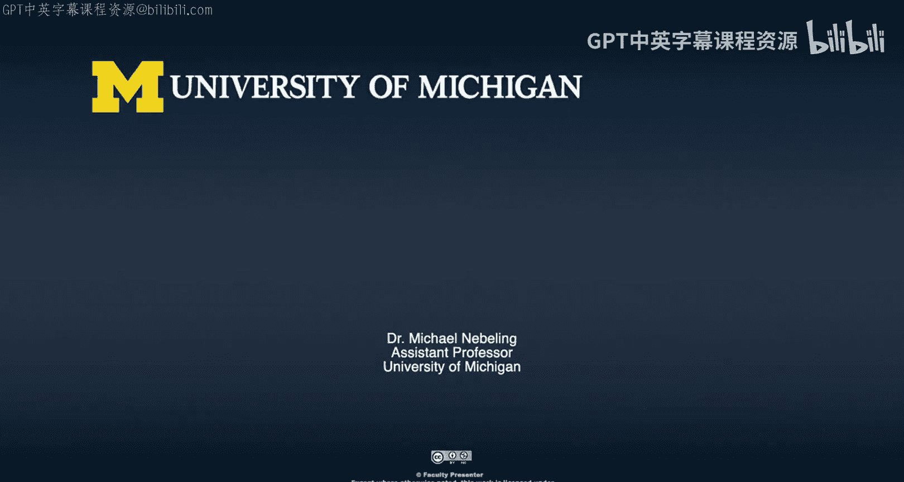

# 密歇根大学《面向所有人的扩展现实（介绍⧸设计⧸开发）｜Extended Reality for Everybody Specialization》中英字幕 p04 3_XR技术定义解析v2.zh_en -BV1jM4m1k73q_p4-

So I wanted to teach you about virtual reality and how it relates to other concepts while I am actually in virtual reality right now。

 Okay， so if we were not in virtual reality， we would call this the reality， the real world， okay。

 and say I'm going to put on the other side of the spectrum， if you will， VR， okay。

 and so I want to tell you how we actually get from the real world to the virtual world。

 the virtual reality that we often talk about in this course。

 and I do this by introducing a few concepts。 Okay， first。

 we often going to talk about AR in this M mooc specialization。😊。

And。AR is augmented reality is the idea of adding virtual content on top of the real world。

 Now you still mostly see the real world， but you do add virtual content。

 If we add a lot a lot of virtual content， you would actually make it over to the point where it's all virtual。

 And this is like where I'm right now everything in here is virtual。

 and I can resize it rescale I can walk through it can do all these things in virtual reality。

 many of which we can also do obviously in the physical world， it is still some form of reality。

 So if we add all this， we end up over at the virtual reality side。

 Now there's one concept that not a lot of people are familiar with。 but it's called AV。

 it's augmented virtual reality。 and augmented virtual reality is really this idea。

 it's the inverse of AR， it is mostly virtual and the augmented virtual with physical content。

 So for example， what you will probably notice is that obviously I do have physical hands but I don't see them in Vr what I see instead is the controllers。

 Now these controllers are very good approximations of my hand movements and where they are in 3D。

Space so you might call this a form of augmented virtuality where you actually bring the real world coordinates and to some sense。

 also the pose and the motion of my hands into the virtual world and so again。

There are also versions of this where you actually do see virtual representations of your hands。

 And now we actually do have hand tracking and can actually get very good at actually entering virtual reality。

 to the extent that we may one day not be able to tell the difference between the virtual and the real world anymore。

 Now， two more concepts that are relevant for us。 First of all。😊。

We usually call this entire space here mixed reality， so MR。

 and it's really like a fancy term that has been used a lot in promotional videos as this kind of like new thing。

 but to be honest mixed reality has been defined in 1994 in the research literature at least by Paul Mugramm from the University of Toronto that was really based on a literature review of all the things we have been doing for more than a decade at the time right in 1994 so AR。

 VR and MR are really old concepts。Now we call thisOOC specialization。

I'm going to bring this back so I can actually draw this nicely。

 we call it the Xr MO okay and now how does XR really fit here into the picture。

 Well it actually refers to everything that is augmenting the real world。

 including full virtual reality。😊，And。The X is really just a wild card for A R， VR or M R。

 And so that's how I'd like you to think about it。Some people refer to it as extended reality again it is actually not introducing any new kinds of interactions or any new ideas。

 it is really just a concept to refer to this entire design space。

 and that's how I'd like us to use that term where X is mostly the wild card again for AR of VR or MRR。

Pretty cool， isn't it？I think this is a really powerful tool for teaching and learning。

 could imagine that in the future we actually do more and more lectures just in VR。

 perhaps with more interesting content， conceptually this was definitely interesting content。

 but you could imagine that I actually start sketching out entire virtual spaces to describe architecture ideas or explain physical phenomena and this is a lot of the stuff that we would talk about in this MO specialization and I really look forward to actually welcoming you once this is going to launch and it's going to be cool。

😊。

