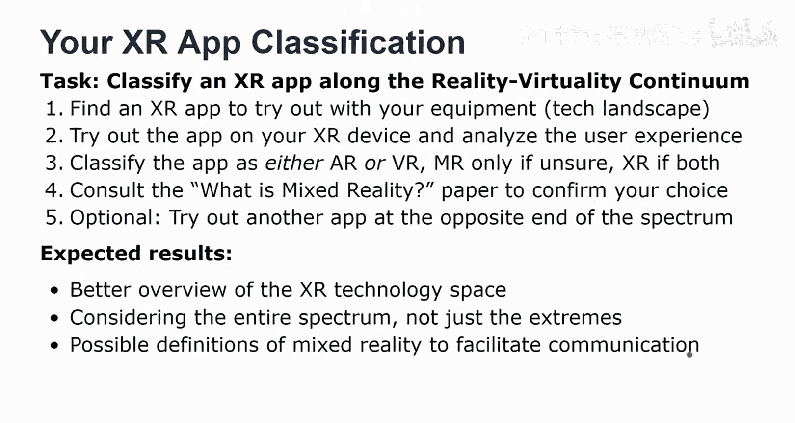
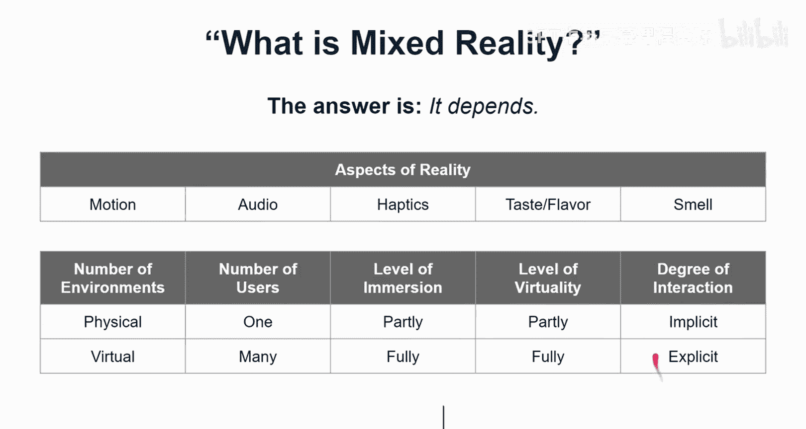

# 密歇根大学《面向所有人的扩展现实（介绍⧸设计⧸开发）｜Extended Reality for Everybody Specialization》中英字幕 p07 6_XR应用分类实践.zh_en -BV1jM4m1k73q_p7-

Again， welcome to the honest track。 This is actually the first exercise as part of the honest track。

 Every exercise comes with the task description in this one we're gonna to focus on trying out an Xr app and actually classifying it along the reality virtual reality continuum of the mixed reality spectrum we have readings to support you in this task and I'm going to go over some of the specifics to set the expectations So the task that I'm talking about is this one classify an XR app along the reality virtual reality continuum so this is something from Mugram and Cacino it's a relatively old paper but it's an interesting concept and I show it to you in a second again but we also obviously talk about it in the lecture so the first step in this exercise or in this task is actually to find obviously an XR app that you can try out with your equipment and so if you have questions about this obviously I write about it I give some tips of how to find XR apps I provide an overviewing the technology landscape。

So we we should have a relatively good sense by now of the kinds of XR applications you should be able to try out。

 So you try out the app on your XR device。 It's important that you're using an AR or VR version of that app。

 it's okay if it's 360， but I'd really like you to see it in virtual reality and analyze the user experience So in this case。

 you don't have to think like a designer you just have to think like an end user and you should then think about the only thing that I'm asking at this stage is to just classify the app as either AR or VR use mixed reality only if youre totally unsure So this is actually not a good option and XR only if both AR and VR are support it and you try out both。

If you have an app that supports both， but you only have AR or VR available。

 then you just say which of these modalities you've tried out and so you can classify the app as either AR or VR in that case。

You should consult the Water is mixed reality paper to confirm your choice and I have a little bit more information about that paper and obviously would like to invite you to read it。

 it was actually written for a broad audience， it's a chiI paper from 2019 from my lab and I thought this might be a good resource for some of us。

And then optionally， you can try out another app ideally at the opposite end of the spectrum。

 so you get to see a little bit more about these different extreme points in the spectrum。

So better overview of the X technology is what I'm hoping you would get from this exercise。

 Also this idea of considering the entire spectrum， so the entire continuum。

 not just the extremes and so really exploring whether something could be characterized as augmented virtual reality and then possible definitions of mixed reality。

 So I think that's where the paper is very useful that I ask you to read because it does identify six working definitions that we have uncovered from talking to experts and in both in industry in academia and it was interesting to see how they don't disagree。

 but they have very different views on mixed reality as a spectrum and what it entailed and what makes an app a mixed reality app。

 and so I think it's good to have this overview that's the whole point of our paper to facilitate communication And so here I show you obviously some examples I have tried out some of the apps So this is me playing a beatabber。

And where do you think this is， I mean， the fact that I'm wearing this olu headset suggests that it is a。

reality app。Right okay， and that's where you put it on the spectrum。

 and you can also reflect a little bit on the user experience。

Here， this one is tricky。 Pokemon go， which I actually still don't really understand。 initially。

 this view is neither augmented nor a virtual reality。 It is actually。

 I don't even know what to call this。 It is a location where 3D mode。 This is not augmented reality。

 I mean， it does map to the space， but according to the mixed reality paper。

 It might actually be weak augmented reality， but I would normally not call this augmented reality。

 And so you can see obviously augmented reality is the term that is usually associated with Pokemon go。

 but as I show now we can see a bit more kind of like augmented reality here。 It's really not great。

 actually it doesn't work very well。 maybe it works better for you， but in my experiments。

 Now I'm not just looking for excuses Why I didn't catch the Pokemon。 I't know。

 I can hear you say that。 No no， it's just a very interesting how I just didn't really understand how。

😊，The game is supposed to work， also the fact that these objects appear in the middle of my room kind of like as if they were in another room。

 so no occlusion， no advanced augmented reality， well yes。

 this would be more along the side of augmented reality。So yes， refer back to the definitions。

 Obviously， virtual reality replaces realityities So by now。

 you would have guessed that beattabr was an example from the virtual reality space。

 and augmentmin reality is obviously enhancing reality。

 but you can still see the real world that's actually a composite view and we talked about these definitions。

 I also highlighted of the fact that the Rs and each of these are different here we have a computer generated a virtual reality。

 And here we actually have the real world。 The R is the real world。 And that's something to consider。

😊，So again， as I said， as a little tip， obviously the device that they're using helps you put things on this continuum more easily again。

 use the most specific term rather than saying it's somewhere on the continuum or this is an XR app。

 I use XR as a place order to say AR， VR or MR， I wouldn't really like it if you class something as mixed reality without a good reason if there's no more specific way to classify an app。

 but we do have quite a few options here， so I prefer that and really I'd like you to go through the exercise and actually try out the app and then place it。

 localize it somewhere on this continuum。It is a continuum。

 So this may make things a little bit ambiguous sometimes， and that is also part of the exercise。

 So to provide more support as you're going through this exercise and also as a way of confirming some of your choices。

 I wanted you to read the what is mixed reality paper。 It's an invitation。

 So this is a paper that my former postdoc Max， my former PhD student Brian and myself have co-author for Chi。

 the Chi conference， the ACM chi conference 2019， we also have more data available。

 if you're more of a researcher， I think it's a good paper。

 and if you're starting out as a researcher in the X space。 So in the mixed reality space。

 this is really the paper for you。 But even if you're not a researcher。

 we wrote it for a broad audience and I hope you will find it helpful and interesting。

So the paper presents a literature review among other things， quite sophisticated literature review。

68 papers that we have looked at in detail and so there is quite a bit of stuff that you would learn just from reading the paper so we also trace back various notions of mixed reality and that's a little bit of the academic part。

 So maybe that part is not that important and not that interesting to you and that's fine so you can skip ahead I wanted to really come to the discussion where we establish the dimensions。

 so the number of environments to consider the number of users that a mixed reality application supports。

 the level of immersion， virtual reality， the degree of interaction and input and output and these are things we discuss in there and so overall this provides a much more sophisticated framework and perhaps a better way to think about mixed reality experiences postdoc Max really wanted to say in the end he really wanted to write in the conclusion the answers it depends and so we kind of left it there。

It's more than it depends， I mean the paper offers different ways to think about it。

 it really establishes the aspects of reality that are often considered。

 so motion is very prominent one， audio， Haptics， taste and flavor or even smell。

 so olfactory displays is something that is supported in some at least virtual reality systems that I've tried out。

And the other way to think about it is obviously， if you start classifying an app in terms of the number of environments。

 so is it both in the physical and in the virtual world or is it just in one of them。

 that is a strong indicator of where we are on the spectrum。

 the number of users helps you further classify。 obviously level of immersion and level of virtual reality。

 these go hand in hand， but they are different notions as we establish in the paper and so I invited to read it there。

 and then obviously the degree of interaction， and throughout my XOoc specialization。

 I also distinguished between implicit and explicit interaction。

 So this comes back every now and then especially in the design and development oriented courses。

 So implicit would be more camerabased you looking at something accidentally so implicit can also be accidental actions。

 but it's more like camera-based interactions， for example。

 in AR when you're bringing markers interview， although this could also be done as a more explicit form of an interaction。

Other ways to think about explicit interactions include specific gestures and speech commands。

 but these are just examples， and so the degree of interaction and what is supported in an app also tells you a little bit more about the immersion。

The level of virtuality and these all really go hand in hand。 together。

 these factors allow you to characterize an XR app。

In a little bit more advanced and sophisticated way than just placing it on the spectrum。

 But so this paper would allow you to verify some of your choices and also be aware of different working definitions。

 and also the fact that there can actually be some ambiguity where we put an app on the spectrum really depends on the number of factors as we lay out in the paper。

 And I'm looking for these kinds of cases where it's not clear cut。

 and that would be an interesting starting point for some of the discussion in our forums。

 So I'm looking forward to seeing what you what you're trying out。

 what kinds of apps you're trying out。 also， if other people are trying out the same apps or other learners report on the same apps。

 that's fine。 it's especially interesting if you start to disagree on some of the classifications。

 but maybe you can provide a rationale， a better rational for how to think about things in the end。

 if you cannot decide I'll come back and。😊，Help you decide and weigh in way I can。

I think it's great that you are thinking about doing some of these exercises here on the On track。

 the honest track is supposed to be fun， but also going deeper and obviously allowing you to earn a certificate in the end。

 which I think would be a great result as a way of showing， hey。

 we've completed this XM MOC specialization or at least one of the courses。😊，So I have more。

 so check back later， there are other exercises in the honest track and really looking forward to seeing what you're doing。

