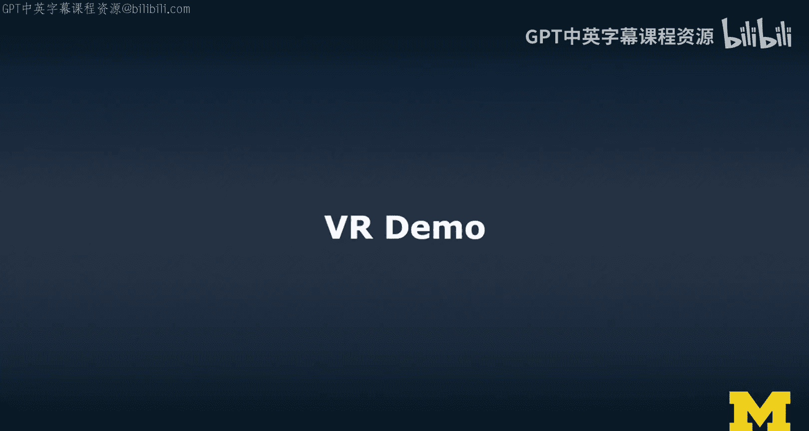
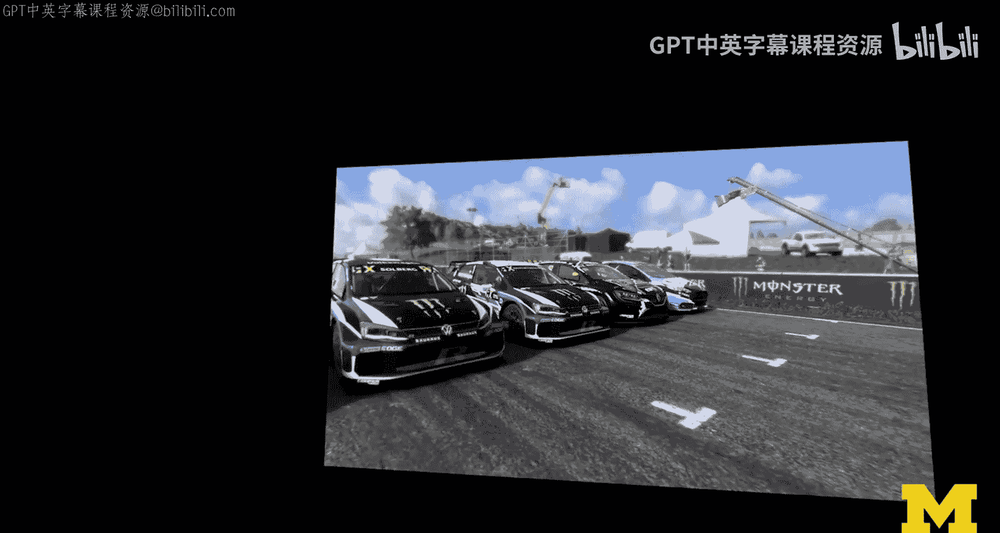
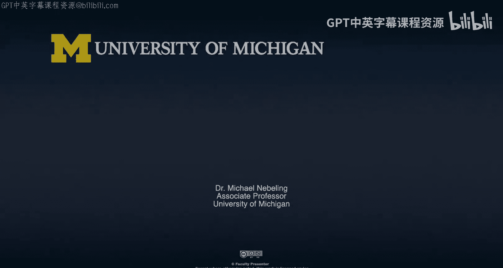

# 密歇根大学《面向所有人的扩展现实（介绍⧸设计⧸开发）｜Extended Reality for Everybody Specialization》中英字幕 p08 7_VR技术演示.zh_en -BV1jM4m1k73q_p8-

So now this is my car， okay？So sitting inside。Okay， to be honest。

 I don't actually have my hand at the gear shift at the moment， but that's what it suggests。

And we can change gears here so that's the car and obviously this is quite cool because now I can also look into the mirror I don't have a rear mirror but who needs a rear mirror this is a rally car and so we're going to get started and we drive a little bit around and。

It's definitely quite immersive。I now have coolest sound in my headset。

 so I'm not sure whether I'm capturing that sound。I'm going to check that in a second。

It's definitely a little more immersive than what I showed you before， and that was a good slide。

Obviously I can like look around right so just like when you're driving。

 I mean if you were sitting next to me I could be looking at you the the whole time， okay。

 nothing happening here is is just practice。😊，And。I'm going to double check that we have the right sound。

And then。Because now the sound is going to the headset and not to the TV。

 maybe that'll make a difference， so I'll be back in one second。

And we're going to just start the championship here。And I'm so excited。 It' is quite tough。😊。

Definitely challenging game， a good simulation。 I mean， I don't know what it's like to driver rally。

 but I think it's pretty cool。😊，And off we go。You have a little bit of a coach giving you some tips。

 we're probably not going to do very well just I'm nervous， you know。

 and I'm actually not that good in the game。So let's get started。

Yeah， thanks， have a good race。Thumbs up。And yeah， yeah， I put my heads at on。 Don't worry。Okay。

 we're just getting ready。I'm sitting in the car， it's a little bit weird， there's this chair。O。

Hello。Definitely not so well we have a car in front of us。

 but that's fine there are still four others so oops。

 we're going to push this guy a little bit off and we really have to cut the corner here。

And I'm being you know， attacked left and right， but that's just live and everywhere jumping， whoops。

And I need the handbrake， but。I'm definitely not doing so well today。I usually struggle。

 but it's actually quite cool as we are。So it feels quite realistic。And this is the hard part。

 and there are people who are really good at this， but I'm not。And as you can tell。

But I'm not doing so badly。Soooh， that was not so good。I think I'm almost the last。

That is obviously quite sad。But。Maybe yeah， this is very useful tip follow the cars ahead。Anyway。

Yeah啊。I have been driving for a long time now。嗯。I'm not sure whether it looks like I know what I'm doing。

 but。I mean， the whole point is， you know， to show you that it's fun and can be quite immersive。

And I'm going after this lap， I'm going to be done， I promise， maybe， we're going to go， oh， come on。

😊，So it's very realistic in terms of like the materials that I'm on also have a very different。

Driving style。 So we're definitely the last now， so。This one is hard。

 I really never really know how to drive on this。Gral or whatever it is。And also。

 sound isn't ideal at the moment， but。I hope。Okay， we just stop here。And we'll accept the defeat。And。

I think the 360 died， but。Well， that was me driving a little bit。

So you know how they usually do interviews。Post game， we're。

So we're going to let me just say it was a tough race。😊，へ。😊，F place is a good place， right。

 So I mean out of five， but nobody knows that。😊，All right。

