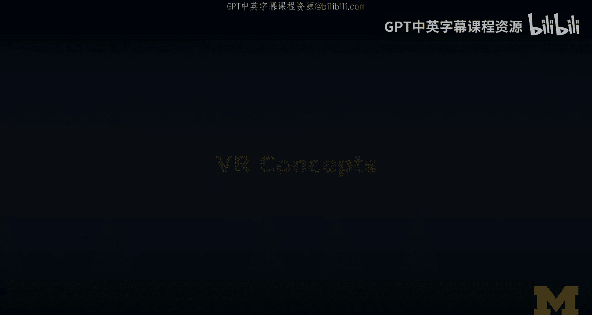
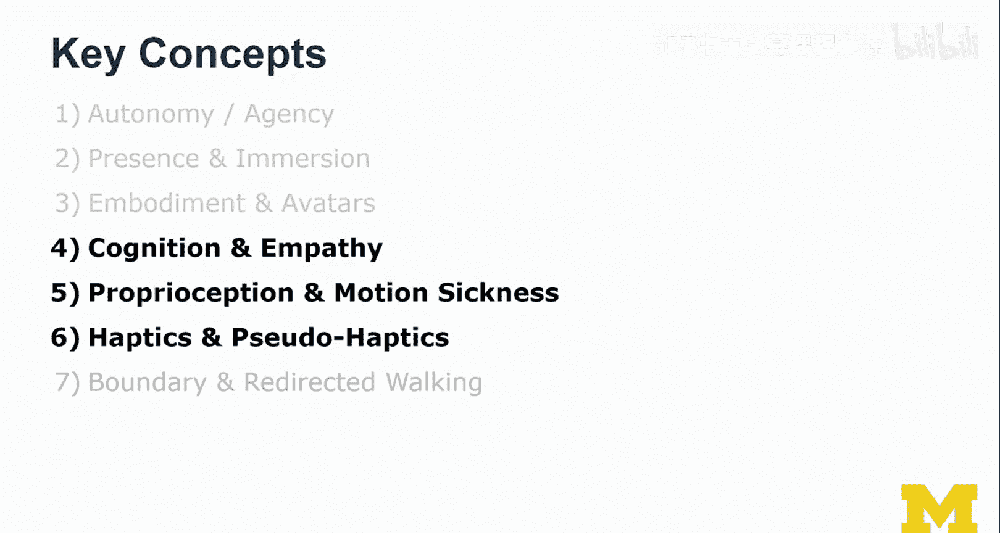

# 密歇根大学《面向所有人的扩展现实（介绍⧸设计⧸开发）｜Extended Reality for Everybody Specialization》中英字幕 p10 9_VR核心概念.zh_en -BV1jM4m1k73q_p10-

Key concepts of virtual reality。

So now that we have established these basic display technologies in the remainder of this video。

 I want to talk about these key concepts。So the seven key concepts that I haveve chosen for us to focus on are autonomy and agency presence and immersion。

 We will talk about embodiment and avatars， cognition and empathy。

 and we're also going to talk about propereller receptionception and motion signalsness and then haptics and pseudohaptics。

 and finally， we're also going to talk about this concept of boundary and redirected walking and now we're going to look at each with a little bit of an example and then I think we have established some of the the key concepts that we should be familiar with before we learn about the technologies that really implement some of these concepts。

So the first concept is autonomy and agency。 And I wanted to give a few examples here。

 So the first example is。The user can actually choose their own perspective in the scene。

 right The user is actually in control of the virtual camera。

 My second example is the user can usually choose to navigate the scene in many different ways。

 So most Vr environments allow you to teleport or provide some kind of menu functionality。

 But if you're using a six degrees of freedom headset you can actually obviously physically walk。

 and then the third example here for autonomy and agency is the user can choose to interact with any objects。

 that is really important basically everything you show to them unless it's like color coded in some specific way。

 they may choose to pick up any object and expect that it behaves when they drop it。

 So physics and gravity are usually thinks that are also expected by users So in a nutshell。

 the user can choose their perspective on the scene。

 the user can choose to navigate the scene in many different ways and the user can choose to interact with any objects that they see both in the virtual world will also in the physical world。

 Let's talk about presence and。😊，So according to Mellater。

 there are like two things going on when you are entering a virtual world。

There is this idea of plays illusion， which really answers this question of am I there and the more time you spend or the better the world is designed。

 you may feel like， wow， you are there。And there is this plausibility illusion which really answers the question is this happening and kind of like it's overcoming this question in some sense。

 the suspension of disbelief kicks in and then these two things will play together the place illusion and the plausibility illusion will make you forget that you are in the R the other main concept often used in virtual reality is immersion。

 And so immersion we usually distinguish between something is less immersive and something is more immersive。

 but what does that mean。 So I wanted to give you some examples。 So I'll start on the very left here。

 less immersive。 My first example is 2D images and videos and that you probably would agree it's not that immersive and you will even more agree when you see the other things that put up there。

 So 360 images and videos on a phone。 So what I mean by that is like you have the 360 content and you like moving your phone around and obviously according to the ds group and an accerometer in the。

😊，Pone so the inertia measurement unit， the IMU， it adjust the perspective。

 and it is arguably more immersive than looking at a 2D image and video on just a screen。

So now what is more immersive is when you actually have the 360 image and video in a headset。

 so even if it's just cardboard like you being in there and looking around and having this whole rendering in your face through stereoscopic views and really kind of like a high field of view anyway。

 when you're comparing the experience of 360 photos and videos on a headset as opposed to a phone。

 you would probably agree that the headset is more immersive。😊，So the question becomes。

 how can we get even more immersive Well， and then I put on 3D images and videos and now we're talking about 3 degrees or freedom headsets I' going to use the Oculus a go and then you have a 3 degrees of freedom controller。

 So it can figure out the orientation in a three degrees of freedom headset so it knows where you're looking but it doesn't know position it just knows orientation So that is arguably not as immersive and why is 3D image and video more immersive than 360。

 Well that's because it has real depth and that really plays a role as we enter even more of the immersion spectrum here So we're going towards 3D images in videos with a 6 degrees of freedom headset So for the 6 degrees or freedom headset I just grabbed as an example the Oculus quest6 degrees or freedom headset so means you can actually not just like look around but also walk around Now that doesn't make a lot of sense for a 360 because 360 is usually captured it like one static position where the camera is。

Or sometimes a 360 camera is moved through the scene。

 but you don't your movement usually doesn't make a difference in a 360 photo video。

 it's really just the orientation， but for 3D where we actually have reap you can now actually start to walk around and we can track this with a 60 degreeser freedoms headset All right my last example here is a 60 degreeser freedom headset with Haptics and other kinds of senseus being stimulated there are ways to make it even more immersive and basically the more senses receive input where the more interactive the content is I mean both implicit like how you explore it with the headset。

 but also express it like how you touch it， how you voice activated how much you become part of the story of whatever the virtual reality content is that really drives the immersion。

And so my example here for immersion is like this， I'm getting up。

 I'm like in the Oculus lounge again， and the first thing I actually did was actually just looking at this view and just looking around。

😊，And feeling like being there。It wasn't exactly a feeling of presence， obviously。

I think the more time you spend in a VR experience also contributes to you forgetting about the real world。

And on the immersion level， that this was really quite immersive。

 it really is a beautiful scenery done in multiple layers and actually quite a lot of detail。😊。

So let's talk about embodiment and avatars。Here， I will continue with the example。

 And what I'll do is actually just show you my avatar。

 And so I'm going to that mirror to actually take a look at myself。

 And after I've been experimenting a little bit with the options that I have。

 I decided this is actually quite cool。 And well， I mean， I look like a cool guy in the mirror。

 I could live with that。 So these were the first three concepts。 I wanted to illustrate。

 And now we're gonna look at the second set of concepts。 So cognition and empathy。

 propception motion sickness and also haptics。 not so much pseudo haptics in this example。

 And the example that I have here is we're going back to me driving in this ready car from Third ready to yeah。

 so here you see me in my car。 I'm in the virtual reality headset now。

 this is 6 degrees or freedom inside out trackinging。 So quite immersive just to say。

 And then obviously I have the。😊。

The steering wheel and the gear shift， and that adds to the haptics aspects。

But the example here is about cognition and empathy。 And as you watch me drive。

 I really develop this mental model of this map that I'm driving on。 So this， I mean， to be honest。

 I've now spent quite a few hours playing this game， and it's really hard to get better at it。

 It's very realistic simulation。And so I can definitely say that I'm building empathy towards race car drivers。

 I mean， that's not really the intention of this game。

 The intention of this game is probably to have fun and maybe get better。 And it's quite competitive。

😊，But it really allowed me to build this empathy towards。Pre sitting the drivers of a ready car。

 And so the other thing I mentioned is proper reception。 And associated with that。

 I have also mentioned motion sickness。 So proper reception is really like。

actually feels pretty good in this car because I'm sitting。

And I'm like moving around here checking my mirror。 I don't have a rear mirror。

 and then I'm like driving around， and I'm looking around what I'm driving and all that feels really kind of natural。

 The speed also kind of feels okay and I don't actually feel motion sick in this game。

 it's actually pretty solid。 When I press the brakes or actually use the hand brake for drifting the car responds as I would expect。

 So overall， I don't actually experience a lot of motion sickness。

 There's really a good mapping between what what I do physically with my body and what happens in the virtual world。

 Finally， I wanted to talk about haptics and pseudohaptics。

 And then I wanted to share the equipment with you that I'm using because they really generate a quite realistic。

😊，I experienced good haptics because I actually have a steering wheel。 I have a gear shift。

 and a handbrake。And obviously， the last piece of equipment is actually the VR headset。 Now。

 that feels a little bit like a helmet。 So I imagine that if you're a ready driver。

 you have a helmet。 So it does， it does feel still quite realistic to have something on your head。

 And so overall， the whole experience is actually quite realistic and immersive。

 And that's also why I showed it to you earlier。 And obviously， it's quite fun。

 at least with the person inside there。 And so what is interesting when you look at it from。😊。

From this outside perspective。I know where the gear shift is。 I know where the handbrake is。

 I cannot see through the headset， So it just really took a few minutes to train the motor memory。

 if you will， so that I remember how to reach out and where the pedals are obviously I can feel those。

 So yeah， this is like how over time basically through haptics and the whole physical layout my motor memory is being trained。

 and I know exactly where the gear shift is and where the handbrake is But like me showing this to you now I'm paying attention to making it like fit into the camera have you。

 But when I'm sitting in the seat。 I really just it's just there I just I just know。

 and this really translates nicely to this experience。

Now I gave some other examples around pseudohaptics， right， this idea of you lifting an object。

 but there's actually no force feedback。 I mean， we can also do muzzle stimulation and all these kinds of a little bit more crazy things that I invite you to read about and maybe talk about in the forums。

 but I't actually have these examples。 There's no approved product right now that I know at least that you know does muzzle stimulation。

 but I've seen a lot of research projects by really good colleagues。

 And so this is also an exciting concept I talked about redirective walking。

 one thing that I definitely want to talk about is the boundary。

 the vul boundary that's something usually set up in a VR experience。

 I'm going to show you this as the last example。😊，In this video。

 I'm going to set up the stationary boundary。And introduce you to the concept of the VR boundary。

 if you want。 So as it shows you in the video is like the safest way to just like。Mark really。

 the area that is really safe to use now I have a chair here， but that one moves all the time。

And that wouldn't be too much of a play area。But that is what it recommends。

 now what you wished you had were like obviously the whole room available。For you to play。

And that's cool。 but as you can see now， the headset finds all these obstacles。

 so there are lots of obstacles here in the room。It finds all these obstacles and it shows you， hey。

 that's dangerous， potentially， so be careful。So what I usually do is and here's a couple of tips for how to do this boundary。

 so we are going to use mostly the safe area。But then I'm going to do a couple of things to it to help me better understand the room layout。

The first thing I'm going to do is I'm actually going to include my desk area so that I stay in VR while I'm seated。

 so I'm okay to accept these obstacles here， that's fine， at least I can enjoy VR while I'm seated。

I'll leave this area of the room untouched， we really don't want to bump into the shelf and the wall。

 and then I'm going to actually mark the exit out of the room， it's not too much。嗯。Okay。

 so I'm going to do that。And that will help me illustrate something in a second。

The first thing I'm gonna show is like， when I sit down now and I'm gonna sit down。

 I'm gonna recenter the menu as I'm seated。 So this is kind of cool。

 Now I can actually leave things that way。And we're kind of。Sitting down。

 hand tracking and all that would work。 I have the， I'm going to show you。

 So I'm kind of like within VR。 And even if I move lean forward or something。I'm still in VR。

 so that's useful if I had not included the balance down there。

 I would exit VR all the time because as I'm like walking to the door to the exit。

If I exit that space now， you will see how I'll see the film set。

And this actually is really disruptive to a VR experience。 obviously。

 so you want to make sure that you're like。Have it mostly set up nicely and be in an area where it's safe？

And have it glanceable。 So when you look down， if you like unsure where you are in the room。

 this happens sometimes。It'll show you and you really want to avoid bumping into areas like this。

So you don't want to go too close to the shelf or to the wall。

And so when it becomes right as reading an issue， I'm going to show you roughly what I'm doing here。

 So when I'm going too close to the wall， it's an issue or the shelf。 And yeah。

 you want to avoid that。 But otherwise， this is。A few tips to keep in mind about the boundary。And。

Yeah， it helps to have a couple of areas marked。To really understand the safe zones。

So this was my overview of key concepts in VR。 I chose a few of them。 There are more。

 I decided to do it by example， and intuitively， rather than giving you the cut and dry definitions some of these you can look up if it help if it's better for you to have a texture definition of some of these concepts。

 But like the setting that I shared about autonomy and agency， empathy， cognition presence immersion。

 These are all some key terms that you should be familiar with and。

That's what I wanted to accomplish。And we also talked about haptics to do haptics so actually there was a lot of stuff in here and now in the next video we're going to look at how these concepts are implemented in technologies and these technologies are actually enabling the experiences that I was talking about。

 including obviously adding to this feeling of presence and immersion。😊。

