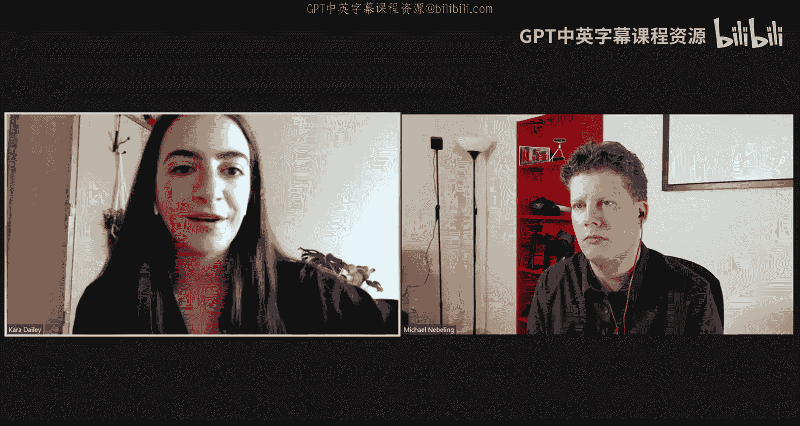
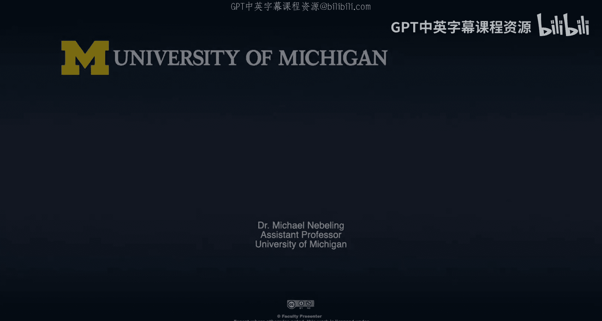

# 面向所有人的扩展现实：101：访谈：Kara Dailey 🎙️

在本节课中，我们将与卡拉·戴利进行一次对话。卡拉曾参与多个项目，并为本MOOC课程提供了支持。她最重要的贡献是帮助我们开发了一个VR项目，用于学习如何设计虚拟现实、如何在VR中导航（移动），以及如何进行对象选择和操作。这个项目基于虚拟现实中的底特律动物园。我们邀请卡拉来谈谈这个项目，并进行回顾。

## 项目概述与背景 🦁

上一节我们介绍了本次访谈的目的。本节中，我们将了解卡拉本人以及项目的起源。

卡拉是密歇根大学信息学院的应届硕士毕业生，主攻用户体验设计与研究，并在XR领域有实践经验。她参与了本课程相关项目。

我们今天要讨论的动物园VR项目始于一次课程答疑。当时，我希望向学生讲解几何学以及在虚拟现实中重建现实世界元素的概念，因此创建了底特律动物园的粗略布局，并收集了一些动物3D模型。卡拉接手了这个项目，并将其完善成了一个精美的作品。

## 设计理念：真实与虚拟的平衡 🗺️

在了解了项目背景后，我们来看看其设计理念。卡拉首先谈到了如何在保持真实感和创造独特VR体验之间取得平衡。

她希望项目与当前底特律动物园的实际情况保持一致。因此，她研究了动物园各区域的样貌和名称，并确保使用的动物模型与底特律动物园现有的动物种类一致，例如长颈鹿、大猩猩和美洲草原区的野牛。

同时，VR也提供了创造独特体验的机会。项目中加入了“夜间动物园”和“投喂区”等现实中底特律动物园没有的特色内容。“投喂区”的灵感来源于卡拉儿时在圣地亚哥动物园喂长颈鹿的经历。在VR中，可以轻松实现这种互动体验。

## 虚拟现实中的导航设计 🚶‍♂️

设计好场景后，下一个关键问题是如何在其中移动。在真实的动物园中需要大量步行，而在虚拟现实中，我们提供了不同的导航方式。

以下是项目中实现的两种主要导航方法：
1.  **传送**：使用带控制器的头显时，用户可以通过传送快速跨越长距离，直接到达目的地。
2.  **菜单导航**：项目包含一个菜单界面，用户可以在其中选择并快速跳转到动物园的不同区域。这个设计最初是为了方便在没有头显时，通过网页浏览器或Google Cardboard进行调试和体验，同时也确保了没有高端头显的用户也能顺畅游览。

## 开发挑战与模型处理 🛠️

导航设计解决了“如何移动”的问题。接下来，我们深入探讨开发过程中遇到的具体挑战，尤其是在使用A-Frame和处理3D模型时。

卡拉提到，处理来自Google Poly的模型是一大挑战。这些模型在尺寸和构建方式上并不一致，有时模型过大，放置到场景中时，用户视角甚至会位于模型内部。

为了解决这个问题，她建立了一个CodePen场景作为“实验室”，将所有模型的初始位置归零并统一尺寸比例，然后再复制到主场景中。这种方法确保了场景中所有元素的一致性，避免了后续调整尺寸或寻找被错误放置的模型的麻烦。

项目中使用了Google Poly的静态模型和SketchFab的免费动画模型。对于光照和材质不一致的问题，她利用A-Frame Inspector工具进行调整。例如，为了营造动物园稀疏的树林感，她通过Inspector编辑了森林环境的变量。

## 项目规划与时间投入 📅

面对复杂的开发工作，良好的规划至关重要。卡拉分享了她的项目组织经验。

在开始编码前，她先用草图规划了整个场景的布局和动物摆放。实际开发时，她采取了分阶段、分场景的策略，而非一次性构建整个地图。这种模块化的方法让复杂的项目变得易于管理。

关于时间投入，整个项目（包括规划和实施）大约花费了20到40个小时，历时一个月左右。这提醒学习者，即使是看起来简单的VR项目，也需要仔细规划时间。

## 交互实现：对象操控的挑战与解决 🍌

规划好场景后，最具挑战性的部分是实现交互，尤其是对象操控。卡拉详细讲述了实现“投喂动物”功能时遇到的困难。

最初，她尝试为所有用户（包括使用Cardboard或网页浏览器的用户）实现“点击投掷”香蕉的功能，但这涉及到复杂的物理模拟，尝试集成多个库后效果并不理想。

最终，解决方案转向了专门为头显和控制器设计的交互。项目使用了`super-hands`等库，支持用户用手柄“抓起”香蕉，然后将其“扔”向动物。释放物体时还需要计算并保持速度，这引入了物理效果，是技术上最具挑战性的部分之一。为了让交互更易进行，虚拟香蕉的尺寸被有意放大，使其更容易被抓取和观察运动轨迹。

## 未来改进与扩展方向 🔮

项目已经具备了导航、游览、投喂等交互功能。如果时间允许，还可以从哪些方面提升沉浸感呢？卡拉提出了几点设想。

她认为可以增加动态元素，例如让鸟类在温室中沿固定轨迹飞行动画。此外，添加环境音效（如美洲草原上的牛叫声）或交互音效（如抚摸猴子时发出的声音），都能显著增强体验的沉浸感。

## 给学习者的建议 💡

在访谈的最后，卡拉基于自身经验，为想要学习XR开发的学习者提供了宝贵的建议。

她认为最大的困难往往源于缺乏前期规划。她建议，在开始任何项目时，先完成所有困难的准备工作，例如统一所有模型的尺寸和初始位置。预先搭建好基础框架，后续调整场景、移动模型等就会变得轻松许多。先苦后甜，做好规划是成功的关键。

## 总结 🎯

本节课中，我们一起学习了卡拉·戴利开发的底特律动物园VR项目。我们探讨了其设计理念如何在真实与虚拟间取得平衡，了解了项目中实现的两种导航方式，并深入分析了开发过程中在处理3D模型、规划项目、实现复杂对象操控交互时遇到的挑战及解决方案。最后，我们还探讨了项目可能的扩展方向，并收获了关于XR开发前期规划的重要建议。这个项目将成为我们学习VR设计、导航和交互的绝佳案例。