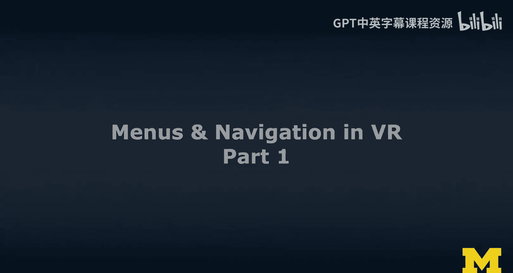
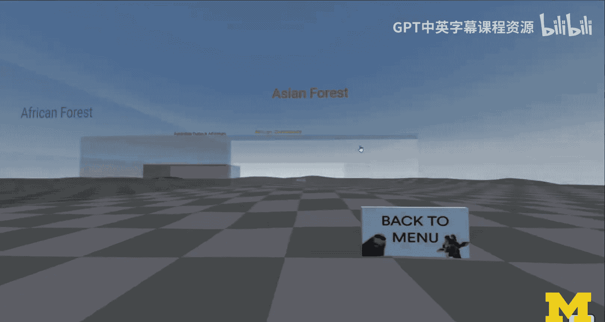
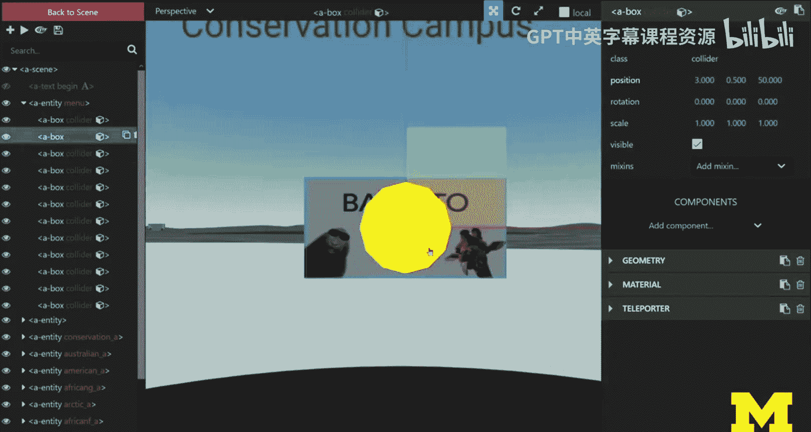
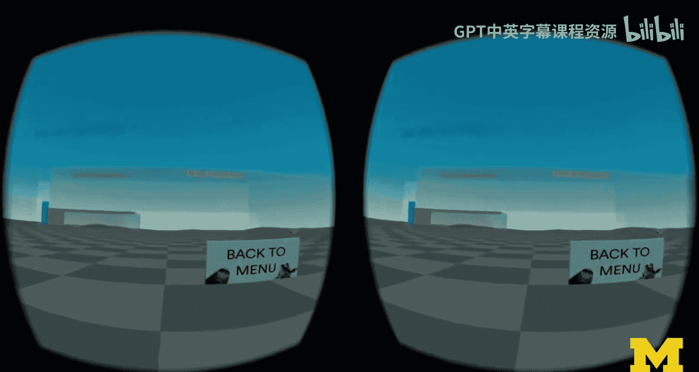
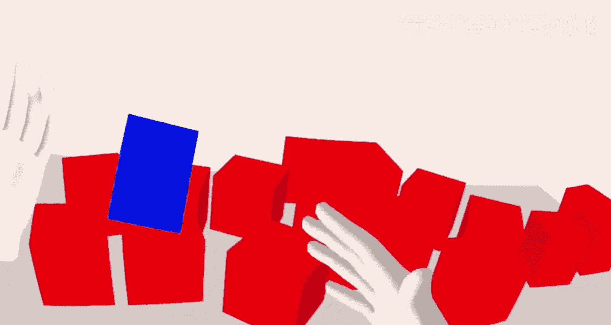
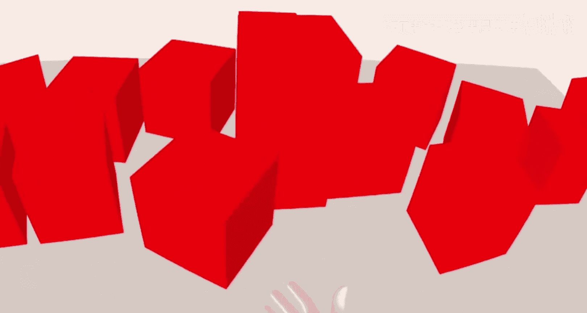
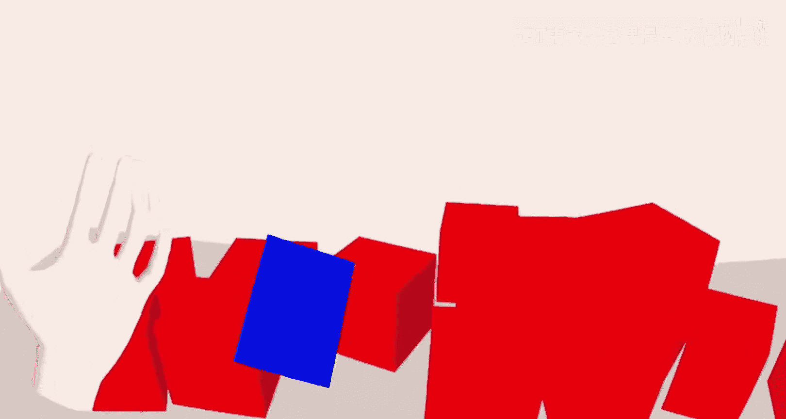
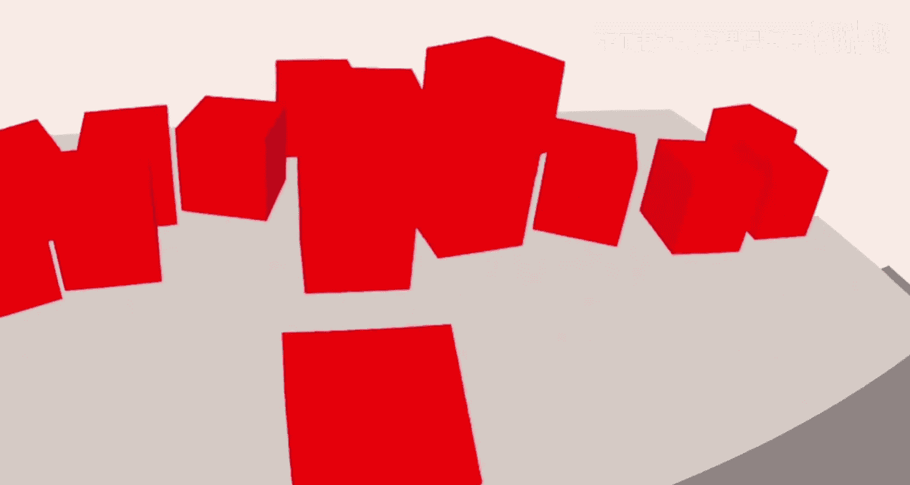

# 密歇根大学《面向所有人的扩展现实（介绍⧸设计⧸开发）｜Extended Reality for Everybody Specialization》中英字幕 p102 18_VR界面导航设计第一部分.zh_en -BV1jM4m1k73q_p102-

Welcome to this lecture on Mens and navigation in virtual reality so if you have experience designing and developing mobile or web applications。

 one of the things you are very familiar with is menus and navigation in these kinds of applications and there are specific design patterns。

 especially for mobile， the web is more like a Wild West but for mobile we have specific design patterns we have things like material design and when it comes to menus。

 there are also specific guidelines and how to do those things。😊，So for virtual reality。

 that's a bit harder。 it's a 3D world。 And how do we navigate in this 3D world。

 What are our options when it comes to placing objects like menus。

 how do you interact with these menus， how do you trigger the functionality of those menus。

 So that's something we're going to talk about and also when it comes to navigation So I'm really thinking about travel here which is basically the moving the viewpoint in our virtual world。

 Now the thing with virtual reality is it doesn't have to match the size of the physical world in which we operate the experience。

 the VR experience。 In fact， most of the time the virtual world that you see is vast。

 it's much larger than what you have available in terms of physical space。

 And so there are common techniques when it comes to navigation， So common travel techniques。

 teleportation is one of them and that's what we're gonna learn about。😊。

So I'm going to start by bringing us actually back into the zoo。

 so we're going to continue learning from that case study。😊，And here we are going into the zoo。

We're going to basically come down and land there and then you see the menu Bam。

 and that's what we want to focus on in this lecture and that menu has the functionality of changing the viewpoint。

 it really teleports us to different locations in this virtual world。

And I'm not operating it in virtual reality just yet。

 this is just me clicking it through so this again the zoo was implemented in Web XR and we are using aframe and we have a couple of components defined to actually enable this teleportation and each of these menu tiles essentially embeds。

Some code triggers some code that actually then moves the viewpoint to a different 3D location。

 we never change the Y， we only change the X and the Z。

So the Y is obviously determined by the height of of your body and where your headset is actually。

In along the Y axis。So here I'm showing a little bit how we have done this。

 a little bit behind the scenes。 So each of these menu tiles has。呃。Well。

 has location associated with that。And what you can also still see is that in these different locations。

 we then have always kind of like also an immediate back button and that button back button takes you back to this ring there。

 That's our starting location。And yeah， so as you can see。

 I've removed all the animals in this this little walkthrough so we can really focus on the virtual world and just navigating in this virtual world。

So in order for menus and navigation to really work the way we demonstrated it。

 this is actually already involving a form of object selection。

 and so we're going to talk about things like ray casting and hit testing we're going to talk about those things in a separate lecture here I really just want to focus on how do we navigate in this world So I'm going show you a virtual reality version of this and as you might expect I'm just picking up the controllers we have no torlight but we have the laser pointer and with that laser pointer I can just pick these tiles and it kind of pointss me there。

 It keeps the orientation so we don't adjust anything in terms of orientation。

If you're looking another way while you're teleporting， then you would continue to look that way。

 there are other approaches to deal with this， so for example。

 in steam VR or in the mixed reality wkit for unity。

You have various configuration options when it comes to defining teleportation zones and hotspots。

 and then also when it comes to landing areas， should your viewpoint be modified further。

So this lecture is focused on menus in the first part。

 So while designing menus and placing menus in virtual reality， you have four main options。

 There might be more。 but these are the common ones so you can fix it so you can place it somewhere in the virtual world。

 It'll always be there。 So it's anchored。 It's kind of like what we would call anchored in augmented reality。

 it can be attached to the head So to the camera that is basically your virtual camera into the world So that's a heads up display essentially I'm going show you an example of this it could be attached to your controller when we track your controller obviously so virtual reality motion controller we can just attach it to that we can attach it to the hand like with the latest VR headsets。

 even now in Webex R I'm going show you one example we have hand tracking it's really the latest I'm glad I was able to put this example in here I was coding a little like crazy to get to show you in the end it doesn't look that impressive。

 but I'm proud of it。's just get started So here's the fixed menu so the fixed menu is really。

Spacing it in the world， it's fixed there， if you look somewhere else。

 but basically disappearing from your viewpoint， it is at that location。

And what I can do in this little example is when I click any of these tiles， a new cube goes born。

That's it。 So there's no difference in terms of functionality。

 What I want us to focus on in this series of examples is where the menus are placed and how that actually changes a little bit the interaction as well。

 even though as I said， technically， the interaction is the same。 you're using Racaster。

 you point at the menu， you get some visual feedback。 and then you can actually trigger it。

So the heads up display， so this is now taking the menu and actually attaching it to your camera to the virtual camera that you have。

And。I can still the way I've implemented it here， I can trigger it so I can hide it and show it。

 but then when it's visible， it's actually really attached to my camera okay so this is not a very common way to do it。

 it is the way I show it here， it could be it could be implemented more nicely。

 but it is an option and so the benefit is obviously that it's always in the view so or it's a disadvantage depending on what kind of experience we're talking about but when it comes to choosing levels for example this might be useful in this specific example。

 I don't like it so much because I'm manipulating the world and so actually want to see more of that but。

😊，It has the benefit， as I say， that it sticks with you with a camera and yeah。It's not very popular。

So a controller menu， this is actually quite， quite popular。

 So in tiltbrush or in many VR sketching applications。

 you always have some kind of palettes attached to the left controller。

 you if you're right handed you put it using the dominant hand。

 the right hand to actually draw and the non- dominant hand。

 the left hand would then be your palette holding some of the tools that you're using。😊。

To manipulate the world and here I show this example so it's the same menu I scale it down a little bit I just attached it to the left hand controller and that's it so the interaction is quite smooth actually so I'm using the left hand to trigger it and'm using the right hand to point at things using the laser pointer that inner section will so that hit testing and raycasting will only work while the menu is visible。

So it's a very clean design and you could do it with also kind of like going through。

 so push through or using the laser pointer， as I show here。

And we are stacking these objects like forever and yeah I wanted you to see this one I thought it was pretty cool and I want to show you this one which is the hand menu I'm particularly proud I was able to implement this with the latest Webex already just came out so I'm doing this on Oculus on the Oculus browser the Oculus Que it's really the only browser right now that supports this hand tracking is experimental。

😊，And I've changed the world a little bit here。 So I'm using。

These hand models and I'm attaching the menu。To the left hand， and I'm actually doing it in a way。

 so I'm tricking it a little bit。This is a one sided plane that's only visible when I actually like this way visible when I put up my hand like this。

And you can see my hand and it's actually being tracked in real time so I dis the password and you can see how it's actually being tracked all the time when I turn the hand around it disappears just because of how I've designed the material of that menu。

 there are nicer ways to do what you could for example。

You could look at the orientation of the hand and then really just show it when。

 when the hand is like this。 But this is a very simple prototype。 and it already looks quite cool。

Because it's hand interaction， I can start playing with these cubes， I mean playing。

And it's actually quite interesting so what we can do with hand interaction like this is we can't have force feedback。

 so the advantage of a virtual reality controller would be that we could have it has vibration motors we could do something there obviously the researchers among us would just say hell you just do muscle stimulation。

St play， we can give you feedback even when you're just using your hands and that's true。

 but it's experimental and it's。😊，As far as I know not improved。

 there's no product when it comes to musclezz stimulation that you can just like attach to yourself and do this kind of stuff if you're interested in obviously I'm just going through some of the basics here but in my mind I'm always thinking about some of the more advanced stuff because that's what I really like to do but it's important to be building this foundation but if you're interested in some of these things I can also share more research papers in that space I have nice colleagues and friends really working in this area。

😊。

