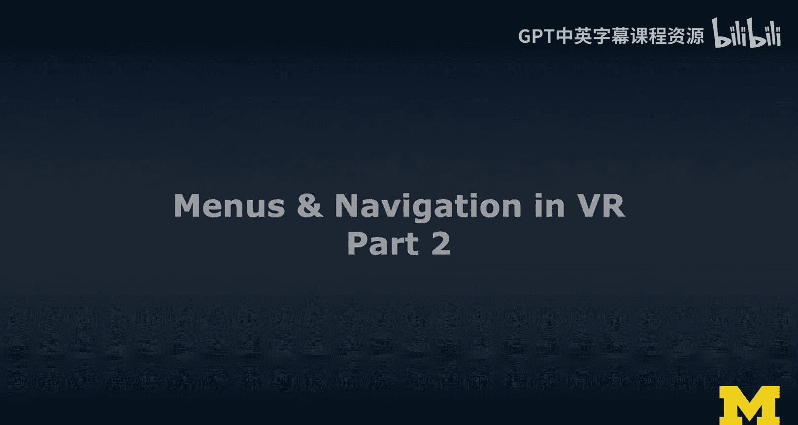
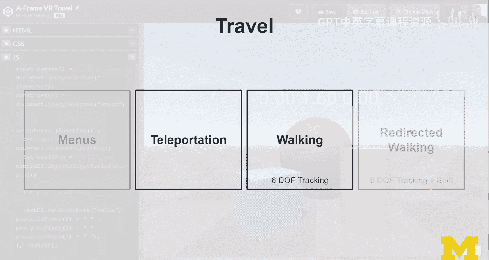
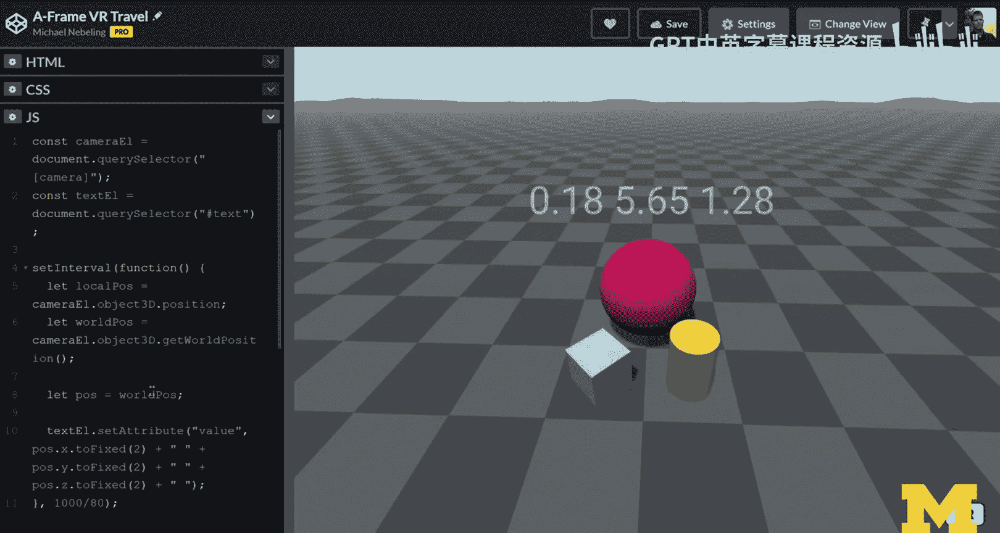
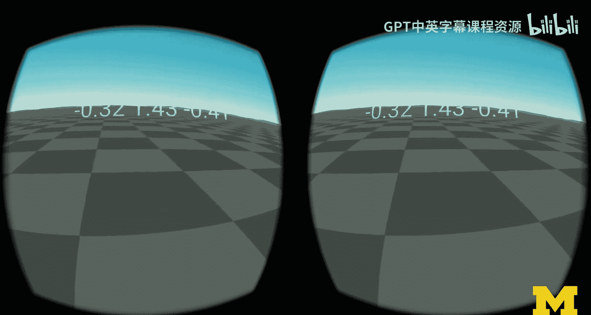
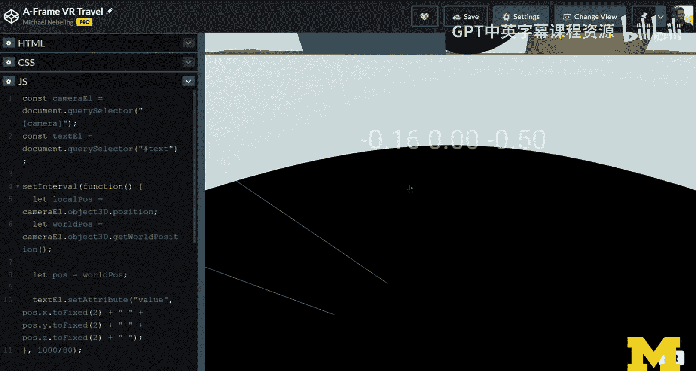
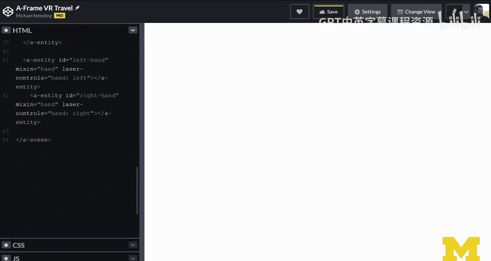
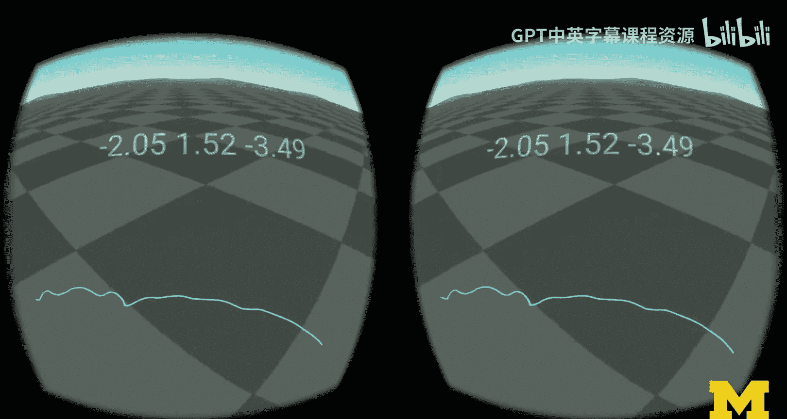
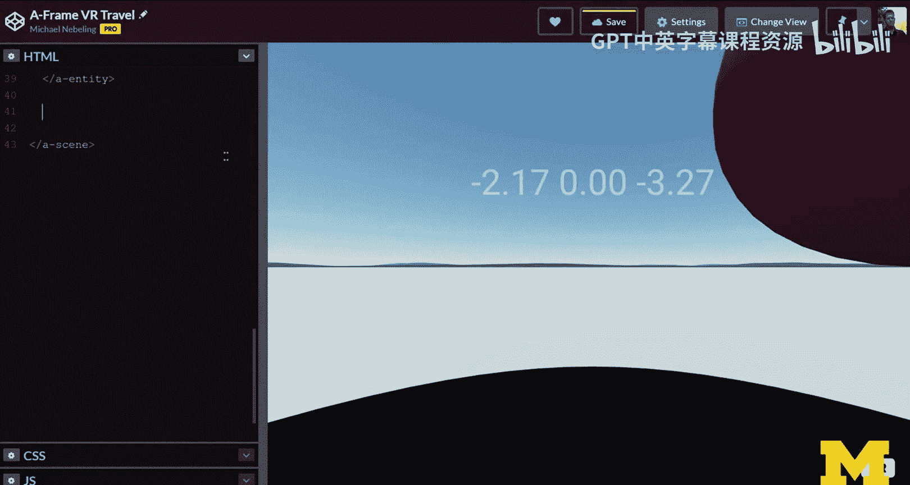
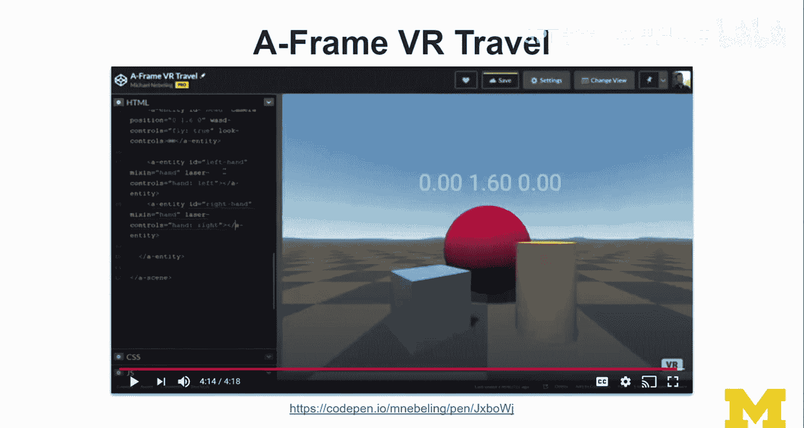
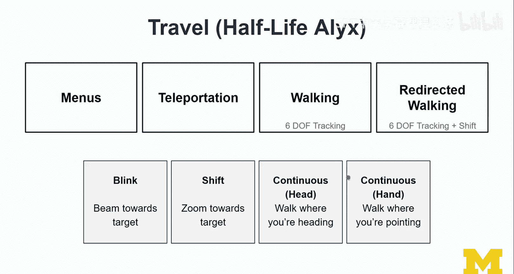

# 面向所有人的扩展现实：103：VR界面导航设计第二部分




## 概述

在本节课中，我们将学习虚拟现实中的导航设计，特别是“移动”这一核心概念。我们将探讨不同的移动技术，并通过实际演示和代码示例来理解其实现原理。

## 导航的核心概念：移动与寻路

上一节我们介绍了菜单设计，本节中我们来看看导航。在最高层面上，导航可以分为两个部分：

*   **移动**：这是视点运动的**运动组件**，例如传送功能。
*   **寻路**：这是用户考虑所有选项后决定去哪里的**认知组件**。



本节课我们将专注于**移动**部分。



## 虚拟现实中的移动技术

以下是几种主要的VR移动方式：

1.  **菜单触发移动**：通过菜单选择目的地进行移动，我们在动物园示例中广泛使用了这种方法。
2.  **传送**：通过控制器发射射线来指示着陆点，然后瞬间移动到该位置。这可以是控制器触发，也可以通过菜单触发。
3.  **真实行走**：在六自由度头显中，如果使用Inside-Out追踪或设置了定位基站，用户可以在一定物理空间内真实行走。
4.  **重定向行走**：这是一种高级技术，通过应用一个增益函数来扭曲用户的行走感知。例如，在物理空间中直线行走，但在虚拟世界中可能走的是曲线，从而允许用户在较小的物理空间内探索较大的虚拟环境。这属于研究性内容，我们将在课程最后一周的高级技巧部分详细讨论。

接下来，让我们重点看看传送和行走这两种最常用的技术，并通过一个详细的演示来学习。





## A-Frame VR移动演示



我将通过一个A-Frame示例来演示VR中的移动。在这个场景中，摄像机的位置变化遵循右手坐标系规则：





*   向前移动会减少Z值。
*   向后移动会增加Z值。
*   向左移动会减少X值。
*   向右移动会增加X值。

我还可以飞行，例如上升到3米的高度。在演示中，我会实时打印出世界坐标位置，这对于理解传送功能很有帮助。



当我进入VR模式后，可以通过身体动作进行移动：
*   身体前倾会减少Z值。
*   身体后移会增加Z值。
*   身体左右倾斜会改变X值。
*   蹲下会显著降低Y值（大约1米）。

**传送功能**允许我通过控制器指向目标位置并瞬间移动过去。当我传送到一个对角线方向的位置时，X和Z坐标都会发生显著变化。

### 摄像机“装备”的重要性

实现流畅移动的一个关键概念是**摄像机“装备”**。这个“装备”是一个包含以下实体的父级容器：
*   头部（摄像机）
*   左手控制器
*   右手控制器

**代码示例：A-Frame中的摄像机装备结构**
```html
<a-entity id="rig">
  <a-entity id="head" camera></a-entity>
  <a-entity id="leftHand" hand-controls="hand: left"></a-entity>
  <a-entity id="rightHand" hand-controls="hand: right"></a-entity>
</a-entity>
```

当我们移动或传送时，需要移动整个“装备”，而不仅仅是摄像机。如果只移动摄像机，控制器会停留在原来的世界位置，导致用户“身首分离”的错乱体验。通过移动“装备”，我们可以确保头部和控制器作为一个整体被带到新的位置。



## 《半衰期：爱莉克斯》中的移动设计实例

《半衰期：爱莉克斯》是一款优秀的VR游戏，它巧妙地集成了多种移动技术。它主要展示了四种移动方式：

以下是游戏中四种移动方式的简要说明：

1.  **闪烁移动**：传送到目的地，伴有短暂的屏幕淡入淡出效果。这是最舒适的移动方式。
2.  **平移移动**：传送到目的地，伴随快速的线性移动动画（没有黑屏过渡）。
3.  **头部导向连续移动**：按住控制器摇杆，朝你**头部注视**的方向持续移动。
4.  **手部导向连续移动**：按住控制器摇杆，朝你**手持控制器指向**的方向持续移动。

在游戏中，**传送**功能设计得非常出色。它会计算目的地是否合法（例如，是否可站立、是否在跳跃范围内），并可视化着陆效果。如果目的地太远，可能需要多次传送才能到达。

对于**连续移动**的两种方式，体验因人而异：
*   **头部导向移动**可能更容易引起晕动症，因为身体静止而视觉在移动，感官产生冲突。
*   **手部导向移动**提供了一些本体感觉（因为手在动），但这种方式不符合直觉，感觉像在“超人式”飞行，可能也不是主流选择。

## 总结

本节课我们一起学习了VR界面设计中的导航部分，重点是**移动**技术。我们了解了传送、真实行走和连续移动等基本方法，并通过A-Frame演示理解了**摄像机“装备”** 对于统一移动的重要性。最后，我们以《半衰期：爱莉克斯》为例，观察了多种移动技术在实际游戏中的混合应用与用户体验差异。


关于菜单设计，虽然具体形态会快速演变，但总体上仍可归类于固定、注视、手持和身体附着这四大概念范畴。掌握这些核心概念，将有助于你理解和设计未来的VR交互界面。