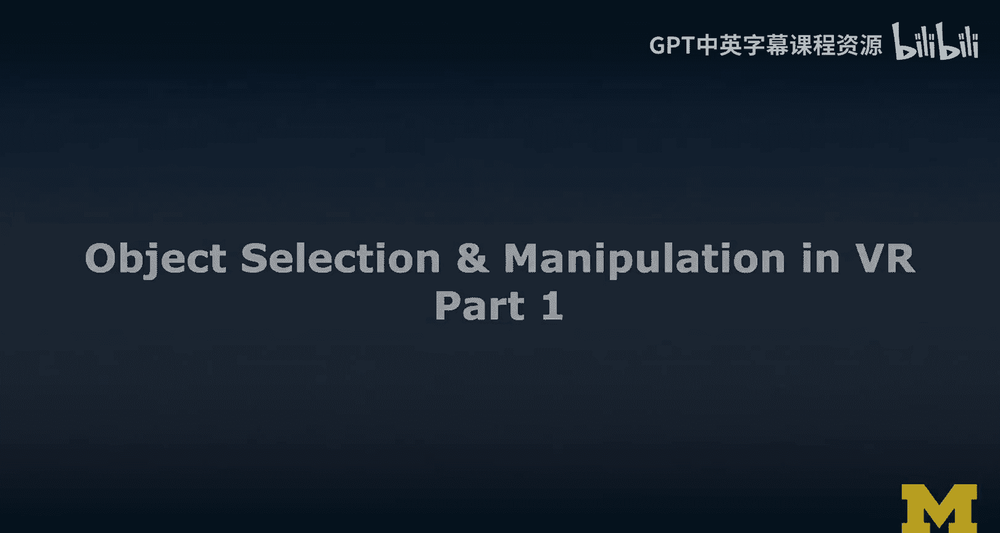
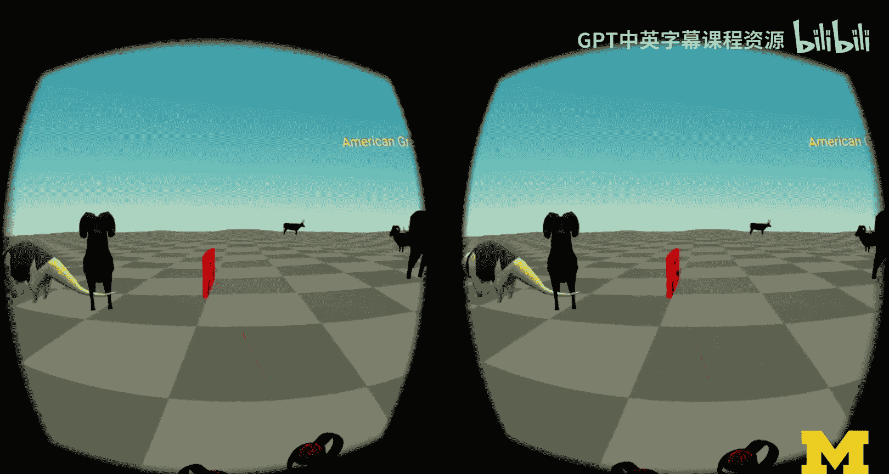
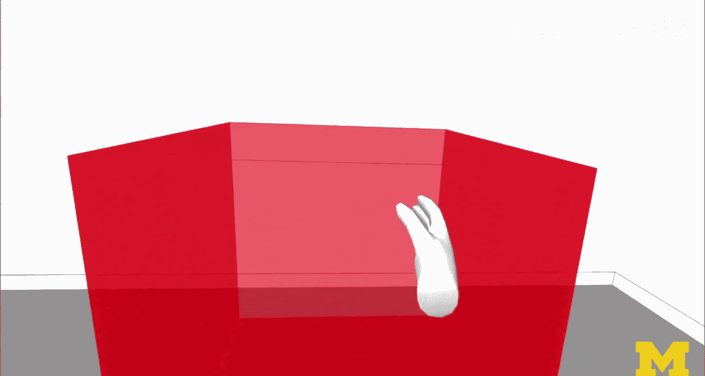
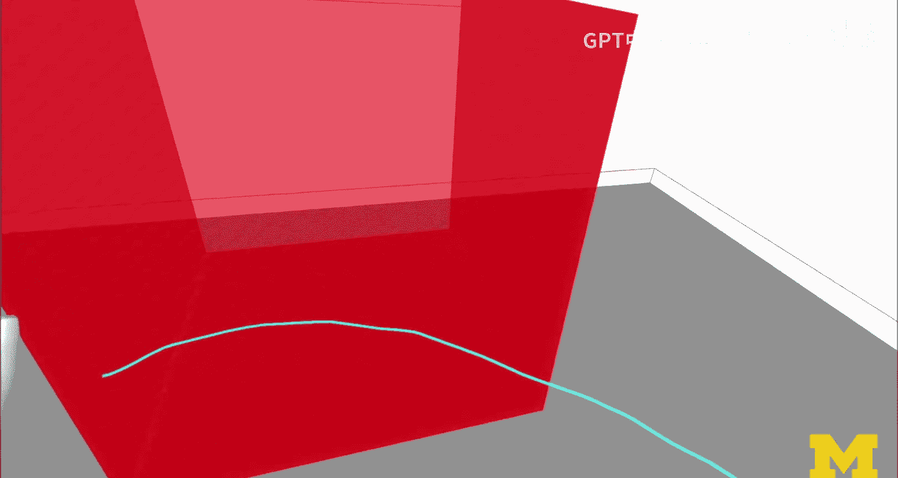
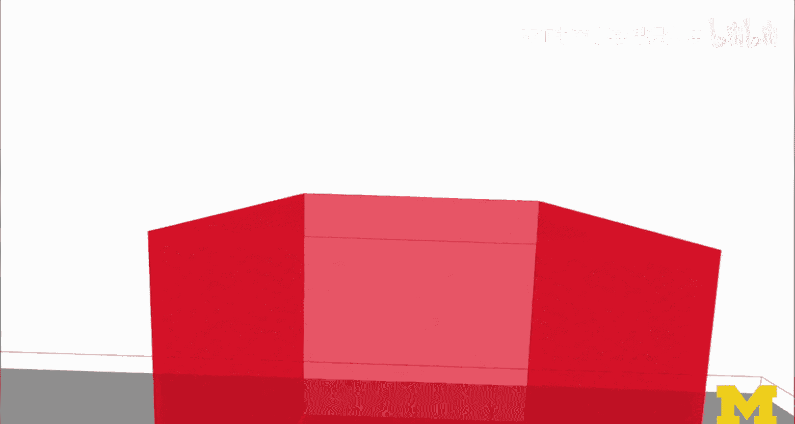
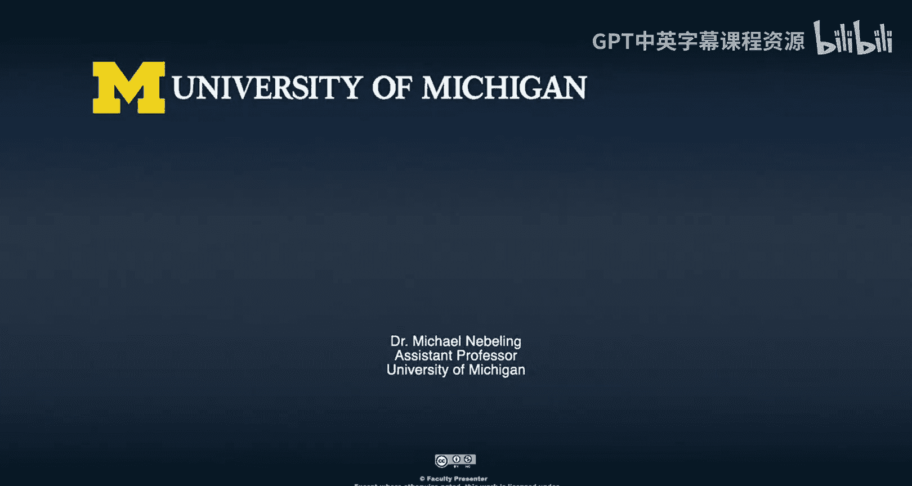

# 面向所有人的扩展现实：104：VR对象选择与操作第一部分

## 概述

在本节课中，我们将学习虚拟现实（VR）中对象选择与操作的基本概念。我们将探讨如何让用户在VR环境中与虚拟内容进行交互，包括如何选择远处的物体以及如何抓取和操纵近处的物体。理解这些交互技术对于创建沉浸式VR体验至关重要。

## 对象选择与操作的重要性

在虚拟现实中，我们希望能够选择物体并操纵虚拟世界。这两项功能都能显著增强沉浸感。让用户能够与内容互动，可以提升用户的“在场感”和沉浸体验。

## 案例研究：虚拟动物园

我们将以一个虚拟动物园作为案例进行研究。这个场景类似于之前专注于菜单和导航的课程，但本次我们将重点放在选择物体这一核心概念上。

在场景中，当我指向这些物体时，我为它们添加了碰撞体，并通过物理系统的调试功能使其可视化。这有助于说明哪些区域是活动的交互区域。

从我的控制器射出的激光（射线投射器）会检测与这些碰撞体的接触，这个过程称为**命中测试**。

目前，交互效果还比较简单（例如仅使用手电筒效果）。但我们可以在此基础上进行扩展，例如让每个被指向的动物播放声音、改变外观、看向用户或触发模型动画。虽然实现更高级的功能需要时间，但我们已经展示了射线投射的基本工作原理。

你可以看到射线如何与某些物体交互（射线似乎不会穿过它们），而与其他物体则无交互（射线直接穿过）。这取决于物体是否设置了碰撞体。

我们需要告诉VR系统（或其背后的引擎）应该对哪些物体进行命中测试。如果对场景中的所有物体都进行测试，计算成本可能会很高。因此，这是一个需要注意的优化点。你可以选择让某些物体有反应，而另一些则没有。

如果你想基于我们的动物园项目构建自己的示例，该项目资源是可用的。我们有一个包含所有步骤的案例研究，作为荣誉课程的一部分，我们将更深入地探讨它。

## 互动喂食区示例

现在，我们来看一个互动喂食区的例子。需要说明的是，这个动物园是以底特律动物园为原型建模的，但完全是虚构的。在现实中，底特律动物园有很高的动物福利标准，不允许喂食。这正是VR的酷炫之处——我们可以安全地模拟这类体验。

从技术案例的角度，我们关注的是碰撞体。你可以看到香蕉周围现在有可见的碰撞体（一个很大的盒子形状碰撞体）。我可以拾起它，并且系统可以检测到它们之间的碰撞。

这些碰撞体是盒子形状的，对香蕉的几何形状拟合得并不完美。在Unity等引擎中，我们可以使用网格碰撞体来做得更好。在WebXR中，虽然也有配置方法，但相对复杂一些。

当我们把物体扔出去时，物理系统开始起作用。系统会根据控制器在前几帧中的移动来计算物体的速度，并在控制器释放物体后继续模拟其运动，从而产生“投掷”的感觉。

由于物理系统的存在，物体需要落在某个表面上。因此，我们在下方放置了一个虚拟平面，防止物体无限下坠。将物理与物体操作相结合，可以创造出非常逼真的VR体验。

我认为为这样的体验添加物理系统总是值得考虑的。否则，物体就会漂浮在空中。当然，在原型设计或草图绘制阶段，让物体悬浮在空中可能更合适。但对于我们的动物园，我们希望它更真实一些。

## VR交互的分类

我已经介绍了大部分内容。现在，我想继续讨论VR交互。从最高层面来看，VR交互可以分为几大类：

1.  **移动**：这是在VR中的一种交互形式，可以是显式的或隐式的。
2.  **对象选择**：在虚拟世界中选择物体。
3.  **对象操作**：在虚拟世界中修改和操纵物体。

本课程将重点讨论后两者，因为之前的课程已经重点讨论过导航和移动。

## 对象选择：远距离选择与近距离选择

在对象选择方面，我们可以区分为**远距离选择**和**近距离选择**。实际上，这两种分类也适用于后续的操作，但我们现在先关注选择物体这一步。

以下是两种选择方式的核心区别：

*   **远距离选择/操作**：我们使用**射线投射**和**命中测试**来进行对象选择。我将在视频中演示这一点。
*   **近距离选择/操作**：我们需要采用不同的方法。我们会在虚拟现实控制器（或基于手部追踪示例中的手部模型）周围定义**碰撞体**。当你的手或控制器与虚拟物体发生碰撞（即相交）时，我们进行**碰撞检测**并触发选择。

### 射线投射与命中测试示例

这是一个典型的从控制器射出射线投射器的例子。当射线与那个立方体相交时，我们可以改变立方体的外观以提供视觉反馈。

基本上，我们可以进行连续的命中测试。例如，我指向这个平面上的某个位置，系统会持续计算交点。当用户触发控制器或点击屏幕（在AR中）时，我们就可以在那个交点上放置一个物体。这个灰色的表面可以是环境中检测到的平面。

这就是射线投射和命中测试。简单来说，就像用控制器向世界发射一条射线，然后确定它击中了哪个物体，并精确获取交点位置（我在那里生成了一个球体）。这项技术对各类应用都非常有用，包括移动，当然也适用于选择菜单项等。

### 碰撞检测示例

接下来，我们看看碰撞检测。射线投射和命中测试用于远距离选择或操作，而近距离选择和操作则需要不同的方法——即碰撞检测。

在这个例子中，我为手部模型、下方的平面以及盒子都设置了碰撞体。现在，我将传送到盒子旁边进行演示。

当我把手伸进盒子里时，你可以看到我们检测到了碰撞。手部周围有一个球形碰撞体（并非精确到指尖，这样灵敏度更高）。当这些碰撞体发生碰撞时，我们检测到了一种“悬停”状态。

这样，我就可以开始与物体交互了。我已经“悬停”选择了它。这个功能可以用于单手或双手。同时，我会提供一些视觉反馈（例如盒子碰撞体的轮廓）。显然，这个盒子现在是放在一个表面上的，所以我们也为它应用了物理效果。

## 核心构建模块总结

两个主要的构建模块是：

1.  **射线投射**：用于远距离选择。
2.  **碰撞检测**：用于近距离选择。我们需要为手部或控制器（本例中使用了VR控制器，但展示的是手部模型）定义碰撞体。当它进入虚拟物体时，我们就可以检测到碰撞。

碰撞体的概念在实现中至关重要。在基于A-Frame（即基于Three.js）的WebXR中，所有的交互默认都需要定义碰撞体。通常有盒状和球状碰撞体，还有一种AABB（轴向包围盒）碰撞体，本例中使用的就是这种。A-Frame中可以使用这些碰撞体。

此外，还有一个名为“Super Hands”的库，它定义了所有这些碰撞检测功能。我在碰撞检测示例中使用的就是Super Hands库，它是专门用于VR碰撞检测的，功能很强大。使用它，你可以真正地操纵场景。

## 总结

本节课中，我们一起学习了VR中对象选择与操作的基础知识。我们探讨了通过射线投射和命中测试实现远距离选择，以及通过碰撞检测实现近距离选择。我们还通过虚拟动物园和互动喂食区的案例，看到了这些技术在实际中的应用。理解这些核心交互技术是创建引人入胜且沉浸感强的VR体验的关键第一步。