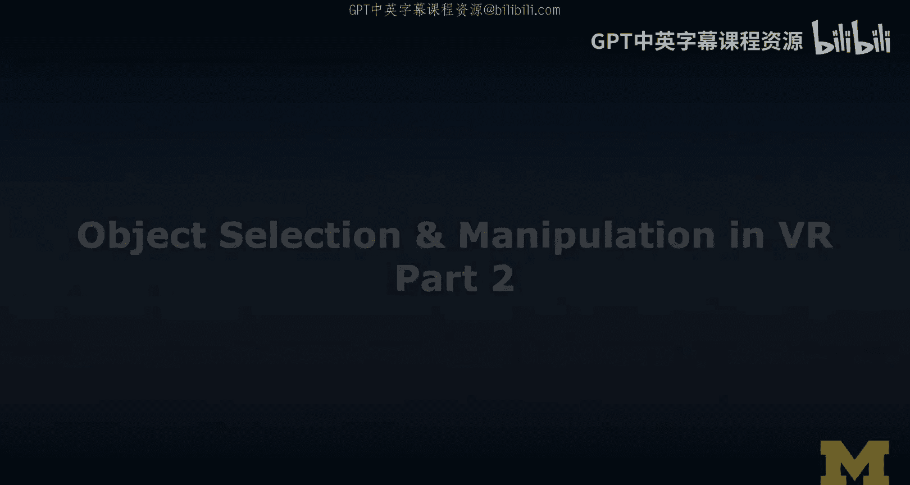
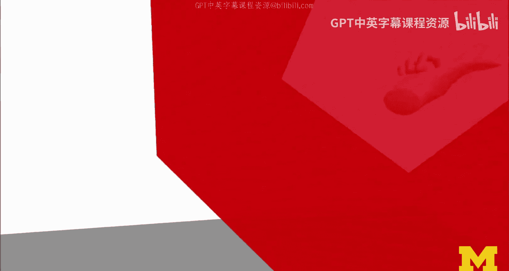
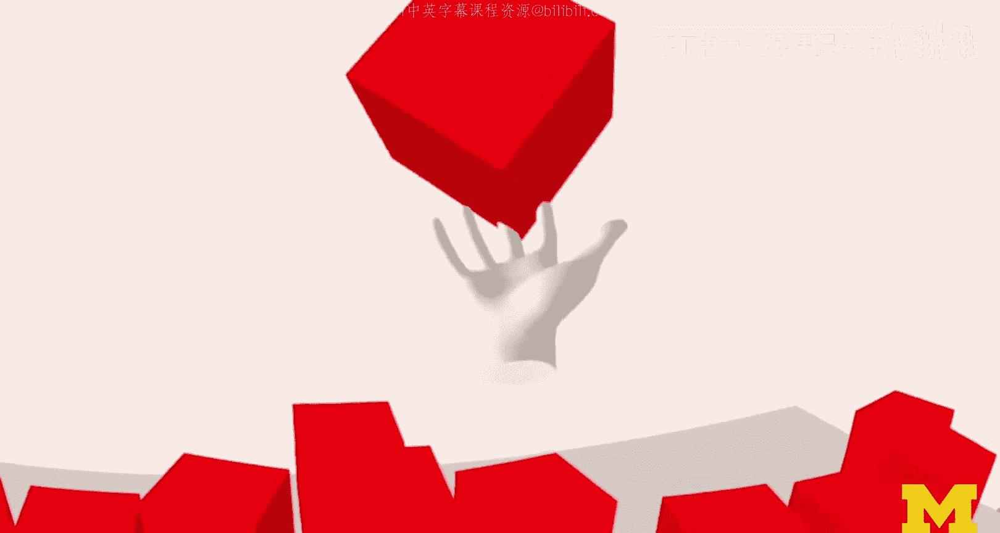
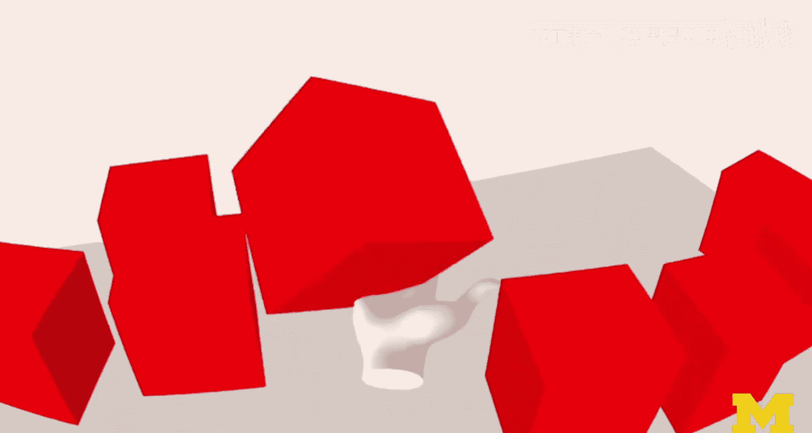

# 扩展现实（XR）入门：21：VR对象选择与操作（第二部分）

在本节课中，我们将学习虚拟现实中对象操作的核心概念与具体实现方式。我们将通过多个实际示例，了解如何使用控制器和手部追踪来抓取、移动、旋转和拉伸虚拟对象。

---

## 概述

对象操作是指在虚拟世界中修改物体的属性。我们将探讨四种主要操作方式：悬停、抓取、旋转和拉伸，并分别通过远距离操作、近距离操作和手部追踪操作来演示这些概念。

---

## 远距离操作示例

上一节我们介绍了对象选择，本节中我们来看看如何进行对象操作。首先，让我们通过“超级手”系统来了解远距离操作。

在远距离操作中，用户使用激光指针与远处的物体交互。以下是其工作流程：

*   **选择**：使用激光指针指向并选中目标物体。
*   **抓取**：通过控制器上的“抓握”按钮锁定物体。
*   **移动**：移动控制器来拖动物体。
*   **释放**：松开抓握按钮，物体将根据物理引擎规则落下或被抛出。

这种模式适用于用户无需靠近即可与物体交互的场景。

---

## 近距离操作示例

接下来，我们看看当用户靠近物体时，如何进行更直接的操作。

在近距离操作中，系统通过碰撞检测来感知用户的手部或控制器是否进入物体范围。以下是可执行的操作列表：

*   **悬停**：当手部进入物体范围时，物体外观可发生变化作为反馈。
*   **抓取与移动**：使用抓握动作抬起并移动物体。
*   **单手旋转**：使用单个控制器改变物体的方向。
*   **双手拉伸**：使用两个控制器同时抓取物体，并通过移动控制器的相对距离来调整物体的大小。

完成操作后，释放物体，它将遵循虚拟世界的物理规则。

---

## 手部追踪操作

随着技术进步，我们现在可以摆脱控制器，直接使用双手进行交互。这通常依赖于如Oculus Quest等设备的计算机视觉手部追踪功能。

在手部追踪操作中，用户通过真实的手势与虚拟物体交互。其核心交互逻辑如下：

1.  **手势触发**：例如，通过捏合手势可以调出手部菜单。
2.  **直接抓取**：虚拟手部与物体发生碰撞时，可执行抓取动作。
3.  **物理交互**：被抓取的物体受物理引擎驱动，可以被移动、堆叠或抛出。

这种交互方式非常直观，代表了VR交互的未来方向之一，尤其在基于WebXR的内容中具有巨大潜力。

---

## 高级操作应用：创意工具

对象操作不仅是移动物体，也是创造内容的基础。让我们看看它在专业创意工具中的应用。

在Tilt Brush这样的VR绘画应用中，操作的核心是**高效生成和修改3D网格数据**。用户选择画笔和颜色后，在空中移动控制器的轨迹会实时生成发光的、动态的3D笔触。这并非简单地放置大量小球体，而是对复杂几何体进行实时操作与渲染，展示了高性能VR应用的实现方式。

---

## 高级操作应用：沉浸式界面

最后，我们考察一个将操作与界面完美结合的范例。

在游戏《半衰期：爱莉克斯》中，有一个早期的白板场景。用户可以直接从环境中抓起一支虚拟笔，然后在白板上自由绘画。其交互设计非常精妙：
*   `拿起笔即开始绘画`，无需额外按钮。
*   提供橡皮擦等工具，操作直观。
*   营造了高度沉浸和自然的叙事或规划体验。

这个例子展示了优秀的对象操作如何让虚拟界面感觉真实且易于使用。

---

## 总结

本节课中我们一起学习了VR中对象操作的多种方法。我们从基础的远距离抓取开始，了解了近距离的抓取、旋转和拉伸，探索了前沿的手部追踪技术，并见识了操作在创意绘画和沉浸式游戏界面中的高级应用。

这些示例奠定了VR交互的基础。如果您对如何编码实现这些功能感兴趣，可以深入查看相关的开发教程，那里将有更详细的技术实现和代码分享。在下一个模块中，我们将把焦点转向增强现实（AR）。