# 密歇根大学《面向所有人的扩展现实（介绍⧸设计⧸开发）｜Extended Reality for Everybody Specialization》中英字幕 p107 23_WebXR沉浸式VR实现.zh_en -BV1jM4m1k73q_p107-

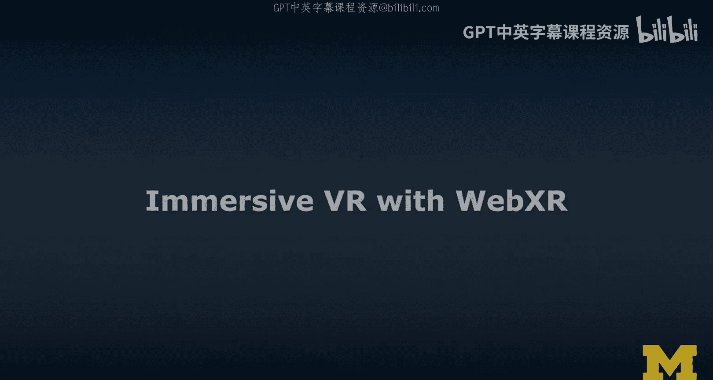

Welcome to this lecture on Imersive VR experience， this is the second in a row of hands-on lectures I'm going to use again primarily the Ocus Rift S and at the end of this lecture I'm also going to show how some of the things I talk about work in cardboard but we' are actually going to go beyond what you can do with cardboard so I'll let you know。

Okay， and so in the previous iteration we were like here。

 so this is the scene that we had created and it was already made for a cardboard and then when you kind of like fuse on the object。

And you hit it， then you will actually disable the light。

 So one thing I'm going to do is actually just reload this quickly。

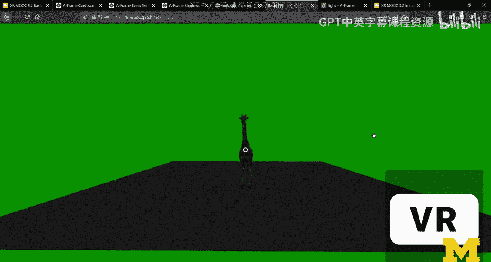

And see。That I'm going to disable the shadow camera so that we don't actually。

See oops see it all the time。 And so then it's a kind of like more or less our final version。

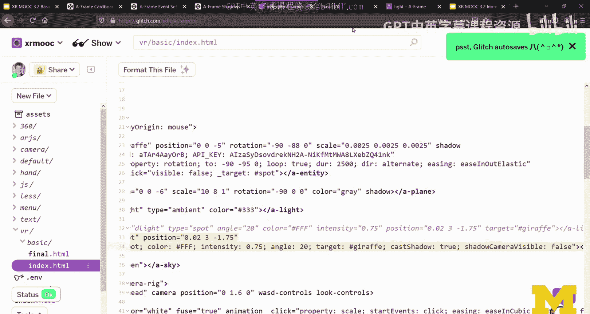

And now。

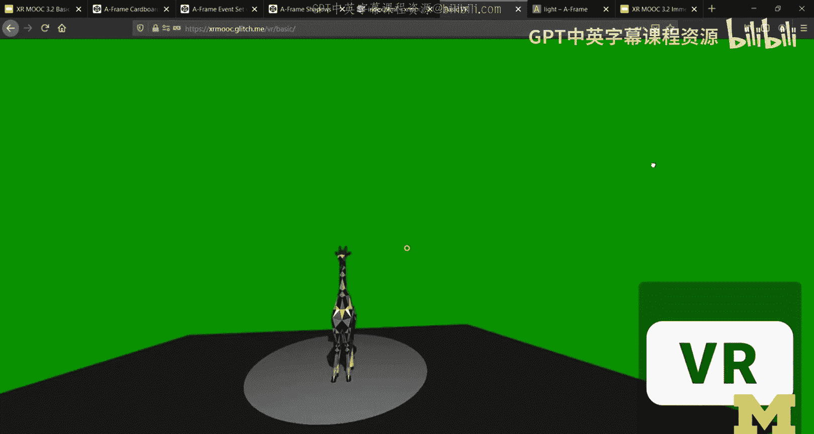

You can just。Look at the giraffe。 and I'm going to disable this。This ray origin mouse cursor。

 This is， I just do this for debugging so that I can click objects。 but now there's no click anymore。

 when I have to use the cursor。 and I have to fuse on the giraffe and this turns off the light。

 So that was what we had created before。 But I actually told you where we wanna be is more like here。

 So I have a new slide deck said wanna be like here So I'm gonna play this again。

 So this is what I had in mind for us。 I'm gonna。

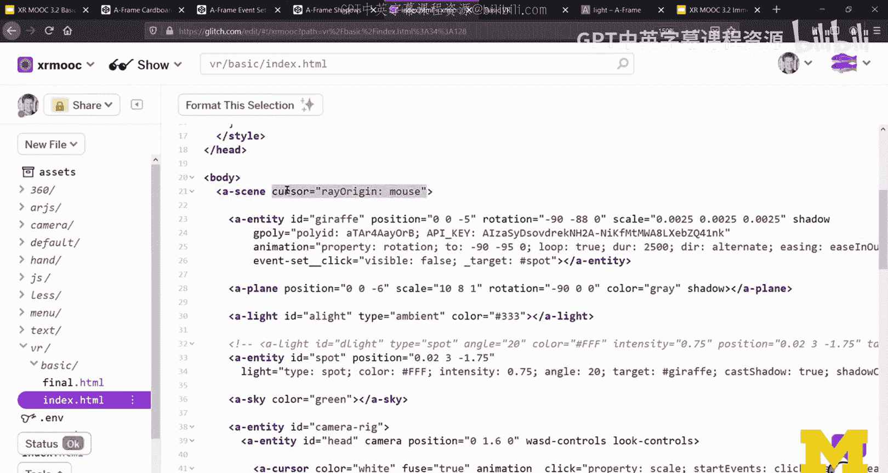

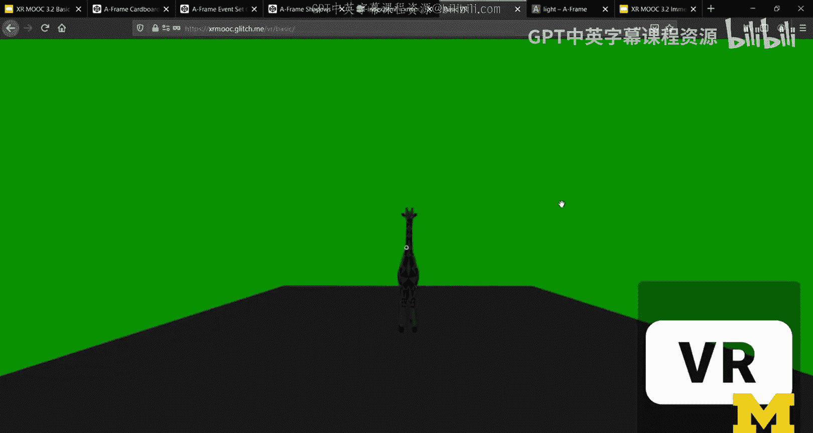

In Firefox， the full screen works a little bit differently。

 but we're going to use Firefox again so that we can do things in beyond very quickly。

 So I said I want to be here。 I want to be able to actually look at the giraffe。

 I want to have a little bit of an environment。 we're gonna add this environment in this in this segment and we're gonna have but we have the controllers。

 I think I showed you the controllers before， but we didn't have teleport。😊，So。

 and and then we added all the spotlight and all that kind of stuff。 So let's see。

 I'm gonna leave the spotlight where it is。 So basically we did。

 We completed this in the previous segment。 And now we're gonna go for oops。

 we're gonna go for the immersive VR experiences。 So environment。 We're gonna add physics sound。

 maybe I would need to use animal sound。 I'm gonna show you an example。

 I may not add everything to the scene。 definitely gonna do an environment probably not gonna do physics。

 but I'll show you examples of physics and the menu。

 and I'm gonna also talk about how to get things working with cardboard again。😊。

There is an aframe speech component and we'll see whether I get that to work。

And maybe I can show that one as well。 So let's get started。

 So the first thing we want to do is get an environment。

 So here I have an environment component as an so as an example seen with the environment， this one。

 I made a really nice。😊。

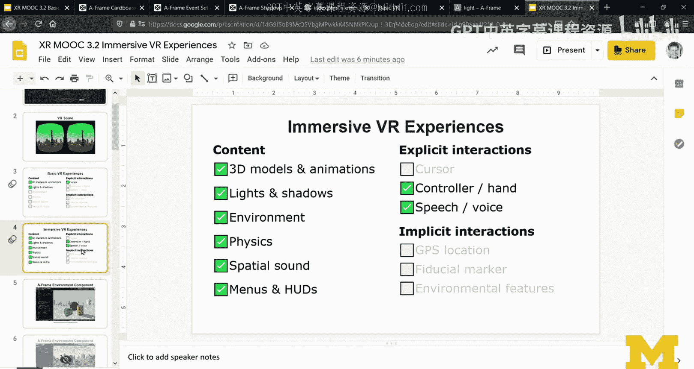

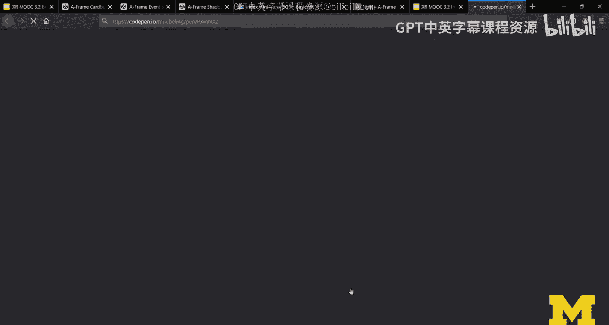

Actually， really nice winter。 So we need to grab this script。 That is our environment component。

 I'm gonna go in here。😊。

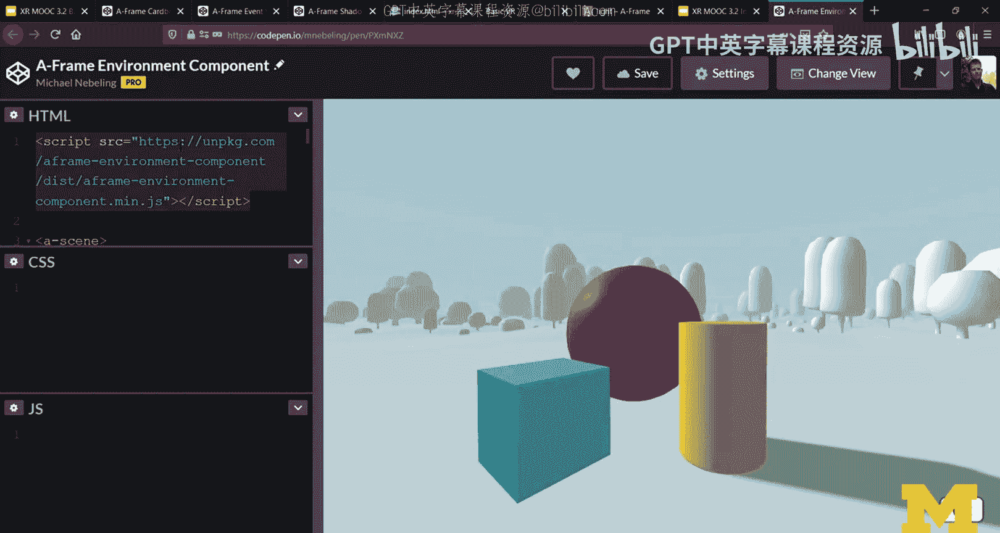

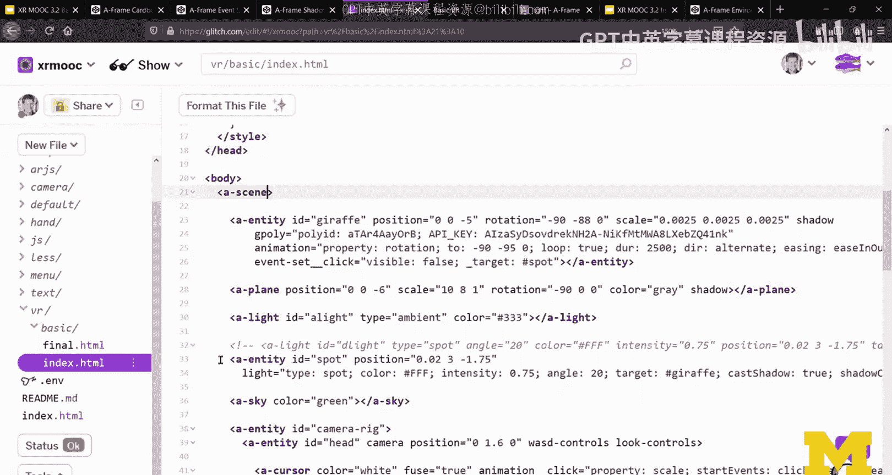

And I'm going to just duplicate this as。嗯。But that was actually our， that was actually our basics。

 I'm gonna sorry， duplicate this and actually make it。A immersive。嗯。

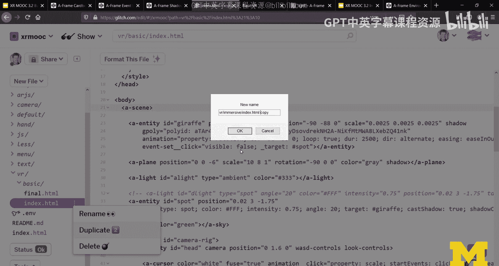

Index HTML or immersive index HTML。 So we're going to have that there。And。That final one， we'll see。

Maybe I can actually rename this into。呃 final。Inindex H T M L， let's see。That would be our final。

 That's what we're aiming for。 So in this one， we're going to start from the。Previous one。

 So we have events component in here。 I said I'm gonna get the teleport control。

 the environment actually， sorry， not the teleport controls。 We're gonna do that later。

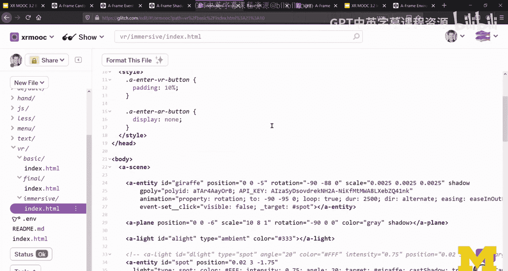

And so let's see， let's load this in here。 Actually， we're gonna call this our immersive。 Okay。

 it's gonna be so much more immersive。 Ha ha。 so let's see we' gonna get immersive to load here。

 Okay， still the same。 I'm actually gonna disable the cursor for now， because it's totally。😊。

Cardboard， and we don't need it right now， So no cursor。

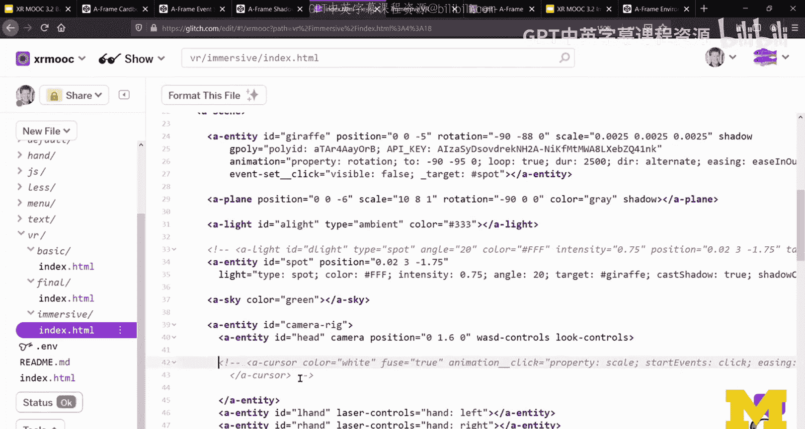

I'm also going to make that VR button a little bit smaller again。 So that was a little bit。

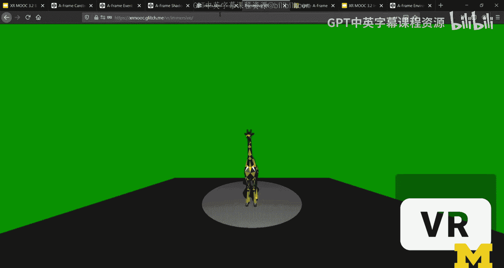

Just like you can do things like that。

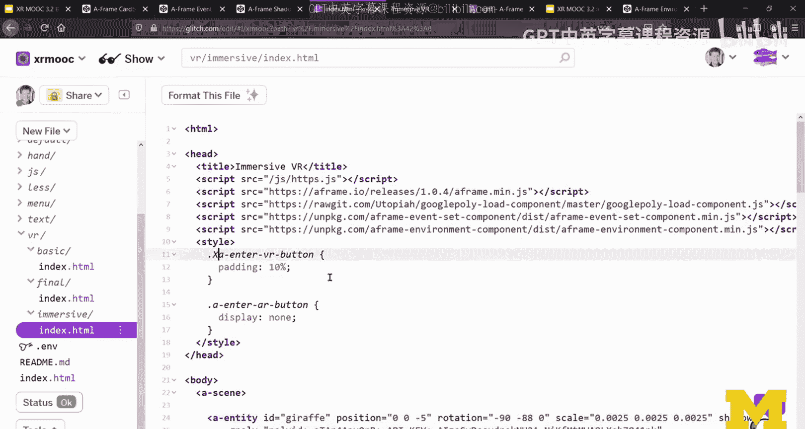

To obviously then wouldn't it wouldn't apply anymore。 And so that is a fast way to。

That's what I often do anyway。 So， okay， so we have a spotlight。 al right。

 said we're gonna get the environment。 So the a frame environment component。

 so we're gonna get an entity。 We are going to actually remove this plane that。😊。

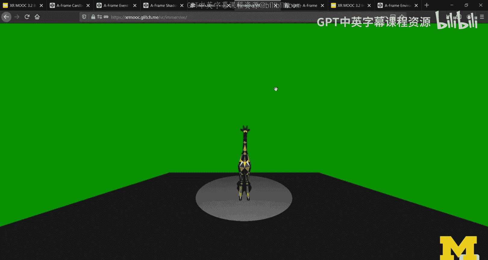

We have here。 and I actually leave it。 So I'll show you first what， what this looks like。

If we don't remove it。 so I'm gonna get a new entity。Okay， and that is going to be our environment。

And。We're going to have preset forest。

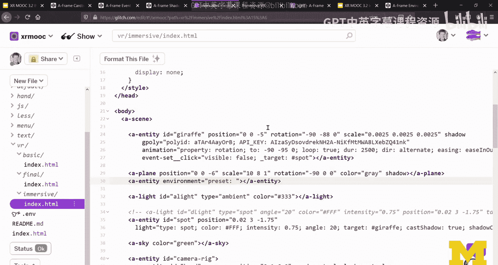

オッケー。So in my example， this is a nicely decorated winter forest。 so it has the a frame。

 I I already also comment out the plane here because would it would lead to some flickering。

 I'm going to show you this in a second。 And then I actually customized this quite a bit。

We're going to get the shadow as well because I want to have the shadow。And sky color。Yeah。

 I'm gonna leave， I'm gonna leave it the way it is pretty full。

 But I'm gonna get the shadow because I want our shadow to be there。 So here is our。

 So then you will see we have a little bit of an issue here， right， So this is the plane。

 It can do two things。 If you really wantan to keep the plane。 Then you move it up like。

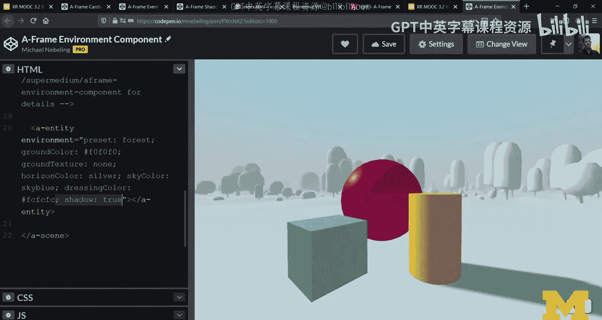

Just a little bit。 So then you're telling the computer to really render it on top。

So now because previously， they were at the same at the same why And that leads to issues。

 But I actually don't like it。 So if you don't mind， I'm gonna just remove this。

Because we have in an environment now。And it's gonna look cooler。And we have the shadow there。

For some reason， it stops at some stage。I do have shadow。

The environment comes with its own ambient light， so I guess we can actually remove that。

And I do want to keep our spotlight。 So we don't need this in this light anymore。

I would like to keep a spotlight， and I would like to see it。 if we saw it better before。

Right now we don't actually see it so nicely。But。That is okay。

And I think we can adjust the a frame environment component。 So in my template。

 there is C here for details， I'd say， So let's go to this web page and then we actually can find out more information about the environment component。

 lots of different environments that you can have。Forest。Really lots of interesting ones。

 I'm gonna go for the forest because， you know， my energyra belongs into a forest， so。

You can change the light position， ground color if you wanted to change a little bit。Sky type。

 we can have a gradient。Or' an atmosphere。 So the default is atmosphere。

We could do a little bit of a gradient。 What does it look like right now？

This is a gradient in or atmosphere， as I say， I'm quite happy with this。 It's cool。嗯。Lightning。

De is distant。 Let's try point light。 wonder what this looks like。

So in here as part of the environment， you then just add here point。

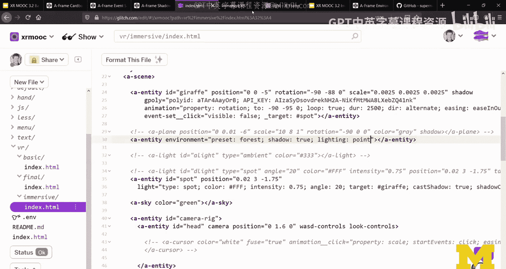

That's what they said， does it change？Does change quite a bit。 It's interesting。

Now we have two shadows， right， Min from before。And this point I must be coming from。

Somewhere in a distance， so it also has a little bit of fog。

 we just gathered with the environment so the environment does a lot adds。Quite a bit of stuff。

Has a little bit of fog， as well。It can even increase more fog， or less fog。

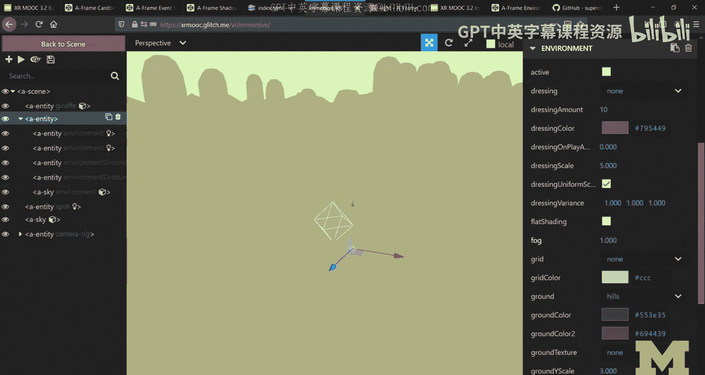

To we want more fog。 I don't。 I don't think we should have too much fog。嗯。So。

But the since I'm not sure what think about the point light。

Here is the environment light that which one is this type， This is the point light。

If you move this a little bit higher。Okay。I'm gonna to do that。

 I'm just gonna take the point I that we have， and we're going to say light position。

 and we're going to adjust the light position to。I don't know。This ry。-1，2，4，0，5，5。

 So what does it say， I think it has light position。Position of the main light。

 If sky type is only the orientation matters。 Otherwise it's okay， we're going to light position。

 and then we're gonna put it there。 We're gonna get rid of my spotlight， so。

Because we got a light with the environment， it's fine。And we are gonna have lighting point。

 light position。 And we could actually have it where I had it before。 Let's see what that looks like。

 I mean， I did like it much better the way I just looked at it in the。In the inspector。

Just remember this coordinate dee。It's not too bad。But the original position。

 let's move it a little bit to the side， okay。So。And a bit more。Maybe a little bit more to the left。

 So it's doing minus。嗯。A little bit more to the left。 So then we have the shadow on the right。

 I like that now。Hope you like it too。Okay， I'm done。

 I don't want to repeat too much of the lighting stuff we did before， but we have an environment。

 you see we have an environment， we have light， so let's go into VR， get my Ochis viewer running。

 so show you this， put on the headset。

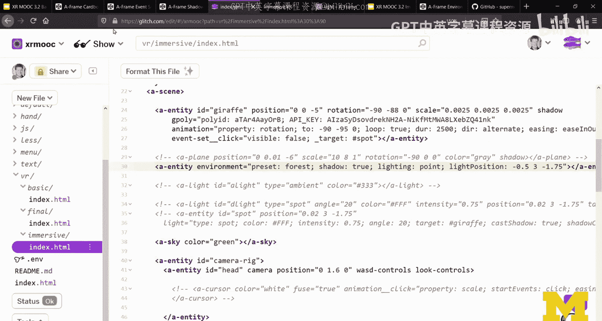

And here we go， headset is going to be U。So。We have the controllers。 We have laser controls。

 We're gonna do something more with laser controls。 And I'm also actually gonna tell up apart。

 I think fairly soon。 But this looks pretty cool now， okay， so。😊。

I'mGo going to go back in here and just cancel this。Light position。 alright。

 So we have the environment component。 We can do a little bit of sound。

 I'm just going to show this very quickly。 I'm gonna get the background。😊，Sound in this example， our。

I have a few things in here。 One thing I have is， when you click。

When you click or when you hover things， but when you click。

It actually starts playing a little bit of an atmospheric background sound。

And I'm gonna get that because that's what I want here。 I'm gonna put them in my assets。

 And then I'm gonna actually copy that as well up there to trigger the sound。

 sound is a little tricky sometimes。 So just be like it doesn't always work in every browser。

 It doesn't always play。And that was。Typo。嗯。Cool， that is my audio that I've previously uploaded。

And we're just going to use that， but we need to trigger it， it doesn't autoplay。

 usually at least not in all browsers， so here what I'm doing is actually sound such so you know。

Okay， and it does say this a note here doesn't always work with the autoplay。

The they say it should do auto play。 Let's see。 I don't think this works。 I'm gonna get。

The sound addeds to the sea。I'm going to reload this， so I don't have that all the time。

 That sound in my head。So here， this is the part that I want。 I definitely know that this works。

 Ro off factor 0 means here everywhere。 Otherwise， it would roll off from the location。

 which would be。The position would be， I guess，0，0，0， oops。 We going to。Do it like this。

 Why you'm not to。 We're gonna do the brainfor， which I have in here。That is the sounds。

 So basically， when I go to this URL， that just shows you。

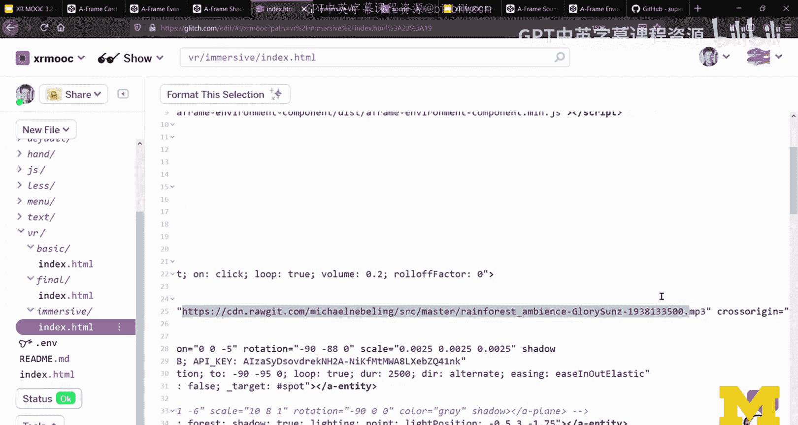

An MP3 player in the browser。Okay， and that is the thing that we're going to load into the background of my scene。

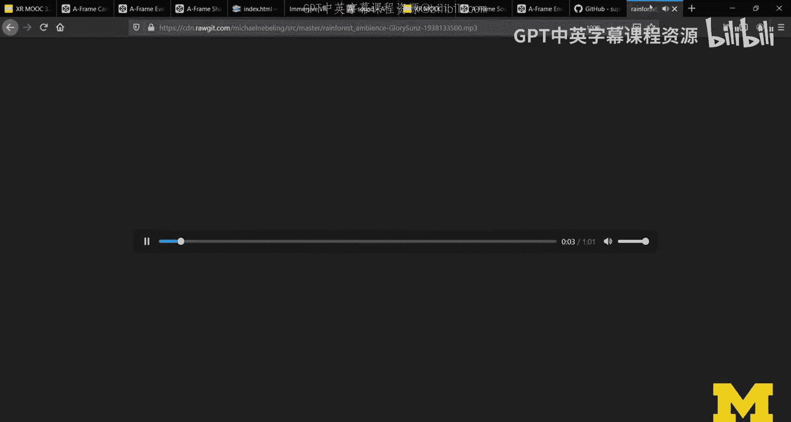

I'm going to try autoplay through。But I doubt itll work。 I've had problems before。

 So let's see if I reload。It does work。 Actually， I get it immediately。嗯。But the trick is。

 if you have this problem， the trick is to just play it on。On click， so。Then when I load the scene。

 it doesn't actually do anything yet。But then as soon as I click， it plays。

 you can see the sound icon。I can make it a little bit louder for you。

 So now youll hear a little bit more of the background。And so it's quite nice。

But it is a little loud， isn't it， So I'm gonna put this back。So that it's not turned out for you。

 Allright， so I have this in my head the whole time。 And now， as we are entering V R。

It is pretty cool。 It is still playing， though， so。That is interesting， why it did it stop。

 it should be looping， roller factors 0。Let's just see。 I think it had to do with。It had to do with。

Me jumping。Into the。Thats said。I don't actually hear it in the headset right now。

 so it's supposed to be playing， but for some reason it doesn't actually play in the headset。

 I'm pretty sure this has to do with my current  Ocuululus thing so I'm not going to try to fix it。

 I believe this will work some other stage。Alright， so where are we， We are going to put this there。

 So we have sound。嗯。Physics， yeah， I'm probably not going to do physics。

 but I wanted to show you physics。 for physics， I would need to do a little bit more。

 but here's an example seen doing physics， so。诶。Yeah， I'm going actually do debug through。

 So we see that the physics are here。So then it shows you how the physics are applied to this scene。

 And then as you like moving this plane down there and you're like kicking， oops， this one fell。

 you can w。Play with these objects。 So this is my click drag example。 It has a little bit of physics。

 And see， let's see where's the ball Oh it's gonna come back at some stage， bouncy， bouncy。

And then things will fall。 Okay， so we have physics more information on physics if you want。嗯。I mean。

 we could have a little bit of food coming down。 I we' gonna do this quickly。 Okay。

 we're gonna have some food， but I'm gonna make it very basic。 Okay。

 so we're just gonna take a sphere。I'm going add physics to the scene， but just like， okay。

 very basic。I don't know what giraffes eat right now。 I'm blanking what giraffes eat。

 We are going have a。Reretty small， dynamic body。One thing I need to get。

 I need to get the plane back。 So we're gonna have physics。 So let me copy paste that。

From I have too many things open here now。 So physics is we need the。Physics， aframe， click。So。

 I w to have the。Physics system。Here is the example for the physics system。

 and then this is a way to do it。I feel like I have a more specific。Cat pen。 but let's see。

This should work。 I know there are a few different physics systems versions out there。

That's just why I'm wondering， but okay， so。Heres our was seen。

 I'm going organize things a little bit more。And cardboard template。

 we're going to get back to that later。 I'm going to close a few things。

This is our immersive preview。 This is what I'm working on right now， sound。This， this， we're done。

 we're done。 we're done。 Okay， cool， now I can see things。 alright。So。Weca came a little twofold。

 so we need to get the physics in here so。I'm going to get it like this and for consistency reasons I am going to write theM HDPS。

Here so I'm going to load the physics。And you can always see whether you're hitting the right script。

 So this should definitely still be there， but let's just see that it actually works。

 So it does load the JavaScript so this is fine。And。Then we're going to enable it on the scene。

 so physics。Have to enable that。 And then we're going have we're going put this tool that will fall down。

Maybe in front of the girae， So minus。I don't know， four maybe and the radio should be pretty small。

And I don't know。 Whatever it is， we're gonna make it green。 Okay。

 I don't know what it is supposed to look like。And so let's see what this looks like when we load the scene。

 Let me see。 So the problem we have now， it'll just like fall down there。

 It's also still a little bit big for our giraffe。 So， so I'll show you one more time。

 It it's gonna come。 But then it's like。Flying through。

 I'm going to actually make this a little larger and green。

And so the problem with that is we don't actually have anything for it to land on。

 And we're gonna bring back that plane。And I'm actually going to move it below our environment。And。

But I'm going to show you first， actually above the environment。 So it's easier for you。

 And I'm going to make this aesthetic static body。 That is very important。 So that way。

 we're going to keep things on top of the plane。 So now it's going to fall down there。 Bam bam。

 And our giraffe will have something to eat。 Very， very cool。

 And I'm going now move it below the environment。 so。😊，诶。You won't see it。

 but it is actually still hitting the environment。 and the ball is there。

 I'm going to go into VR just to check where we are。Right now。

 I'm gonna to get our O as viewer full screen and。Where a type。Okay。We have hand controls。And。

We maybe can pick up the food。 Maybe that's what we're going to do。 We'll see。Okay， so we are。Okay。

 now I have the sound in my headset。 it is really loud。

 I told you it's going to come back at some stage。 Okay， one thing we could do is particle system。

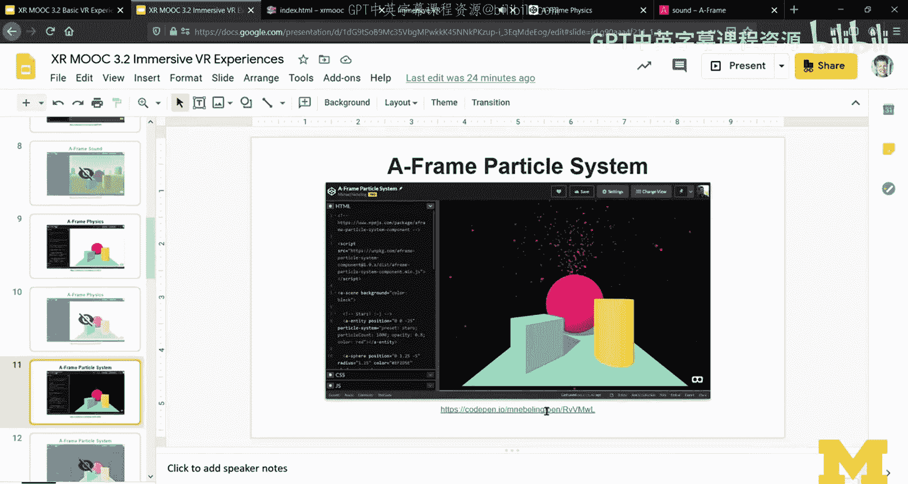

This is an interesting thing to make scenes more immersive。

AndThere are a few different particle systems。 and I'm going to show you some examples。

 This one is probably not something that would make a lot of sense in our scene right now。

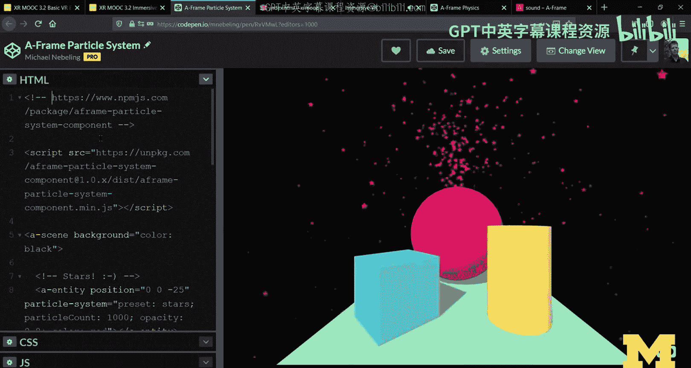

Sts， so theyre different kinds of presets。

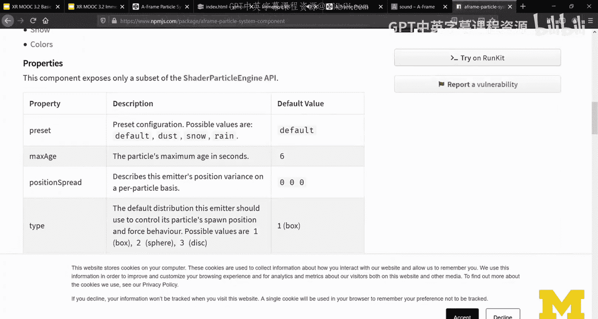

Stars， dust， going to have rain。 What do you think You're going to have rain， okay。

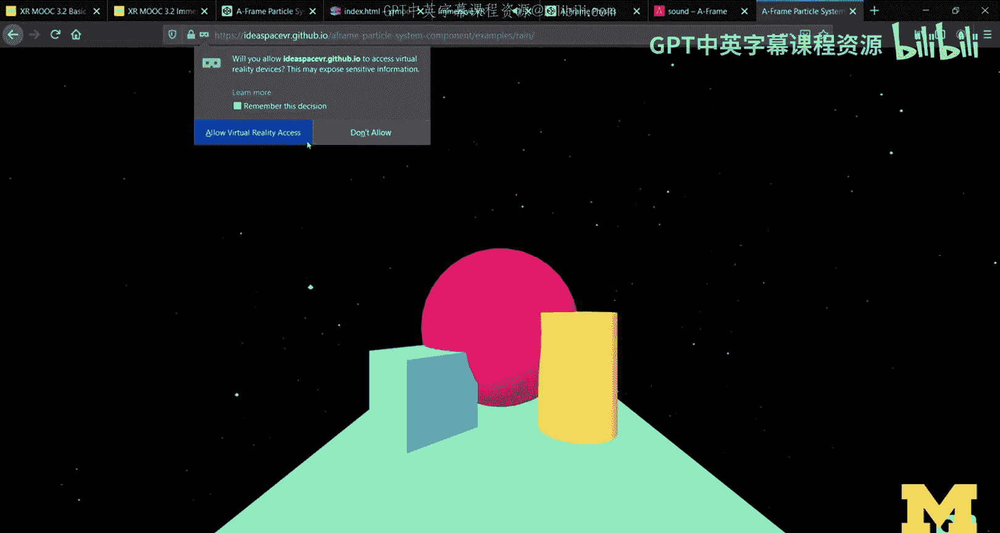

I'm definitely gonna do rain。 Okay， we're gonna have a little bit of rain。

 then so gonna get the particle system。

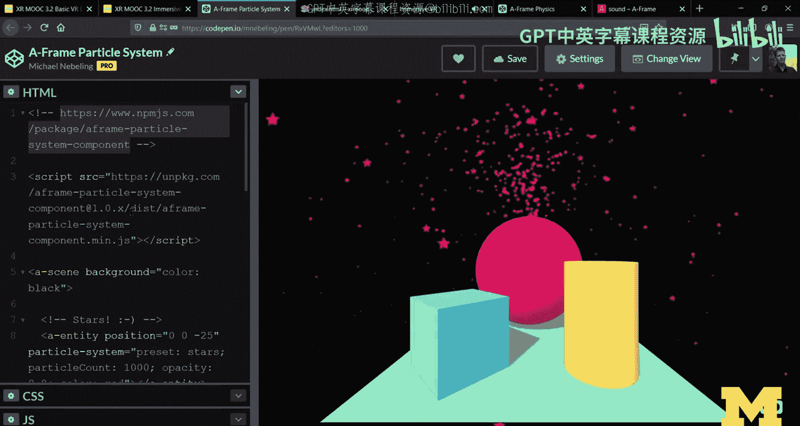

Make it immersive， have a little bit of rain。 so I see what they're doing。 Okay cool。诶。

I'm going to make this even。Soft I'm going to remove this sound because it's pretty annoying for me。

 so I hope you don't mind。And。

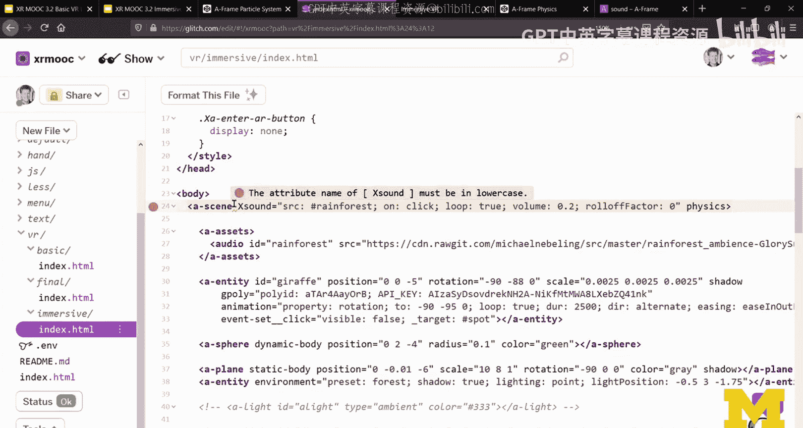

Yeah， that's fine。 Cool。 particle system， right， And so we were gonna get the rain。

 We're gonna make it rain。

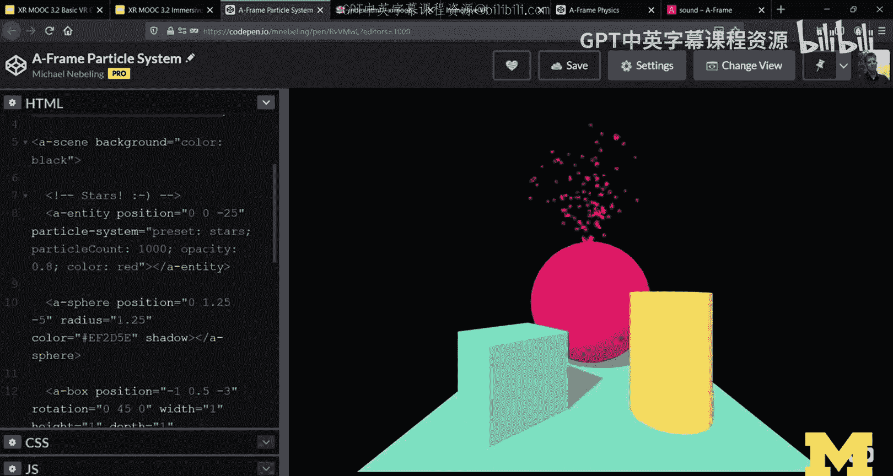

So I' going to have particle ecosystem， rain。Heavy rain。 okay， we can think about that。

 color should be， I don't know， it just tea。What the preset does。 So is it going to be said。Oh。

I remember the environment doesn't actually work very well with the particle system。Now， that's sad。

 And it actually just died or something。 Yeah， it just doesn't work。So I'll show you。

 So this we had this problem before， and I don't know why。 but when I don't actually have。Okay。

 it just looks like the velocity is like crazy。

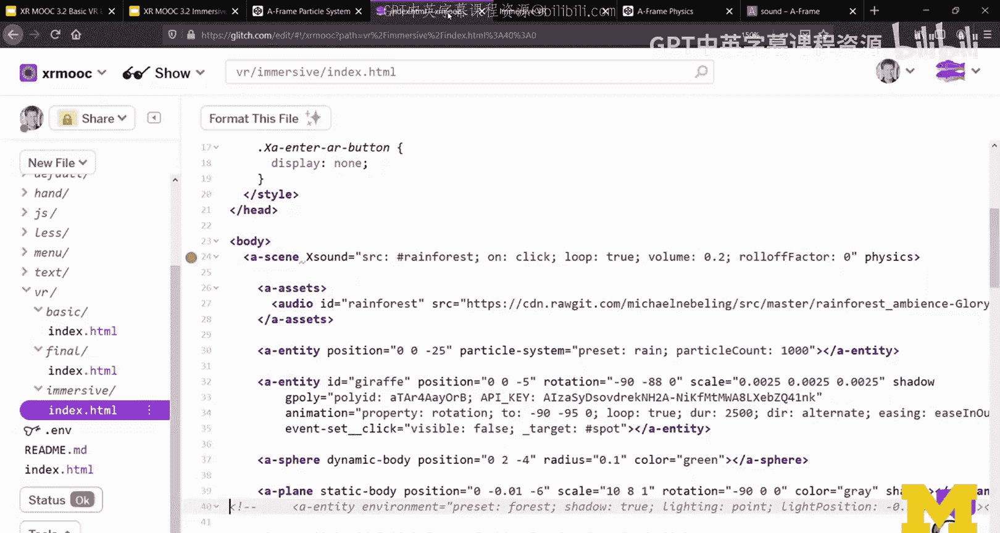

Let me see。 I do want to have a little bit less rain。

 So let's go to the particle system documentation。

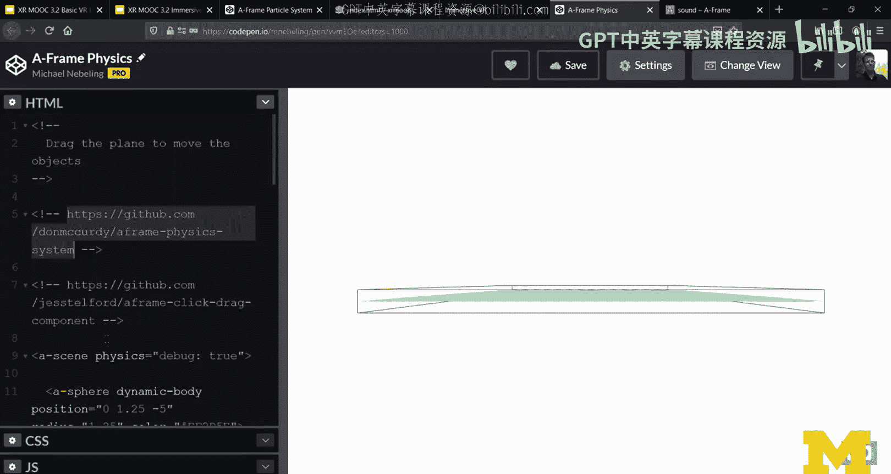

Didn't I have that open just a second ago。 I don't know。 Okay， here we go。 Open it again。

🤧嗯。So there is a velocityvalue and。Direction， spine duration。Okay， we're gonna do。Vloity。嗯。

They mean is base velocity to you。嗯。一次。So， this。Let's see whether this does anything。

 So if I make this。

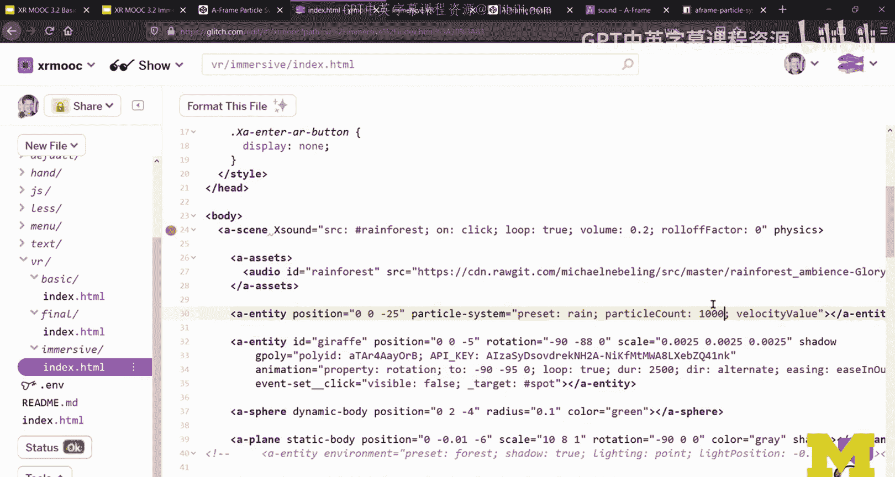

that looks like rain， though。

Okay， i see。

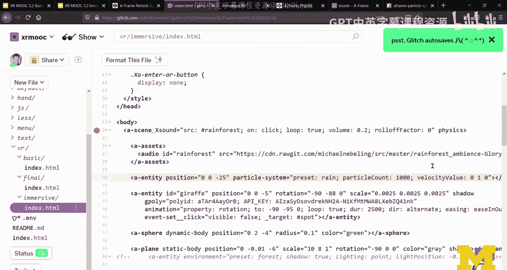

ok。Yeah， okay。

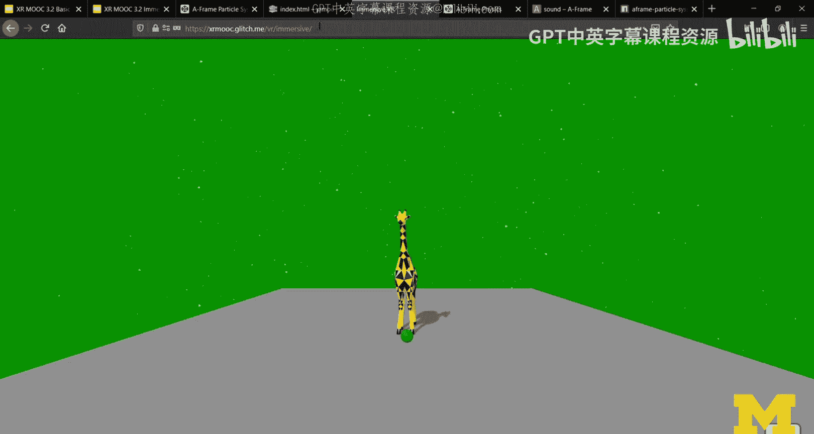

Fine， we're gonna have heavy rain。

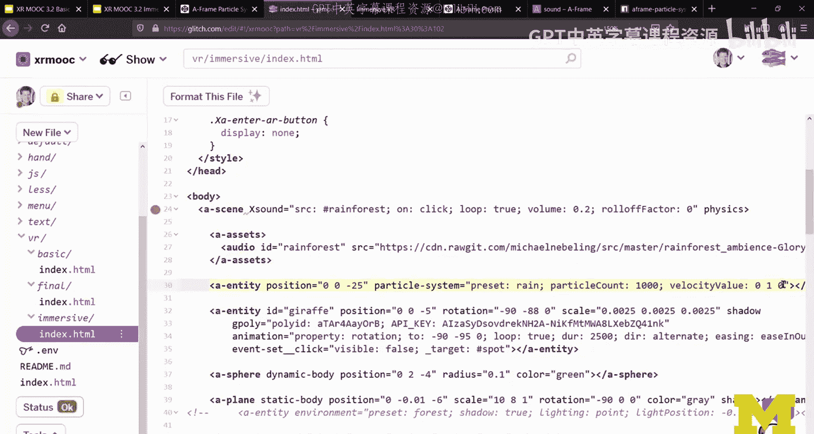

Otherwise， it looks like dust。 So we could have the rain。 Okay， poor little giraffe rain。

 The problem then is， doesn't work with the environment。

 I still don't know exactly why they are incompatible， but， as a proof of。

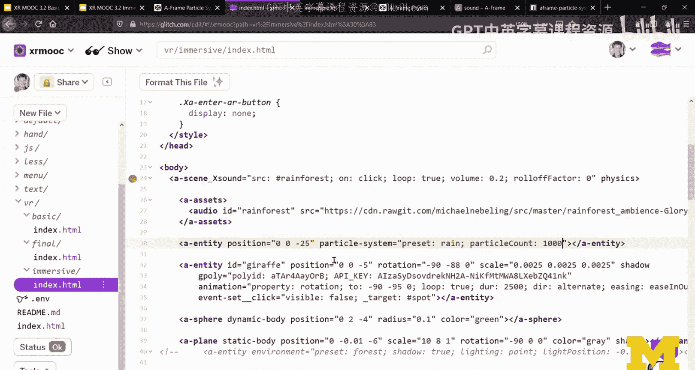

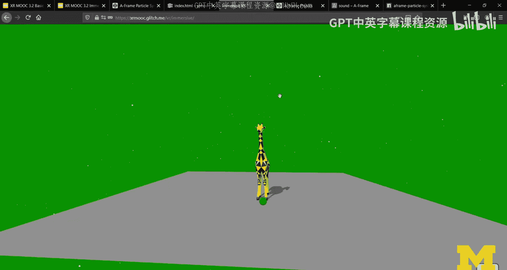

So nothing views anymore。 Nothing works。 And then we have a pretty。Much， we have an issue here。

 Ashada era。And maybe that kills it。Maybe with a fog。If I said the fog， I'。

 I'm just gonna try one thing。 So I' gonna say fog two falls。See whether that does anything。

 But I'm not sure this would probably not thisfies it。Oh my God， I'm a genius。Cool。

 so we have a little bit of rain， but we need to make the。Does it look like rain， I don't know。

 It doesn't really look like rain。It looks a little crazy。

 but we also have to make it a little bit darker， right， So we're gonna change just like， just。

 I mean， why not。 So we got the environment fixed。 We can't have we kind of fog and particle system for some reason。

And light position。 And then we can go back to the environment。嗯。

So I'm going to just look this up again， a frame environment。Component， cool。

 So here what I want to do now is actually have sky type。Gient。If type color is gradient。

 is color or gradient it's the main sky。 So sky horizon。 Okay， we're gonna make it a little bit off。

 So we're gonna have sky color， sky type blue。And then Sky。We're going to have a little bit of gray。

 And then what was the other thing called about oops。Horizon car。花 right。Lets see， sky blue。

The other way around。And大。It's still grey。Gray is like a 6，6，6 So a aanca。嗯。overall。

You're going make it a little bit darker。Okay， just like。Lighting shadow， do we have intensity。

🤧And seems。So， lighting distant。Maybe， no， I like the lighting。 I'm not gonna do too much lighting。

 flat trading。 No， we going do that。嗯。Yeah。the ambient light。If we do。The ambient line。

 I'm just like， let's see if I were to change things and we can hit play here。

 So it plays even why we are like in there。The physics would actually， by the way， still work。

 You can see a little bit of the。Planin。That we have underneath there。Anyway。And our little giraffe。

 and it's raining， but it's still happy。 I wanted to， what did I want to do， I wanted to。Light。

 right， light light。 I was thinking ambient light。 So this is the。Point light。

 and this is the hemisphere light。And if we can get the intensity a little lower。

 it would look cooler。Right， it would look so much。 Wellow， it's a little dark now。嗯。Good。

 so light position。Maybe it does support by intensity vi。Maybe it's not documented。But no I doesn't。

So I'm going to actually try the emmb lights。So here's our am advisor system to bring this back。

And we're going to make it much。Tせ。是。That makes the scene darkca。Yeah。

 it's just gonna make the models docker。You can't have negative light， I guess so。

Can't make it darker。I could。 I'm I'm going to live with this。 So no rain then。 What do you think。

I mean。We can't have more fog， but we can't have fog。Because of the environment。

 what if we do our own fog here， I'm just like curious if we have fog， is it going to die。

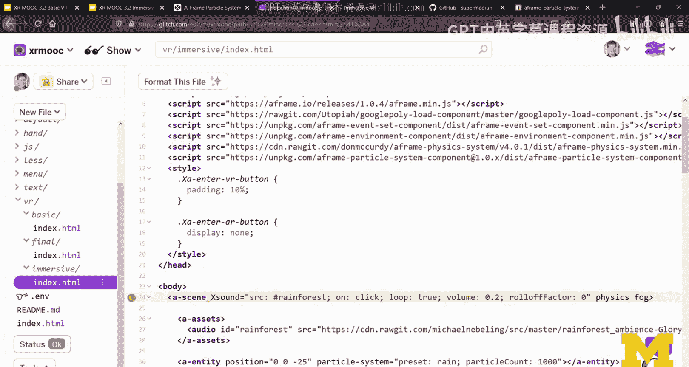

Yeah。It is still working。 So then aframe fog， let's just look at that。

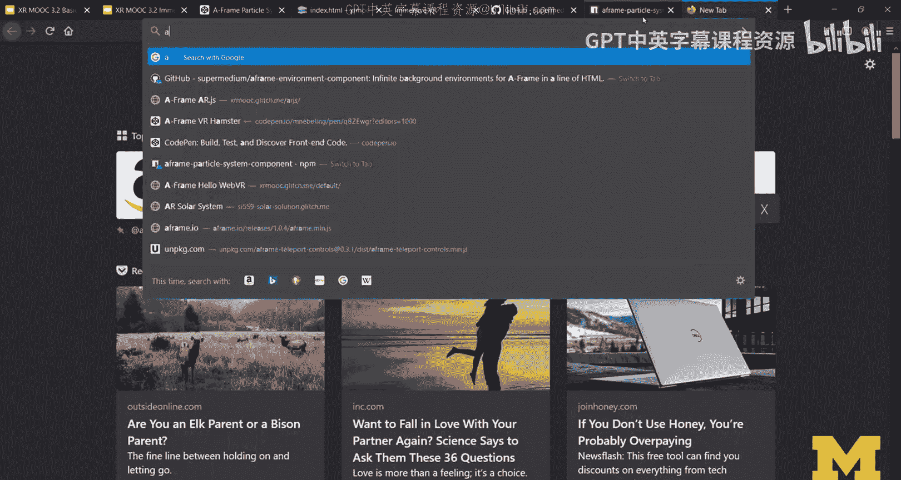

Try something like this。We do our own fog。Still physics last。

Let's see how that looks and whether it actually messes up things。Okay， and then and then there is a。

What's it call， there is a distance near。 we're gonna do near。near。8。

I should making it pretty sad now。No， it doesn't work。うん。😊，I know。

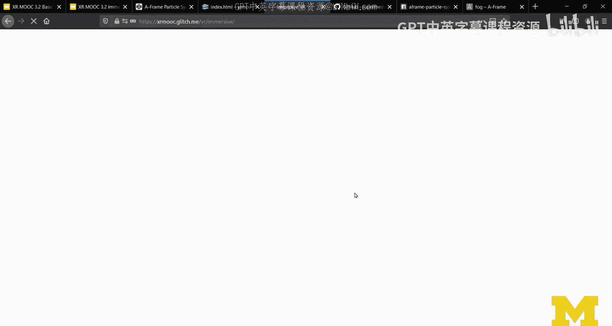

うん。喂。We do have far grants， so we I zoom out。

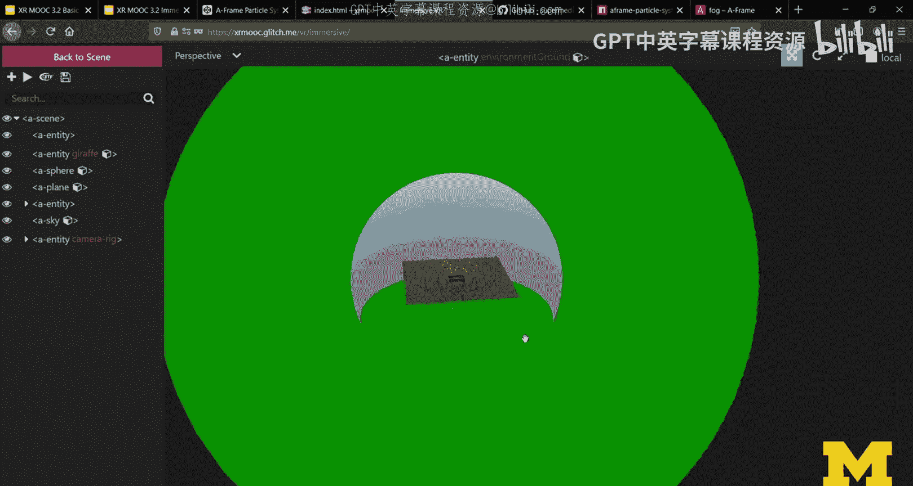

Doesn't actually do too much。So， we do have。It didn't actually do it。 So on the scene。

Particle system。I'm actually going to make it a little bit darker。So， but as， I don't see。

I don't see the fog here and should actually be there。and okay。うん。Near and fire。

 So this fog doesn't work。 I'm going try remove the environment。

Just to see so the environment actually then plays tricks on us from time to time。That's a bit sad。

 And now we have so much fog。 we can't even see the animal。 Okay。

 so the fog really isn't working together with the environment。 So I'll just give up on the fog。Good。

Okay， Ill give up。Can be persuaded。 Bring back our。Environment。Good， so we have。

Rain and that I showed you。 So not everything unfortunately is working on at the demo。

 I showed you particles system。 we added that。 We have teleport controls， so。That is。Here。

Teleport controls。 We have the environment component already。 I think I already added this script。

 but I'm just gonna add it again to my。Here。The the the。Environment component load， particle system。

 physics， teleport controls immersive， right， quite immersive。

 So you can see the number of components that we're adding。

So then we have that and so teleport controls。The way we're gonna do it。Is we need hands。

 so we already have hands in the scene， I think。We're gonna get teleport controls。

 We're just gonna add it to。The left。I'm actually going to go for something like we did in the so here left teleport controls。

 And I'm just going use hand controls instead of teleport instead of laser controls。

And then here on the right， in my laser controls。I'm going have a。Yeah， laser controls。

 I'm gonna make it Raycast。嗯。This is just going to work on。Objects on the girae。

 that's the only thing that it can hit。And a。We're going to make the line red。o k。

And then the other one doesn't have anymore。 We have teleport controls。

 and then we should be able to look at the giraffe and actually probably the food。

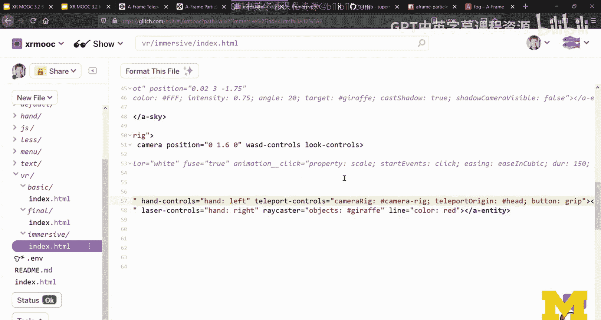

Okay， so let's try。Did I bring back the mirror or did I have it on my head。

 post distortion full the screen？

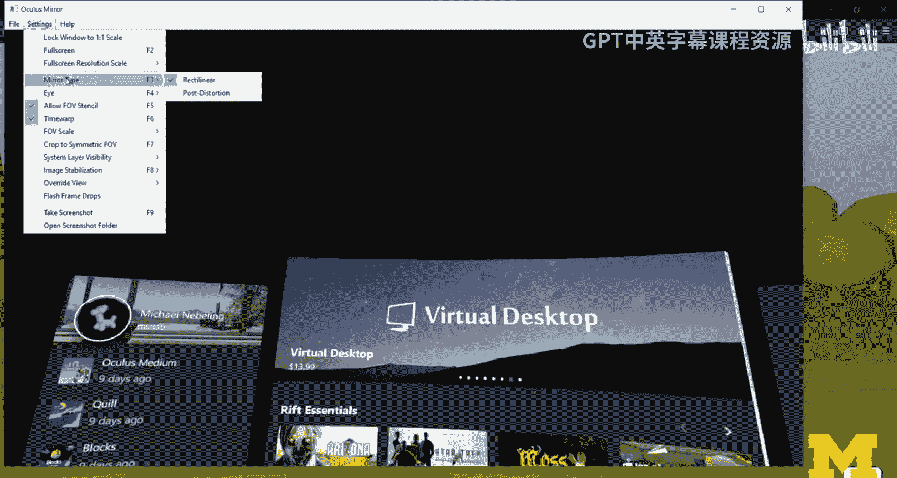

And running at NVR。 And here we go。So laser controls and a hand。That looks weird， right？嗯。Yeah。

 we have a hand and we have laser controls。And we can。Touch the object。

 You can see how the laser is going， otherwise going。Through like through some of these objects， but。

The giraffe it actually hits。It is， sometimes。嗯。Ass a pretty， pretty accurate colider on the giraffe。

I feel like， I mean， you can see it from the side。Hitting the legs， hitting the legs。

 hitting through。Hitting through the legs to So this is actually。

On the it has a pretty good collider so we can see that now with laser controls。

 but we actually want to do teleporting， so we have teleporting on the left on grip。嗯。It looks weird。

 So I'm gonna to get rid of the hand。 I wanted to show you the hand。

 I'm going to make it Ocus touch controls， so。Okay could touch。Cons。

 so they look the same in the second and just one has a laser， the other one， not。

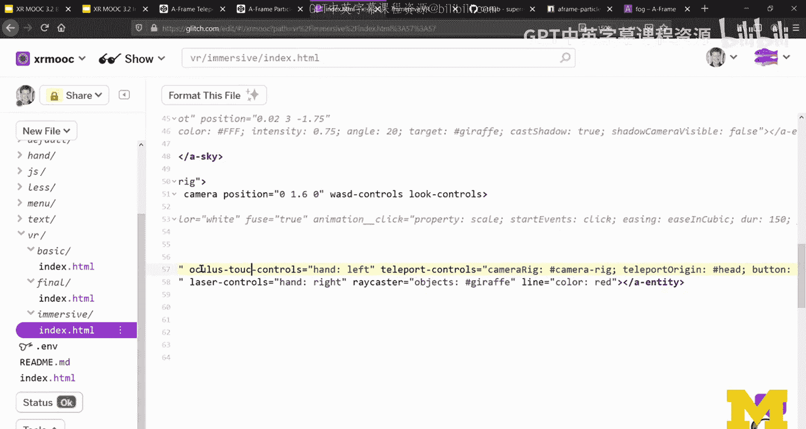

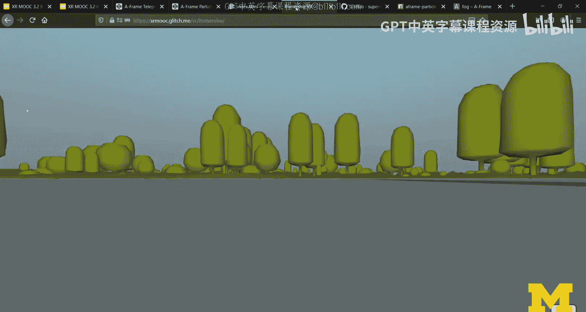

But hand control is something we can do。嗯。Allright。And so theoretically， I should still be able to。

Click the giraffe and hide the spotlight， but we don't have a spotlight anymore。

So since we don't have the spotlight anymore， that interaction isn't working anymore。So。嗯。

This one is obsolete now。 No spotlight。I'm just going to remove that。Trectionional light。

 also not anymore。 And instead we also don't need another sky actually well， nobody。

 nobody noticed right， didn't see that。Okay， and we are going to actually we're gonna do anything that is interactable。

 Okay， anything of class interactable。 And then maybe we can have， if we had a giraffe sound。

 let's see。 I'm just gonna try this a bit experimental。 So we're gonna make it class Interable。😊。

When you。Click the giraffe。Not trade。 What we're gonna to do when gonna click the giraffe。

 but we're gonna have this interactable and this interactable。 Also the food。

 And so then both should have a collider。 So now when we go into V R。

And we should be able to intersect the food cool and the giraffe。 So these are two characters。

 and we could do something with them now。And。Let's see what we're going to do with them。 Okay。

 let's go a little bit more to my script。 So you have teleportation。 Yeah， on the left。

We have teleport controls， so we're going to move the rig， so we have all that teleport origin is。

And we're actually gonna do the trigger button。Rather than the grip。

 So now this is just a different button。 But its a different。 It changes the user experience for me。

 It doesn't look like different for you。 But now， when I use the left button here， I can。Kind of。

I think we can change the resolution of the shadows because it does look a little pixelated。

That's something we could do， but we have our giraffe， it's moving and to be honest， if I get up。

This giraffe isn't big enough， so it's like a baby giraffe。

There's something I never really figured out before。 So I'm going actually。诶。Make it larger。

So and the way we can do this， and I've previously played with this。Going to make it quite a bit。

If you make it。Douple the size， so。That would make it quite a bit larger。And now we are pretty close。

And。I just w to make sure that when I okay， across the。

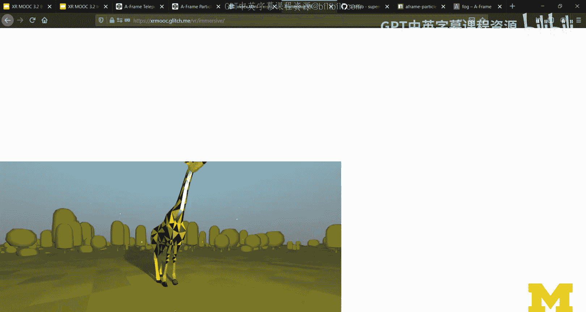

Thinking here again， sorry。That when I actually stand up， that I feel like I'm like no。Like， I hide。

 this is good。Yeah， okay。 So if I were to。

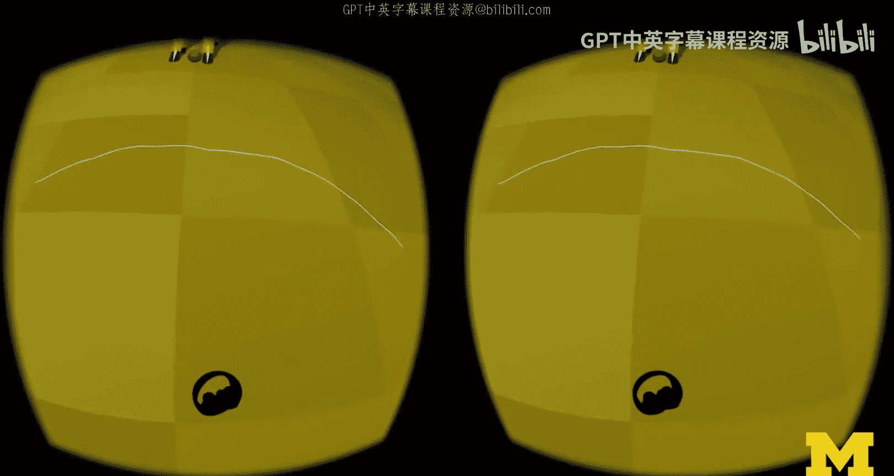

嗯喂。Treracking just went crazy for a second。So hello， giraffe， we can look at you know， we can。

 I want to do something with the food， but we're gonna grab it with super hands。

And I'm gonna show you a super brands。 Okay， so now I'm okay with the height， definitely。

We could add more sound， I disable the sound。 remember。

 and we could also have sound when we click the giraffe and whatnot， but。呃。

We wouldn't learn too much new stuff now if I showed that。 So we've moved on already with teleport。

Laser controls。I have that already。 I showed hand for a second。But I want to get to super hands。

 So super hands is pretty cool。 So I have like a demo here。Of super hands， I'm gonna to disable。

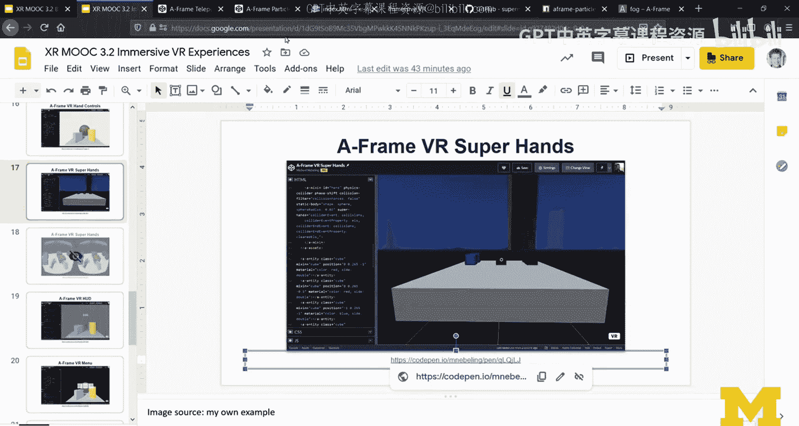

VR in this scene。And I'm going to show you super hands。 So if you go to super hands。

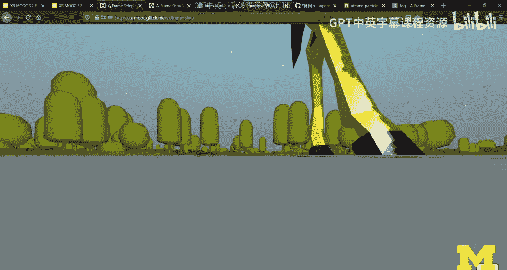

There will be different objects here that I can。


Interact with and pick up。 So I'm gonna actually。


Just like I have really big hands here， and then I can interact with these objects。

And pick it up and scale it just like we did in the。Zoo example， and then also throw it， okay。


And all I want to accomplish now。Is G。


Pick up the food。That's what you're gonna to do， okay。


Oops， yeah， I should not have done that， but okay， fine。Particle system， we are done， teleportation。

 We are done。 We're going to do super hand。 So we're going grab the We have physics。

We need physics extras for some reason。 I forgot why， but this is what superhans would tell you。

And so we're going to do these， but already have the event set， so。


I'm going add that to our library， make sure that you don't add any library any scripts twice or no even at twice。

 otherwise it's going yell at you super hands。 I'm just gonna remove the version numbers here because that way I just get the latest from unpackaged so okay cool just make sure that this again resolves to。

That does actually not work， because I remove this。


Okay， glad that I tested this because I would have probably debu this forever。

 And now we have the script。 Okay， so that would be loading。


And then we need to edit。To。Okay， we have the script。 we not， we need to add this script。

 This is a face shift so we can pick up things。嗯。With the collision forces。


That's just something I'm gonna to add， okay， so。Before the scene。

 turn controllers physics presences on while button is held down。

 this is something that you can see in the super hands examples， they'll tell you to do this。

 installing this phase shift。


And that's something we will need as well。 Then we have preset。Physics here， a cube。And so the big。

 the biggest thing is to add。I'm gonna do just grabable because I want my food to be grabbable。嗯。So。

 this green thing。It's gonna be。Grab a ball。This can actually have physics dynamic and shadow and all that。

 just grab a ball。And。I'm going to also do this when you， when you touch inside。 So hover on。

 we're also going to do hover bowl。To change the opacity。 So're gonna just get that。

 but also hoverable。 So when I pick up the food。 So here hoverable。

And then when I pick up the food。I'm going to have a little bit of the material changed。嗯。

And I have that class here， so I remember it。And so I'm going to sort things a little bit。

 so we have that， then we have the hover bowl。


Events head stuff， so that changes that and this is the previous stuff that we had。Okay。

 so what should happen now is that we will be able when we get there。 we were able to pick it up。

 I think I'm just double checking that I didn't forget anything。Oh yeah。

 we need to add physics to our hand。


I'm going to take this entire mix in。 This will mixings just go in assets， and this will just work。

And I just have to give my right hand， the mix in。And。


ちょっとる。This is the cube so we can pick them up。I'm plain so that things don't fall。😔。

Hand crs both have the mixing。Hang controls， right。So we don't do laser controls anymore。

Are we okay with that。I guess we are fine。

So I show a little bit of the coliers。 We're going to do hand controls and。Hand controls actually。

 so hand controls so that they have hand。


Hand controls hand right。 And there is actually hand controls is improved a little bit。就。

Hand oh yeah， okay， that aframe hand controls。That's what I want。

 So hand controls is a little bit improved recently， so you can have a higher poly model。

 So we're gonna do。You're going to do high poly。 So high poly or tune。嗯。Depends which one you want。

 We're going to do high pot and look a little better。

And we're going we're going to make both hands controls。

 now I'm just going to make one left and one right。And we can have a tender part coming out。

There's the wrong thing。Okay， so I feel like。


This is now my scene。And there's the food。I'm still somewhere in beyond here things。


呃比。


Go to the。嗯嗯嗯嗯。I'm not saying anything anymore， just to always。Press it accidentally， we have hands。

 okay。And okay， I'm gonna go a little closer。 This is really on the floor now。 and I can pick it up。

And throw it。And now。Oops，Oh， I just fell off my plane。 The plane below things isn't large enough。

 but。😊。


Let's just reload the scene。 And I can make the plane larger。 Okay， so that's。

 so that things don't fall off anything。Unexpected anymore。

 the plane that is our aesthetic body really make it like really。Like really big。

And this one doesn't even matter。 A plane doesn't have a depth， so。You don't have color。

Just make it black。Shadow doesn't need to render a shadow on it anymore。 So we fixed all that。

 And so now now things shouldn't like just roll off anymore。So here we have。It I little giraffe。

 it's not so little anymore， going to teleport there， pick up the ball。

Which is the food and I'm not even sure like how to get it， but I can keep it with me。

 I can teleport with the food and maybe。I can actually throw it at the giraffe。

 Let's see whether it's gonna pick it。up。Wops， yeah， the velocity wasn't great。 and it's actually。

Kind of like rolling through the giraffe。We could add the collision and' still rolling。

 So it's still there。 anyway， that food is gone。 I am sorry， but we made it a pretty massive scene。

 I'm not sure what you think， but let's see why I am in my little script here， so。

What else they want to show you， maybe menus actually， I did want to show you menus， okay。

So we did all this， and I have examples also for adding a heads up display。

 So this one is also cool because it shows shadow。 I'm just going show that I'm not going add it to my scene。

 Here we stop。😊。


oops， yeah， I couldn't。 for some reason， couldn't stop。 But okay， we're going to start this。

 This is our heads up display。 And now I actually have a counter。


And a little bit of fog here。 So that's also cool。And。It doesnn't have。Anything else this' seen。

 but it has a。Text， I think it says a game over here has it a text attached to the camera。

 And I obviously see this only once because still could be rendering So not twice。 but you knew that。

 right， so。


Okay， so that's a heads up display and then I have another example which is a menu and this one I'm just going to open。


Here we have the menu。 One thing I have to do is the menu should be hidden per default。


I just。Had it visible。So the menu is here invisible。So I control things。In the screenshot。

 But this is how we should run it。 So now it is there。

 And so the way this menu works is you have controllers。


And you bring up， well， you can。Teleeleport。 and then you can bring up the menu。

 The menu is actually attached to the camera， and you can just like collide through them to hide and show these objects。

 okay。So show and hide the box。 And when you release the button， it'll go again。

 I've tried out many different many designs。 It's not great。 This is one。

That is relatively easy to implement， and it's attached to the camera。嗯。Obviously。

 this is a heads up display menu， if you will。 And you can actually really like go through each of these。

And show them all or hide them all。So that's maybe one cool way to。In terms of like。

 how you can interact with it， Obviously， we could also have you kind of like。

 I had like a version where I had a mini。


Many thing in my controllers， I showed you many different kinds of many designs。


In my lecture， So I'll just leave that。 This is a had menu。 I do have another menu。 Let me see。

 I want to show you the other menu。嗯。Just go to my。


Profile， I think。Actually dashboard。 I don't。 I never know which one is which。

 And here I should have another menu。 I feel like I coded a。


Controll and menu。 Yeah， let's do the controller menu。


You will find many more examples in my code pin library。


So let's see。 And I closed it to things again。


Mchaah，micah，micah， full screen。Mmhm。So。And here I have a， okay， let me turn the point back。

 But I like， I have like a mini， a mini version of this is like a mini mini world。

And it's kind of cool， because。It's like attached to the controller。 Okay， the controller is black。

 so you don't see it so well。 I agree。Easy to change the background color。 but it has。

 it's the same functionality。 But now the menu is attached to the controller。And this 1。

 I actually like， the hot menu。


Didn't like so much， but I showed all the different kinds of menus， including hand menus。

 but hand menus won't work right now。 This is a rift， not a quest right now。

 no hand tracking in the rift S and so。


Yeah， that's that。Let me see。 One else。 Oh， yeah。 I'm gonna show you one thing where you put everything together。

 V Rron primitives is my little fun game for that 1， I have to actually get up。

 This is my example where I really put lots of things together， including all the sound and all that。

 so。😊。


へ。😊，Okay， I'm going to make this a little bit softer。 just afraid。 Okay， so here we go。


I close it again。断掉了没。So 그。This one has a lot of the things combined。 It has light in my helmet。

 it has。A shield right now。 And I can place the cube。And then it falls。

 And so this is how this works。 And then I can change my functionality to shooting。

And so then I shoot these objects and they disappear， okay。

I can also place new ones and I can use the shield。To shoot these objects at different people。

 So the idea is to have a little bit of a game here。 Obviously， that's what I was aiming for。 So。

 but interestingly， when you teleport， you can have the shield。 But when you shoot。

Like when you're placing new cubes， when you're shooting at cubes and you could get points for that。

Then you can't have a shield。 So no more shield。When you place things。

 you can have a shield so you can quickly switch between these different modes。And。

I'm going to teleport a little bit so that you see what's going on and I'm going to go into the shoot mode and now I can shoot all these objects。

And they would disappear。 and that's pretty fun。 So a little bit of a demo here。

And the sound is pretty loud， I think。But。


嗯。That's just how this song shoot shoot。Okay。And the mode was visible in the hand。

 And so that is that。 So these are a lot of things I wanted to show you。 There's more。

 I have many more examples。 Check out my code pen。And we are kind of like at the end of this lecture。

A little bit longer than I wanted it to be， but so one thing。Cardboard。 Okay。

 so I'm going show you two things with cardboard。 One thing you can do is actually travel with cardboard。

 so。Coming back to the cardboard template here， so this is a cardboard template I showed you previously。

And here I show you a VR gaze travel， okay。So I'm going to run that scene。


Quickly here in。Ffox。 So when I look at this， it does gaze based travel。 So I can also run it in V R。

 just have to stop T。


Run this in VR put on my headset。


Get the mirror。One last time。诶。Put the headset on。What is important is that you no controllers， okay。

 no controllers because we're simulating cardboard here。

 so handet is on and now I am is gaze based travel so I can look at these teleportation points and then they take me there。

And okay， I'm gonna look at the blue 1。 and I'm gonna jump to the blue 1。

 And now I'm front of the blue 1。Yellow。You get the idea。


And I can travel back as well。So。That's guys by his travel。

 And so so shooting and stuff could be done or I killed the。Henceads it again。

Shooting could be done potentially with a button。But you need to。

Be able to shoot at something so you could。Obviously。

 with the cursor and then shoot objects like my cubes we could implement that on click with the button so that would work。

 You can probably get most of the tra stuff to work。

 but you cannot switch the modes like we needed two buttons for travel for switching for shooting actually two controllers。

So it would be hard to actually implement T primitives， which is obviously。

Very simple game would be hard to implement that for cardboard。

 but I wanted to show you that a lot of this is possible。 I hope you enjoyed this lecture。

 We definitely made the scene a bit more immersive。

 so let's just check one last time What did we actually create in the end I'm going to open this scene。

😊，In a new window， I'm going to actually add the immersive VR as our example。Down there。

 so immersive。Well。And massive VR is our example seen。And I'm going open this in a new tab。

Making sure that none of these are running in VR。


And。That's we have a little bit of rain。Yeah， so here's our scene。 We see our cool giraffe。

 I'm going to get up for this demonstration。

We have hand controls。It's pretty immersive。 We have a little bit of an environment。 we can teleport。

And we can pick up this food。 oops， Im pretty close。


Pick up the food。Have it， can travel with it。And see whether。The giraffe would like it or not。It can。

 It doesn't seem to care。And we could add more interactions as well。But this is still pretty fun。

 So a little bit of a fun lecture on Imersive VR。That was。About 50 minutes of coding。

I think we've seen quite a bit。And hope you enjoyed it。Next one is AR。

 so I'll see you in the AR ones， I have one on Macbase AR and one on Mac less AR with WebexR。

 AK A frame and a frame AR JS。

