# 密歇根大学《面向所有人的扩展现实（介绍⧸设计⧸开发）｜Extended Reality for Everybody Specialization》中英字幕 p109 25_Unity引擎VR开发答疑会.zh_en -BV1jM4m1k73q_p109-

All right， hello， everybody。😊，Here we are welcome to our second office hour in the ExOC。

 I'm Mike and evening。And I am the instructor in the course。

 I'm also a professor at the University of Michigan， and I'm just gonna。

Start our office hour here as in the last one I have。

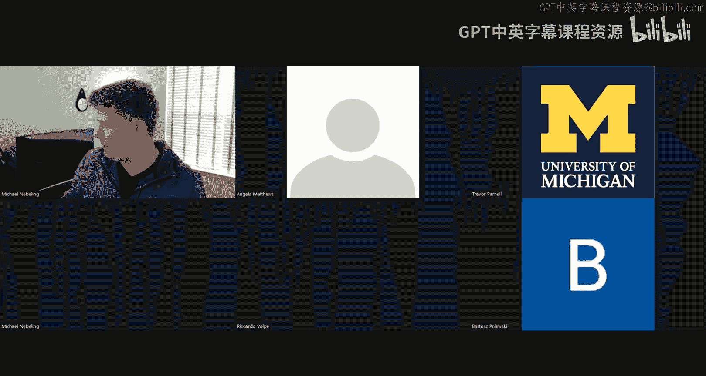

A few things prepared。And but also wanted to leave more time for questions。

 so the last office hour was focused on Aframe， we did both AI and VI and Aframe and kind of like had a good overview so we were doing a solar system that I was doing in the second course I was taking it basically into Aframe through various stages and then added some interactivity a bit of a 3D model was just a tiny lunar module for landing on the moon and then it。

Had like all these different kinds of did I have a link in here。

 I thought I had a link in here it looked like this in the end so。So today we're going to do unity。

There wasn' an era starting the editor that is interesting let me just quickly log in I guess I haven't prepared this a frame part anymore。

 but it should just take me there nonetheless so i'll show you what we had in。That's my other course。

What we had in the last office hour， roughly。It was like a starting point that looked a little boring。

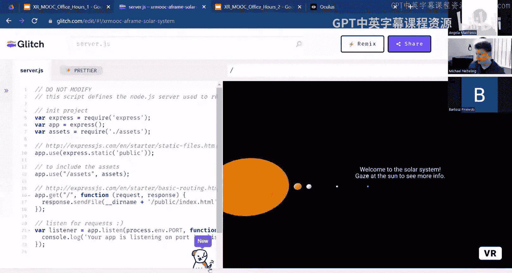

And then I created a new version of V2， and then we had an index 3D HTML， for example。

 and I did it in VR in。

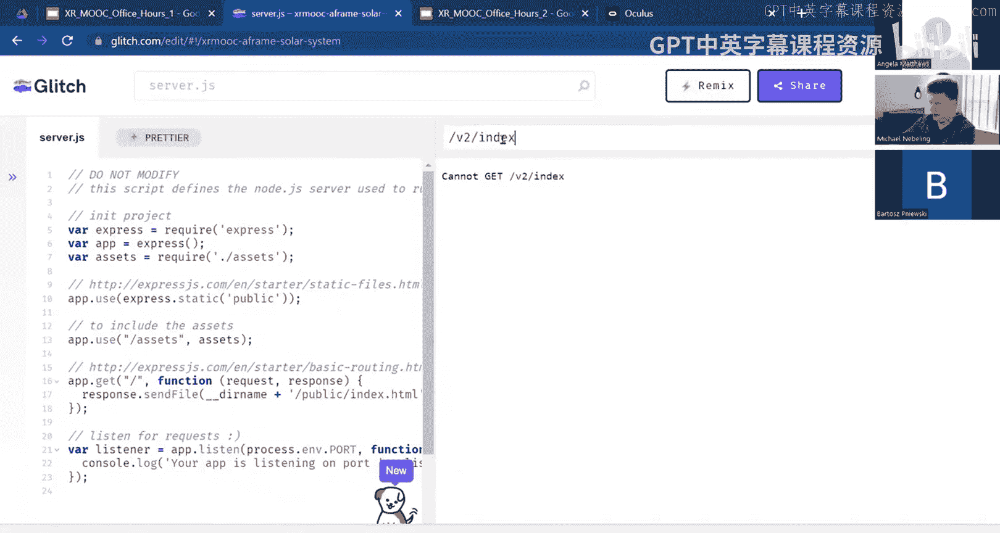

In AR and so forth。It just doesn't seem to load any textures at the moment。That is been said。

I what's going on here so well rather than so I showed how to do all the did the textures and keep backing all that and it actually looked like it looked like this。

😊。

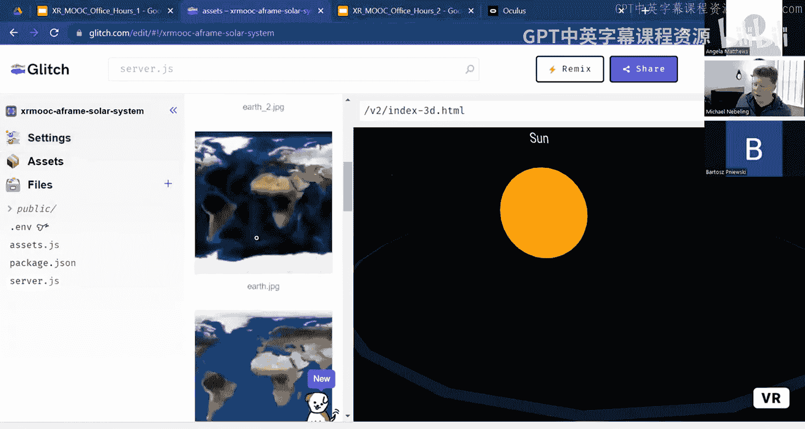

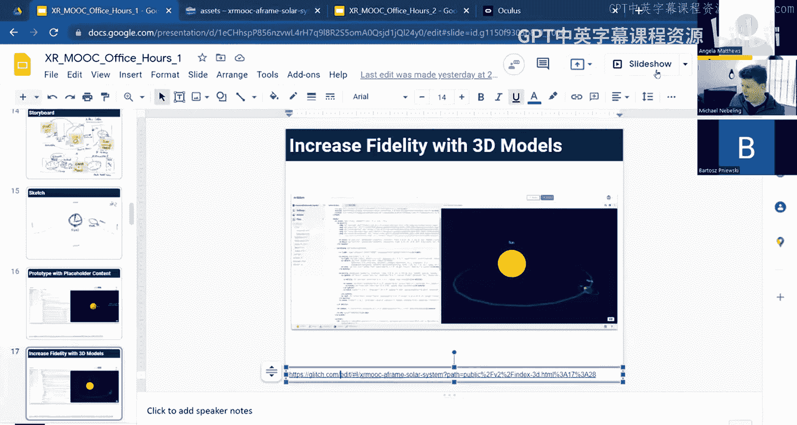

As you can see here on the right。So it was blue background faded。

 we had Earth going around the sun and we had moon going around the earth。

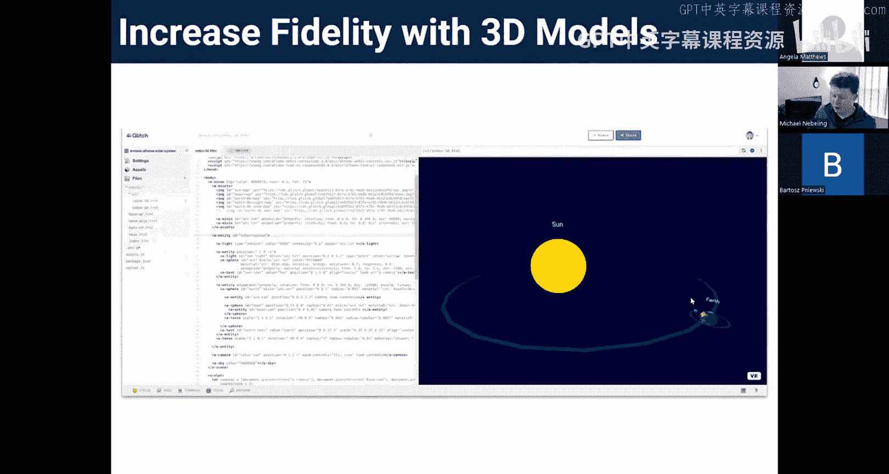

I was what I did last time so let's jump into today's office hours。

 so this is the second of a series of three office hours in this examOC that I'm doing this semester at least。

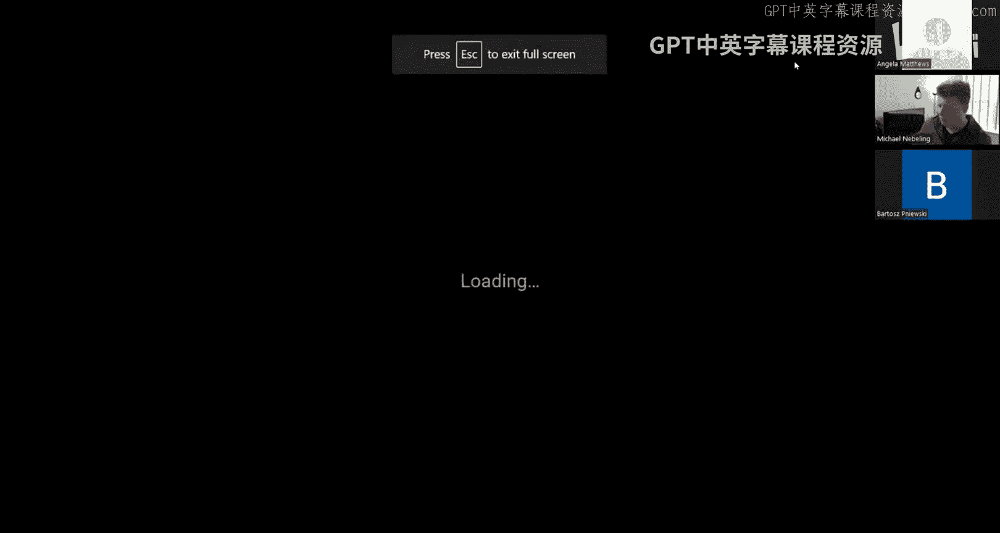

And this one is focused on virtual reality with unity and so the office hours， I mean。

 we are we are allowed to ask any questions and we can talk about everything in about。

 I would say 35， 40 minutes。

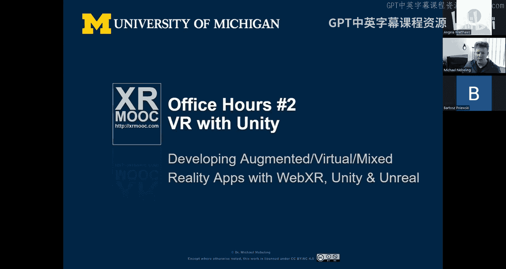

But maybe more like that if I don't have so much prepared today， I can always show more。

You're allowed to talk about any course but I'll focus for my content here I'll focus on the third course。

 that is the course focused on development， it is like all the other courses structured into four weeks and it has an honors track and we'll focus on assignments in the honors track and for this office hour today specifically we just focus on the VR assignment and then I have another one in unity on AR in a couple of weeks。

Andum。Yeah， so this is where we are， basically the second one of three planned for this semester。

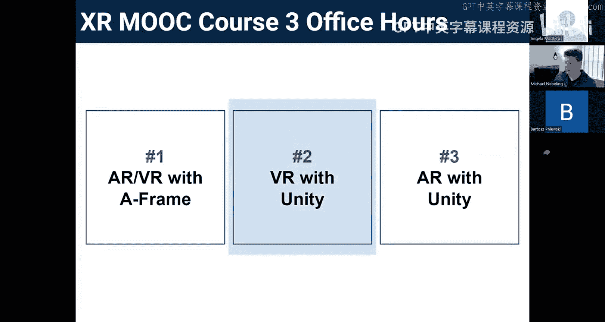

So let's jump right into unity the first thing， so these office hours I usually come with a few tips。

 but basically I want to get you ready to work on the assignments very common and we're just going to make sure that maybe everybody else is muted unless there are questions。

And。I'm just going to。Make sure that that's the case。Although I'm not a host， I can that。

 so Angela you need to help with us， we have a few participants that are currently not muted。

And so and I'll ask for questions later and just go through this with this first part first。

 so we'll have unity here， when I took the screenshot， which is like， well actually。

 the screenshot is probably not from too long ago， but I said everything happened on my computer in December。

And so right now。

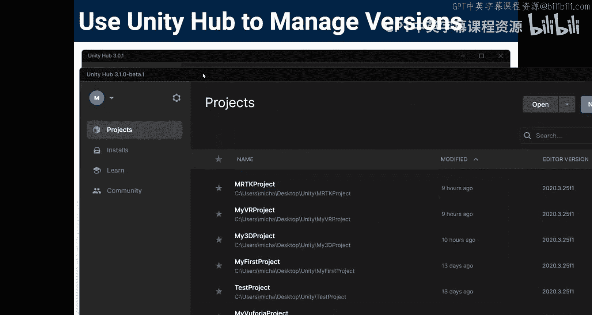

Unity Hb is I'm currently in the beish channel of Unity H so it has this black look maybe it looks great for you depending on which version of Unity hub you're using so we're using Unity hub to manage different kinds of unity installations。

I was using the latest long-term support LTS version at the time。

 but if I wanted to install a new editor right now it would be 202330 F1 so I'm working with 26 F1 but I don't think I'm doing anything where that you would see any differences what I'm not doing is working with 2022 which is pre pre releaselease beta and I'm also not working with any 2021 versions I'm just working I'm still stuck in 2020 and that's fine for the purposes of our course and the purposes of the assignment and I do this because some of the toolkits that I'm using for the VR and AR portions in UNT they just have the best support in。

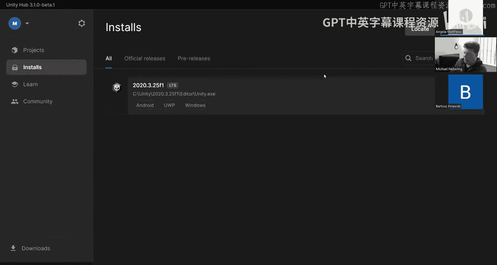

Well they're currently tested with these versions and they recommend you to use the long term LTS long term support versions。

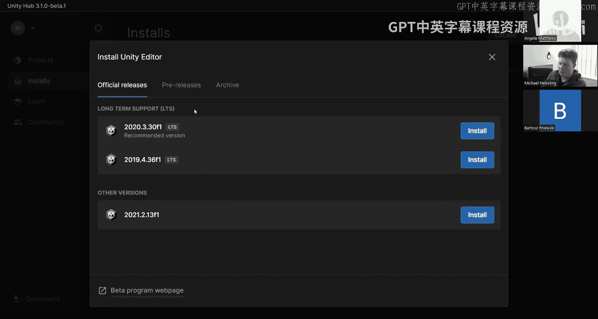

And then what I usually do I'm not going to stand here now install for you。

 but this is actually video of me installing things so associated with the office hour I'm also releasing a number of YouTube videos I give the link at the end or I can actually just post it right now I can post it into the。

😊，Into the channel so these。

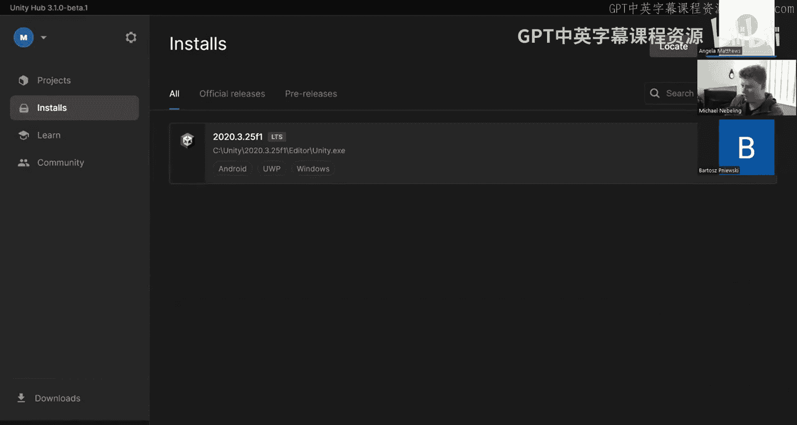

This here， so this is our YouTube playlist。And I'm just going to post that in the channel in the Zoom chat。

嗯。So what I'm cover here is not basically I'm taking video I'm showing you what is in so I'm going through my assignments today and I'll link you to what's in the YouTube playlist but this is something that you should do in your own time I'm not going to do it I'm not going to play these videos now is not just the YouTube playlist but basically I also add the second office hours I added the one from last week so the second office hours this week today I'll probably insert right here before the unity portion starts。

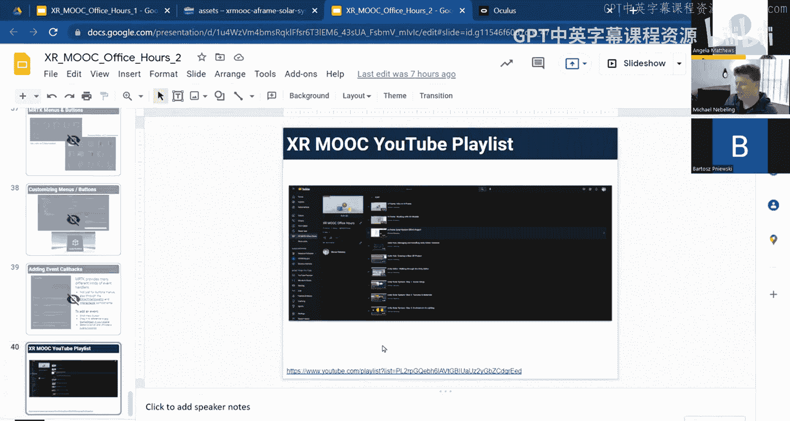

And then I have quite a few videos on how to do things in unity。

And these are meant to be so that I can be there with you if you work on the assignments and it feels like you can follow more more along these are not videos that I cut in any way。

 so it really takes 30 minutes to deploy things to a headset it's real time but for the office hours that would not be productive so。

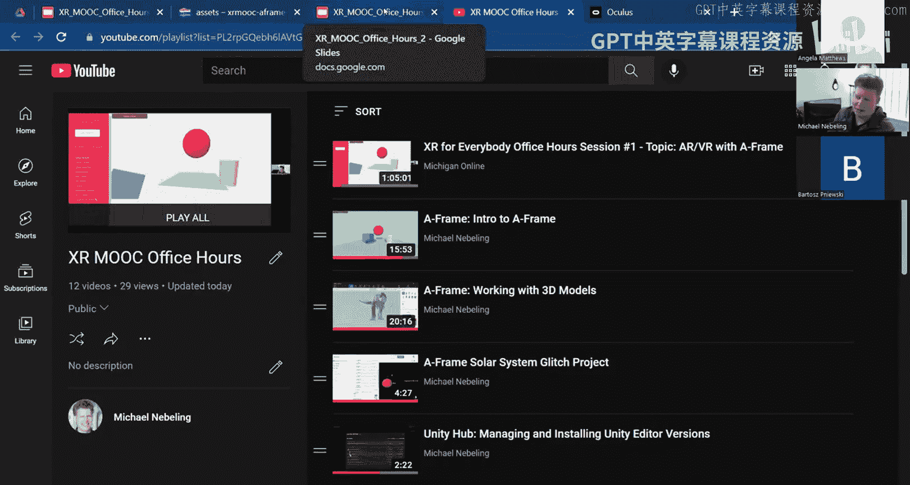

I wanted to show you right quickly what I install when I get my unity ready。

 so when I do a new unity installation， I'll choose the studio。

 the Microsoft Viual Studio Community edition。

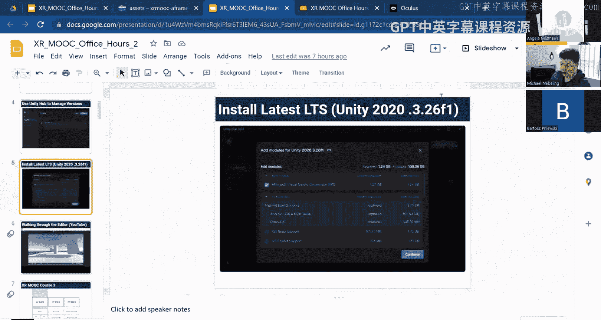

And then I usually do Android build support and I need both， you need to select everything here。

 the Android SDK， the NdK and the open JDK。And without so and I need this because I want to deploy it to my Que two and the quest two is an Android based virtual reality headset and so if you have a rift S so which is already connected to a computer。

Like this one is black and then you do not you do not need to install the build support。

 but if you want to deploy it to a headset like the Ques2。

 it's Android based you need all this stuff。And so this is actually quite heavy in terms of installation almost two gigabys that you just need to install so I have all that for my current。

😊。

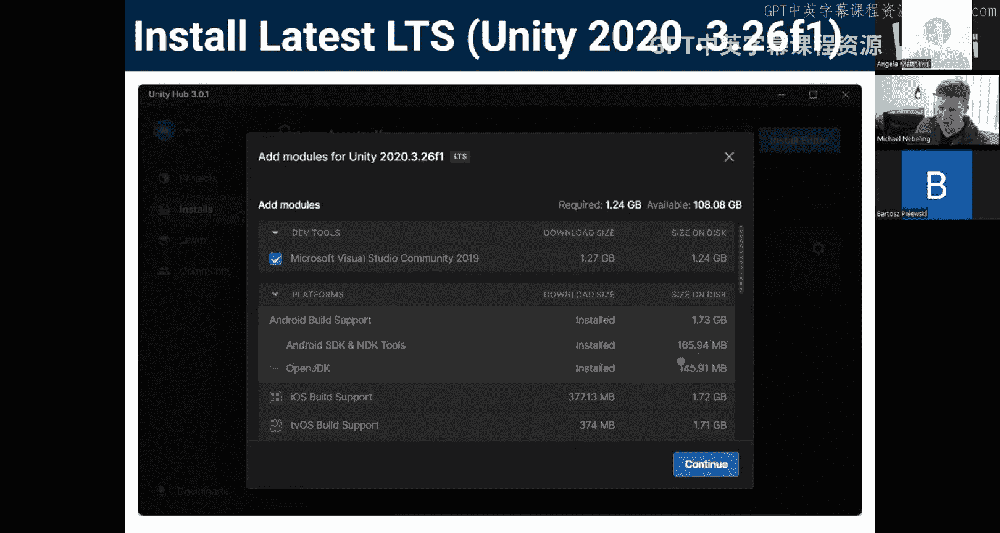

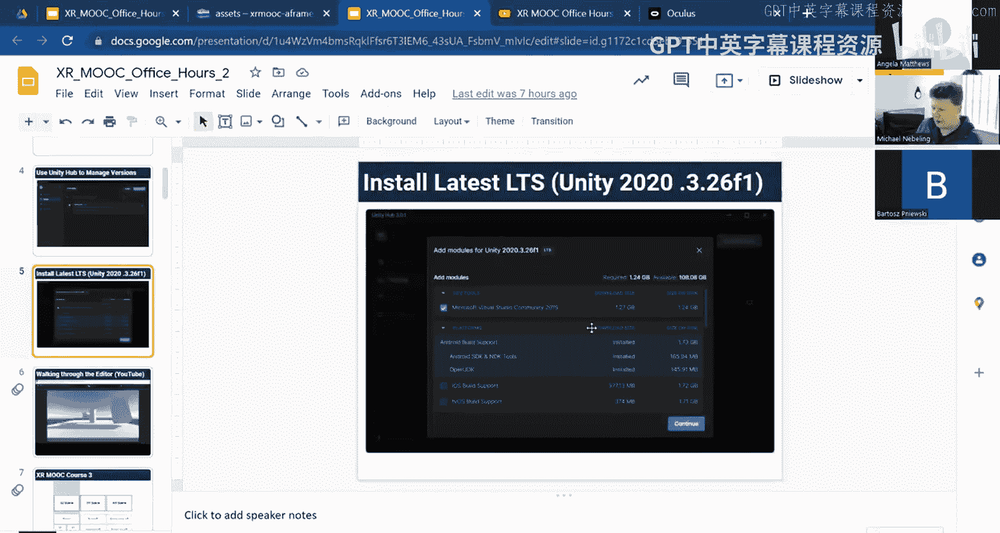

Right for my current。Install and。Then I'm going to just do quickly a new project in this version and so when I start a new project I usually just start from the 3D template。

There are。Except for when I do an AR foundation project， so when I do an AR foundation project。

 so AR next week。

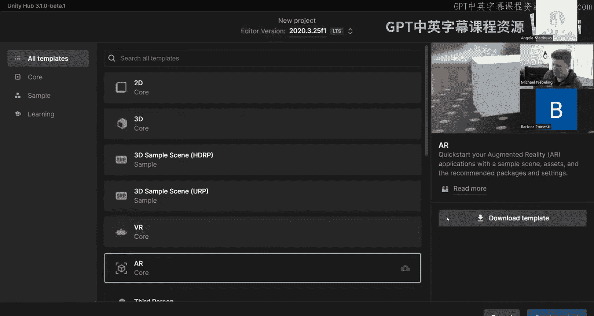

Sorry， next office hour in two weeks， I think that's the only time I actually choose a template that is not 3D。

 so I would choose the AR template。

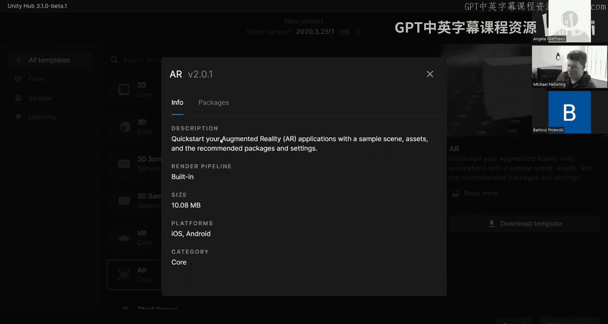

And so for any new project in the VR space， I usually start from a 3D template。

 even though you attempted to say， yeah， my office project。

 yeah I'm doing a VR project therefore I should choose the VR template。

 but I'm not necessarily using all the UT stuff I'm actually not even sure what the。Yeah。

 this is opening in the macro i'm just like going to try one more time i'm not going to actually select it。

 but just like curious what they actually put in there is probably。

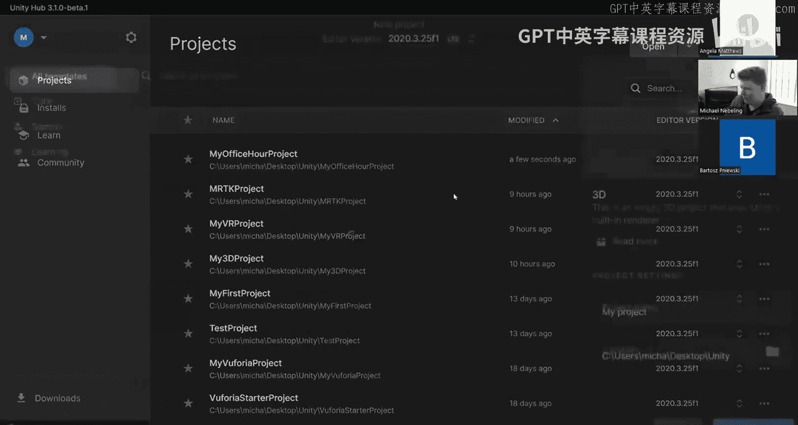

Xr interaction Tookit maybe no it's just you could actually technically start from this。

 to be honest， there's nothing wrong in here。嗯。There's nothing wrong in there that would actually make it no about starting point。

 but I。

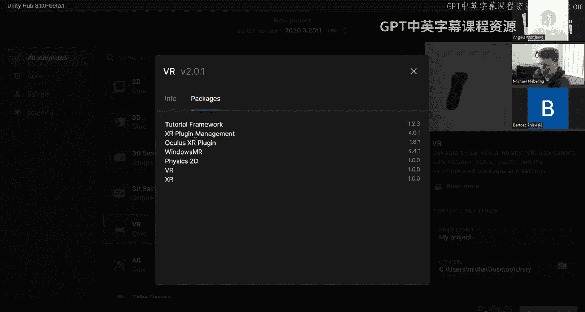

Yeah， okay， so this is。I mean， at least from the package list。

 it looks like there's nothing wrong in there。So I'm opening the Unity editor in the background I'm just jumping back to my slides here is actually my new Unity project。

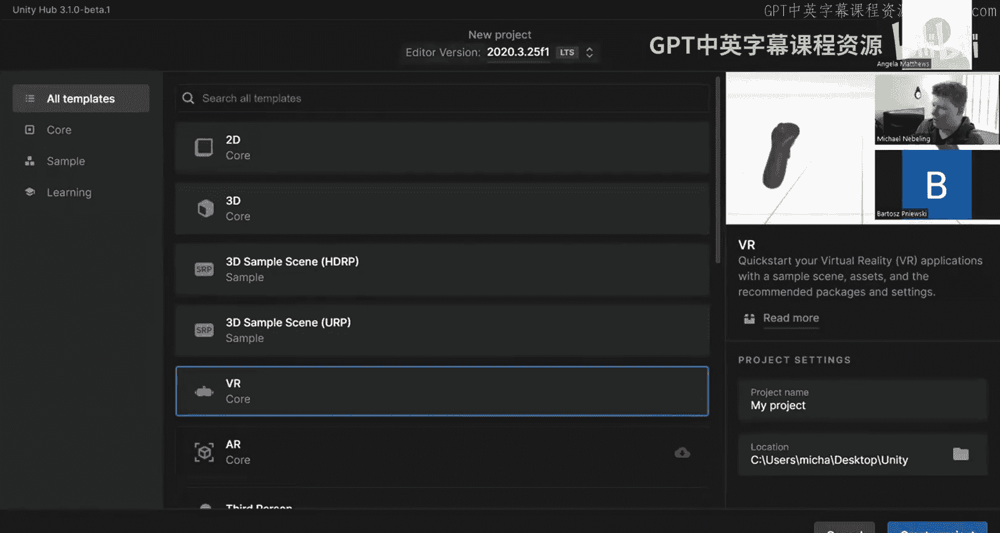

So what I'm not doing now is clicking around like I mean I'm not doing too much so in the example scene that I'll create I'll put a cube roughly maybe a little bit away from the camera so the camera is oops then we should do it along the Z axis the camera is there and。

Right so Z and Y up okay so it's interesting working in these different tools they always have different coordinate systems righthanded versus lefthanded and then unreal engine is like the z axis is up rather than the Y axis so as this and sometimes when I switch between them it needs just one second to get to get calibrated to them again right so in some of the examples where I actually create the whole solar system in my in my videos so I'll play some of it but basically it's it's basic 3D operations transforms putting things together and I'll show you the project in a second so this will be my new kind of like my new project and in order so when new press play now。

诶。It's just it's just a 3D project you're just looking at it like that it nothing special and then if I were to useR the VR template I could actually connect my headset。

And use Oculus link， which used to be called Oculus link and to turn this into a display。

 which would be just like a rift S connected to the computer so the rendering is done by the computer not on the headset anymore。

 but it needs to be tethered so you can see there's this cable here So once I use Oculus link。

And I make it a VR project and I press the play button I can actually play it on the device and it's actually a very comfortable way of working through this so let's win a little bit of time by just like going through some of the things so what I show you in some of the videos in the office is really like putting together a scene and working with a game view and the scene view and explaining all the panels in Unity if you haven't actually used Unity before showing how to create a layout that I'm using in a lot of my videos and it's just allows me to have all the windows visible for learners so when I record videos so normally this is not even my layout my layout looks like this。

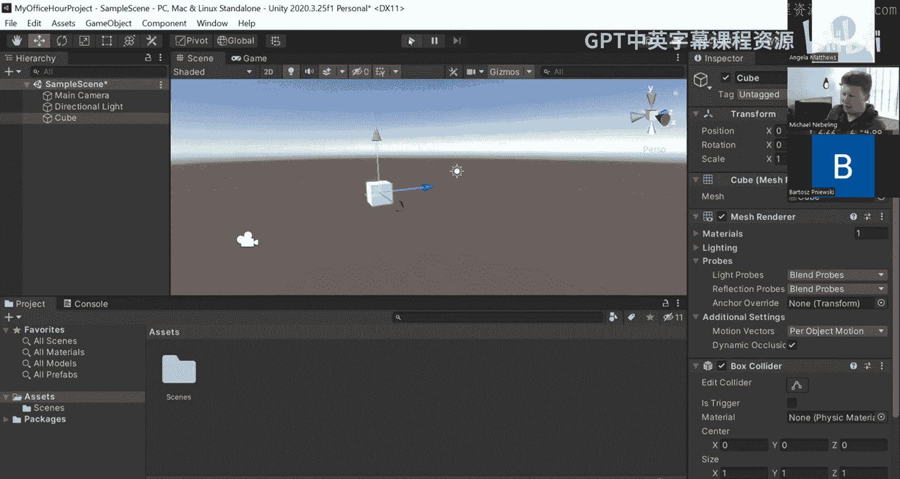

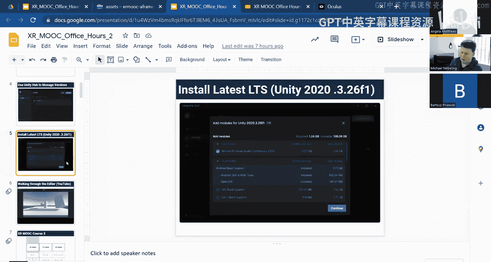

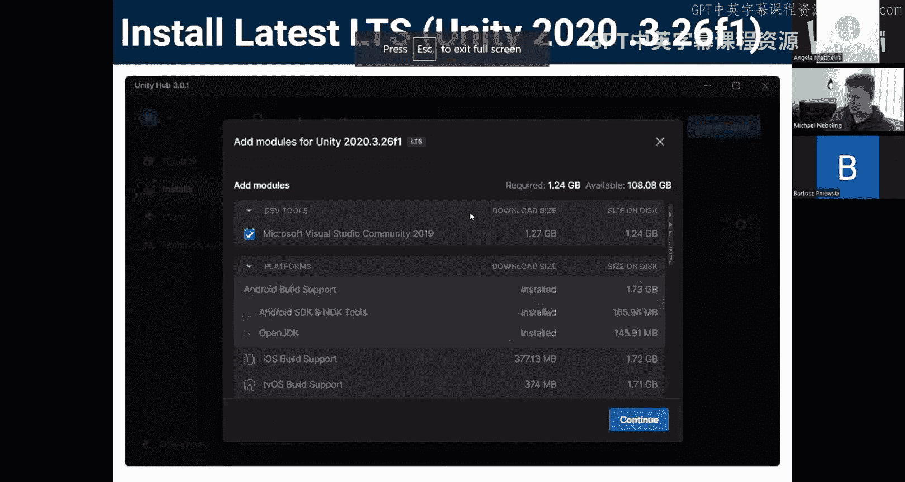

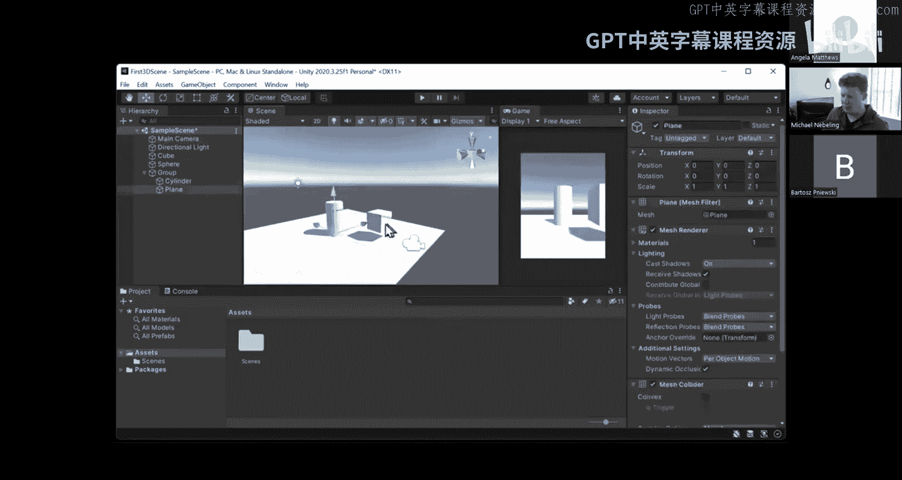

It has the build settings here， the project settings， the package manager。

Because I do I do a lot of things to get this up to speed and install all the packages。

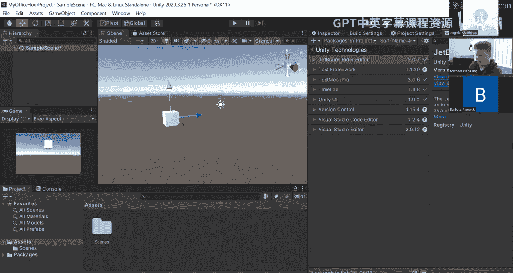

So there's more stuff in it's basically a walking through the editor in the YouTube paylist and that's something that if you haven't done a lot of unity before。

 it could be helpful。

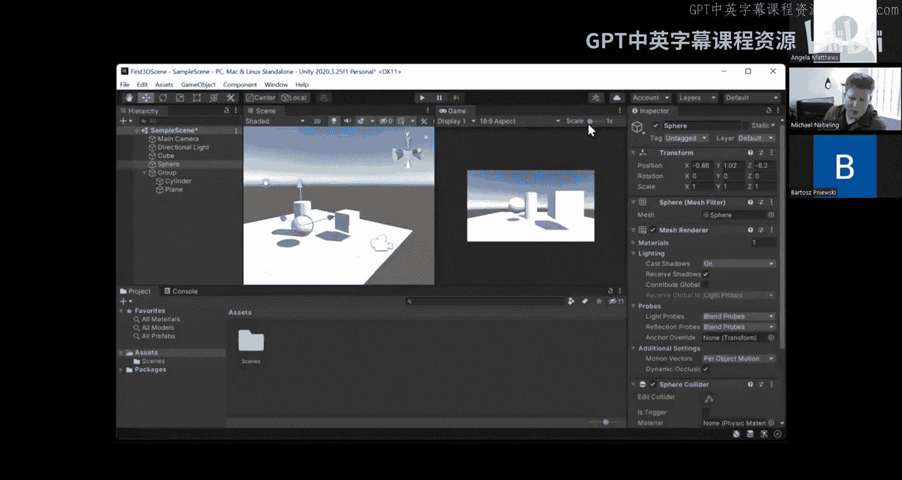

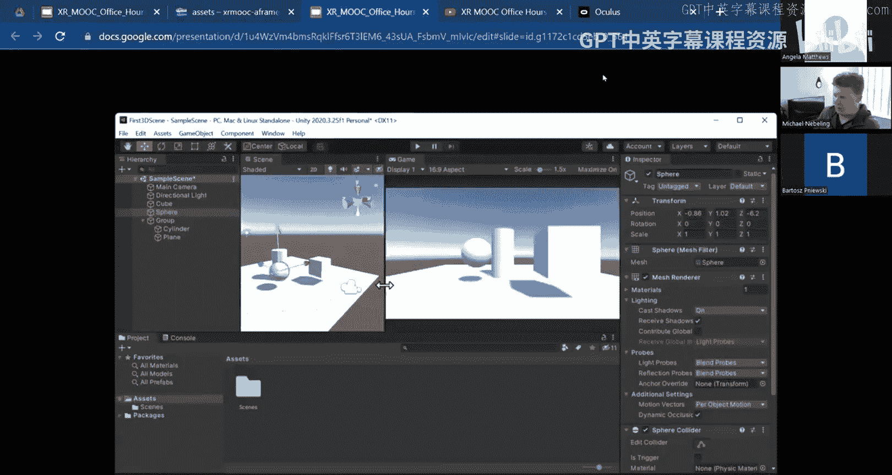

So then all right， so now let's get started on the first part of the assignment I quickly do the 3D scene just walk through。

 but I want to focus on VR I think a lot of troubleshooting will be in the VR space including what kinds of headsets to use and I'm wondering what kinds of questions you have after this。

But the first assignment in the third course， the first honest track assignment is creating a 3D scene it would start from like a sketch or it functions like a template。

 something that you want to design for me it was the solar system I created this solar system in the second course and so I'll continue from there the 3D scene which is the assignment before the VR assignment。

 but it makes sense to spend a little bit of time on this even though this is the office I focused on VR in the 3D scene you would quickly sketch what you plan to recreate in 3D so usually it's a good idea base it on something existing so you can measure and compare how did you do compare to the template that you had and so in my residential course we would just going through this assignment again with my learners also online learners currently you were doing hybrid learning at the moment at the University of Michigan so some students come in and some students stay remote。

And I saw the most fascinating camping scenes and some of their scenes were based on movies like inceptionion and just really inspirational and actually really cool。

 really cool recreations。Obviously when you work in this space you want to probably do your own ideas not just recreate things but for practicing I think it's always good to start from an example and so to set a goal for yourself anyway that's how the assignments are structured let mean prototype a 3D seed with two to three primitives such as basic shapes。

Addd materials or replace some of them with 3D models to increase the level of fidelity they look。

And then I usually in the 3D assignment， I just want people to try a few different camera perspectives just just to get a sense for 3D and actually so that could mean that you fly around in the Unity editor。

 but it could also mean that you actually really insert a couple of different cameras and activate and deactivate some of them。

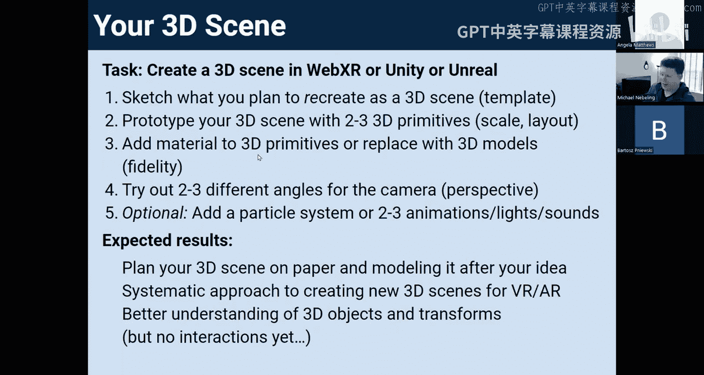

So here is my solar system that I created and so trying out a few different camera perspectives could be like okay。

 right now I think I have the camera roughly here so it shows us where the camera is。

What if I started more like from this side view or from further away。

 would probably be above this is zero。So I fly around with the right clicking in the scene and then WD。

 just like in most games， I guess。And so I could also like take a side angle on this further away or like what I really like is actually zoomed in so it could be interesting to find a really nice perspective where you have like。

Just like very zoomed in like something like this so anyway that was the 3D assignment and then when you're like happy with this position you could copy it。

 copy this transform and just like put it in the put it oops that's a transform of the camera so the current camera position actually not not sure how I would copy the current camera position is there actually an option to do。

Copy position and that would just copy the position that has entered in here what I want now is the position of my current virtual camera。

Anyway， I would then approximate it roughly， I guess， get it into this position。

 just like trying to get it here a little bit to the right and a little bit of rotation around the oops。

 the y。like something like that and because I have the game view on the right I can always see roughly what it looks like when I actually started and then when I started it looks like this and I added very simple rotations here so it's just a very simple rotation script and in fact what it does it rotates the sun。

And the earth is embedded in the sun and it's interesting that the earth cast a she on the moon so probably didn't get some of the lighting right I think I should have worked with a point light the in the sun rather than a directional light I still have a directional light coming from somewhere else which is just a default light but then essentially it does rotate the planets。

😊，And it themselves and then because the moon is nested in the earth。

 I'll show that in a second in the hierarchy， it should just like appear。

 should just like come around， it's probably going to be pretty dark。

But let's see what this looks like anyway and I made it very slow I can make it a lot faster too。

 so I did a little rotation script。I guess I'm just too captured by the scene therefore I'm waiting。

Okay， come on west with the moon。Is its not there？嗯。

We've waited so long it's just like it's probably right behind also and because I'm not using any other toolkis at the moment oh there it is finally coming I'm not using any other toolkits at the moment I cannot actually like I don't have have a camera that is movable and I cannot fly around while I'm in the game view。

 but here is I moon。😊，And but I'm going to make it and I'm going to set up an MRTK project and mixtureial toolkit project is the toolkit that I would recommend so anyway we've done the 3D assignment now and it was based on what I did in the last office hours so my inspiration was this NASA solar system here。

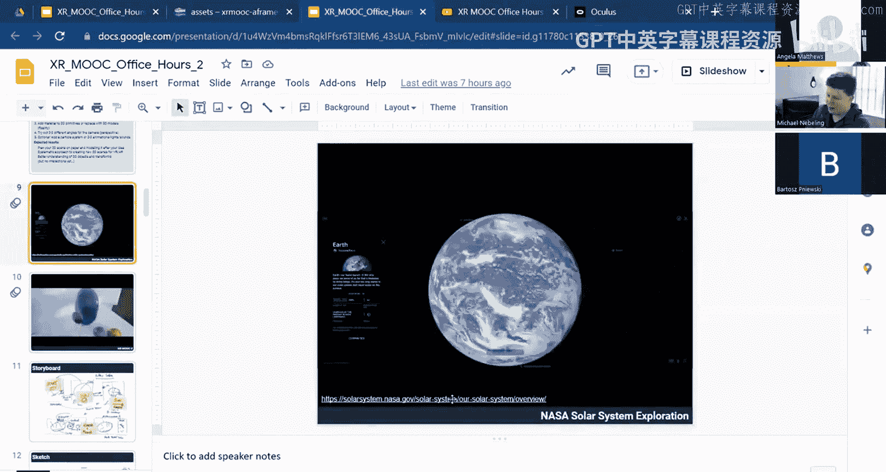

即等该咧嗯。Post for you you can also play with it very quickly it's actually really cool like it's in it's obviously in in a web browser but like you can zoom in and you can like tilt around and it has like these kind of like orbit bottleal system and you could double click the sun and then it would show you this kind of like。

诶。Close up view。And。You can go back and you can pick Earth so earth is like somewhere in the orbit there yeah and then we can just like jump onto earth and the way they do it is pretty fascinating it's obviously rendered very nicely and I'm not sure how real time it is but the ISS has this orbit around Earth apparently。

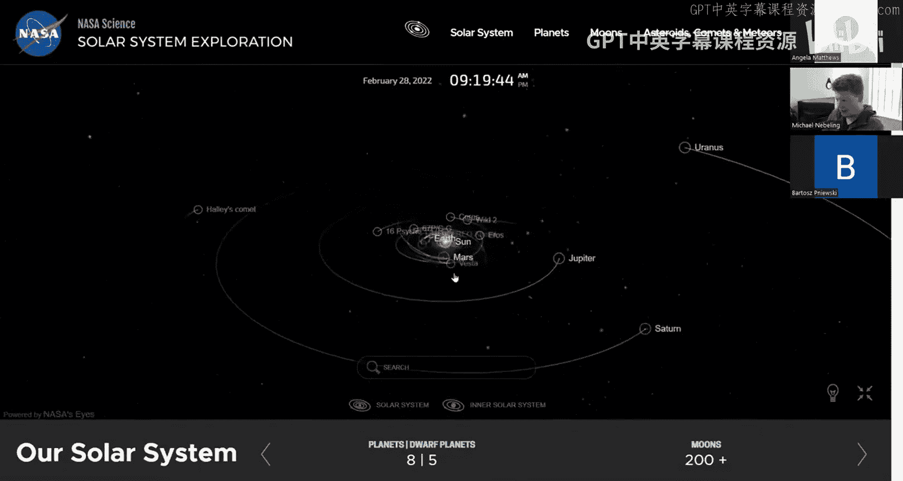

And I'm not sure whether these an ever update or whether it reacts to the。Current day， I mean。

 it does show current day and time， so。嗯。I guess this makes sense。Good to think about where we are。

And。Just like waking up in some parts of the US， I guess。All right。

 so this was my inspiration and so in the second course where I focus on a lot of like prototyping I did all this prototyping stuff and I did a critique and that was at the time still Google expeditions。

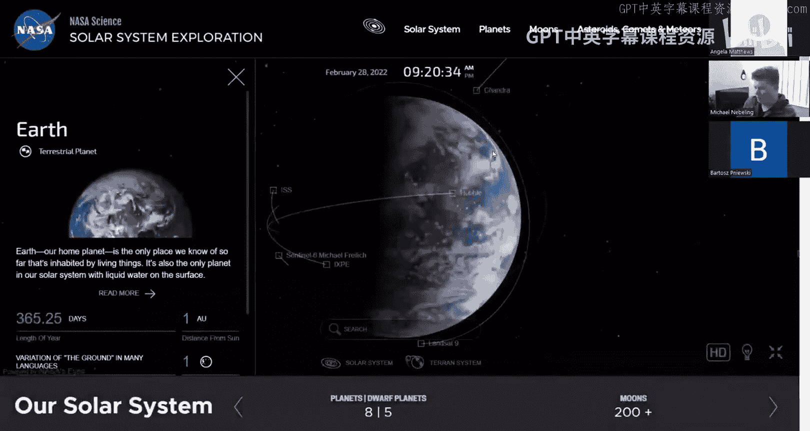

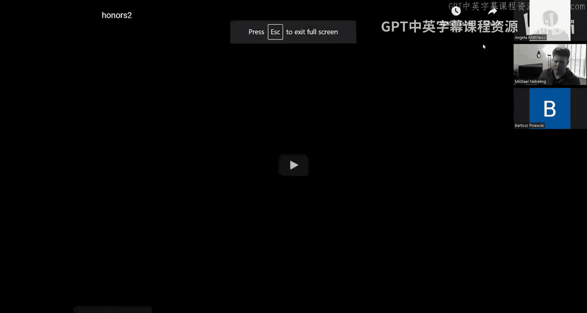

Which is discontinued and I don't actually have a very good replacement for Google Expeditions。

So I was working on an update to the course instructions。

And I put together a few apps that I found there are some companies who try to be like Google expeditions。

 but then they change charge money Google Expeditions used to be a free mobile app that has really nice 3D experiences of existing places on earth or like some museums or like an airport and then also some more educational ones like an anatomy or like the solar system anyway in the second course I。

The focus of the second course is on user experience design， many some of you may be in that course。

 so maybe that is currently what you're working on and maybe where you have some questions I'm happy to help there as well。

Anyway then in the second course I already show like a few techniques like working with the 360 grid and like Plato to really model the solar system and there are some elements in this video where I also then use AR and combination so this is now an AR capture it's actually a photo that I placed in AR so then I can I can use my phone to use some of the content and then I can actually use physical objects that I can I don't have to hold everything in the physical way I can just anchor some things in AR and so it becomes a very flexible way of prototyping and I'm always I'm actually always happy with how well these methods are received I mean some of these things are coming from my own research and I created some of my own prototyping tools that I don't maintain it's very expensive because I don't run a company expensive it would be expensive maintaining them so I also use a lot of existing standard。

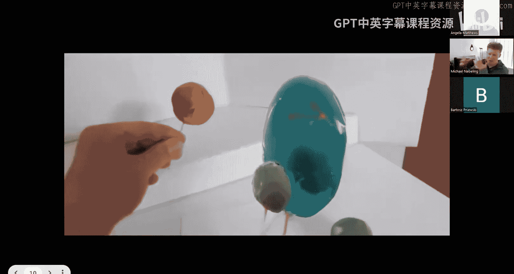

What's with all the limitations that I try to solve in my research？Here， for example。

 you can see me use Google blockslocks， which is probably also discontinued at this point and tiltbes also did。

 but so these are some of the immersive authoring tools。

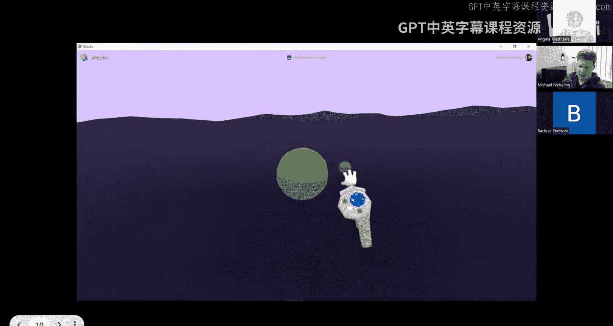

Anyway， then for the three years assignmentm and I have my sketch I have a couple of ideas I wanted to create and I spend a bit more time on this in the first office hour。

 so it says I'm still working on the same project I'm just like assuming so last office hour was focus on aframen which is one of the paths through the third course。

 but now I want to focus on unity which is which is working with a cross device kind of like platform。

And unity is very is a very established tool and here's my sketch of essentially what I already showed you what my solution is obviously have the earth around the sun and the moon around earth and I created these。

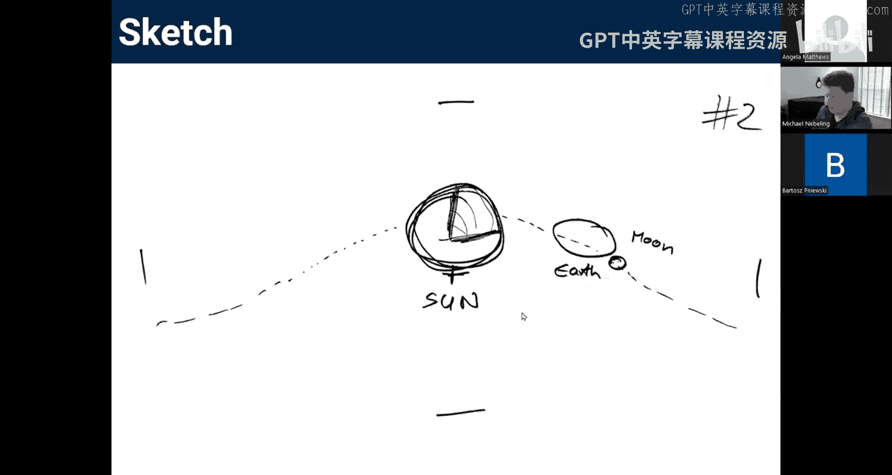

Animations so this is the project that I showed you and I just quickly wanted to go in there and just like in terms of the hierarchy。

 so I have one script。On earth。So let's say I just like。I nest them all I do not nest them。

 so I just like place them。Like this doesn't change anything in terms of their position。

 but it does make a difference， so each of these have a rotation script。

And I'll had them rotate very slowly， but I'll rotate them a little faster now。嗯。Maybe。

Let's do three and the sun， let's just do one。So if I play it now and I can show you the rotation script as well。

 but if I play it now， now you have all these。Planets like rotating by themselves。

 but nobody is actually rotating around anybody else and so。

The trick to achieve this is just to work with nesting， so I nest the earth inside the sun。

 therefore when the sun rotates， the earth will also rotate。So I'll just prove of concept。

 but I'll show you now it flies around and because the sun is going very quickly I would I should now take a different camera position and so I'll just like make sure that my Zx is。

It's probably further away oops。Let me see camera， camera camera。Right。嗯。And that would actually be。

 you know really far away like minus100， so an AR that would be 100 meters away and that's actually really far away。

诶。Right， so I can see a tiny these are the dimensions roughly I mean。

 this is what it would look like from somebody very far away tiny earth and a moon around which you can't even see So anyway I'm going to undo this because okay。

 when I didn't do is actually write let's just leave it there and so the last thing I do is I actually have the。

😊。

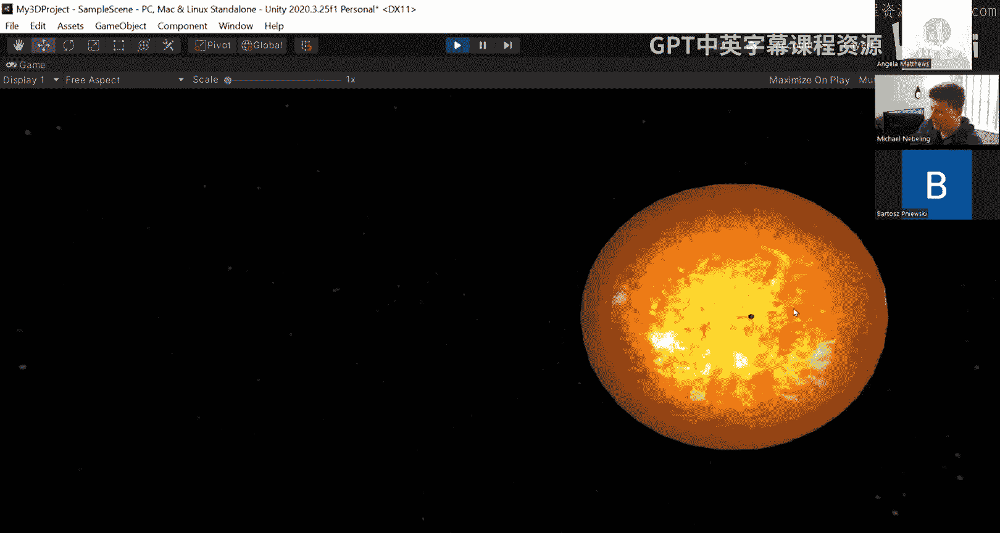

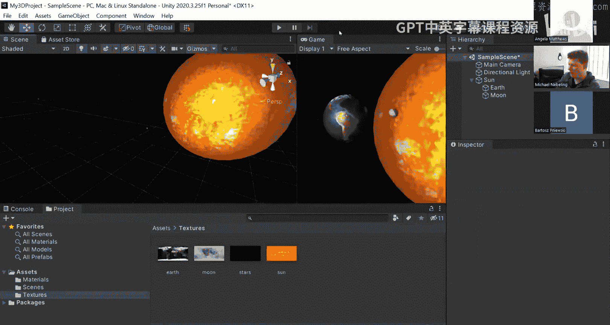

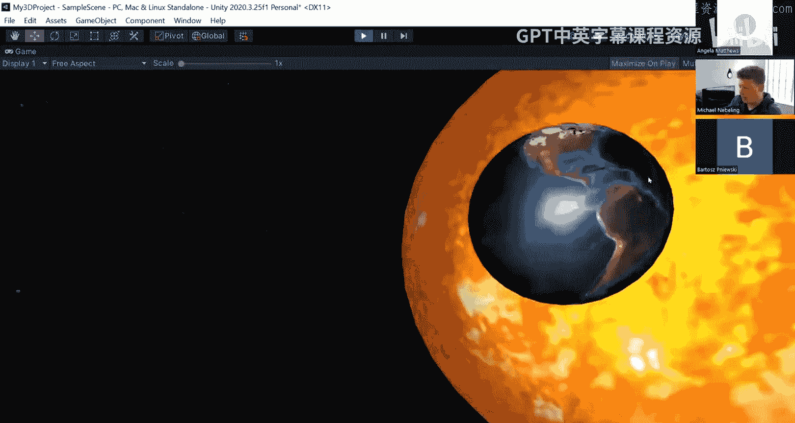

I'll make this a little bit slower again。So it doesn't look so crazy。

I'll just have the the moon also go around the sun and it's the same principle。

 I just nest the moon inside Earth， sorry I said sun just now I mean technically there's not completely wrong but we want the moon to go around Earth and then those two together go around the sun。

Okay， and the rotation script is really nothing。To special。Just opening it in Vi Studio。In fact。

 I think I found an example in when you look for。Rotation in unity what I did is just like so the rotate script takes whatever the current object is。

 the current game object。And I don't actually have to。呃。Actually， I don't have to do anything here。

I don't need the start one。 I just did this one was like。I guess。

Just like a first example that would have rotated it by 60 degrees on start。

 but what I want is basically in the update function， which is called every frame。

 I want to rotate it a little bit and I want to use the time the deelta time that is passed into that I have access to in the update function that allows me to basically the time that has passed。

Since I started this。嗯。This application and there'll be longer obviously the more frames have passed and then if Im multiplied by a certain speed so for example one or two or three it'll move faster and if I when I rotate have it rotate the other way around I just use a minus one so it's usually rotate this way and so I wanted it to rotate that way okay so that's that's the script and then I just applied it to all the components sorry then I made it a component for all these。

诶。For all these subjects， I have sun， I have earth， which I guess was。1 or 1。

2 was something I forgot。 and then the moon I remember I did quite a bit fast like so that it looks more visible and this is。

This is now roughly what I had in the beginning anyway。

 so this is my 3DC we still unit in VR so let's go into VR。

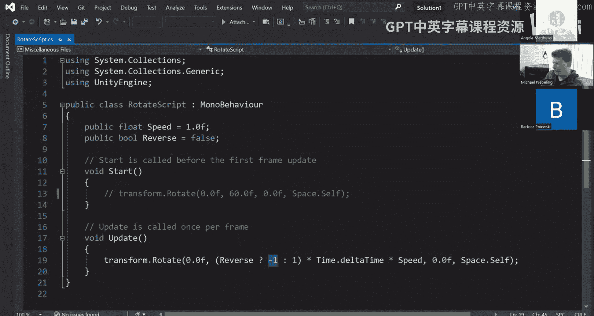

Cool， so now comes the tricky part。

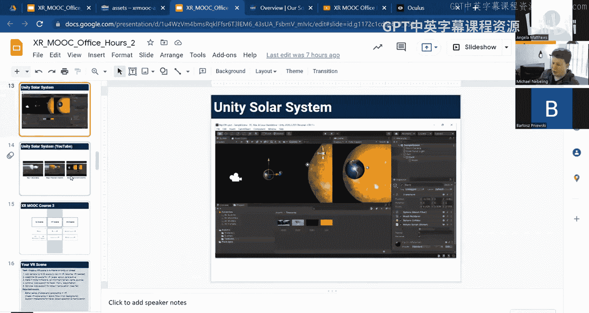

So there are actually more videos， actually the whole solar system I created in three videos。

 I do a basic scene setup， I applied textures and materials that I got from NASA essentially and this would be the part where you would increase this third step in the assignment where I increased the fidelity maybe bring in a 3D models so I could bring in this Luna module from I found it before on SketFab so working with 3D models I would often go for three models from SkeFab for example。

 and I showed this in the last office hour so the same stuff applies here just I would use an FBX so that's important in unity I would work with FBX as a file format at GLTF is what I talked about in the last office hour for web the global transition format at GLTF is recommended but for unity we would work with FBX。

And then I don't actually have a 3D model here， all these are basic 3D shapes with materials。

 and I initially color them and then I replaced it with textures and you could even do some combinations of that。

Anyway， and then I add lighting and change the background from the standard unity background here to something more。

Stars and sky using a 360 video。All right so we're going to go into VR now so once we are in VR so the idea of the VR assignment is you'll continue from your 3D scene and we'll add a well need to add a kind of like an Xr camera into the scene so all these toolkits and I show you the toolkits that I choose so I'm soing this now with unity and I'm usingoccuululus integration package to connect to my quest。

And then unrealre engine， sorry under engine， I'm not using unreal Engine and then mixed reality took it for some of the。

Interactions， it's just a setup that I recommend because I think it takes you very far and I'll show you each of these components now each of these toolkits。

And then what you were do in the assignment is you first prepare your scene by adding a new camera rig。

 so this rig allows you to in most tooltit allows you to teleport and to take the controllers with you。

 also shows the controllers when you have on the right it shows the right controllers so which show the white ones with the quest or the black ones。

With the Oululus Rift。诶。And I will still need to decide what chats that I'm going to choose。

Because the I guess they renamed Oculus Li or something I just can't find it in the request anymore。

 but I'll still refer to things with the terminology。

 you know metata is working very hard to get rid of everything that's called Oculus at the moment。

But so really removing that as a brand and so it's the meta Que now， it still as awkward as up here。

 but we can't see that， I guess。But that is confusing so I just couldn't do the archcus link just a second ago but we'll try again otherwise I'll switch to my Rift as but I'll show you with two different ways to deploy or run it a VR scene the most important thing is what makes it a VR scene is like adding the camera rig and then once you have that in there you can actually view the scene in VR which means on the headset through the goggles。

And then you would normally want to adapt the in， like maybe scale it differently。

 maybe take a different camera position， maybe change the layout completely because now the scale in the headset is like it very different from looking at it on a screen。

And then the third step is to make it more immersive so adding for example an environment terrain I'll show you some examples there lights。

 sounds， all that and then add support for travel which usually you get the locomotion is usually supported with the toolkits that I recommended so even just As integration package has all that support already but you could use so I will use mixed reality Tookit you could also use X interaction toolkit which is unity native I just don't like the look so much to it but it does have examples of menus and teleportation and actually I wanted to find I think I have。

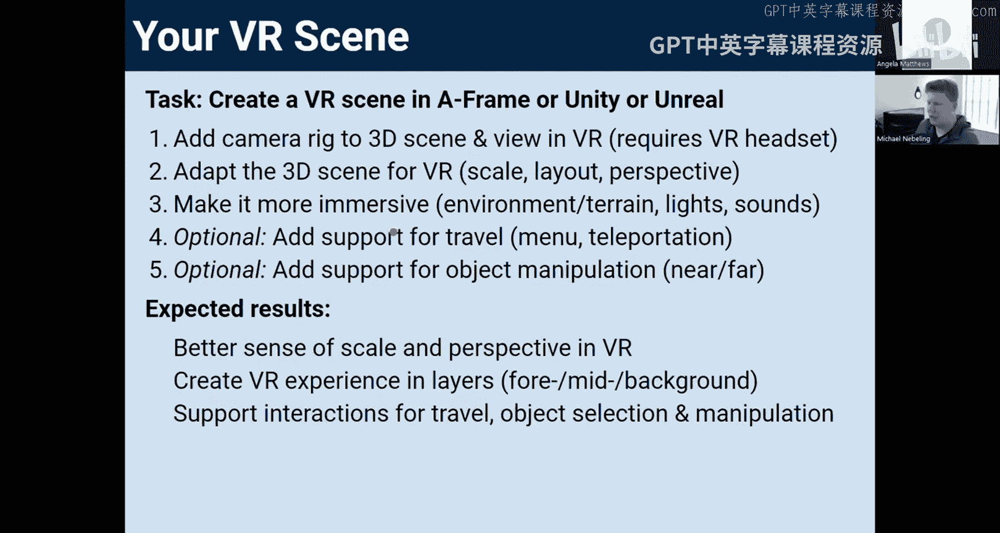

Make sure I took it here， but I also wanted to quickly show the。Exllent interaction to aki。

 so in the first week of the third course we're going through all the different tool aki。

And so steam VR is obviously another another way to do it， but here is X interaction tool aki。

 so I'll just make that part of my。诶。Slide deck here。Okay。

 it's like an office R can watch me edit my slides cool。All right。

 so we'm just going to place it roughly in the middle， I won't obsessed too much about it。

 but this would be XR interaction quickly。嗯嗯。That's not alternative thenre not you would use one or the other so this is an important slide I want to show you did I finished the one before we we would do object manipulation so at the end of my little office hour like in about 10 minutes I guess we would be able to interact with the objects so Make toolkit is a toolkit that I featured a few times throughout the MC it's still under active development it's still it's done by Microsoft it' it's really quite good it was originating as Hol toolkit it was just for the Hollolens and here I show example videos on HolloLs2 rather than a quest but you can actually get things you can actually get it to work it has support for both VR and AR including mobile AR as well so。

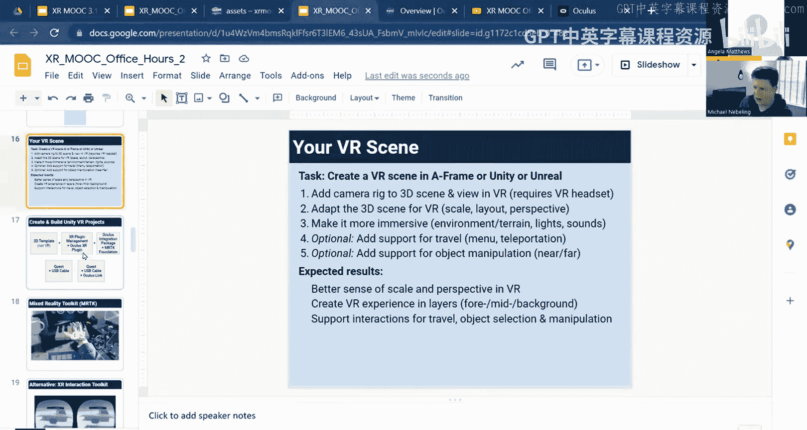

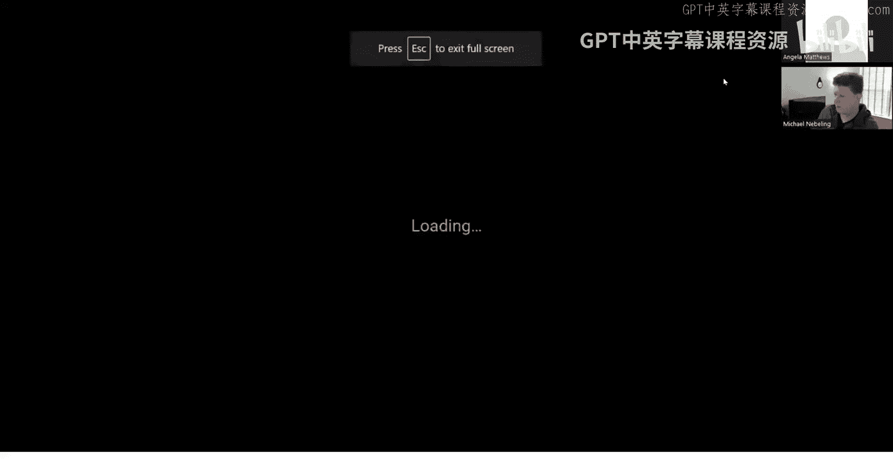

If you're working on the AR assignments later， so next week。

 next time in the office I talk about a few different ways to solve the AR assignments in Unity。

 and one is using AR Foundation with a Microsoft's Miity toolki and then deploying to an AR core AR kit enabled smartphone or an iPad with AR kit。

But then I'll also briefly talk about how to deploy to a Hollands。

 I don't expect that a lot of learners have access to a holands it's still $3500 but。

Sometimes people do and。Obviously I designed these courses for the majority。

 but I'm happy to answer a question so this is my recommended setup。For the VR assignment。

 you start from the 3D template， you could start from the VR template。

 I guess that was at some version of annuity I was very specific about it， but right now。

I would say 3D templates though you need to enable the Excel plugin management I show all that in a separate video this process setting this up takes 30 minutes in itself use the Oculus XR plugin to actually get all the to be able so this gives me with this I then have here's my MRTK project when I have all that in there I have this then becomes options once I have the Oculus VR and the XR plugin in there and so it's here on the X plugin management that would normally be like enable it now and then you enable it and install a bunch of packages into your tool and then I can have I can render to an Oculus headset right when I press start or I can just render can just deploy it to Oculus which would be going through the build settings which I think I have here it just opens this。

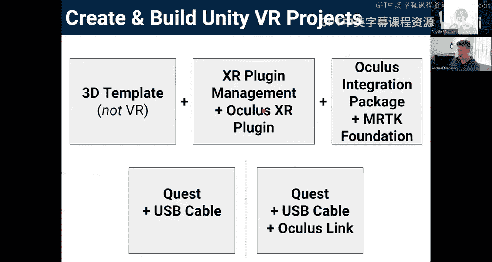

Tab and it's currently fetching connected devices， but probably the quest is not on at the moment。

 but once it's on。It would like appear in there。I'll switch it on so it becomes an option。

AndRight now it should be probably empty。And so once I have the quest started。

It was just charging once I have it started it should become an option here as well and that way I can deploy but anyway I shouldn't be tempted to try this now because I know this takes a long time and I've prerecorded this。

Let me see now is myoc quest here it connected。And I could actually pick this， build and run。

And it would actually。Do it。I'll do it the third time then。

 so I'll build this in the background and try to get it running on the quest while I'll talk to you。

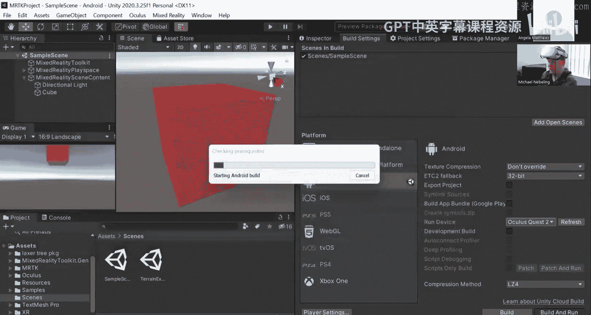

And then I also use the Os integration package and MRTK so mixed really tool it is to recommended toolkit that gives me all these hand interactions and menus and dialogues and widgets and 3D objects I can manipulate so it's just a cool starting point also comes with very simple scenes。

But I just use the MRTK foundation package it has foundation examples has like five packages so I' we need this foundation for now and then I have two ways to do it to reach my quest one is well you need to connect it via USB in order to deploy to it unless you're using other software like sidequest you can probably do a wireless upload somehow but I usually just connect my quest to the。

To the computer and then it says enable data。Which is currently happening right now。

And let me see whether I can get side quest to work so you can see roughly what I'm seeing in my headset。

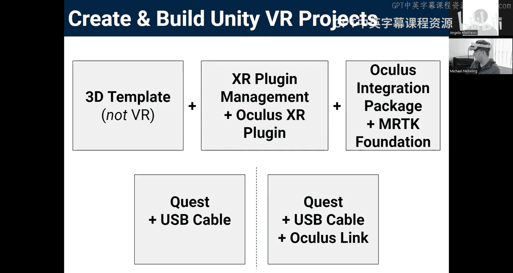

嗯Well。Oh yeah。

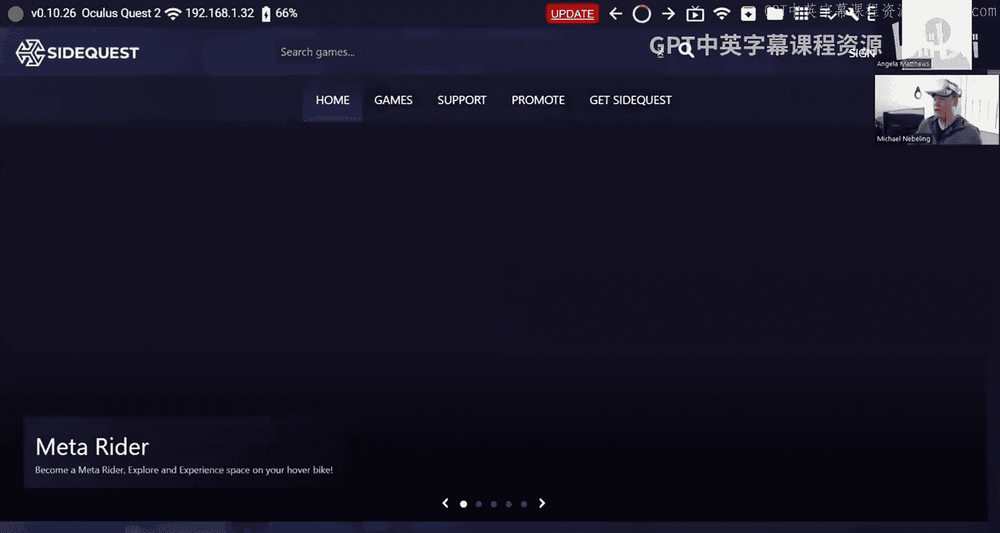

While it's updating。Why don't see whether this。Kind of like works。So。是。

Well this led to some terrible rendering issues here on the headset now。

 I'm not sure what's happening。 It looks like broken I've never seen this before Anyway。

 I'm just going to allow and hope it'll be fine after this。

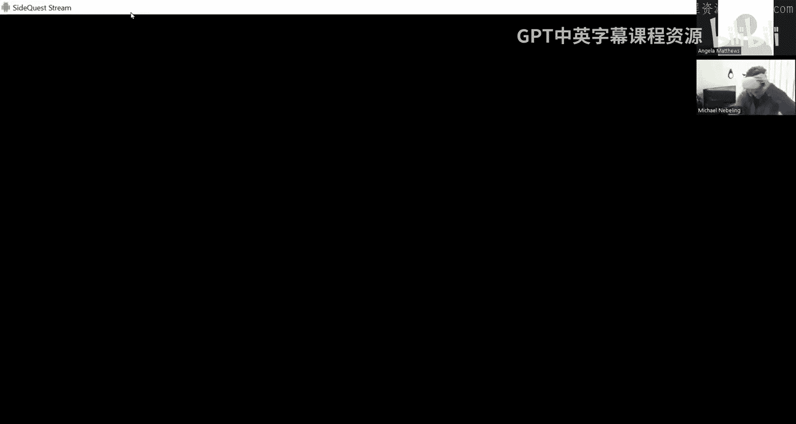

It just stopped this dream here a bit， okay？Let me just like， let's not break the headset now。

So already quite bad。嗯。是。So I would use sidepress sometimes to just show to people what I see in the headset so here right now normally just yesterday when I was looking at this part it would show up as Oululus link so I'm not sure what they just did I have no idea where it is but it used to be here it used to be an option and right now it's not showing up instead it shows me the Guardian only and I have no idea actually how to enable it at the moment。

This would be me， but if somebody knows and has this problem as well cannot fix it right now。

 I will just switch to my other headset because the only thing I could show right now is actually what I'm doing at the moment is actually deploying it so I'm deploying it to my headset。

 which means it becomes like an application here。As an unknown source。

And then you can see some of the scenes that I have previously previously which whichs the stream stopped sorry about that I don't know what's going on I guess I should have。

Not detective。Yeah。Anyway， this part was fun right。

 I guess I I don't want to update this its a really big red update button that really wanted to do they really wanted to press it right now。

Unauthorized allow an headset， Okay， let's see。One more time。Okay， USBDbuging， yes， allow。O。

It's currently not functioning the they wanted to function。

 so I'll do it Ill switch to my other headset one second。Yeah。Yes。

So me stopping this also means that I will not be able to successfully deploy it my to my quest headset right now because I just disconnected it。

What I'll show you instead is so I have a video of that。

 but what I'll show you instead is actually using the Que in combination with Oculus link。

 which is really enabling this in the headset it used to be called Oculus link and then the rendering happens actually on the computer this is an option when you have a good computer and it's the same as using a rift as headset so that's why I'm doing this。

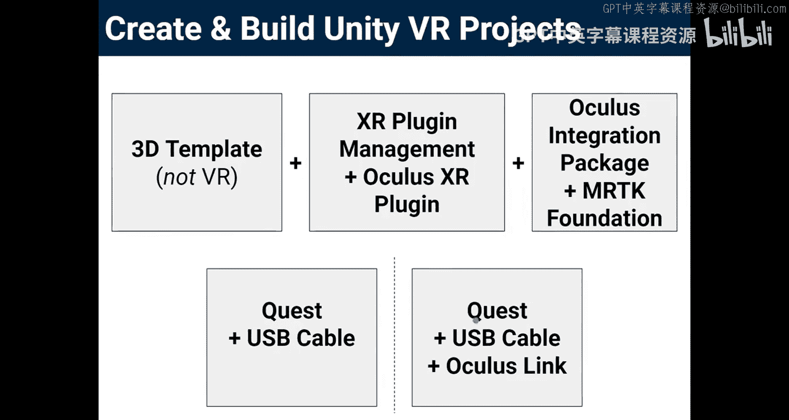

And okay， so the alternative to MRDK would have been an excellent interaction tool a kid。😊。

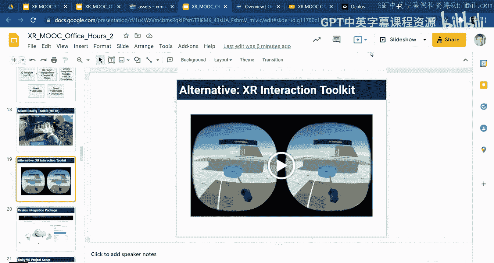

You could use it and you will find instructions on how to set it up， but they on their website。

 it has teleportation like what I show here。And it has various。

Interactive behaviors like grabbing objects， like most most of these toolkits have like standard support for grabbing。

 picking， sometimes snapping to the controller like these are snap interactions。

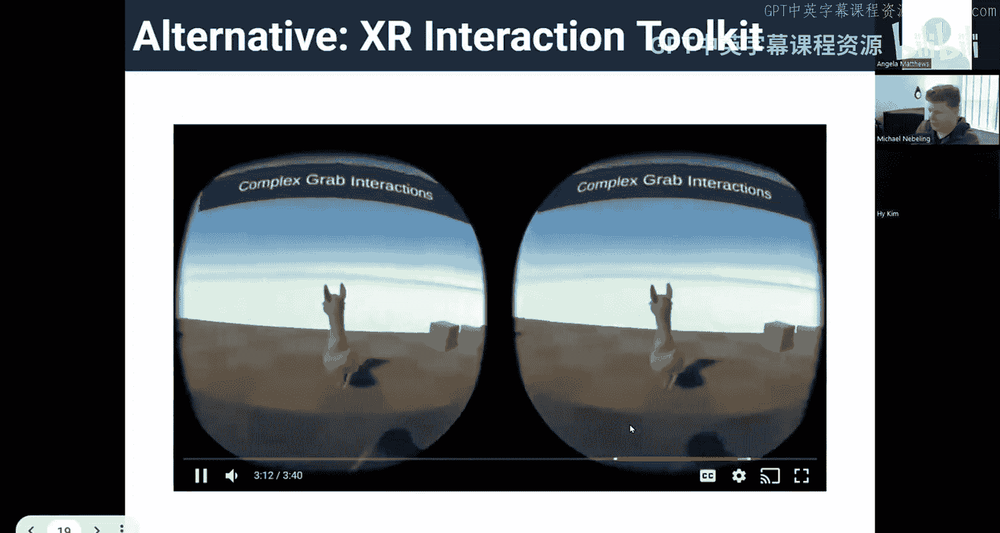

And different kinds of behaviors。And then you get for free then we also need the AchiIS integration package it was one of the things I showed here in my deployment slide。

 very important AIS integration package。

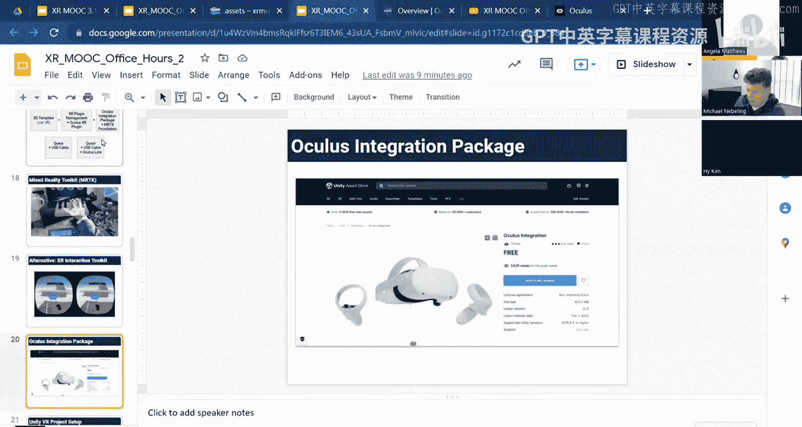

Um we need that， obviously if you develop for Oculus， if you develop for a different headset。

 then my instructions will not apply。

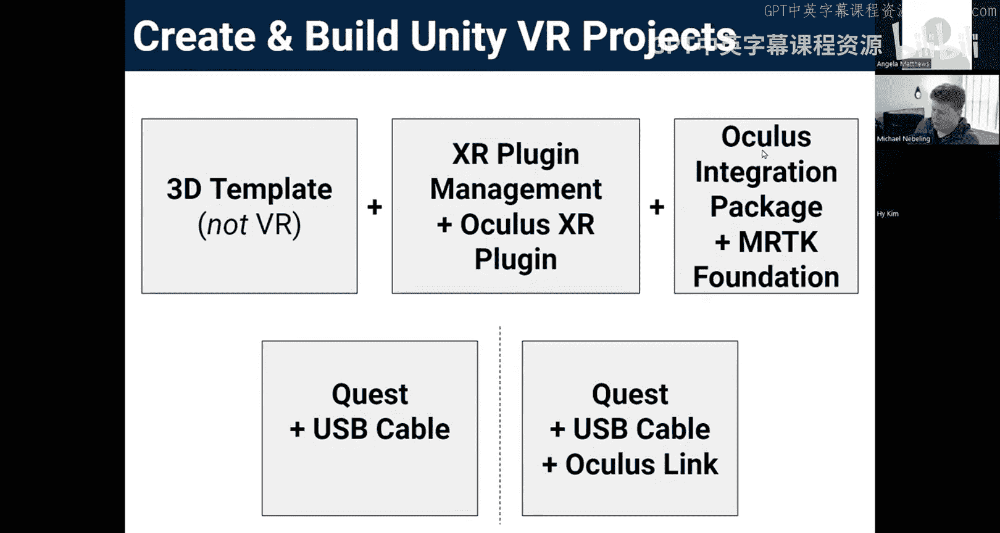

By the O is integration package。It's just an asset that you get from the Unity As store。

 which is then just add to your assets and import into your project and I show all this in my 35 minute video。

 I guess， which is this one here。

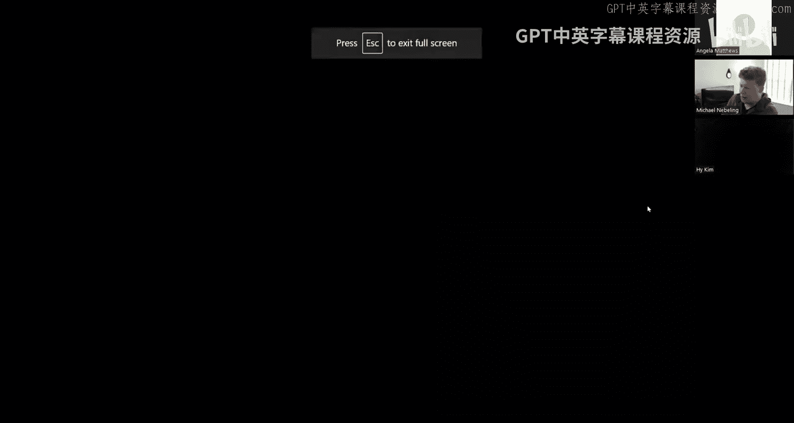

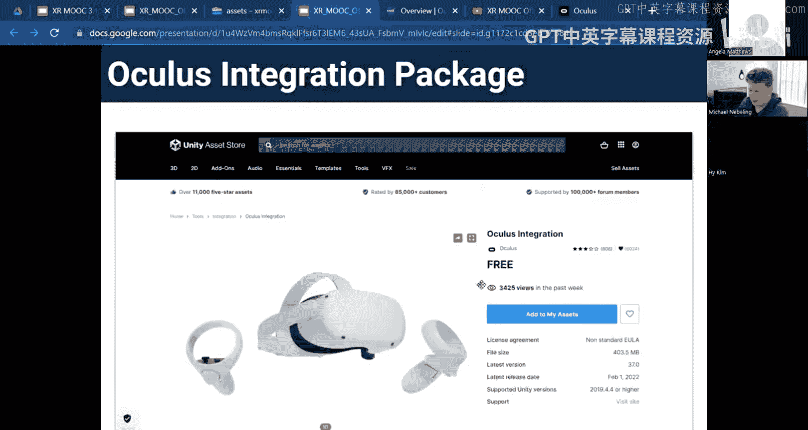

So this is the whole the whole setup and I go through all the different ways of deploying to a headset and then one of the things is once I have enabled AIS integration is if I anticipated this wouldn't work today。

Once I have enabled O link on the headset。I can actually use。诶。

I can use the headset once I press the play button， which is just like using a rift。

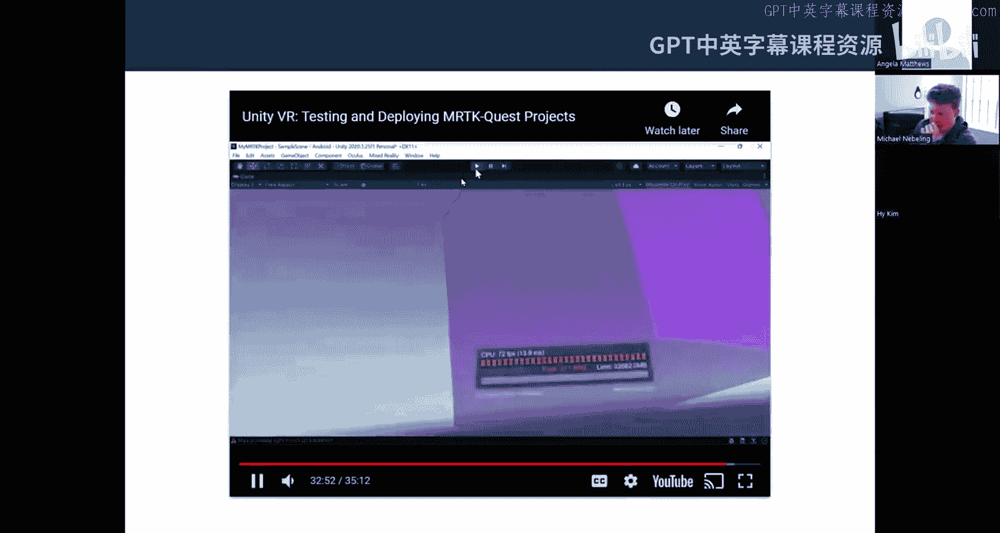

So I want to show very quickly two ways， so when you have everything set up the way and I've set it up when you launch it。

You can say yes， I want to run it on anocchius or you can disable this for a second and because we're using Mi reality Tookit。

 here's a standard scene with some interactive behaviors。

 I can now use a mouse and a keyboard to fly around in this scene and then I can have hand interactions which right now I guess is teleporting。

But I can also grab objects with the right mouse here and so I have configured this in different ways。

 and I think I also have videos about how to actually configure。

All this for for simulating interaction like here on a computer。

 but let's just like stop this scene and I'll show you the so this was just running it on a in a simulation on a computer but then when I press Os here。

 I'm not deploying right now to my quest two I'm just instead using my Rift as I trusted。

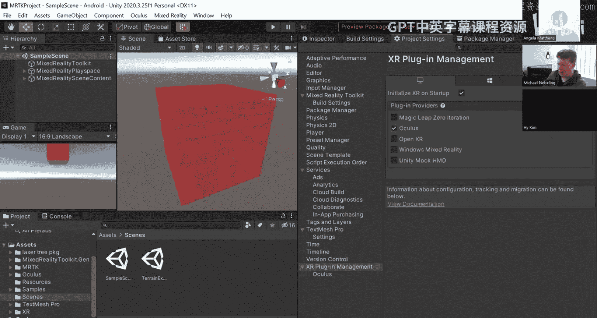

Non interested rift S， which is currently be functioning。I meanWhat the hell is going on？😊。

Let me see。No it is red， I will reconnect it one more time。

I guess my side quest messed up something but。I'll close that now。

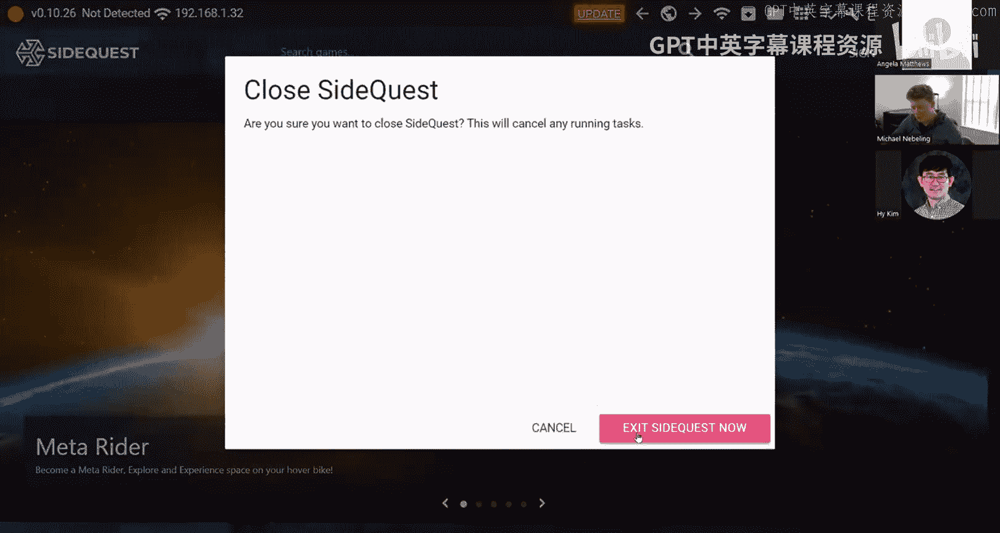

Yes。And it just fell back to rendering on the computer， so one last attempt。

So proud of my new computer， everything I was working through。

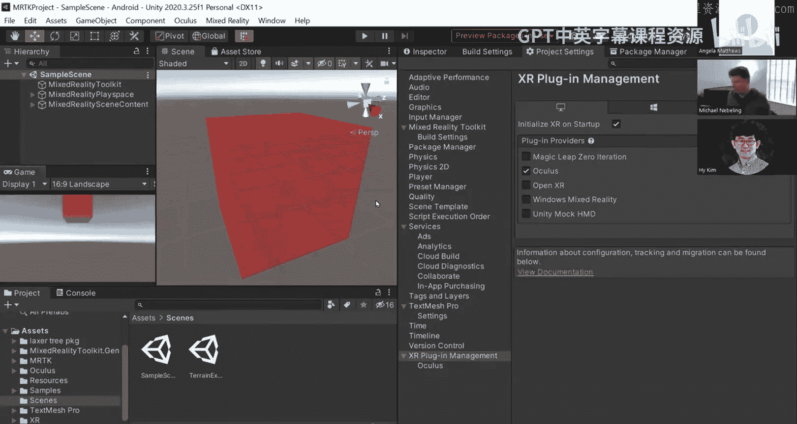

So。So this is the whole setup that I described in my video。

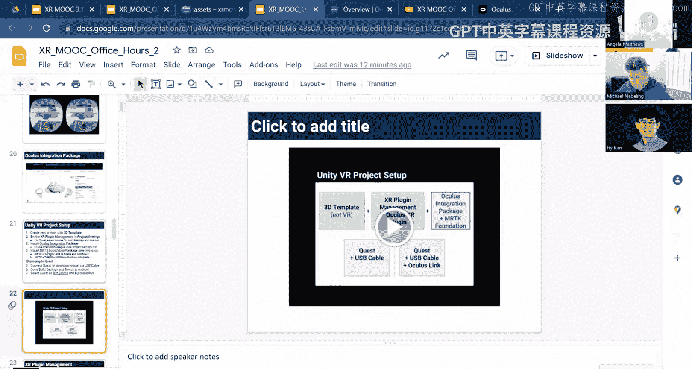

How to create a new project， enable the Excelile plugin management and project settings。

What you do for Que specifically， you need to get all the Android stuff I showed initially install As integration package MRTK Foundation。

packackage just to have all that and then if you wanted to deploy to your quest you would go through these extra steps of actually deploying and running on the device that here you have to be an Ochis developer something you have to set up in the app in the Achis app so that's something you may have to Google a little bit because it's not straightforward always。

And I don't know what kind of Facebook accounts you have。

 but so you need to become a developer in the app and then you are able to deploy and most of this is covered in my 35 minute video。

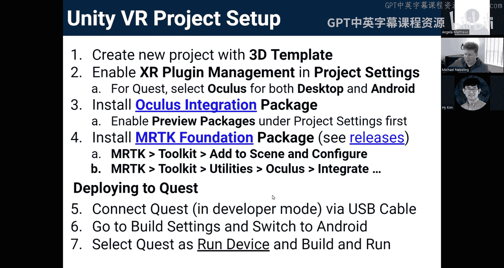

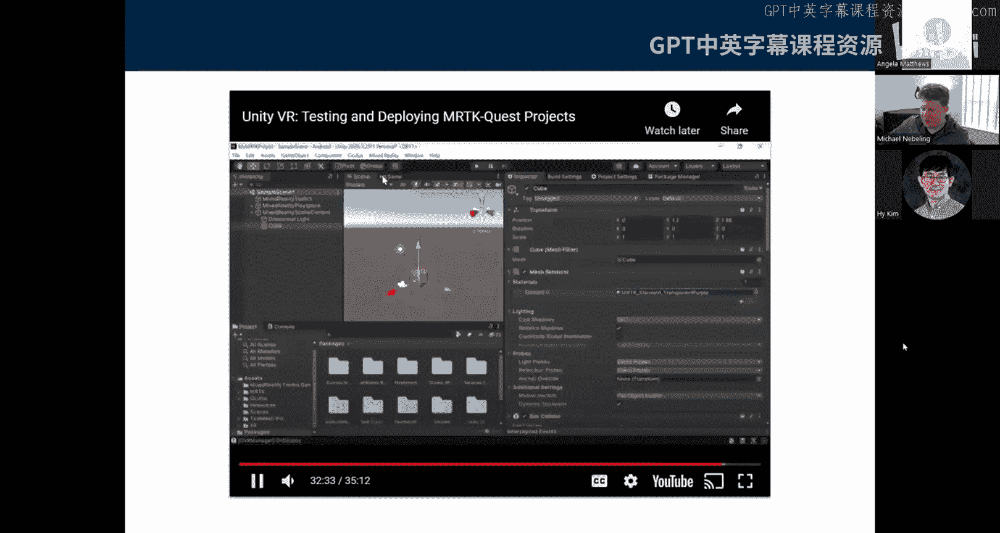

And I just want to show， I guess， two more things。嗯。

One thing that I think as part of the assignment is actually setting up a little bit of a terrain。

So嗯。This is something that I think you'll have a lot of fun with in Unity I have a video on that as well。

So I'm opening my terrain。Project here。I'ming to bring back the Unity hub for that。

Wonnda which one that is does it say this one is called terrain example and MRTK project okay。

 I have that one open already。

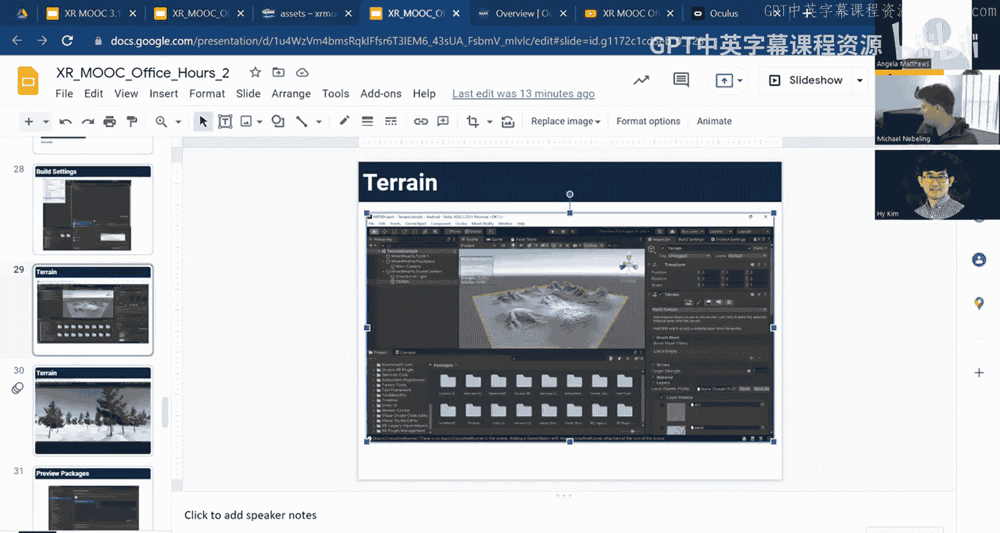

So this is the standard interaction scene that I have， but I have a different one， which is this。

Tran here， and I'm going to。I am just going to see whether I could actually run it， but's still red。

 so I guess I have to restart myocs。Let me see I can do that hopefully in the background。

We start Os okay， and I will just disable it here for。Yeah， something is really wrong。

We'll probably have to restart the computer。I'll show you what the problem is so I would normally go here and do restart and would normally actually allow me to restart it but。

And it's this red light here in the quest is not good and that just means that the tracking right now is not working and it probably shows me an error message somewhere that I'm just like too nervous now because nothing is working added that I don't see but I'll just try you know doing the good computer scientist thing and just kind't even close the app here。

😊。

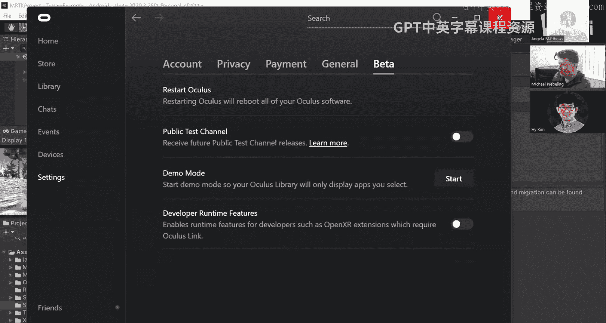

Anyway， so I'll show you the video instead， but。😊，And I ran here in simulation。

 so I created this terrain example， I guess there's cheese in there because the student asked me something about that。

 but you can just like walk around in this scene。😊，And in VR， you would be able to teleport。

It doesn't always work I guess now the camera is below the terrain， that's unfortunate。

 let me try this one more time。But I created this kind of like a beautiful dish。

 I mean for my standards， never mind the cheese there scene where you have a little bit of a mountain in the background and a lot of trees and so I show all this in my video as well how I did that。

😊，So it is one of the steps in the assignment ask you to create a nice environment。And so far。

For that， this is actually then running it， I guess in。On on my VR headset， so let's just。

This is also simulation here and I'm pretty sure this is not me and the headet and I guess I had some problems sometimes with where I spa and I fixed it at the end of the video I just moved the scene a little bit lower and once the scene is a little bit lower it actually makes a lot more sense walking around。

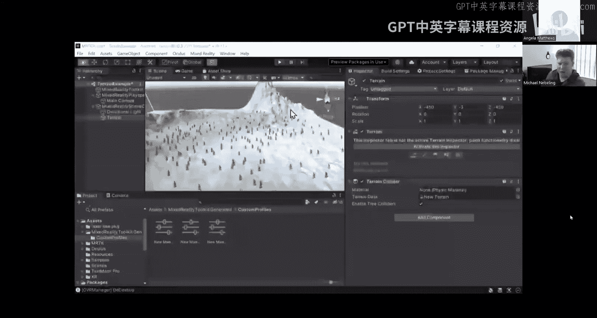

And navigating so。I'll just click through the last slides here the video again that I also share with creating this terrain which is like essentially one of the steps in the VR assignment with together with deployment you kind of like have everything that you need then and the last thing is adding manipulation to objects so in order to set up the terrain you need to enable the preview packages that is something you need to do in the package manager under project settings。

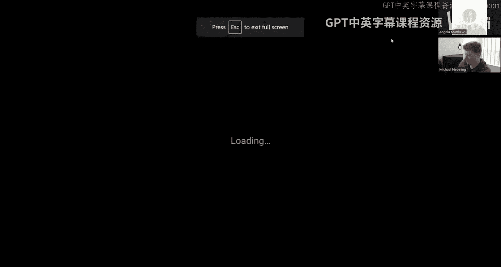

That's also described in detail there so please refer to that video I just mention it very quickly here but I think this is not the guide I would refer to the video then you get the terrain tools sample acid pack and then I start like creating a terrain the first thing I do is actually lower and raise it so these are the tools here that I can actually use right now even even now just make this a little bit smaller。

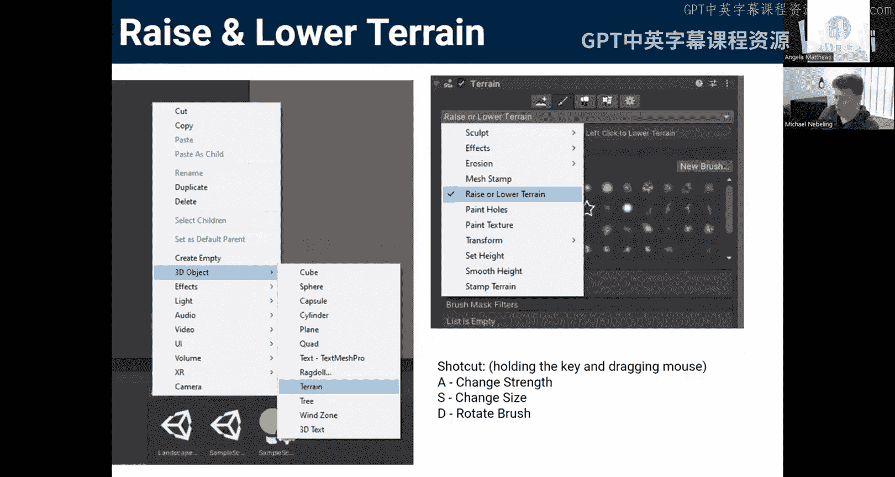

So if I wanted to create a new mountain or something。

 I would just go to the terrain to the terrain tools and。U。This is pain trees。alreadyy forgot it。

 that's crazy race。Raise a lower terrain。And that way I can just like。

 I can use a different brush here， so it comes with different kind of terrain style。

Rrushes and then I click there and the more I click the more it raises it and so you can create a mountain like that was probably where my starting point was probably not a good idea I just destroyed it You can see it on the in the preview here。

 This is not actually where I want the mountain， but maybell put a new mountain here on the background and you can see how it。

Like looks from the camera starting point position。

And then I actually should paint different textures on it as well to make it look like the other ones make it look a little bit nicer anyway so this is fun and you'll probably spend some time painting textures and then adding trees and I show all that in the video and the last thing I wanted to show is actually adding manipulation I just showed you the scene where you have like a cube in front of you that is very easily done with the object manipulator in the MRTK and a mixture reality toolkit。

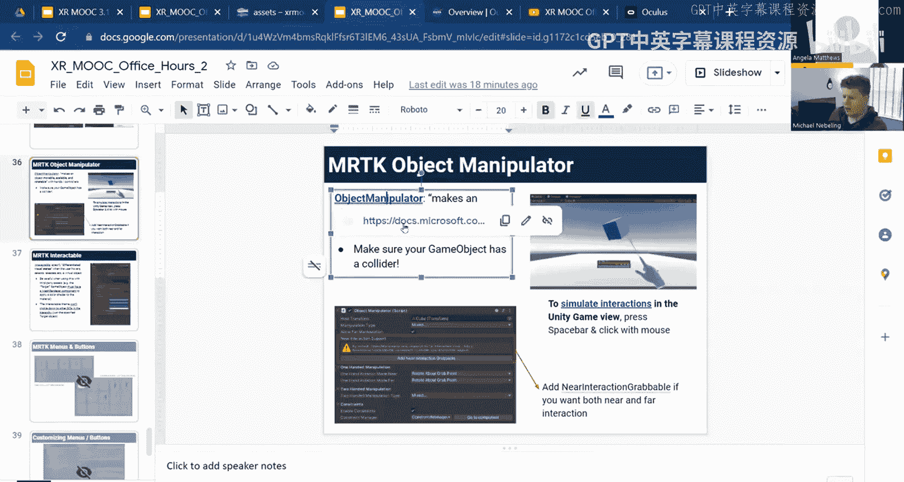

And they have instructions for how to set it up， but basically you would just add the object manipulator object component。

To the object。

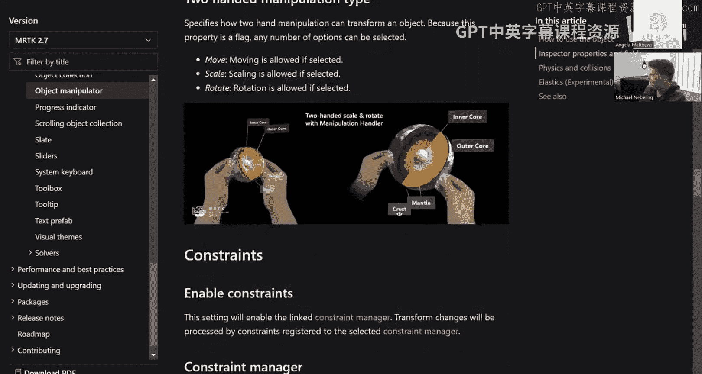

And I'll just go back to my sample scene with a cube that is what I did here with a cube， by the way。

 all the content and mixed reality should go under mixed reality scene content or default people always put in the root。

 but that's not how it's supposed to be。And here's our cube。

There we go and then there I have the object manipulator and it's a lot of stuff that I set up but I also set up near interaction and fine interaction and this is still red so and this never restart。

嗯。But。We have luckily we have kind of like a backup video， so I'll。

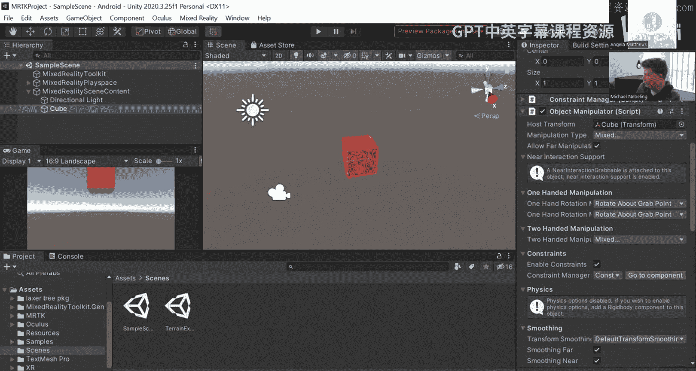

想有。

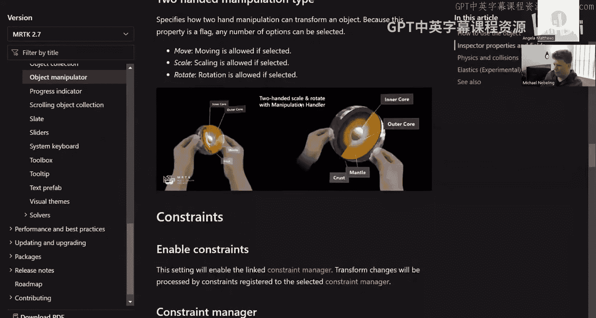

。 one second。The manipulation stuff so there is I'll end my video， my office our official part。

 which was supposed to end a long time ago with all the trouble here at the end is the unity testing and deploy and also setting up the cube and all that to actually run it。

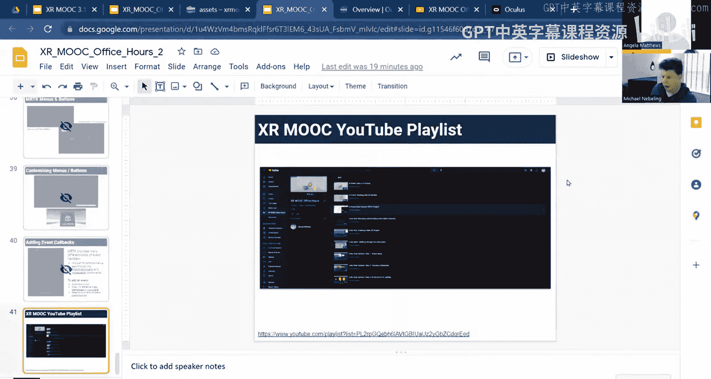

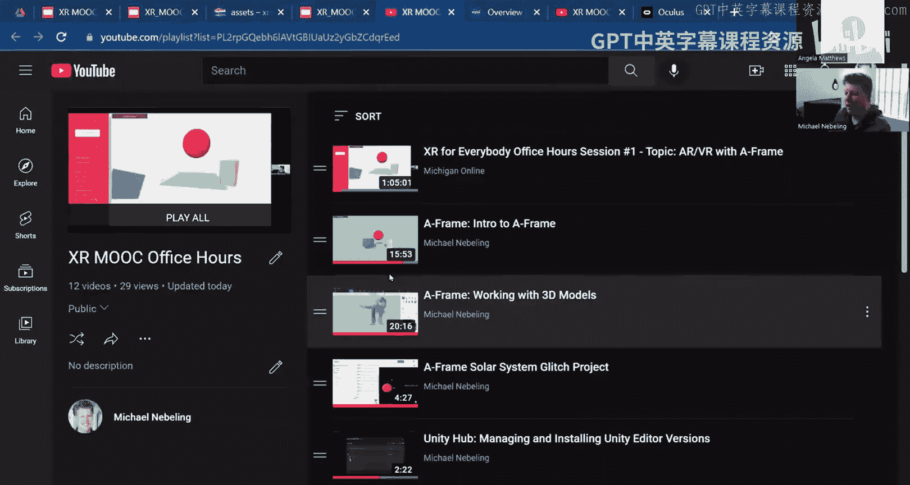

嗯。On on the headset。And then just go into full screen。

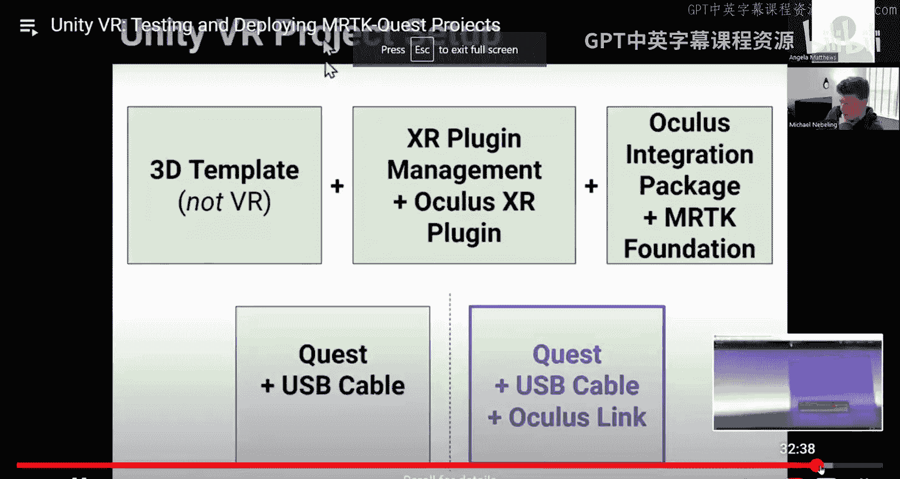

this is what should have happened so when you do theocululus link。And then you have it。

 you have like the rift S， like either the Oculus link from the Ques2 headset like this one connected by USB or the rift S。

'sThe same thing， then I can just run it in my editor and。

I can just grab the object once I set up the acus。Once I set that the object manipulator， sorry。

And also works with hand tracking on the quest， so I actually wanted to show that， but unfortunately。

Let's see what questions we have， I'll just stop here sharing my screens and just wondering what kinds of questions learners have and thanks for。

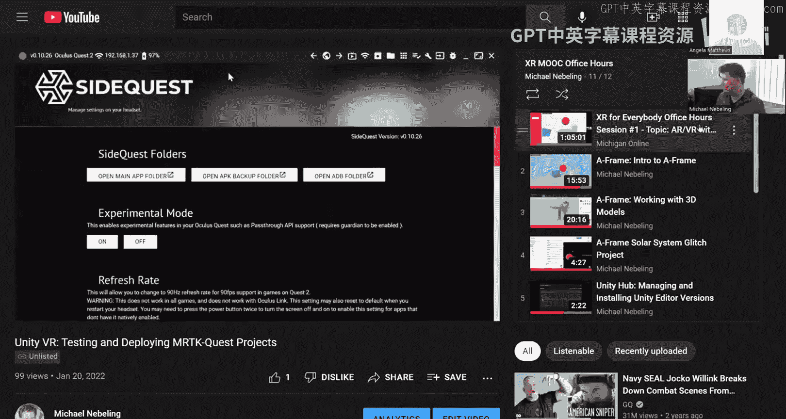

Thanks for watching this so far and attending。All right。

We can have a bit of interaction now if you wanted to just ask in the chat or unmute yourself and tell me what you're wondering we can。

You can do that now while I'll still try to fix the headset， I guess。But I am here。嗯。Okay。

No questions so far。In the chat， we have。Just a prompt for questions。嗯。对。Yeah。Yeah。

What I'll do is I restart the computer here in the meantime in case there is。

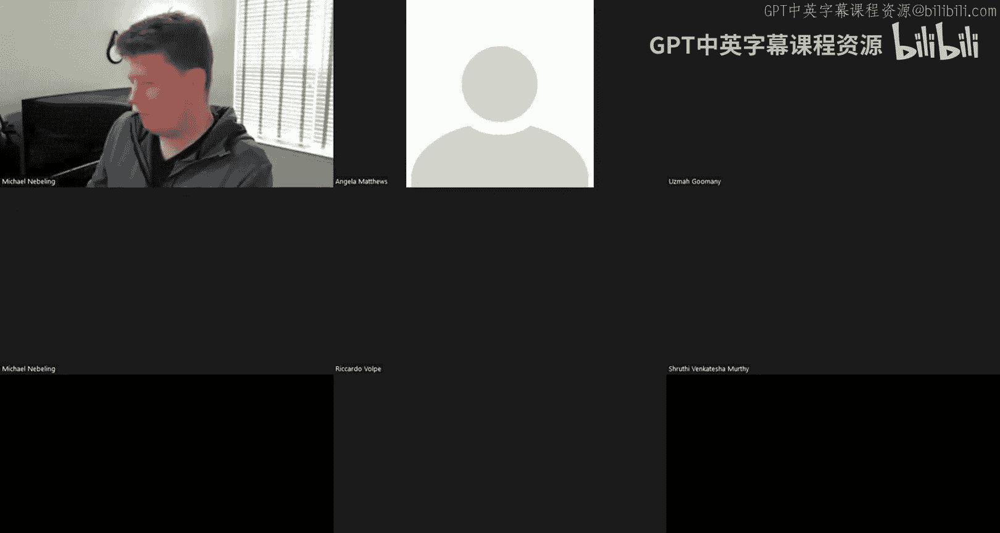

I will still be here so。Just the other guy I was leaving。All right， let me can see。No questions Okay。

 so well these are then some of my tips as I said， I was focusing mostly on the。Third course。

 the VR portion there is additional materials that will link nicely into the MOC I think the office hour last time is just hidden somewhere in the MOOC I'll rearrange it a little bit to make it a bit more prominent and I'll also add new content to the MOOC so that you can find the YouTube playlist the video is a little easier and I just didn't have the time yet to do that but we' got the video is somewhere in the MOOC the one from the first one this one will also go in the MOOC。

For the HTC vi do you recommend it toolki so that's a good that's a good question so I have never really done a lot with the HTC vi I would probably use steam VR so I remember when we。

😊，A few years ago when we when I taught still in residentially。

 we have a really big computer room with like。22 headsets at Michigan I mean it's not so big。

 but it's kind of feels like big four of them are HTC vis and so when we when we did that year we used steam VR so steam VR is。

Probably the toolkit that I use so every year since I've been teaching my courses i've always used a different toolkit first year was steam VR then I use X interaction toolkit and now i'm using mixed reality toolkit for the last two years but I would use steam VR and it is one of the。

It is one of the。It is one of the toolkits that I go through in my course Ster the first video in is in the week one discussion board that's right that's where where we put it but we'll make it a nice we'll make it nice content as part of the honest track。

And I'll write a little introduction to it and well just make sure that learners can find it。

I had trouble finding it， but it is in the MOC。So steam VR。

 yes that would be my answer and you can actually do like a setup is slightly differently。

 but it follows similar principles， I guess you would use a different kind of integration for the HCT lives so different kind of unity assets。

But it' the same idea you get the packages， you set up the scene and you make it。

 there must be some kind of plugin to deploy to the headset just like I chose Oculus there there should be a different option than for HTC vi but I actually haven't done any active HTC vi development on in a long time and probably never have we just I just know that we had a few students use it in class。

It's a cool。 It's a cool。 I mean， I still have the lighthouse。 I mean， there's a connect and the。😊。

There's no lighthouse there lighthouse is in the other corner。

 you can't see that right now I have lighthouse there and lightl there and I use to use。The HT5。

 but it's a。Five years ago now， I think four years。Thank you very much， Thomas。Yeah， so。

Still happy to answer any questions。 You have I can stay like maybe three，5 more minutes。

 And if there are any questions， I was mostly watching Michael struggle with his computer。

 And I swear I had everything ready and running。 And it's just like， did this to me again。

 Let me see whether my archus is， it's white now。 Imagine it's。😊。

It's a happyocs that's it now so while we are still recording because I can't let you go this way。

 this is just like is this unacceptable。😊，I will just so that it's not one of the its not another video is Mike failing to get all this kind of like working in this office always what is he doing so I will just make sure that I'll show I'll be just lives I mean it doesn't make a big difference because it's still video for you but。

😊，actually go hang on one second yeah I'll just come back into this into this question and just like run my little project here for one second while I can。

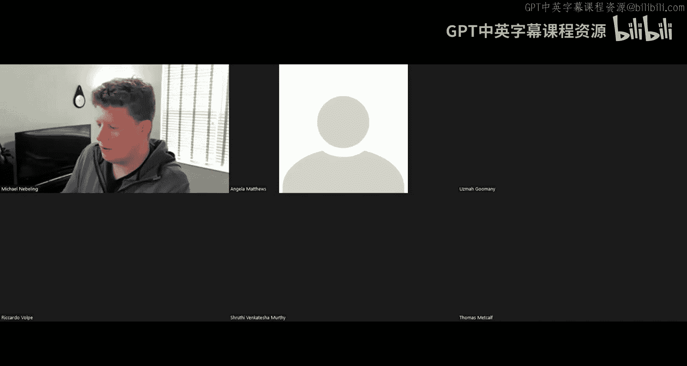

呃。Oh， we ran out of。We ran off space， unit， he says。Perrick photo， a disc is read only word。

I haven' seen that before， so just checking， are there any other questions nope？😊。

You're probably just waiting。

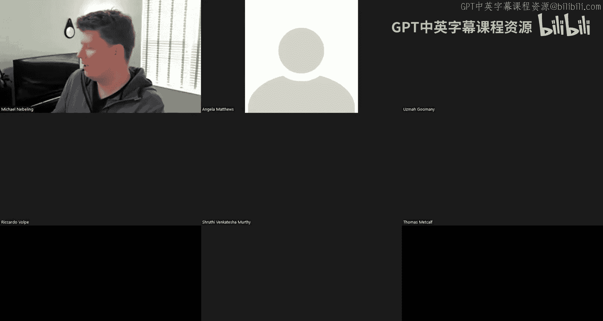

All right。Let me just make sure。诶。I need to show you this， I have never seen this before。

 please move the project photo somewhere else readable。

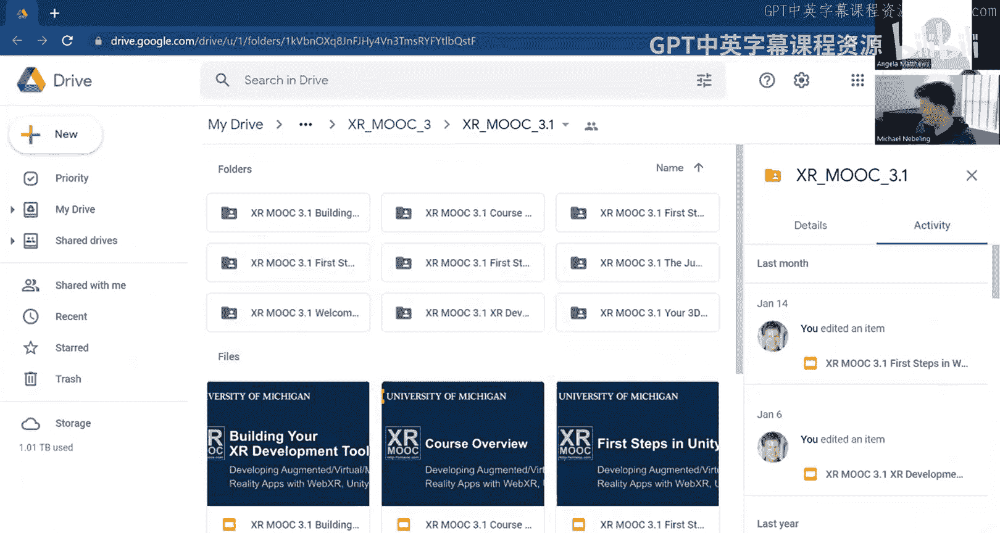

I don't know what's going on， so I was just trying to open my MRTK project。

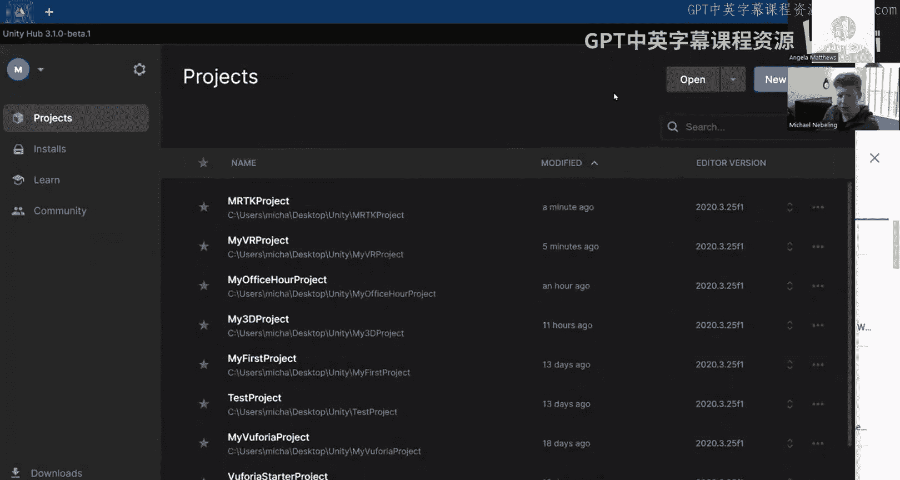

And。It says it's already open we go finally and。

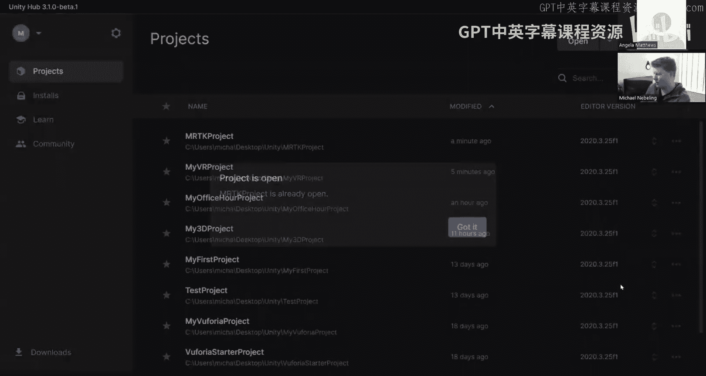

So when I have everything set up properly， I should be able to click Ocus here and I guess it would be steam VR or something like that as a。

As one of these things and then when I press play and actually run it in a headset now comes the magic moment when everything launches so I see the Os app launching on my computer and it's now tracking my headset。

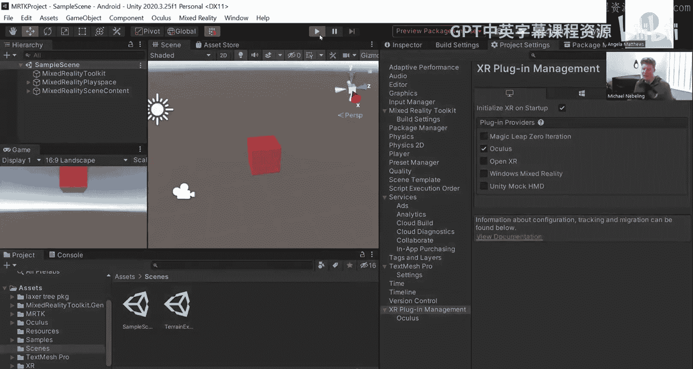

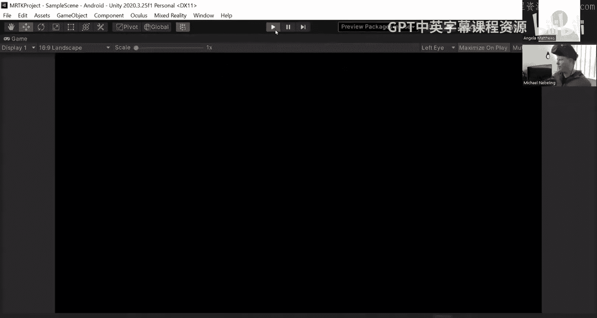

And it's starting to render here as well， and I saw it for like one second， but then。嗯。

And I'll show you， so this is roughly what I see in my headset as well。And。

Just need to find all the controllers here for a second。

And it says the tracking is pretty bad at the moment。

So but here is the cube and I'm just like wondering can you see how I'm interacting with it Okay cool and so now I have basic interactions like this object manipulator so I can like rotate。

 I can scale it up， scale it down。And on my quest， I kind additionally just used my hands。

 I would have hand tracking and I could grab the object。

And obviously would be super awesome if I could show that to now， but probably stretching it。

 I will just。

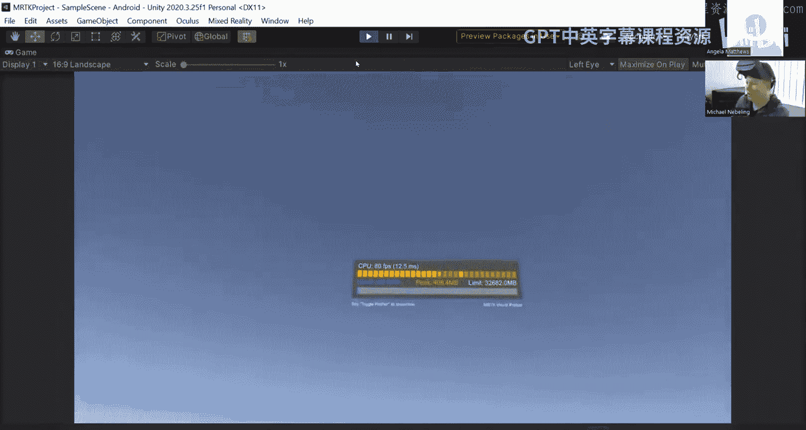

Go one。I would just go one。I just need to do this one second。

 sorry I cannot let it go and this is why these assignments are so evil because when they don't work。

 you feel like， oh my God。I really want to get this to work。And。So。

I just still pretty angry that it didn't work before。

 so I'll be just doing this for me here not necessary for you anymore。

 but it is still being recorded so I allow access。😊。

I'm now connecting a different should use the white controllers a different headset。

 we're definitely going a little bit over time here。

Um based on what I oh now Alist link is a thing and I can actually， so I have archivist link。

Which is USB cable to computer， it doesn't look very different for you because I still press play here。

But。It won't work now because I actually haven't enabled it。

 so I'll quickly just enable archist name。which is an option here now finally came up。

 so launching on the headset it's looking like a rift test now。

 but you will see one difference I can use my hands。And when I now start。When I now press play here。

 it should it's now actually my quest。

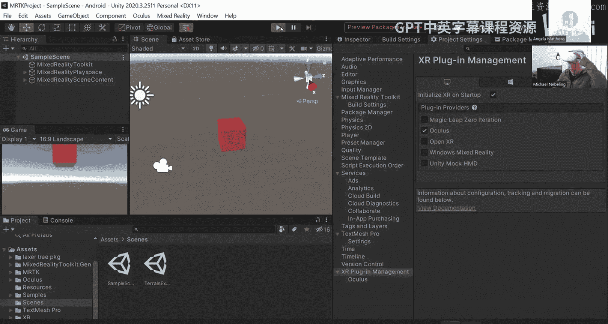

And you can see my hands， can you see my hands， Yeah， you can see my hands。

And now I can actually interact with this object just using hands and that is of course something that you can only do with a quest。

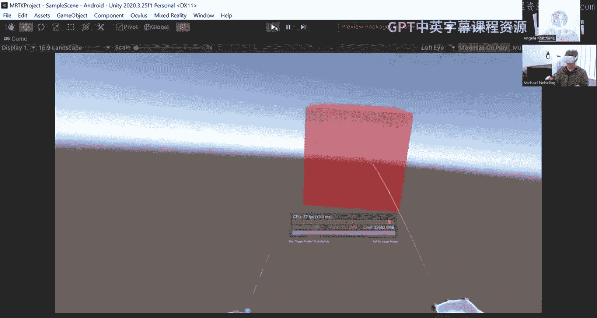

But it is pretty cool and I have neo interaction。And I have fire direction。

 which is when these lasers come out of my hands and these are things that I get kind of like for free this kind of behavior。

With。The object manipulator。And。So I'm now a little happier and I think I can let you go with this little demonstration。

If there are no other questions， I would conclude the。Office are I here。There are no other questions。

 so basically I release additional videos we link it nicely into the course。And yeah， use the forums。

Or yeah and when you're done what I really want to do I want to thank all the learners that have completed the courses so far is quite a few I really love reading your stories on LinkedIn and when when you add me on LinkedIn I'll get to celebrate a little bit with you so for those who have managed to graduate from the course we will soon have first year of creditss actually more than a year of credits now so maybe we can get them together and do something fun chat at some point those of us who are currently still enrolled in some of the courses hope you find them interesting a little entertaining sometimes and overall useful and so good luck with。

With all the assignments and I hope you have nice interactions with the fellow learners check out the galleries that I linked throughout the courses I was just browsing to them so for example in the second course we have so many critiques of existing Xr experiences more than 120 so you will find lots of examples of other apps you can use to critique and so I know that Google expeditions currently is not an option and I owe an update to the XMbook but I just wanted to say that one more time here so thanks everybody for coming。

And I hope you have a great rest of your week。拜拜。

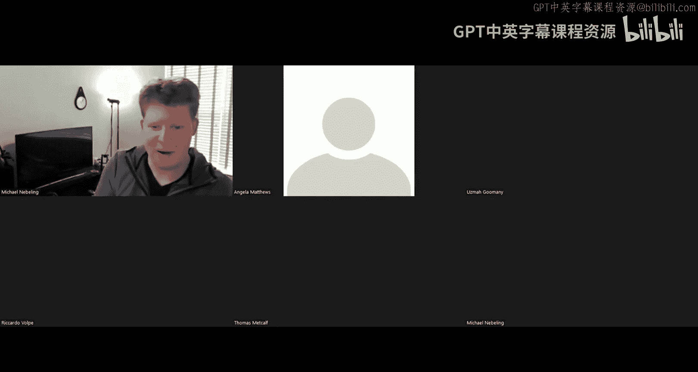