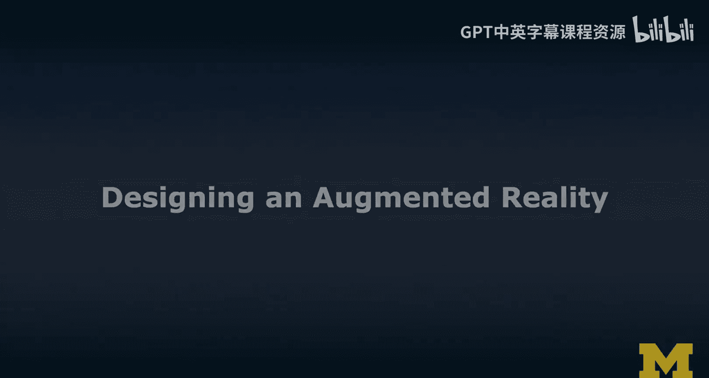
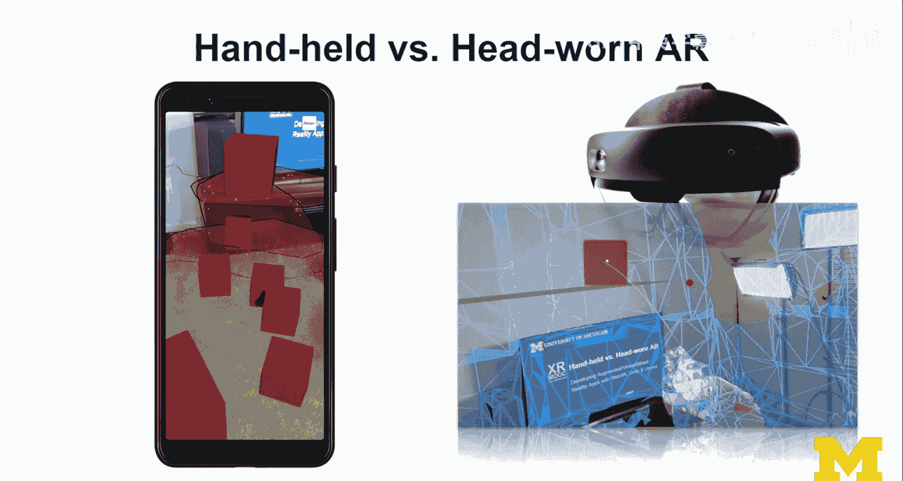
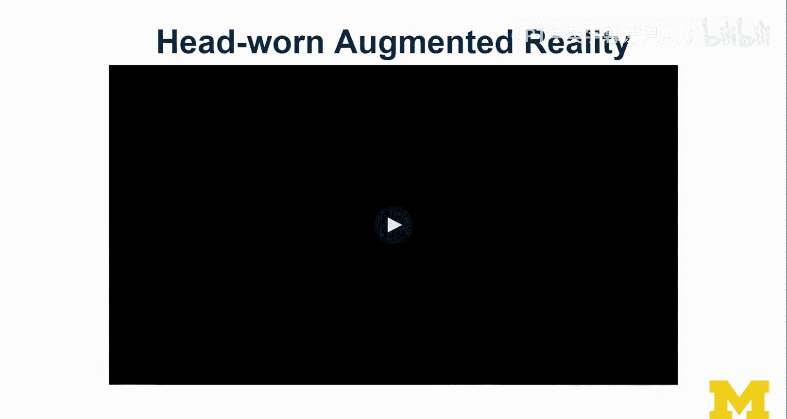
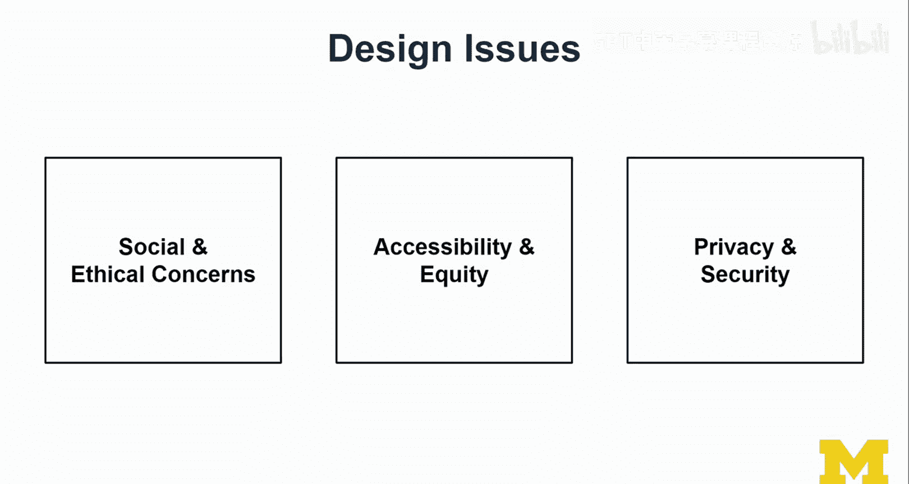

# 扩展现实设计：第26讲：增强现实设计原理 🚀

在本节课中，我们将学习如何为增强现实（AR）进行设计。我们将探讨AR与虚拟现实（VR）设计的异同，并通过一个具体的案例研究来理解基于标记（Marker-based）和无标记（Markerless）AR的设计与实现。课程将涵盖核心概念、交互设计考量以及重要的社会与伦理问题。

---

## 案例研究：开普勒行星运动定律AR模拟 🌌

上一节我们介绍了AR设计的基本概念，本节中我们来看看一个具体的教育应用案例。

我们与博士生Schar Rajara共同开发了一个基于AR的开普勒行星运动定律模拟。该项目有两个版本：一个使用纸质标记，另一个使用无标记技术。

### 基于标记的AR版本

以下是该版本的核心交互方式：

*   **标记作为门户**：用户将智能手机摄像头对准印有定律信息的纸质标记。
*   **交互控制**：用户可以通过手机屏幕上的界面与模拟内容互动，例如点击以暂停或继续行星运动模拟。
*   **尺度控制**：AR体验的尺度由打印的标记大小决定，这为设计提供了直观的尺度控制。

其核心流程可概括为：**检测到标记 -> 显示虚拟内容 -> 标记丢失 -> 隐藏虚拟内容**。部分工具包支持“扩展跟踪”，可在标记移出视野后仍维持虚拟内容的稳定。

### 无标记的AR版本

以下是该版本的主要特点：

*   **环境理解**：系统使用摄像头扫描环境，自动检测水平与垂直平面（如桌面、地板、墙壁）。
*   **自由放置**：用户可以将虚拟行星模型放置在检测到的任何平面上，无需依赖物理标记。
*   **界面调整**：由于失去了纸质标记作为切换不同定律的媒介，我们设计了一个标签页界面来进行切换。

无标记AR的核心依赖于**平面检测**和**空间映射**技术，以实现虚拟物体在真实环境中的放置与遮挡。

---

## 增强现实的核心技术原理 🔧

了解了案例研究后，我们来看看支撑这些体验的底层技术原理。

### 基于标记的AR工作原理

基于标记的AR依赖于对特定图案（标记）的识别与跟踪。

*   **标记设计**：标记通常具有高对比度和独特图案，例如带有黑色边框的“英雄”标记。公式可表示为：`检测到(标记图案) == True`。
*   **跟踪与渲染**：当摄像头识别到标记后，系统会计算其在3D空间中的位置和方向，并据此渲染关联的虚拟内容。

### 无标记的AR工作原理

无标记AR通过设备自身的传感器和理解能力来感知环境。

*   **平面检测**：系统通过计算机视觉算法识别环境中的平面。代码逻辑类似于：`if (检测到平面(水平|垂直)) { 允许放置虚拟物体(); }`。
*   **空间映射**：更高级的环境理解，通过深度传感器或软件算法构建环境的3D网格模型。这使得**遮挡渲染**成为可能，即虚拟物体可以被真实物体遮挡。
*   **光照估计**：系统分析环境光线的强度和色温，并调整虚拟物体的光照与颜色，使其更好地融入真实环境。例如：`调整虚拟物体材质(环境光强度， 色温)`。

---

## AR体验的设计维度对比 ⚖️

从技术原理回到设计层面，基于标记和无标记的AR在多个维度上存在差异。

以下是两种AR体验的关键设计考量对比：

*   **环境**
    *   **基于标记**：环境理解有限，体验围绕标记展开。
    *   **无标记**：需要并利用环境理解，支持更大范围的体验（从桌面到房间尺度）。

*   **内容**
    *   **基于标记**：内容尺度与标记大小强相关，通常用于桌面级体验。
    *   **无标记**：内容尺度更自由，可适应房间级布局，能展示的信息量可能更大。

*   **交互**
    *   **基于标记**：交互可能更显式，例如要求用户将特定标记带入视野以触发内容。
    *   **无标记**：交互方式多样，在移动设备上多为触控，在头戴设备上可能结合手势与语音。

---

## 头戴式AR与手持式AR 🥽📱

除了上述分类，AR设备形态也深刻影响着设计。

我们将以HoloLens 2为例，看看头戴式AR带来的独特可能性。在我的演示中，虚拟立方体被赋予了物理属性（刚体、重力），它们可以掉落在真实桌面上并被真实物体遮挡。用户可以通过“近处操作”和“远处操作”手势与这些物体进行自然交互。这种**持续的环境感知**和**沉浸的交互方式**是头戴式AR的显著优势。

---

## 重要的社会与伦理设计议题 🤔

在深入技术开发之前，我们必须关注AR设计带来的广泛影响。

*   **隐私与安全**：AR应用通常需要持续的摄像头访问权限，这可能无意中记录下他人或敏感环境，引发严重的隐私关切。
*   **公平性与可及性**：目前，高性能的AR头戴设备价格昂贵，而基于智能手机的AR则更为普及。在设计时应考虑目标用户的技术可及性。
*   **社会接受度**：在公共场合使用AR，尤其是涉及录制功能时，需要考虑对他人的影响和社会规范。

这些议题不应是事后才考虑的问题，而应融入设计和开发每一个阶段的决策之中。

---

## 总结 📝

本节课中我们一起学习了增强现实的核心设计原理。我们从开普勒定律的案例出发，剖析了**基于标记**和**无标记**两种AR实现方式的技术基础与设计差异。我们还比较了**手持式**与**头戴式**AR设备带来的不同交互体验。最后，我们强调了在追求技术创新的同时，必须将**隐私、公平和社会伦理**等设计议题置于重要位置。在接下来的课程中，我们将深入AR的具体开发实践。