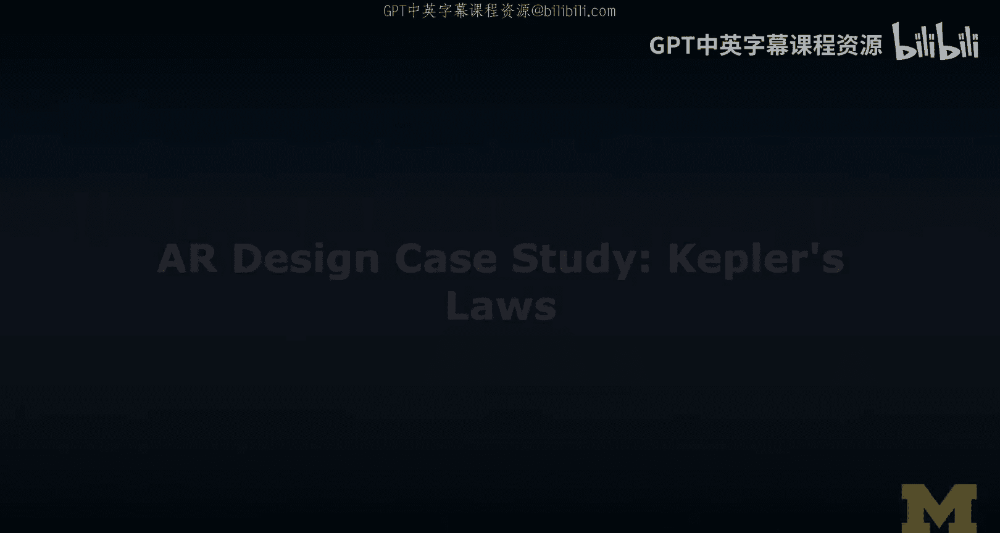
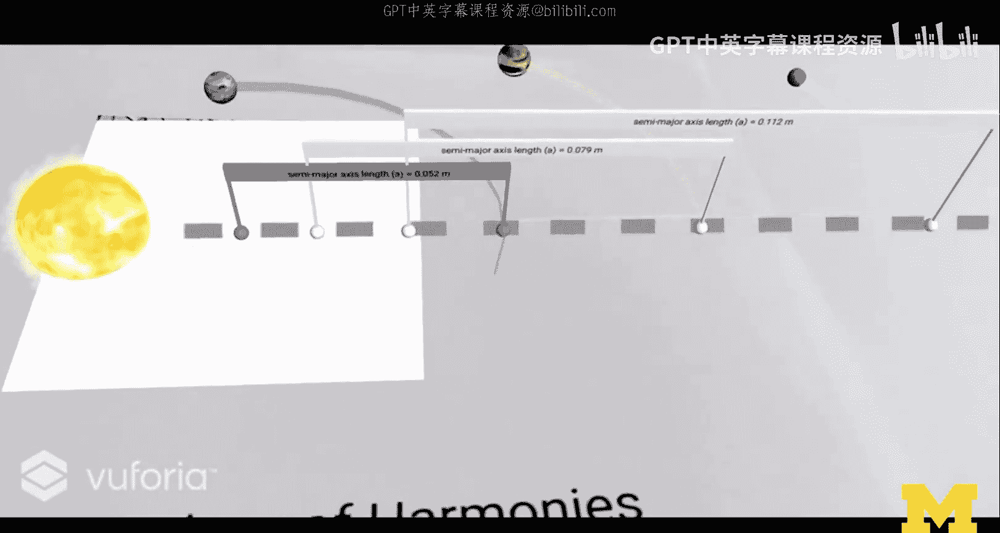

# 扩展现实设计：案例研究：开普勒行星运动定律AR应用

在本节课中，我们将学习一个增强现实（AR）设计案例。该案例研究探讨了如何为智能手机设计一个同时支持**基于标记**和**无标记**的AR体验，用于演示开普勒行星运动定律。我们将分析其交互设计、实现方式，并比较两种AR模式的特点。

## 项目概述

这是一个关于开普勒行星运动定律的AR学习应用。项目由讲师与学生Schweta Rajra在为期五周的独立研究中合作完成。应用旨在为学生提供一个直观、交互式的学习体验，帮助他们理解复杂的物理定律。

## 基于标记的AR版本

上一节我们介绍了项目背景，本节中我们来看看基于标记的AR版本是如何实现的。该版本需要将特定的图像标记打印在纸上。

*   **标记设计**：为每个开普勒定律都设计了一张独立的打印纸。纸上不仅包含AR识别标记，还直接印刷了行星轨道图示和相关数值公式，将数字内容与实体媒介紧密结合。
*   **核心交互**：用户通过智能手机摄像头识别纸张后，虚拟的太阳系模型便会叠加在纸上。用户可以通过**拖拽**操作（使用Unity的Lean Touch插件实现）来改变行星轨道的参数，并实时观察模拟效果的变化。
*   **视觉亮点**：行星的虚拟运动可以超出纸张的物理边界，这种虚实结合的效果创造了独特的视觉体验。

以下是基于标记版本中三个定律的具体交互方式：

1.  **第一定律（轨道定律）**：展示行星沿椭圆轨道绕太阳运行。用户可拖拽改变轨道形状。
2.  **第二定律（面积定律）**：展示行星在相等时间内扫过相等面积。应用提供了**暂停**功能，方便用户仔细观察和验证这一定律。
3.  **第三定律（周期定律）**：同时展示多个行星的轨道运动。用户可以通过拖拽每个行星旁的“小旗”来独立调整其轨道参数，并观察所有行星运动周期的和谐关系。

用户只需将摄像头对准不同的打印纸，即可在不同定律的演示之间无缝切换。

## 无标记的AR版本

看过了基于标记的体验，本节我们转向无标记的AR版本。该版本无需特定打印图案，允许用户在任意平面放置虚拟模型。

*   **初始放置**：启动应用后，用户需移动设备以启动环境追踪，然后在现实空间中选定一个位置放置虚拟的太阳系模型。
*   **界面设计**：模型以垂直面板的形式呈现，顶部设有**标签页**，用于切换不同的开普勒定律模拟。
*   **交互与反馈**：与标记版本类似，用户可以通过触摸屏进行拖拽交互。所有模拟都是实时运行且可交互的。当用户调整参数时，面板上的数值和图示会同步更新，提供即时反馈。

无标记版本的优势在于其灵活性和沉浸感。用户无需关注标记，可以自由地缩放视角、近距离跟随单个行星的运动，或将行星“拖出”面板观察，交互更加自然。

## 项目总结与思考

本节课中我们一起学习了开普勒行星运动定律AR应用的设计案例。我们分析了其**基于标记**和**无标记**两种实现方式，探讨了如何利用实体纸张增强学习体验，以及如何设计直观的拖拽交互来操控复杂的科学模拟。

这个案例展示了在短时间内（五周）构建一个功能完整、设计精良的AR教育应用的可行性。它成功地将抽象的科学定律转化为直观、可操作的视觉体验，为AR在教育领域的应用提供了优秀的范例。接下来，我们将与项目开发者Schweta进行对话，深入了解她的开发经验和见解。