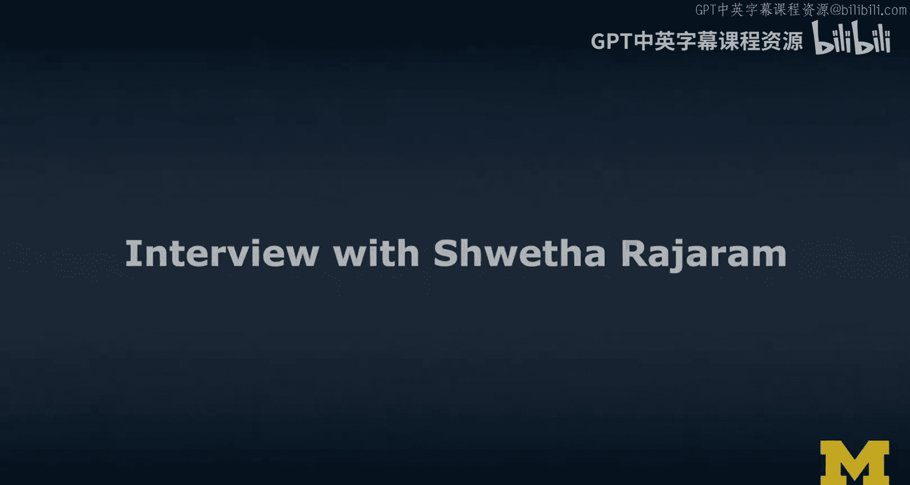
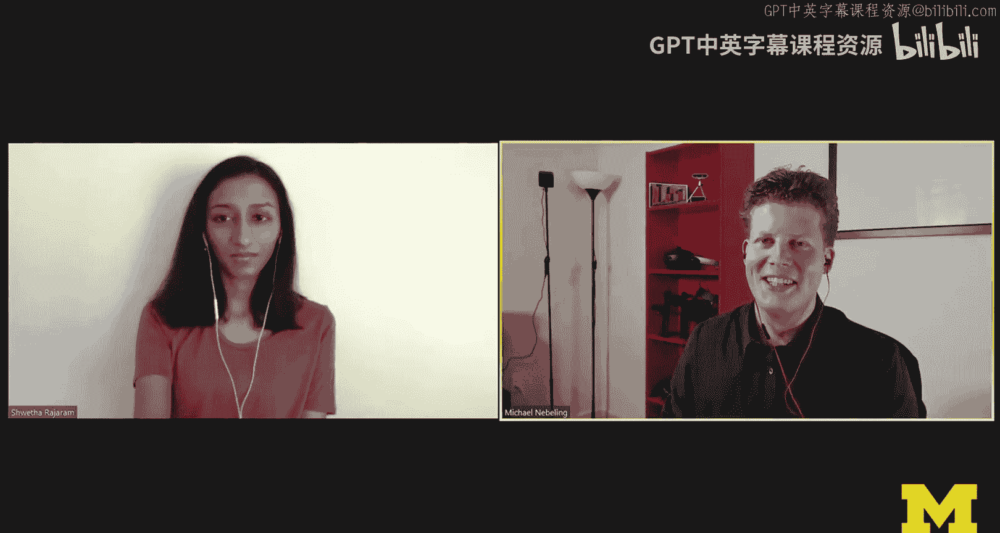
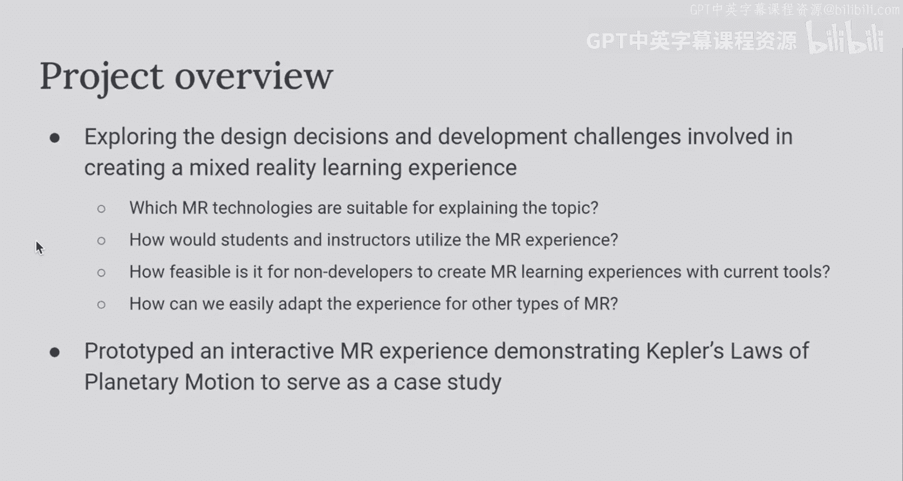
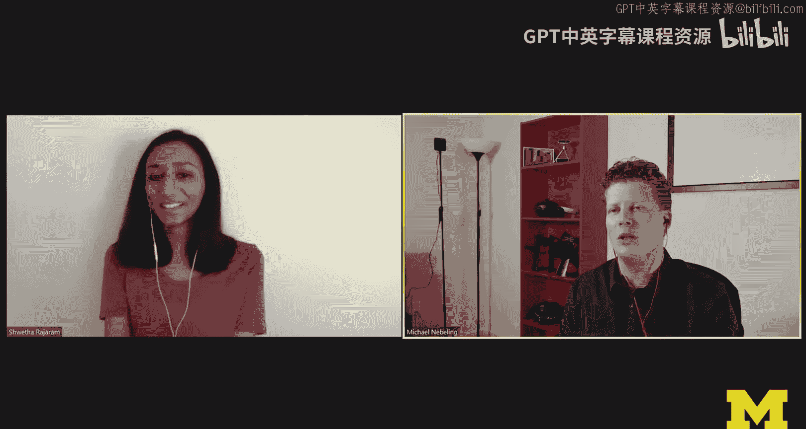
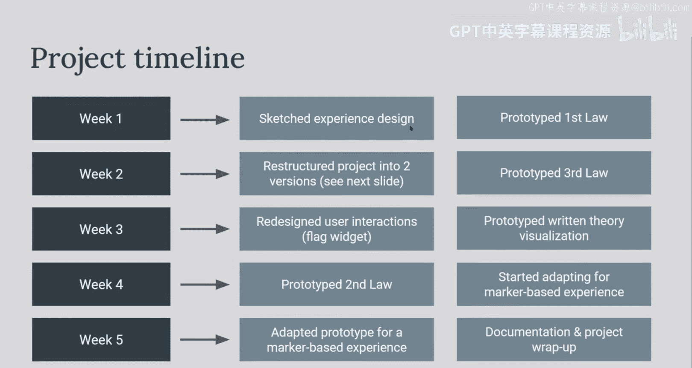
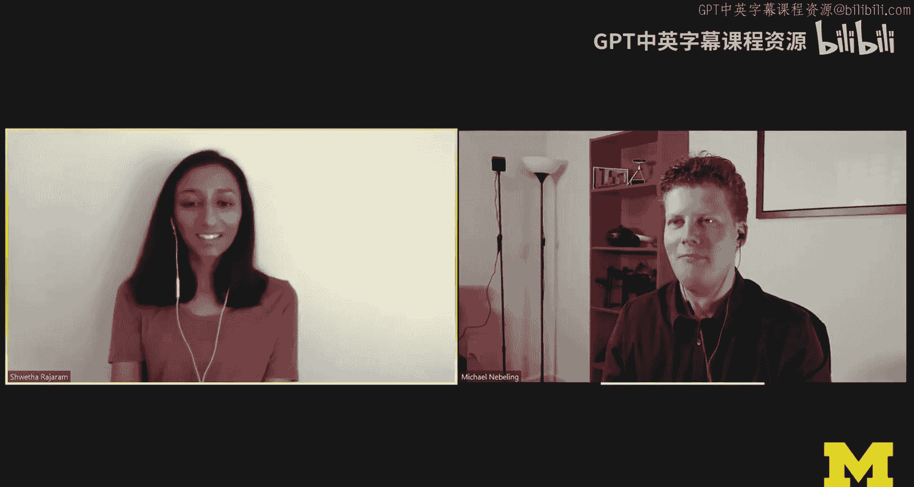
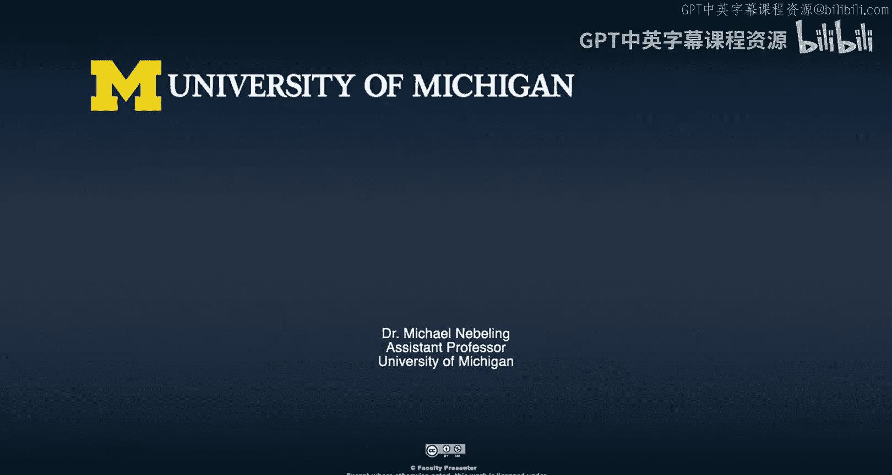
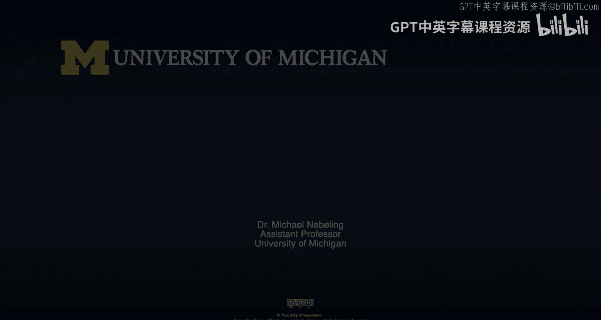

# 密歇根大学《面向所有人的扩展现实（介绍⧸设计⧸开发）｜Extended Reality for Everybody Specialization》中英字幕 p112 28_访谈：Shwetha Rajaram.zh_en -BV1jM4m1k73q_p112-

In this video， we're going to talk to Sweta Rajaraam who actually contributed to the MO her AR project。

 So she's actually， it's an exciting project that was done in an independent study with me。 Well。

 that's not why it's so exciting。 It is exciting because it involves both MacAbased and Macka S AR So it's actually a really good learning opportunity for us And I've actually invited Sweta to talk to us about her project。

 Soweta， hey， how' is it going。😊，It's coming pretty well。 Thanks for inviting me。 Sure， Yeah， so。

 you know， the project is really quite complex。 I feel like the main key milestones。

 So we're like finding a topic， like selecting a topic。

 implementing things first with Mark a less AR because you you already knew about AR and you wanted to do an AR project and。

😊，MiOS AR technology seemed like very interesting to us and then in the last stage of the project。

 we actually played around this Mac based AR， which to many people from a technology perspective seems inferior to Macs so why use Macs if you can do Macs。

Is that also how you remember the project？

Yeah， I think that's a good description of the key challenges that we faced really key decisions that we made at the beginning So yeah that's great so we're going to talk about this project and we're going to tackle this issue of picking a good topic for AR and to well help us and support our discussion a little bit actually brought back your the presentation that you prepared about the project that we used to discuss it and present it to a various stakeholders here across Michigan working in the XR initiative so let's talk about topic so you chose Keplla's laws of planetary motion why were you excited to actually do this as an AR project。

😊，I guess the overall motivation for this project was to get a sense of if we were instructors trying to create an AR experience for a class what kind of challenges would we run into and I felt like Kepller's laws was a pretty complex topic that involves some like mathematical simulation。

 it would have interesting interactions and it just felt like a sufficiently complex topic so a good learning point to see where instructors would actually struggle in trying to create something like this themselves。

😊。

Right， cool。 So， and yes， so we started out。 Let's talk a little bit about process then。

 which I think was very interesting。 So I think this was an independent study。 So was semester long。

 but we did some other things in the first half。 So what we're talking about now is about six weeks of work。

 maybe。😊，Is that， is that about right？ Just okay， get a sense for that。 cool， Alright， so yeah。

 topic。 So let's start with our process。 sketches。 I remember， well。

 you have a very creative background。 So in arts。 I remember you sketching a lot。

 So I'm gonna bring up some of your sketches。 And I was thinking。

 maybe you could use these sketches and well， walk us a little bit through some of the ideas you had initially。

😊，Sure， so I guess I am a person who really doesn't need to sketch things out for。😊。

Media an idea of what I actually want to develop so here are a few of the ideas that I had the left two pictures there were they were my initial ideas so for marker base they are on the left I。

😊，Had some ideas around attaching a planet to a marker and then the users can kind of move the markers around in the physical space and that would affect the simulation parameter so maybe if you move the planets closer together to the sun the orbit is going to decrease in radius Yeah so that was one of the ideas that we didn't actually end up implementing it that way but it seemed like a cool idea at the time and it allowed you to brainstorm through some of the interactions and thinking about markerbase A。

😊，Okay， and then Mark and S what were you thinking there So I was also thinking about a tabletop experience for Merer S AR which is kind of a odd decision in hindsight but the idea was to have three base visualizations or sorry one base visualizations with three different changes that we would make for each of the three couples laws So we were thinking about mobile AR so using my iPhone and there would be a few onscreen interactions tools the planets around or stop visualization and posit and kind of learn how changing the parameters would affect other things in the simulation Yeah so mobile AR so students would have students and instructors would have a smartphone or a tablet and you said tabletop why was that not a good idea you said something like in hindsight it wasn't the best idea why did you say that Yeah I think if you think about Merer SR you definitely you need to scan。

Area quite a lot to get stable tracking because that's pretty easy to do with marker based AR I think you know in hindsight maybe that would have been a good starting point if I wanted to do a tabletop experience but I say it's a little strange because you don't really intend on scanning the whole area for a tabletop experience you just。

😊，intend on looking at something when it's right in front of you。

 but I think marker lesss was really cool to explore with scaling also we tried that I think a little bit scaling it up to the planets are like flying around you and could make something a little bit more immersive that way。

😊，That's right。 And we had we had more time。 We would have even taken it further and maybe tried a lot on Hollens as well。

 which in some of the other projects you have implemented Hollens experiences。 So mobile AR。

 well I think it seems it was a good it was a good technology choice for the classroom。

 I think Macbase Macs ultimately we supported both in the project， which I think is cool。

 the interactions changed quite a bit。 So I want to talk to you about how we how we thought about that and how we how we thought that through。

 So obviously you have all three laws。Kind of like implemented。

 and we can run simulations of of these motion laws。In both Macs and Macbase A。

 So then this project was about Macbase and Macs AR and the interactions changed quite a bit。

 But so it's during the implementation and development phase。 But in your earlier sketches。

 can you walk us through some of the interaction ideas you had。Sure， so I guess one of them is the。

Moving the planets was kind of like a constant idea。

But we had different ideas on how you would actually achieve that in earlier implementation it just kind of had you clicking on a planet and dragging along the axis like the semi major axis of the ellipse but then later we kind of figured out that we also wanted to show how calculations within the simulation they change like if you know you extend the length of the radius how fast to the planet move that it slow down with it speed up and actually show mathematical values to support that and we kind of found that it was hard to know what parameters you are changing just by dragging the planet because it really depends on the geometry of the ellipse so kind of in the top of that right hand sketch we change the design a bit that you're dragging this little flag that extends from the center of orbit to the planet itself and on that flag there's it prints a value of how long that axis is。

Well that's cool。 So we have a first overview of the interactions you had planned at the well sketching phase and storyboarding phase。

 which is very important。 And then soon， I mean， because you were already experienced with these technologies we really went very quickly into a development and prototyping。

 So we started with mark less AR basically phone that you supports ARK or AR core smartphone is the device of choice and then we would experience your laws So can you walk us a little bit through how you developed that AR experience。

 the mark less experience whether any particular design choices you made and and design rationale for those or you can also talk about any implementation challenges because this is really the the course where we want to learn more about developing AR experience。

I guess one of the decisions that we made is that we wanted to try out this same experience for like a desktop version a markerbased version and a marker less version so knowing that at the beginning I kind of structured my unity project that way structured my development workflow that way so for every new future I added it would start out with this desktop version and just get it working within the Unity editor and then I would try to adapt it for marker lessAR since I decided to do that one first I kind of worked on the marker-based version more near the end but that was the basic workflow get it working in the unity editor and then。

😊，Test out on my phone and try to see if there are any other issues that came up I guess implementation challenges there were definitely quite a lot。

 I think even from transitioning from desktop to AR coordinate systems was something that I had a little bit bit of issue with once you're transitioning to AR the scale definitely changes once you put it in the world and with all the animations that were happening。

😊，Kind of a lot of my calculations were based on world position when sometimes it really should have been based on local positioning between the elements so that was one thing that I definitely struggled with。

 I'd say also creating the second law visualization was pretty difficult because it involved a lot of realtime calculations about how fast the planet was moving and then trying to calculate the area that it was sweeping out at that point which is effectively in integration problem which is you know pretty hard to implement immunity so I think I experimented with doing an estimation instead but it just wasn't really working out so I think that was one kind of compromise that I had to make for the sake of just creating this proof of concept I thought okay it's okay if I just hard code one set of area values to show what I intended this interaction to look like。

Those are good insights， actually。 and obviously yeah。

 I can really hear the experience of going through that project and learning about some of the implementation choices。

 So technology wise， it's a unity project you said。

 we used an AR foundation that allowed us to compile to both A kit youre using an iPhone or maybe you were also using Android in this project。

 But I know that I was able to also try it out here and show it to the learner。

 So technology choice Do you do you feel like that was a good choice using unity A Foundation going that round。

I think for me I think it was the right choice I guess because I am more familiar with unity I think if I had to implement this in aframe or some other technology I probably wouldn't have been so confident and probably wouldn't have been able to do it within that six week timeline if you think about actually deploying this I think you know in a classroom or for instructors and students to use it would be pretty difficult to have everybody install it on their device if you don't have access to just devices that you can hand out to them so。

😊，Yeah， I think definitely some drawbacks。 Yeah， so deployment is well but I think you you have a good reach with the technology choices that you made you and yeah unity versus aframe。

 I mean， that's an ongoing debate in the lab where banks are versus unity and now also we're doing more and more stuff and unreal。

 But I think ultimately it's it's a really good like what you're saying is' it's really true。

 like I say， reflecting on your own skills。 maybe what do you want to learn。

 I remember always asking you， what do you want to learn in this independent study where do you want to grow and and I think ultimately。

 I'm actually really happy with with the technology choices you made。

So I want to look a little bit more at the actual Macs version of the project。

 so the way it is designed， so implemented in Naman terms is three a tap interface appears above a table。

 we see three tabs， each of these tabs is dedicated to each of these laws and then you're running a simulation with planets rotating around the sun and I can actually impact their rotation by drawing flags。

 I think you talk about these flags。And I can nicely switch between these different laws just by switching to the tabs and what I really like about the project is that I actually see the formula so behind all this。

 the calculations that you actually fill in the values so it's interactive and allows me to explore how these values change when I drag around the planet So okay so that describes roughly the interactions you can do in the Mars AR version and so which of these design choices are you like happy with and maybe where would you have liked to make other decisions now thinking about the project。

Yeah so I like that we tried to integrate a lot of different learning components so there's a visual simulation that you can watch you can play with and see what happens kind of at a high level when you change the parameter so you drag planet out the orbit's gonna to get bigger and then the speed should also slow down a bit when it's further away from the sun so I think that's like a pretty simple connection that you can make for maybe more advanced students or you know once you kind of get the base idea you could probably start reading some of the stuff on that card that we had there so you can look at the formulas and see how the calculation is actually done。

😊，So I think it。It was pretty challenging to figure out how to integrate all of these components together because you know。

 you have some 2D elements like the panels and then some 3D elements， the visualization。😊。

I think definitely there could be some more experimentation with how to actually organize that content within this theme because if you actually try out the experience you watch the video of Michael trying it out。

 there is a little bit of context switching that's going on that wasn't the easiest to do on a small phone you know you have to look down like a bird's eye view of the visualization and then keep switching up if you want to see the value changing so I think definitely there could be some some improvements there。

😊，Well so in the markerbased AR version， you then have changed quite a bit of that layout and design。

 So when I try it out the way I look at it， I placed the marker on a table that marker is actually embedded nicely in a handout that handout actually then tells me more about the experience sorry about the loss and it's actually a really cool experience to have it like flat on the table and then you run the visualization like it's embedded in the paper I think that's really exciting So it feel like you have changed the layout quite a bit was that because it was in some sense a second iteration of this project because it's like the marker based version you did last。

 or was that a specific design choice you made for markerbased AR。

I guess kind of both from testing the markless version。

 I think we both realized it was a little bit hard to。To do that context switching， but also。

I think just having a piece of paper there affords putting more information on the paper instead of just all within the virtual environment so。

😊，That was a design choice I made because I wanted to explore that side of it also like if more of the content was was physical。

😊，Yeah， I like that especially about the project in many ways。

 the Margabased version is actually my favorite in the end because of the really nice way of how you integrate it with paper。

 and it also inspired some of our ongoing research at the moment。

 So I think maybe we're taking some of these ideas further。 I think it's a nice blending。

 the physical and the digital。 And I feel that is what AR is really about like in this project。

 I feel like we talk many times about scale and accuracy of the simulation。

 and how does is it even like it's the distance between planets like accurate and all these kinds of things。

 So which doesn't seem to be the case。 So there is no spatial spatially consistent relationship。

 So the primary use of AR is not necessary of bringing it into the physical space。

 So then that's why I really liked how you made use of the paper， like basically it enriches paper。

 And now it becomes an interesting learning experience。 Well， that's my view。

 But how do you think about it。😊，I agree I think I definitely liked the marker based version a bit more I think the reason that I had started with marker less is because I really thought it would be an issue to keep the entire visualization in view while also looking at the marker but it turned out to not be so bad I also really liked the navigation method with paper I mean you could just scan a different marker like move on to a different sheet of paper and I think that format is it feels a lot more flexible in terms of like what activities that you could do like you could make it into a workbook or they have these kind of like poster walk activities where。

😊，Teachers put little like demos or activities at different corners of the room and students can kind of rotate from one to one and and explore on their own I think the tub setup was also okay but with the paper you could more easily compare what's happening between the laws if that was useful to you。

😊，Yeah， and I think you had a version where multi market tracking actually worked。

 so I could actually put all three sheets of paper next to each other and and see the three laws next to each other。

 Is this correct sort of。I you know， in theory if I had got the coordinate system right at the end。

 I think you would have been able to do multi marker tracking。

 but I did kind of like a hacky fix at the end because the way that the refer coordinate system mark is that it can be where the devices I think if you're doing extended tracking or it can be attached to a specific marker so like zero0 zero is attached to a specific marker so in that case。

 which is what I ended up doing attaching it to a specific marker。

 you can't really scan multiple markers because then all of the planets would try to rotate I think around the first marker thats scanned so instead whenever a marker is found or lost I kind of change the coordinate system based on that So if a new marker is found that's gonna be our new zero0 is zero All right yeah so and you know now you're getting quite technical already so it's like okay that's cool yeah and so our learners will learn more about this so they learn more about marker based we actually start with marker based I still think。

😊，Maybe this is a good way to teach it。 Hope you agree。 And then we're doing Mar。 Yeah， you think so。

 And then we're doing Mar S AR。 And so to me， it's just interesting and unique to this project that we we explore all of these。

 including desktop， market based and then the order in which we did things。

 which I think is pretty cool。 So I want to bring up the project timeline quickly。

 So let' that we can share that a little bit。 So I'll put it up here on my screen。

 And it looks like as if I project。 So to me it's still impressive and I look at this because it's really a lot of things you can do and then you change the interactions between Mar based and Mac S。

 So okay， so here's the timeline that you put together Can you walk us a little bit through this timeline。

😊。

Sure， so first like you saw we sketched a little bit before getting into development and then I started prototyping the first law so again starting with the desktop version and then the marker less AR version I guess what's a little strange is that I moved on to the third law before the first law so I kind of chose that in order of difficulty I thought I would really struggle with the second law so I figured let me try to get the easier stuff out of the way to make sure that I do have some kind of an end an end project and then in the middle we did kind of redesign the user interactions after trying out the first law and third law and realizing that we wanted more of a connection between the mathematical calculations and the user interactions and after getting a pretty solid version so kind of week four is when I started adapting for the markerbased experience and it was actually a pretty。

😊，A pretty straightforward。Transition， I think more straightforward than I thought and probably because of the way that we had structured the project at the beginning。

 we're trying to just keep a desktop version that's always working and adapt it specifically for other kinds of AR and potentially VR as well。

😊，That's cool。 And then also project management wise。

 I know that you followed a few strategies because you've taken other like game design and development courses as well。

 So what was your， what was your usual workflow， Like when does a feature make it into the project and and how did you go about some of the project management more。

Yeah so like Michael said I did take a game design course and that's where I first learned unity and our instructor are really stressed creating these lab scenes like a laboratory like a little where you can run like a little experiment on a small feature before trying to integrate it into the rest of the code to make sure that it works on its own before you add all of this other complexity to it so I did follow that I prototyped each law in its own lab scene and then when I was satisfied with it I would move it into the main scene and then connect it to the theory of visualization and all of the other parts of the scene。

😊，I guess also just to keep organized between everything， I am a big note taker， huge fan of that。

 maybe maybe too much sometimes， but I think it's it's really helpful to maintain a document or something where you can know issues that you've been having sometimes I even put down tasks that I've worked on for a specific day and how much time I spent on it just so I。

😊，Make sure that I'm using my time well and then definitely links to like stack overflow posts or just anything that you found helpful。

 sometimes even in future projects I'll run into issues and then think back to where I've found that issue before and look at my coupleplr's law research notes to figure out exactly what steps I took to solve that problem。

😊。

And's funny how you made the comment about note taking。

 I think that's really important because and also how you spend your time because sometimes it feels like an endless loop。

 something that seems to be relatively easy to be very difficult to implement。

 or you just don't know how feature works because it's not really well documented。

 So really being smart about your time and then taking notes so that in the future you can revisit some of the lessons you've learned in the past。

 I think that is actually a really， really important thing to do。

 and I would encourage our learners to do that as well。 So I really actually like that。

 So no't need to apologize。 I think the notes were really helpful also like when we revisited this project now to present it in this MOoc。

 I think it was really easy for me to set it up again and get it to work and do the demo and then prepare for our discussion here。

 So we've learned quite a bit mark last first markerbased last kind of like what we did。 So I find。😊。

I find that still fascinating and so I wonder I have two questions for you。 first of all。

 do you think in your next project or in general， it makes sense when you do AR to explore both marketerbased and Marks or and do you have any kind of like would you do markerbased first and then Marks or how do you think about like are they both necessary or can you eliminate one of these even earlier。

 I don't know， So it's an interesting decision to make when it comes to AR so Id say you think it really depends on what you're designing for。

 the reason why we did it is because our intent was really to learn about the challenges with Mer based versus Mers and what an instructor might go through when。

Making this decision for their for their own classroom， I'd say， you know。

 in my case since I was doing a tabletop experience。

 it could have been smarter to just start with the marker based version。😊。

Although I think I think maybe the result might have been a bit different maybe we'd have had two completely different simulations when where you're actually moving using the physical space a bit more to move the markers and move the planets and then maybe something from markless more similar to what we ended up with in the end I wouldn't necessarily say that you have to implement both of these versions I would recommend always starting out with a desktop version because then as you saw it was it wasn't too difficult to actually adapt it so I would say start with desktop and then move to。

😊，AR or VR Yeah VR could be another channel， even even I think in this project could have been interesting as well to then also bring in VR and and see which of these modalities is ultimately the best for this kind of learning experience So I think this is a really cool project。

 So ourOO learners can can learn about the technologies we will go deeper into markbased AR first learn how to do this with aframe and then also learn how to do this with unity and what kinds of technological choices we have there。

 how to reach smartphones， how to design for headsets which are not very widespread at this stage So the choices we made around smartphones and Macs and mark based I think are really cool what I really like is ultimately what you're doing in this project is because you can support these different kinds of configurations The choices ultimately with the user which in your case。

mightight be the instructor or the students even using it in a course so if you're telling me that because of how you structured the project and how you have implemented it。

 that overall it wasn't actually so time consuming to support these different uses of AR and that might not be true for every project but then I would just say this really goes well with the idea of empowering users and whenever you feel like you can't make that ultimate decision as a designer why not implement a way so that users can make that decision。

So now that raises maybe some deployment questions how would you get these different versions is it easy to switch can you package them into like one unity app we haven't actually deployed it yet in a course。

 that's something that we'll talk about as part of the ExcelO initiative I think before see some challenges there actually getting it into the classroom。

 but its I really like that project because we can learn from it。Yeah。

 it was a really fun project for me as well。😊，I like that。

We could focus on development but then also be kind of critical about some of the design aspects and then brainstorm around how this could actually be used。

 I think neither of us really think that it's a perfect experience definitely a lot of improvements but I think it's been really useful as is a point for learning and now we can build off of this for future projects Yeah and that's I mean that's fine I mean everything is a prototype and I think we learned a lot from that project and yeah I'm not sure which design decisions like if we had to do it again not going back in time but just like doing another iteration it's interesting to me do you have some ideas of how you might take it further there' are some features that you feel like you have an implement or would you change the design completely or how do you think about any kind of extensions to the project。

😊，There I'm thinking back to at the end of the independent study we had a conversation with a few people and one of them was a learning experience expert I guess you could call her and that was really helpful to hear her insights about what learning goals the instructor and students would actually have by from using this experience and whether the AR simulation would actually fulfill those learning goals so I think it would be interesting to think of a redesign。

😊，And。To look more， I guess and into the learning experience aspects of it。Yeah， I don't know。

 I mean， obviously getting the input from the learning experience designer was very good。

 And it's just something that is difficult to integrate in an independent study。

 bringring in all these stakeholders， whether you complete redesign is necessary。 I don't know。

 I don't know whether we would have ended up with a different design。

 but it's like in the nature of the project， we wanted to explore。

 which of these technologies are actually better suited。

 wanted to learn more about these technologies。 And so I think even in that sense that project is very relevant because a lot of people out there are actually experimenting with these technologies。

 we don't have a lot of guidelines。 So I feel like we just have to do it。

 So learning by doing and yeah， some of the when we reflect on this project together。

 you're not saying and this is in your nature， I know。

 but you're not saying this is the best thing that you know。

 this is the ultimate design every app should be designed this way。 obviously you're not saying this。

 But I mean， maybe we would have more confidence。😊，And some of our design choices。

 if we had if there were a more established guidelines and right now。

 I think you're filling a really cool gap with this project well first of all。

 our learners can learn about Marbased and MarsAR So we're actually gonna really inspect that project so don't be scared but were we're gonna to learn about this and I'll mix in some other things So that's really part of the idea to learn about these technologies but based on one example and I think this will be actually really exciting for our learners and learning supporting the learning experience with AR technologies。

 I still think as a topic。😊，That is actually pretty cool。 Even like， you know。

 we're doing more research in that space now。 So I think there is even a lot of future value and even going through the exercise of actually deploying it in in a classroom and learning that way。

 That is like ultimately would be so fascinating。 Maybe maybe you wouldn't want to take Keplless law。

 maybe you would do something else。 but I think every like the project。

 So thanks again for sharing sharing your insights with us and I'll let you know what our learners think and where they struggled and maybe we'll bring you back if there are some questions。

 So thanks again， Twitter。😊，6。

