# 密歇根大学《面向所有人的扩展现实（介绍⧸设计⧸开发）｜Extended Reality for Everybody Specialization》中英字幕 p114 30_基于标记的AR开发第二部分.zh_en -BV1jM4m1k73q_p114-

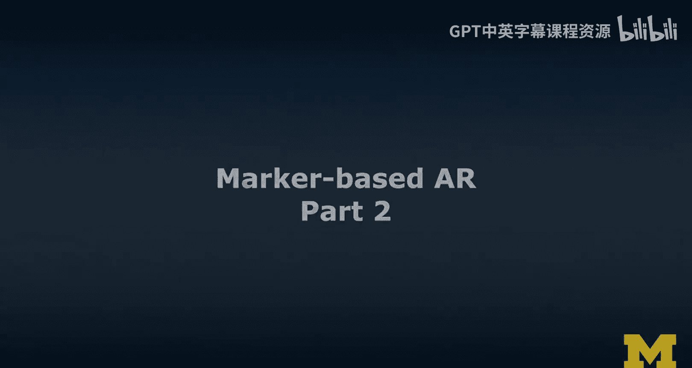

So here's me doing face tracking in Snapchat。 I kind of felt like I have to show this。😊。

So we're gonna do a facial lens。 I want to show face tracking。

 So I'm using a tool called lens Studio here。 and lens Studio is behind a lot of the Snapchat lenses。

 If you are familiar with Snapchat。 And so there's a lot of examples out there。

 And maybe as I talk about this you're imagining all the things you could do to my face。

 But we're gonna do something meaningful in this example。

 So the scenario is we are going to a conference。 and you're getting。

 you meet me there and you get to see some information about me。 And so like a badge。 Okay。

 we're gonna to do an augmented reality like a virtual badge。

 So I just downloaded that badge that I prepared。 I'm gonna add it to my project。

 from this file that I just downloaded， here we go， that's that's the example。😊。

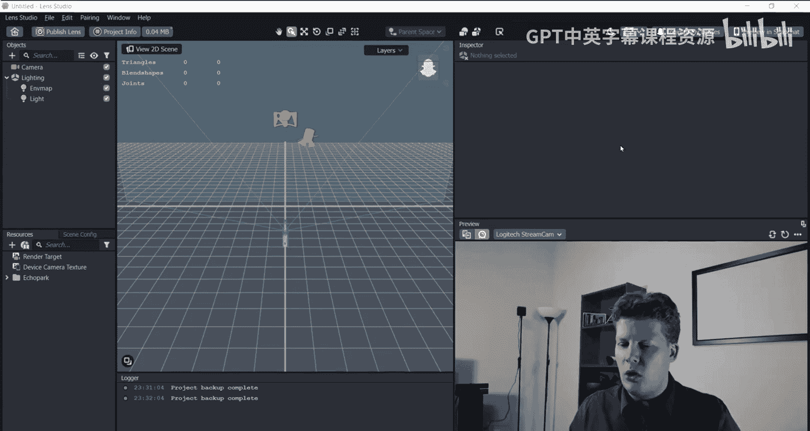

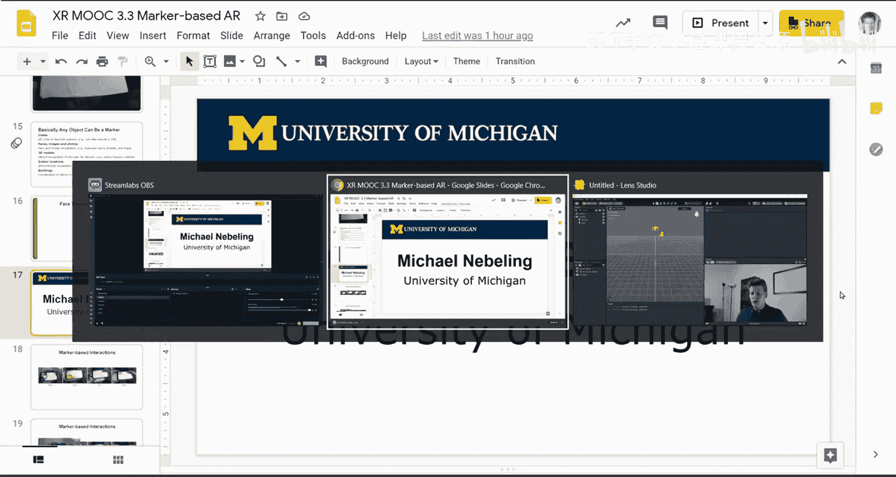

And what I'm going to do is actually add it to my face。 so I'm going to do a face image。

And we can think about where we're gonna place it right now。 I have it like in my face。

 And that's exactly where it's going to be。 And that's not what I had in mind， but。

So I don't want it like this。 And I don't want it like that。 That's not meaningful。

 I'm thinking we're gonna put it relative to my， to my face。 maybe a little bit closer。

 And it would be good to anchor it between the eyes。

 I think this is like kind of like the best example。 And so let's say you meet me at the conference。

 And then。😊，You could ask like your augmented reality glasses that you're wearing right now。

 could do some gesture or it just like it knows when it looks at people。

 It should show you this information。 And so this is the information that it could show about me。

And could also be other information， obviously。 But this is an example that is not so far fetched。

 What's the main reason Microsoft bought LinkedIn as they are investing into Hols is something you could ask yourself。

 for example。

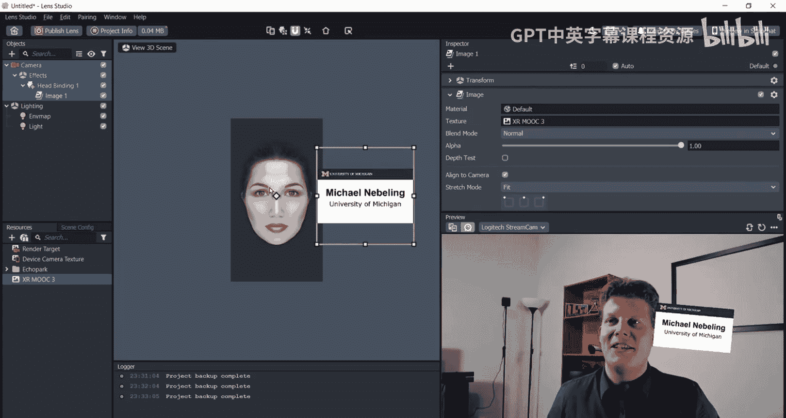

So yeah that was that example。Cool application。 I think this is a better application than some of the other things you could do to my face。

 but I'll leave that up to you。😊，And then so in terms of markerbased interactions。

 let's come back to our case study。 So there's a number of things that are going on there。

 You can place the sheet of paper。 You can point on paper。 So I use the hand behind the phone here。

 You can tap on the screen and you can drag things on the screen。

 And these are some of the marker based interactions And even these are still markerb because you have to keep the marker in view。

 Otherwise， you wouldn't even see this content。 And so it is an interesting relationship between the device and the marker that we're exploitloding here to support these operations。

😊，So placing looks like this。 right， you bring the sheet of paper into the view or you're placing it somewhere on the table。

 That's how I had it。Pointing again， it's pretty cool。

 keep in mind that unless you have people segmentation。

 which is a technique to really segment these hands and fingers out。

 you will always have the AR content appear on top of the finger。

 So you pointing into the onto like you pointing at the paper。

 keep in mind that the air content will appear above your hand not behind your hand will not accrue the mark will not occrue the content。

 and that's a limitation at this stage。 but maybe when you watch this video。

 maybe this has been solved already。Anyway， in 2020。

 when we didn't have anything like we didn't have occlusion with Macabbase， A R， yeah。Anyway。

 so then tapping onto the content and dragging。 So dragging these sliders around。

 this is something that we have implemented using lean touch。

 It's one of the libraries you can use in unity to do touch and multi touch based interactions。

 So so far in my examples， we've mostly either place the paper or sometimes put the the paper in view。

 But you can actually design very specific interactions。

 whether I'm gonna show you these differences quickly。😊。

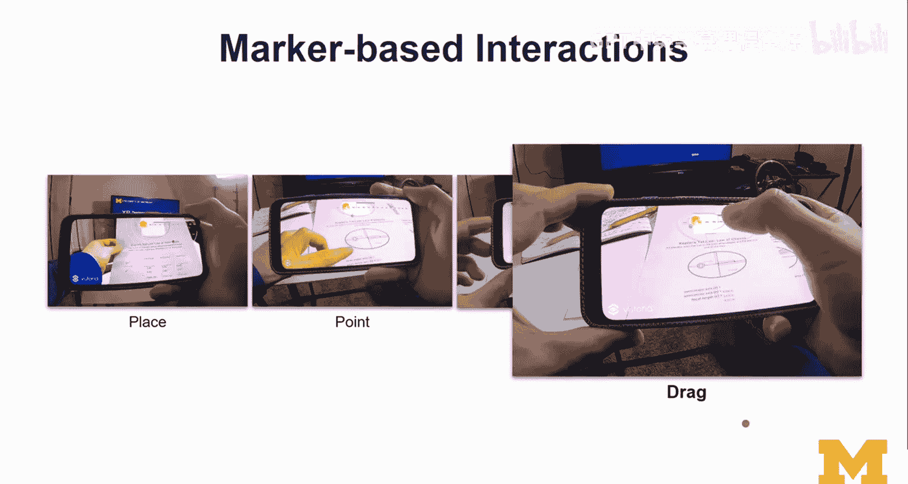

So here I'm bringing the the marker， obviously， into the view of the phone。 I'm holding the marker。

 Okay， and， and that's a way to design interactions。

 But keep in mind that that would mean that the user has only one hand to hold the phone and one hand to hold the marker。

 So it's not too much they can do。 this is different， right， placingcing the marker gives more。

 I don't have to hold the phone with two devices。 if I were using an iPad。

 I would have to hold it probably with two hands。 let's say two devices。 I meant two hands。 And。So。

That is a difference。 And now， what can we actually do with market tracking？ Well。

 we can do something funny like this。😊。

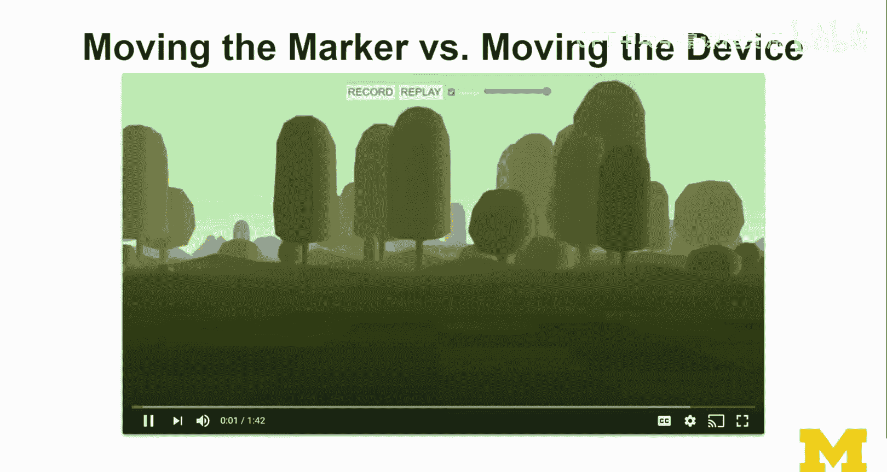

So here I have an example of using markers for puppetering。I'm a giraffe。 It's nice to meet you。

 Welcome to my MOoc and。😊，Let's go。And I can also have two。Hey， what's up。

 Have you heard Tesda's interesting news， Yeah oops。And then the， yeah， I have。 And so also。

 by the way， it's good to see you。😊，And I'm gonna show you。How is done。

So here I have an interface where I can actually change the opacity。And。show you。

The magic now that takes away from the illusion， but all I'm doing here is puppeering with markers。

And this is for storytelling， but it's just like I wanted to illustrate that Macbased AR can be used for rapid prototyping。

 these could be interface elements， these could be all kinds of different things that you want to experiment with different layouts。

 obviously you can align the models differently， it doesn't have to be models。

 all kinds of flexibility there and you can use this for prototyping VR interfaces or AR interfaces as well。

So， I mean， the actual video stream that you show here doesn't have to be。

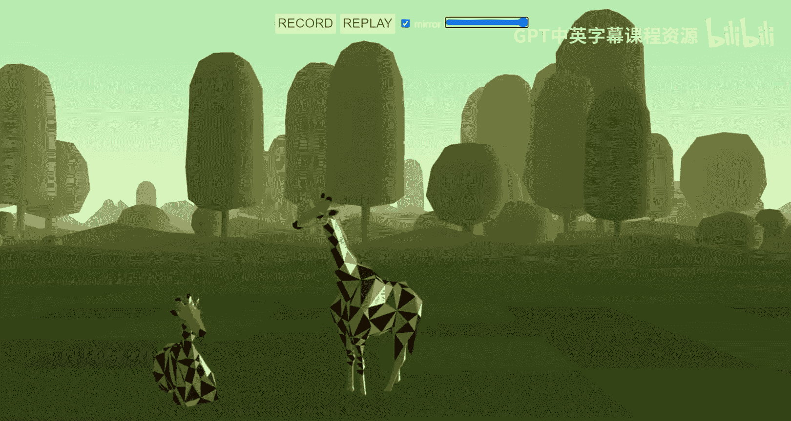

It doesn't have to be this one， so。Lots of flexibility there。

 And this was just a illustration of what you could do with Mac based A。And now， we're gonna go off。

はい。😊，I'm。 Nice to meet you。 Okay， yeah， I definitely had had fun there。

 So let's review some of the mark based AR applications。

 So market based AR is a good option if you want to reach low end devices if you're not just assuming that everybody has the the fancy devices that can do mark less AR。

 Well with market based A， you can you need is a camera。 And then most of most devices。

 even a few generations back in terms of mobile have cameras。 So that is a good use of mark based A。

 I personally think， as I was just illustrating that market based AR is very。

 very good for rapid prototyping。 rather than you figuring out really the layout and hard coding that or whatever you implement the spatial layout and all the U components。

 you could also approach this using market based AR。

 and then segment the interface assign different portion of the interface to markers and then playing around with multiple。

😊，So multi market tracking is a is a thing。 And that's something that didn't show too much here in this case。

 But if if you were going a little bit deeper on marketbase， they are。

 even we could also do multi market tracking。 If you're looking at AJS andhoria examples。

 it does show you exactly how that would work。I also think that Macer based AR is actually valuable for collaborative experiences。

 and just because multiple people could point their devices at the same marker。

 And so it establishes a shared coordinate system。😊，So with A core。

 this would be called cloud anchors。 So we did this idea of sharing the anchors and then enabling the。

 well， the collaborative experience based on this shared coordinate frame。

 I also wanted to bring back our virtual reality case study。 So the zoo， I just really like the zoo。

 Well， the zoo was obviously designed for VR initially。

 But here I'm showing a few examples of how we can adapt it to AR as well。

 So we could take one of the animals and place it on the marker。 here have a little giraffe here。

 And that's pretty cool。😊，So in this case， we always actually have to pay attention that we keep the marker in view。

 So if you make the object really， really big， like a really big giraffe。

 if you wanted to have a life sized giraffe appear in front of the user。

 Mac based AR may not be the best solution unless you have support for extended tracking。

 So which means that the device can then actually seamlessly switch between Macer based AR and Mac S AR。

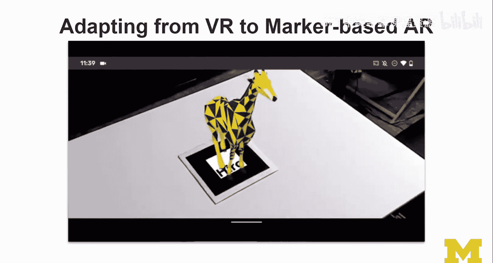

So here I'm using still Macap based AR。 as you can see， the giraffe then obviously， unfortunately。

 just disappears。 and that can be very frustrating for the user。

 So keep that in mind as you're designing and implementing some of these experiences。

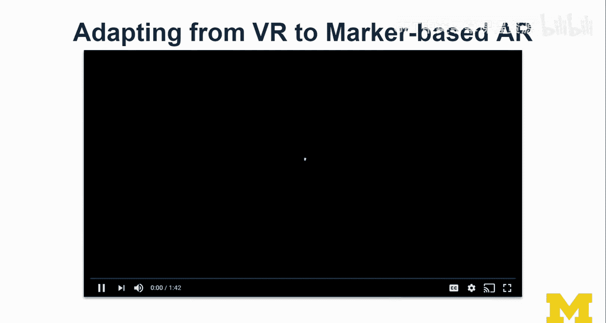

But we can actually， we can actually do Mac based A R。 And we can actually bring in more of the zoo。

 So here's an example。😊，Where I bring back several of the animals， I did leave some out。 It was。

For scale reasons and also for performance reasons， to be honest。Because a frame。

 So Web X R that I'm using here， actually。Because a frame is the A R J S that I'm using here。

 the a frame version， is's not too much。 too many objects you can put in at any one time。

This still pretty cool。 I'm going bring back this zoo also with Mares。😊，So this zoo。

 this Detroit zoo， I won't leave you alone。 I'm gonna bring it back。 I loved Kara's project。

 I love Twita's project。 And I think it's great that they both are supporting this MOoc by， you know。

 helping us learn from their examples。😊，So here I'm doing an almost horizontal to the marker。

 So that's when it is particularly hard to track。 But some of these shots I got。

 I got in really nicely。 And so you feel like， wow， there is a really cool zoo。

 You can see how the tracking feels a little choppy from time to time is a combination of reduced frame rate just because we have many animals we want to show it at the same time。

 And the zoo in terms of the models was optimized for Vr， not for AR。

 So was assuming a powerful device。 And I didn't spend enough time really adapting from VR to A。

 I just wanted as a proof of concept。 I wanted to show you how cool is that。 we can have that zoo。

 we can apply our techniques we learned from virtual reality and we can apply it to AR and we can do it with Macer based AR。

 So this concludes my lecture。 I hope you found it interesting and useful。

 there's more stuff I want to share with you。 We're gonna look at Macca less AR next。😊。

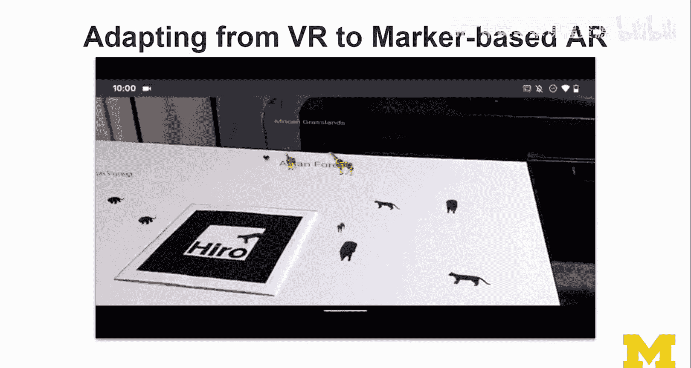

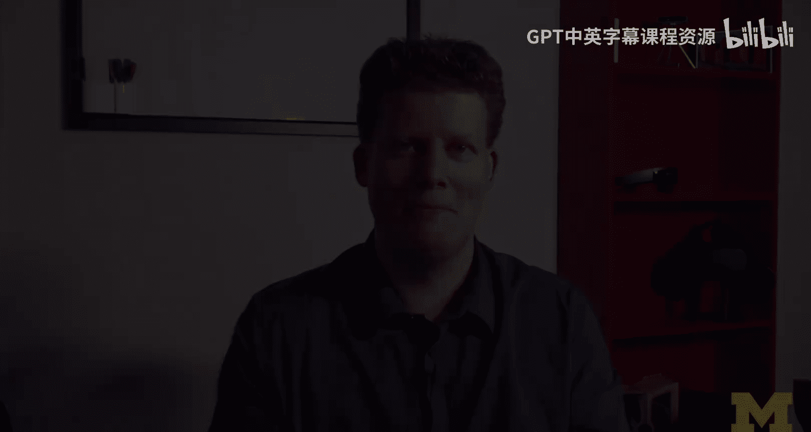

