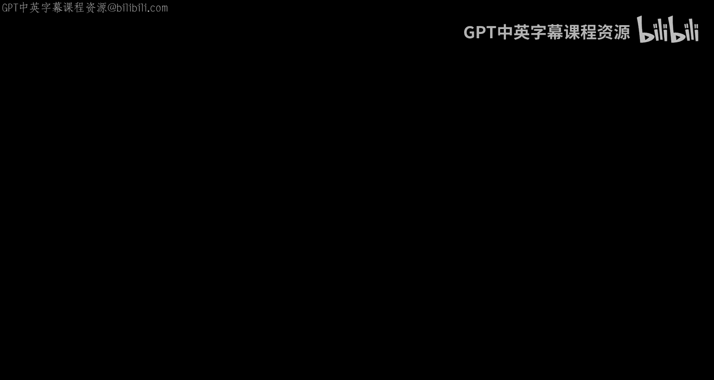
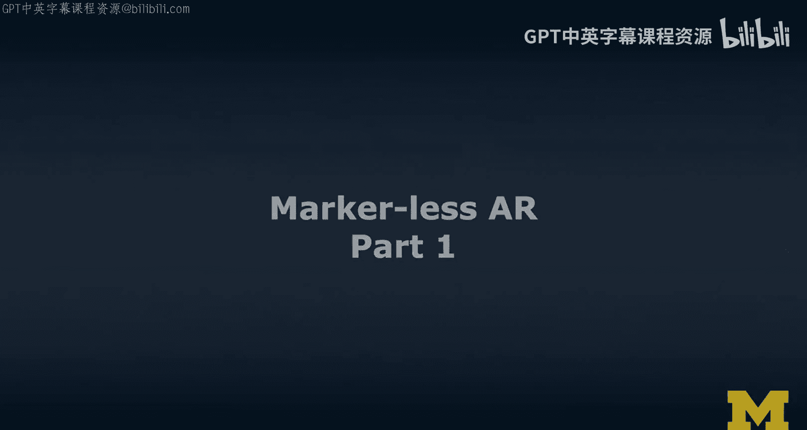
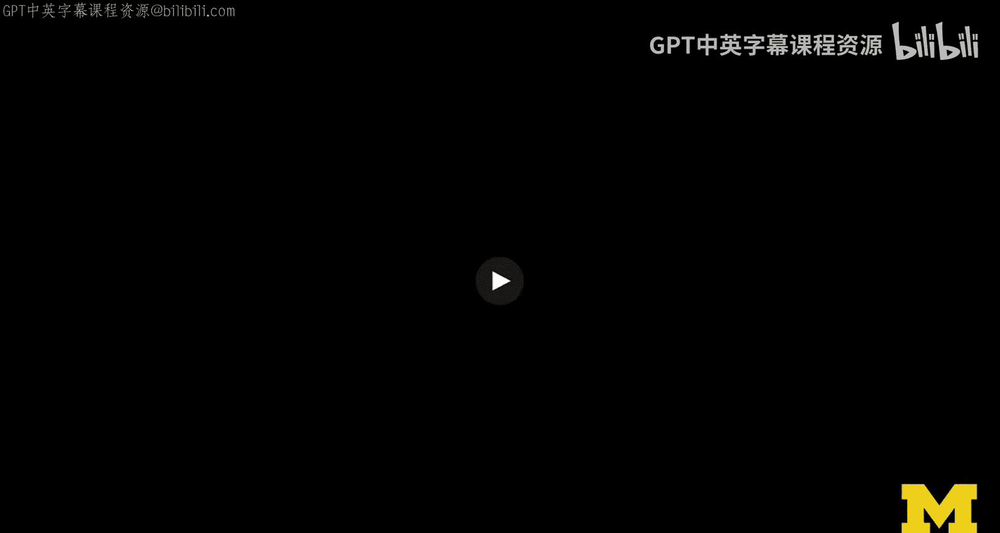
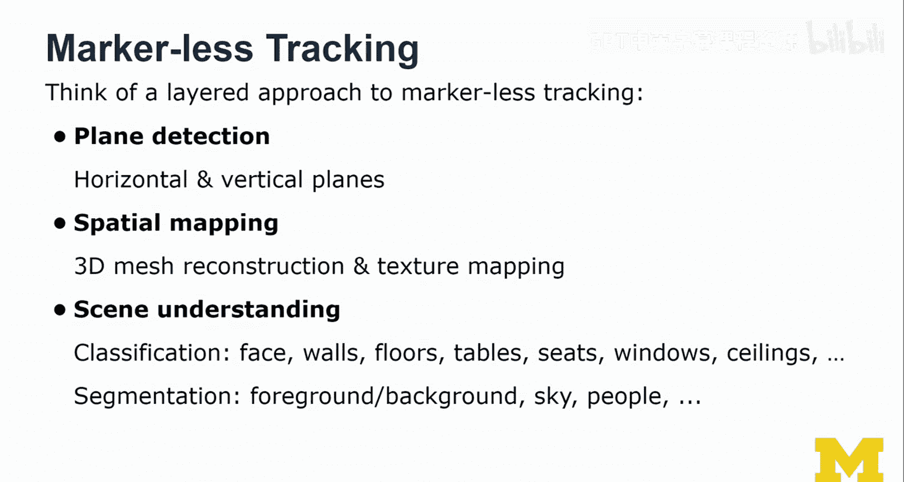
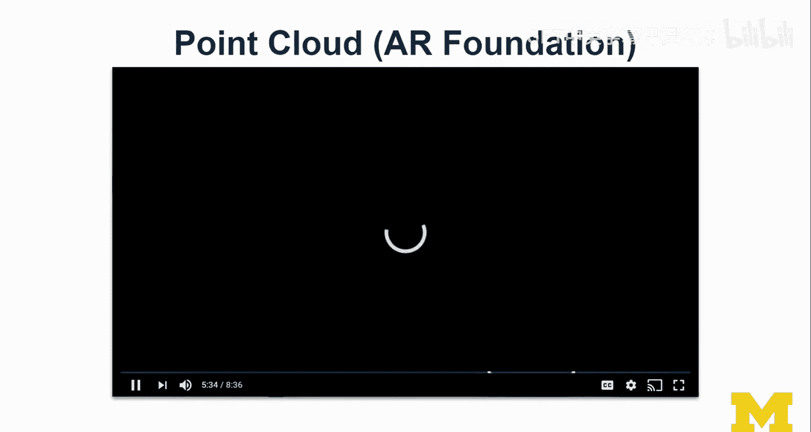
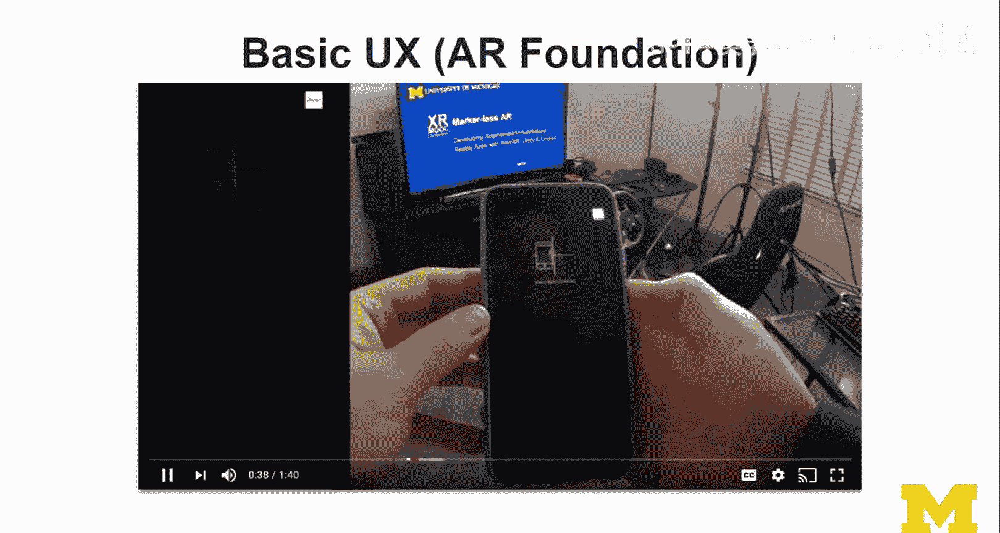
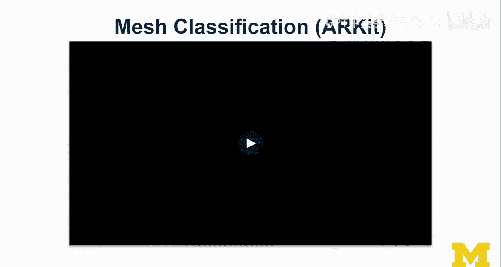
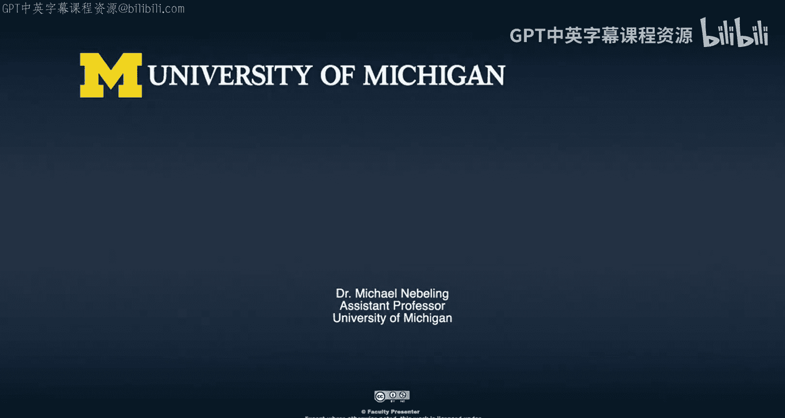

# 扩展现实开发：第31讲：无标记AR开发第一部分





在本节课中，我们将学习无标记增强现实（Markerless AR）的基础知识。我们将探讨其工作原理、核心概念、用户体验设计，并通过具体案例和示例来理解其实现方式。

---

## 概述

无标记AR的核心在于，设备需要自行在环境中寻找“标记”或参考点，而不是依赖预先设计好的视觉标记（如二维码）。这涉及到更复杂的环境感知和空间理解技术。

上一节我们介绍了基于标记的AR，本节中我们来看看无标记AR如何工作。

---

## 无标记AR案例：开普勒定律



我们将通过一个案例研究来开始。这个案例是开普勒行星运动定律的无标记AR可视化应用。

*   **内容放置**：首先需要决定虚拟内容在现实世界中的放置位置。初始移动设备对于设备进行平面检测和环境理解至关重要。
*   **交互设计**：该应用采用了标签页界面。用户可以点击或轻触标签在不同可视化内容（如第一、第二定律）之间切换。此设计完全脱离了纸质标记。
*   **交互方式**：交互仍然基于轻触。例如，点击屏幕可以暂停行星运行的模拟。
*   **环境要求**：无标记AR的追踪效果依赖于环境纹理。单色或单调的表面（如绿幕）是最糟糕的情况，因为设备难以找到足够的视觉特征点。因此，在实际演示中，我们会在桌面上放置一些物品（如笔记本、笔）来提供纹理，以帮助设备更好地进行平面追踪。

这个案例展示了无标记AR应用的基本形态：用户通过移动设备探索环境，找到合适平面，然后放置并与之交互。

---

## 无标记追踪技术原理



那么，无标记追踪的“魔法”是什么？它与基于标记的追踪有何不同？

无标记AR采用了一种分层的方法来理解环境：
1.  **空间映射**：不仅仅是检测水平或垂直平面，而是构建更丰富的环境三维网格（Mesh）重建，可能包括纹理映射。
2.  **语义场景理解**：在高级设备（如搭载LiDAR的iPad）上，可以对重建的网格进行语义分类，为不同部分打上标签，例如：`地板`、`墙壁`、`桌子`、`座椅`、`窗户`、`天花板`。
3.  **基于分割**：基于语义理解，可以进行前景/背景提取、天空分割、人物分割等操作。

这种技术能实现更自然和沉浸的AR体验，例如让虚拟物体真实地被现实物体遮挡。



---

## 基础用户体验与平面检测

无标记AR的基础用户体验流程通常如下：



1.  **启动应用**：用户打开应用，摄像头开启。
2.  **环境扫描**：应用会提示用户左右缓慢移动设备。这不是为了锻炼，而是为了让设备从不同角度捕获多帧图像，通过三角测量法估算深度，识别特征点，从而理解环境结构。
3.  **平面可视化**：一旦检测到平面（如地板、桌面），应用会以半透明网格、高亮区域等方式将其可视化出来。
4.  **内容放置**：用户点击屏幕，应用会计算点击位置与检测到的平面的交点，并在此处放置虚拟物体。物体的视觉大小会根据其放置的深度（距离摄像头的远近）自动调整。

以下是一个使用WebXR（在浏览器中实现AR）进行平面检测的示例逻辑描述：

```javascript
// 伪代码：在检测到的平面上放置一个立方体
function onPlaneDetected(plane) {
    // 当用户点击屏幕时
    let intersectionPoint = calculateIntersection(screenTap, plane);
    // 在交点处实例化一个立方体
    placeObjectAt(intersectionPoint, cubePrefab);
}
```

---

## 高级功能：点云、深度API与网格分类

让我们深入了解一些更高级的技术特性。

**点云**
设备通过追踪环境中的特征点（关键点）来理解空间。这些点的集合称为点云。它代表了设备对环境的“理解”。在AR Foundation（Unity中抽象ARKit和ARCore的框架）中，可以实时可视化这些点云，观察它们如何随着设备移动而累积和更新。

**深度API与遮挡**
深度API（如ARCore中的功能）能提供更精确的深度信息。这使得虚拟物体能够被现实物体正确遮挡。例如，将一个虚拟物体放在椅子后面，当你移动视角时，椅子会自然地挡住该物体，极大地增强了真实感。

**LiDAR与网格分类**
搭载LiDAR扫描仪的设备（如某些iPad）能快速创建高精度的环境深度图。结合语义分割算法，它可以实时对重建的三维网格进行分类，识别出“墙壁”、“窗户”、“桌子”等。这为更智能的AR交互奠定了基础，例如让内容自动吸附在墙面上。

**人物分割**
这是另一项高级功能，能够实时将人物从背景中分割出来。这使得虚拟物体可以与用户的手或身体进行真实的遮挡交互，如上图所示，虚拟花瓶可以被用户的手遮挡。

---

## 技术考量与限制

在开发无标记AR应用时，需要注意以下几点：



*   **设备兼容性**：与基于标记的AR相比，无标记AR对设备硬件（处理器、摄像头、传感器）要求更高，因此支持的设备范围更小。不过，目前大多数最新一代的智能手机都已支持。
*   **隐私与安全**：更高级的场景理解（如结合云端图像识别）可能涉及将环境图像数据上传处理。开发者需要考虑用户的隐私关切，并明确数据使用方式。
*   **设计挑战**：由于没有物理标记作为参考，界面设计和用户体验引导变得尤为重要。需要清晰地指导用户如何扫描环境、放置内容。

---

## 总结



本节课中，我们一起学习了无标记增强现实（Markerless AR）的核心概念。我们从开普勒定律的案例入手，了解了无标记AR的基本交互。随后，我们深入探讨了其背后的技术原理，包括空间映射、平面检测、点云、深度API、LiDAR扫描以及语义网格分类和人物分割等高级功能。最后，我们讨论了开发无标记AR应用时的设备兼容性和设计注意事项。无标记AR提供了更自由、更沉浸的体验，是当前移动AR技术发展的重要方向。