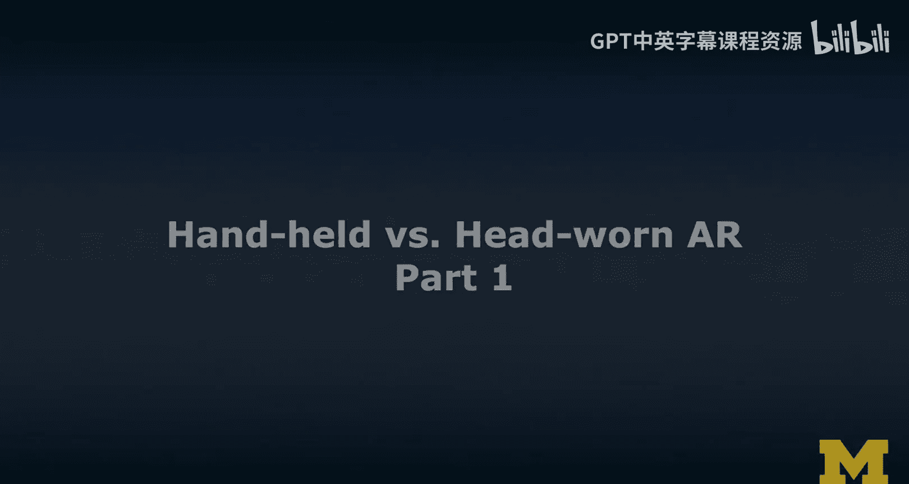
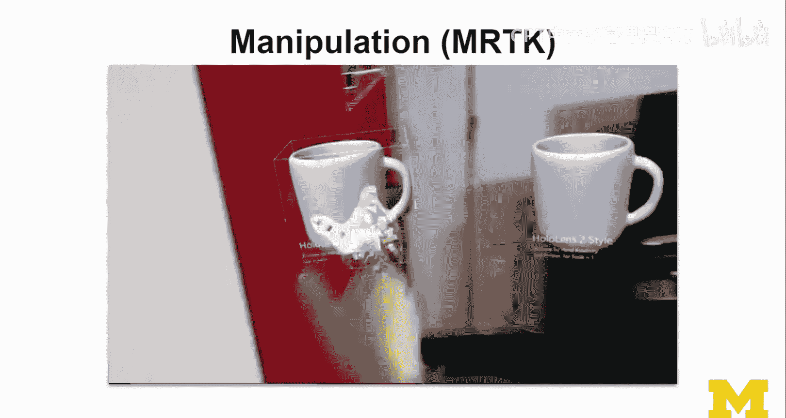
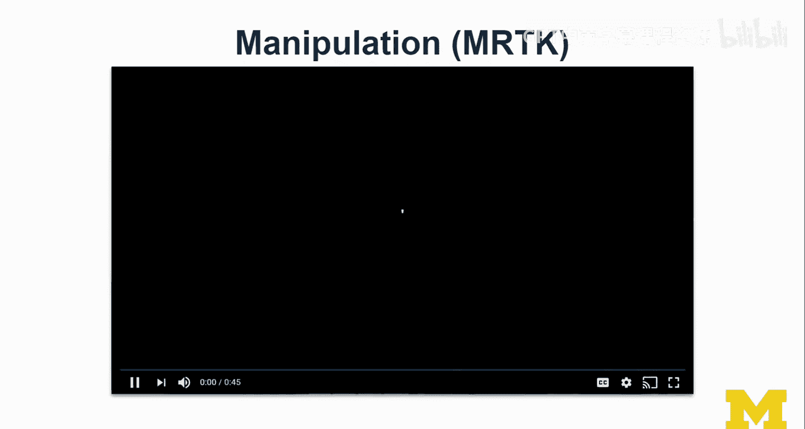
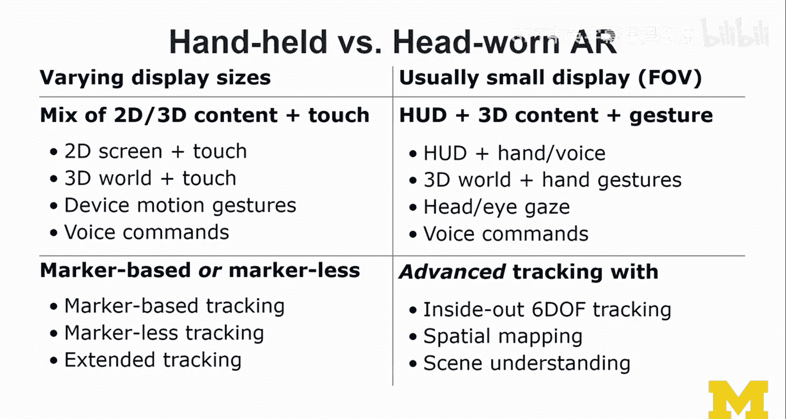

# 密歇根大学《面向所有人的扩展现实（介绍⧸设计⧸开发）｜Extended Reality for Everybody Specialization》中英字幕 p117 33_手持式与头戴式AR对比第一部分.zh_en -BV1jM4m1k73q_p117-

In this lecture， we're going to talk about handheld。Versus headw AR。

 So for the 1% of you out there that have access to a device like the Hollens2。

 I thought we should also cover a little bit well a little bit mark AR and taking that knowledge into a headw AR display like the Hollens。

 one thing that you should always keep in mind， even though all my examples are holens based。

 there are also cardboard like solutions for AR like the hollow kit that I have here。

 well the phone goes inside there。 I'm not actually running it I'm just showing how this would work goes in there the camera needs to be exposed and then the screen actually has to do a stereoscopic rendering So like a rendering for H kind of like when you do what you would do in VR but all the black that you render on the screen will obviously not be visible to the user as they're looking through this So everything that's black here it does。

actually appear on the visor。 So that's the way to do it。 Okay。

 so you're rendering a stoscopic view for the hollow kid。

But you're using it at the same time the camera。The camera that's up here using that camera to do some of the tracking that we talked about。

 you can do Macb or Mac as AR。Cool， so keep that in mind。 Don't。

 don't be sad that you don't have access to holens If you don't have access to Hollens。

 That's totally that's totally fine。 I don't assume due to the issues with equity that that are real。

 I don't assume that everybody has access to headw AR。 But I just showed you how we can do it。 Okay。

 so Hollo kit is is a cardboard like so cardboard， like virtual reality cardboard。

 a cardboard like AR experience。 So this lecture is actually structured around a number of themre gonna ramp right written。

 we're gonna go onto the holen And I'm gonna had little bit of fun here。

 So I'm gonna show you lots of examples。 And then we're gonna learn about the differences between handheld and head one AR。

 So let's enjoy this a little bit together。😊，So here you see a mixed reality toolkit example。

 basic user experience。 one of their examples is on tool tipss and you can explore kind of like objects that way and I'm showing you from time to time the outside perspective while this is the first person view which is pretty cool this is what it looked like for me and I was trying to they have some stabilization built in for some of these video recordings。

😊，But I was also trying to move quickly rather than going like James Jason Bn style， super immersive。

 going crazy。 I was trying to keep things a little stable for you so youll see better what's going on。

 And so here I'm just playing with some of their hand interactions。 In fact。

 hand interactions is something that will explore a little bit more in depth in this。😊。

In this lecture。So there' a lot of stuff you can do basic user experience。

 You can have tool tips that you know， can be triggered based on near and farm manipulation。

 So that's something that we're gonna learn about。 One of the latest examples that I actually likedd a lot is the hand menu that I'm gonna show you here so on the Hollands too。

 you know， have the hand menu and mixed toolkit。😊。

doesnn't always work。 Like for some reason， it didn't always work well for me。

 So I'm gonna show you the portions where it did work very well for me so that you get a sense。

 Sometimes it wasn't triggered。 And I I can't explain why。 But here。

 it actually does work relatively well。 So obviously。

 it has fully articulated finger tracking But in this case。

 we're just like trying to get a sense for the actually the wrist。 Where's the wrist of the user。

 in this case， I'm not rendering the spatial mesh of the hand。And this is what it would look like。

 the more final user experience， the more polished user experience when you have the menu appear next to the user。

I mean， from the outside， it does look a little funny how I'm like staring at my hands。嗯。

And it's still， it's still midair， right， you're interacting next to the hand。

 when I'm showing you again， enabling some of these debugging tools。

 I'm gonna show you a medium sized version in a second。

 So you can also see a little bit of an offset between the virtually represented hand。

 That offset is not， how I see it when I run this demo on the Hollens。

 That offset really has to do with how this demo is recorded。

 there not correcting automatically for the offset between the where the camera is placed。😊。

And where the how the video is being recorded。 But there are also fixes for that。 I just actually。

 to be honest， couldn't figure out how to do that there is a little bit of documentation on that。

And here I'm showing a medium size hand menu。 So hand menus are cool， I think。😊，Manipulation changes。

 okay， so you don't have a touch screen anymore。You notice this already。 but obviously。

 this demo is gonna make it very clear to you。 So you have to think bit about how the interactions change in this kind of head one AR。

 You can do more with speech。 I think people will find it more intuitive to use voicebased or speechbased interactions because you it's kind of like hands free。

 And so wearing something on your head。 So you feel like talking to the computer will be fine here I show a little bit。

 actually， I show a lot of different gestures。 So they have different types of manipulation styles。

 Holland's two style， Hollands one style。 You can go through these examples。

 I build this mixed reality Tookit 2。4 example scene of。😊。

Of their head interactions。And this is actually the， the box， the box styles。That they have。

 And I can do again far。 This is far manipulation using the lasers that are coming out of my hand。

 some Spidman。AndSo not webs， but lasers。So the difference is in terms of how neo farm manipulation works。

Is that you need to use more of the anchor points to visualize it to users what they're actually grabbing。

 which part of the user， which part of the object they're actually grabbing and what kind of transformation theyre actually executing。

Now， you can do really cool things。 Like， I like this example of the clipping planes。

 and these clipping planes can come in different form and shape。 And now it's， it's actually using。

 it's actually using a feature of the Hollens a feature the feature that we cannot render black and。

😊，It looked a little different。 Actually， for most of my demos。

 when you see something black in the video that is actually transparent to me。

 I don't see it because of how the display technology works。 I don't see it。

And so this video capture is not exactly the user experience， but it comes very close。

 It just it feels like a really nice see through cube that I'm holding there。

 And I'm gonna come back to that issue later。 as I'm gonna show you one really。

 really cool experience。 mission A R。 That is an actually an unreal experience。 So done with unreal。

 but it an unreal experience as well。 It's pretty cool。 So let's explore handheld versus head1 A R。

 So first of all， here's my handheld。 So handhel varying display sizes， right。

 can be can be smartphone can be tablet。😊，We usually have a mix of 2D and 3D content。

 and then primarily touch interaction。 Obviously， you can do voice。 I mean， you could do whatever。

 but the， the primary ways of interacting is actually through touch，2D screen and touch。

3D world in touch。 So where you place content So quantum placement and device motion gestures。

 So what I mean by that， obviously， since we can track the device。

 This is something I explore in my X director research project， we can we can use it for puppeering。

 so I can actually move object。 just like by moving the phone I move I move an object。

 a virtual object this is a socialist like an airplane。😊，That was always one of my favorite examples。

 And now I was able to demonstrate it to you。So device motion gestures。

 keep in mind that we can't move the device too quickly because we still need to do tracking and tracking while relatively robust is not that robust and voice commands。

 so。And then obviously， when it comes to handout， we can do Mackabase or Macs。 I mean。

 it's also the same for headw， but for head one， I would say Macs is more popular。

 So Macbase tracking Macs tracking extended tracking through this transition， for example。

 supported by Bhoria， using the Macer initially to establish the coordinate frame and then switching over seamlessly to Macs tracking as you're moving the Macca out of view or just for other reasons。

 loses tracking like you're occluing the Macca。If you're looking at it from the head one A side。

 So we usually have a very small display。 So the field of view， the field of view， right。

The field of view， you would think that when I put this on my head and this is part of my foundations lectures as well。

 in the first MOO。You would probably think that， wow， everything is super augmented for me now。

 But it's actually like these are the portions that that are， that are that are augmented。

 Everything else around it。 is just the real world。 And I have peripheral vision。

 not just the foveal area。 I actually have peripheral vision。😊，And so that can be disappointing。

 even with a ho lunchch， too。So I'm going to show you not like you know the field of view and a virtual reality headset。

 we have 120 more120 or more degrees of the field of view where we can like we can no included display。

 So we're shutting off the real world and everything else in there is actually black。

 That's like that's why we have all this stuff here to really control nicely And so it feels like wow。

 such a better view so much more augmented view and so that's something to design for。

 And that's something I'll cover in our XR research lecture where I go in little in more depth about one of our research projects around the mixed reality tool kit that we used。

😊，To develop an analytics tool kit and then also design a crisis simulation case study。

 But the field of view was really a limiting factor。

You actually have a heads up display or 3D content， right， There's no more 2D display。 I mean。

 there's nothing you can touch。 I mean， you don't reach into the between you and the glasses。

 the goggles， the interaction。I mean， Google Glas had these things on the side。

 They can actually touch things on the side。 The Holland doesn't have any of this。

 at least not released。 Maybe there are some senses in build。 I mean。

 you could do a little bit of IMU detection。 And I mean， I'm sure you can read that signal。

 And so that's like how， for example， pass through works on the Oululus quest， which I think is。

There。So yeah， that's， but so there is a heads up display。 That's what you can do。 or it's。

 So that sticks with me。 or it's like placed in the world。 And then basically， when I look this way。

 I don't see it anymore。 actually， at this angle， I would already not see it anymore because of the small field of you。

😊，And you don't reach into the display to do any interactions。

 All the interactions happen in front of the display。 That's why we have these cameras。

 So this is outside in tracking。 sorry。So this is inside out tracking， not outside in tracking。

 And so basically， the the hands need to be in front of the display in some area so they can be tracked。

 So that's important。 So we can do gesture。 We have a headset display。 We can do 3D content。

 So you can do hand and voice And I say hand because I'm assuming we're talking about holens too。

 That's more like the latest。 so we can do hand and finger tracking。

 So we can do finger based interactions as well。 We also can do eye tracking on so that's something that on both。

😊，I don't think I've covered it sufficiently， but eye tracking。Can be used also for interactions。

 And I haven't seen a lot of useful examples yet other than scrolling with your eyes。

 which I think is interesting。 So head and eye gaze and voice commands。

 And so I would say when it comes to tracking。 when youre designing for devices。

 these high end devices， you actually have access to advanced tracking。 So you have inside out。

60 reason of freedom tracking。 spatial mapping， just comes for free kind of it's built in。

 especially when you have like multiple cameras like the Hollands， including a depth camera。

 Its like a little key on your head。 And then we have seen understanding。

 So advanced tracking with scene understanding。😊，It's like can do so much with it。 If it's well done。

 we can do so much with it。 And so this will be and some of these technologies。 It's interesting。

 so people have argued that the smartphone based AR was just to figure out how to design better headphone AR。

 So all the features that you get in one of these platforms。 And right now。

 it's still fragmented because there are different technical requirements in order to， for example。

 do really reliable spatial mapping and seen understanding。 So doing it in software。

 like with A core and A kit So visual inertial dormittry。

 that was actually really a key enabling step。😊。

Previously， you always had to rely on depth cameras。 So， so if youve heard of Google Tgo， that was a。

 an exploration by Google of how to augment smartphones with depth cameras。

 I really like that project。 And I really like Johnny Lee's work。

 and but it kind of kind of was superseded by A core and journalist Lee is still pretty involved。

 I'm sure。😊。

