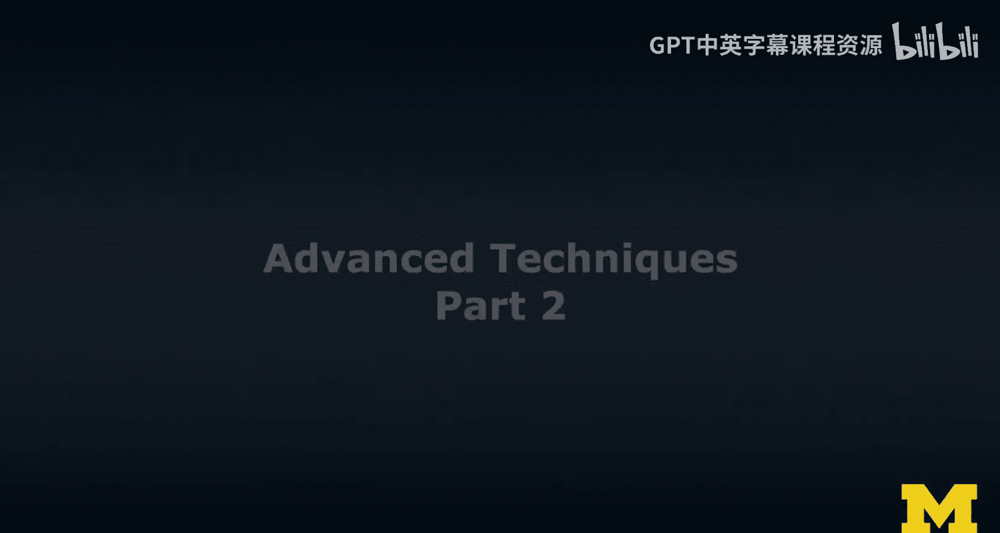
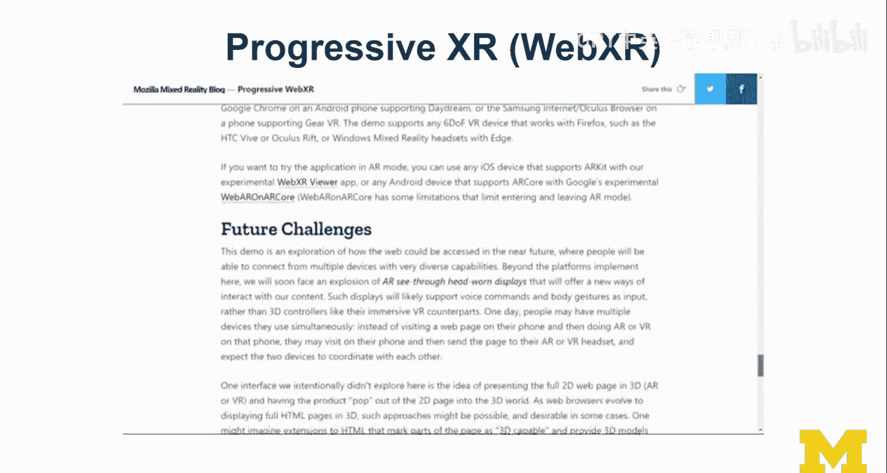
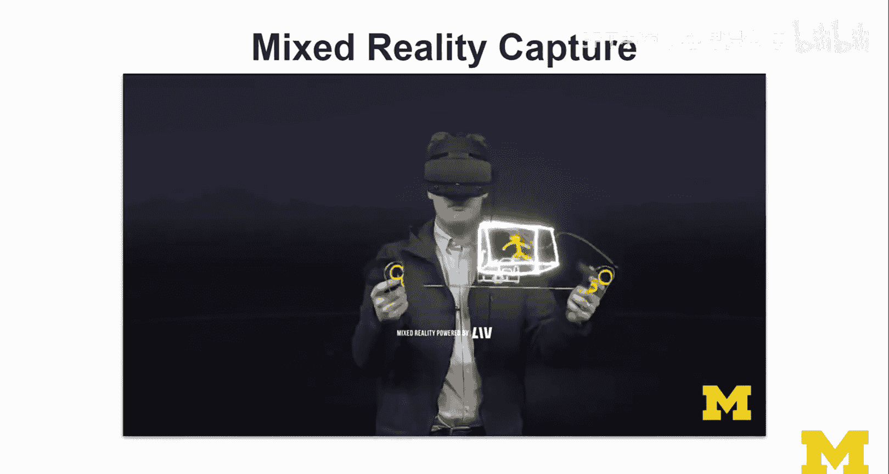
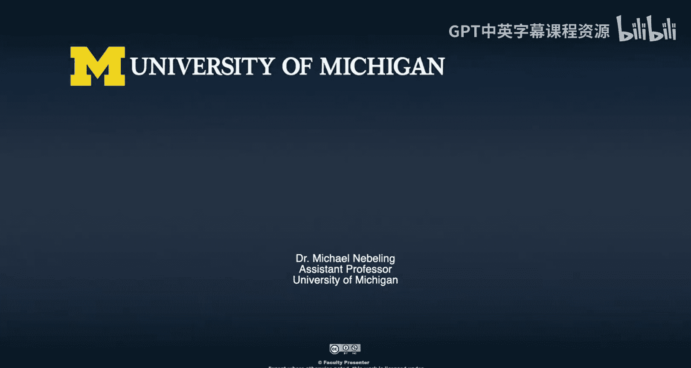

# 扩展现实（XR）课程：第40讲：高级技术专题Ⅱ

## 概述

在本节课中，我们将探讨扩展现实（XR）领域中的几个高级技术专题。这些主题虽然被归类为“高级”，但其中一些，如无障碍访问，本应是基础设计原则。我们将依次讨论无障碍访问、文本输入、协作、自适应布局与定制化，以及混合现实捕捉。这些主题代表了XR领域当前面临的挑战和未来的发展方向。

---

## 无障碍访问：不应是“高级”话题

上一节我们讨论了XR的基础交互，本节中我们来看看一个本应基础但常被忽视的领域：无障碍访问。

无障碍访问不应被列为高级话题。它出现在这里，是因为实现它确实需要先进的技术，特别是**场景理解**能力。系统需要像人类一样感知和理解用户周围的世界。例如，系统需要知道用户身后是一面墙，以避免碰撞；或者识别出架子上有用户可能放置的物品。

对于视障用户而言，在陌生环境中导航是困难的。一个配备了**场景理解**能力的XR设备（如头戴显示器）可以充当用户的“眼睛”，扫描并描述周围环境。这需要精准的追踪、场景理解和语义感知技术，以及精心设计的用户体验，让系统能够有效地向用户描述世界。

开发一个“AR屏幕阅读器”将是一个非常酷的研究项目，但这无疑需要先进的技术。

---

## 文本输入：尚未解决的挑战

在讨论了环境感知后，我们转向一个更具体的交互难题：文本输入。

目前，无论是在VR还是AR中，虚拟键盘的效率通常不高。最有效的方式仍然是使用物理键盘，但物理键盘并未很好地集成到当前的XR体验中。例如，即使VR设备连接了电脑，在大多数VR界面中直接使用物理键盘打字也常常无法实现。

以下是几种文本输入方式及其挑战：

*   **语音命令**：可以使用语音识别。但问题在于，用户通常不清楚系统支持哪些命令。例如，在HoloLens上，听写模式（基于字典的语音识别）和语音命令模式是有区别的。
*   **多模态输入**：结合多种输入方式（如语音、手势、凝视）是未来的方向。
*   **空中键盘**：像HoloLens上通过空中点击输入的键盘设计很有趣，但许多人仍觉得其效率不如实体键盘。

我们尚未真正解决XR中的高效文本输入问题。

---

## 协作：从单用户到多用户体验

解决了个人交互问题后，我们来看看如何让多人一起工作。目前大多数XR体验都是为单用户设计的。

协作可以分为两种主要模式：

1.  **同地协作**：多个用户在同一物理空间共享XR体验。虽然技术上是可行的，但大多数系统仍缺乏对此的良好支持。
2.  **远程协作**：用户位于不同的物理位置进行协作。这更具挑战性，因为涉及网络、延迟问题，并且用户所处的物理环境不同。

实现远程协作的核心是创建一个**共享会话**。这通常需要在各自的坐标系之间定义一个**共享原点**，并交换该信息。在ARCore平台上，**云锚点**（Cloud Anchors）就是一种实现方式。一个有趣的研究方向是如何弥合不同物理世界之间的差异，实现无缝的远程协作。

---

## 自适应布局与定制化

从多人协作回到个人体验，我们来看看内容如何适应不同环境。大多数XR体验可分为桌面级、房间级或世界级规模。

自适应布局是指让内容自动适应不同的空间尺度。例如，一个在桌面上移动方块的游戏（类似《我的世界》），可以适配到桌面规模。如果切换到房间规模，我们可以放大内容，利用更多空间，甚至将整个场景按比例放大以适应房间。

虽然这听起来简单，但大多数XR体验并未实现自适应。它们通常由开发者固定为某一种规模，不允许用户在之间切换。

世界级规模的体验则更具挑战性，因为它可能需要之前提到的协作平台和共享环境数据（有时被称为“AR云”）。从设计理念上看，这涉及到两种思路：

*   **优雅降级**：为功能较弱的设备或较小空间提供最基本的体验。
*   **渐进增强**：为功能更强的设备或更大空间增加更多功能层，充分利用环境。

这个概念类似于响应式网页设计。Mozilla的同事进行了一项名为“渐进式XR”的案例研究，探索了如何让一个虚拟购物界面自适应从手机触屏、AR手势到VR控制器等不同的显示设备和交互方式。未来，也许会出现类似CSS的样式表来管理XR界面的自适应。

---

## 混合现实捕捉

最后，我们来探讨如何将虚拟体验记录下来并展示给他人，这就是混合现实捕捉。

混合现实捕捉允许将真人实拍与虚拟内容合成在一起。例如，讲师可以站在绿幕前，使用像Tiltbrush这样的沉浸式创作工具绘制3D内容。通过校准，系统可以确定摄像机在3D世界中的位置，从而实现实拍画面与虚拟世界的同步。移除绿幕背景后，讲师就仿佛置身于虚拟环境之中。

这项技术对于演示和教学非常有用，它能让没有头显的观众也能理解XR体验。在影视制作中（如《曼达洛人》使用的“虚拟制片”技术），它通过巨大的LED屏幕实时渲染背景，让演员产生身临其境的感觉。混合现实捕捉是一个令人兴奋且正在发展的领域。

---

## 总结

本节课我们一起学习了XR领域的几个高级专题：本应基础却需要先进技术的**无障碍访问**；尚未完美解决的**文本输入**挑战；从单用户迈向**协作**体验的路径；让内容适应不同空间的**自适应布局与定制化**；以及连接虚实世界的**混合现实捕捉**技术。

其中，**无障碍访问**尤其需要社区共同努力，使其不再依赖“高级技术”，而是成为每个开发者和设计师的基础考量。XR领域仍有广阔天地等待探索，希望未来这些“高级”技术都能变为“基础”能力。