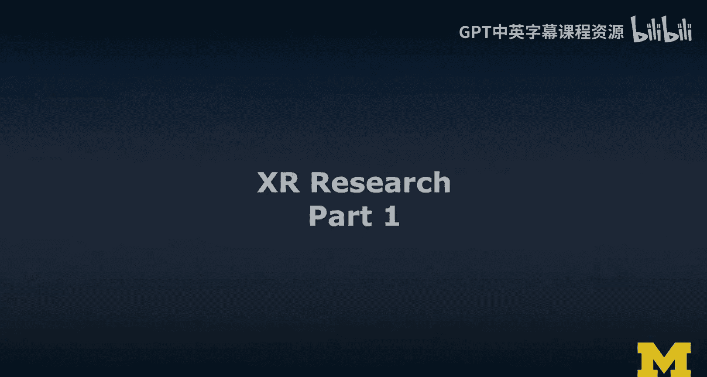
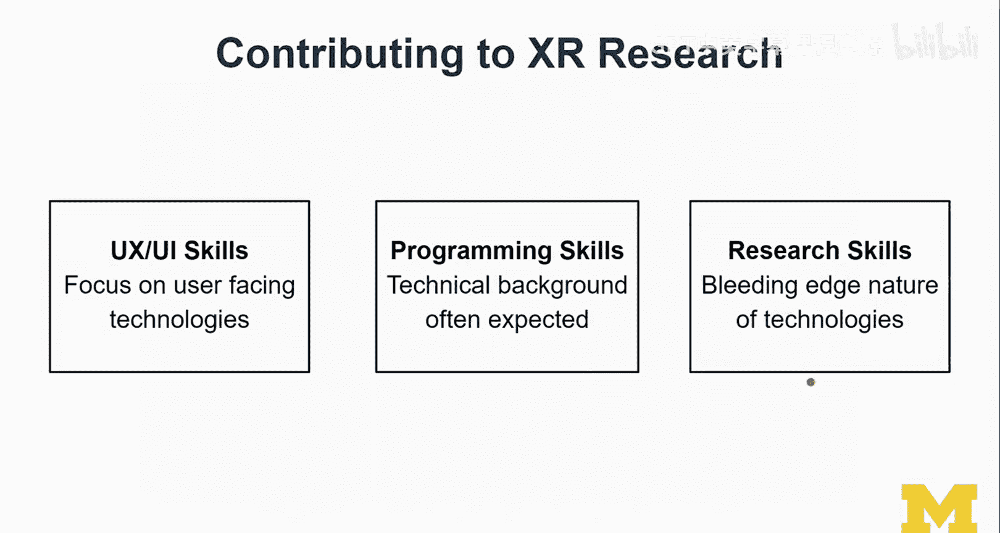
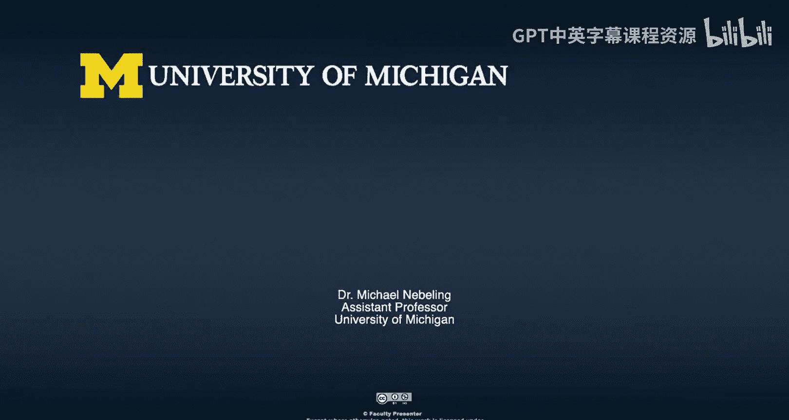

# 密歇根大学《面向所有人的扩展现实（介绍⧸设计⧸开发）｜Extended Reality for Everybody Specialization》中英字幕 p125 41_XR研究前沿第一部分.zh_en -BV1jM4m1k73q_p125-

In this segment， we're gonna to talk about XR research。 Now， when I say research here。

 I'm thinking user research， not so much academic research。

 So this is not like the lecture that provides an overview of all the things that happened in the XR space in various communities。

 There are obviously a lot of academic conferences out there and I'm active in a few of them。

 but that is not the goal here。 So I'm going build this lecture around a research project that we submitted to the ACM Chi。

 So the main human computer interaction conference and that project is called Amrat mixed reality analytics toolkit。

 So I'm going to build a lecture around it。 but I'm going to present it very differently。

 This is not a paper presentation。 This is not an academic research presentation。

 Im want to use that work to reflect on what it means to be involved and to be doing XR research。

 So working with users a lot of experimentation。And I'm also going to use it here at the end of this course focused on development because that particular project allows me to cover a few topics that we haven't spent too much time on custom marker design and multius collaboration so a few things there spatial mapping and working really with a hololens we haven't spent too much time working obviously these devices are still very expensive and not a lot of people have them so it didn't make sense to have the MO focused on those devices。

 but we can learn maybe for my case study like the one that I'm going to present here。

 So the way I'm going to talk about X research years in terms of three main things I'm going talk about topics we're going to talk about skills and we're going to talk about questions So topics。

 yes， I'm going to provide a little bit of an overview of the research landscape in terms of topics and my assessment going to a number of conferences over the past five years focused on that。

That observation with you and we're going to talk about skills so what does it take to participate in research and then we're going to talk about actually what I think are good questions to ask when when it comes to X research and what are not so good questions to ask。

😊，This is not so much in terms of hot research topics。 It's more like how to approach research in XR。

 So a little bit more general and broad。So let's start with topics。 So obviously， when you zoom out。

 there's VR and AR。 And so when you go to major conferences。

 what you feel like is everybody is talking about Vr and nobody is really talking about AR。

 that is an exaggeration。 but there still seems to be this imbalance when you go to conferences right now in 2020 yeah。

 so the VR part is maturing right， We see lots of devices out there。

 a lot more people can do VR AR is unless you're doing smartphone based AR。

 It's still very expensive。 Like not everybody has a holen or Magly。

 not everybody can do studies like the one that I'm gonna present here with multiple ho lenses。

 And so I feel like yeah， it's understandable。 but I hope that over the next few years。

 This is gonna balance out。 And maybe the AR is really， really hard as well。

 So we should really spend some time on it。😊，And so when it comes to topics and when I go to conferences。

 I hear a lot about sensing and input， it might just be that I'm going to a lot of technical conferences。

 It is also true。 I mean tracking is really， really good actually already but we can always do better。

 especially on the sensing when you talk about sensing I mean traditionally sensing and input is more like sM and those kinds of things but in the next few years and actually already it is about really semantic scene understanding So really making sense of what the device sees and what is around the user。

😊，So you'll see more there， I'm sure we' are also exploring applications。

 a lot of the vendors are actually just throwing out devices。

 putting well throwing out is probably a little bit of an nextagger。

 but giving out Hollands for example to Michigan or well that's mostly I think Microsoft was a primary partner so far for us to explore what we could do with it and giving it to a university like Michigan which has like so many different disciplines in schools is actually a smart move so together we can then explore all kinds of applications and you see a lot in the even in the research literature you to see applications。

 papers and really cool case studies there。I think prototyping。

 but I put prototyping because I was working on prototyping。

 but also that's a space that I understand very well。 And I think there's still a lot of interest。

 And even though I would say to a new PhD student， hey， maybe we shouldn't do prototyping。

 it's really hard to publish there。 I do think it's still relatively unsolved。

 It's still very expensive and hard to create ARVR experiences。 The prototyping tools out there。

 It's just like doing this super basic stuff， right。

 allowing you to design a markerbased experience without programming。 I mean， really， that is cool。

 that is cool in some sense， right it's like its creating this Wordpress so that everybody can write ARVR applications。

 I get it。 like that's the whole power of Wordpress and how it transformed the web。 In fact。

 we've studied this a little bit I understand that。

 templatebased design could be a good approach to ARVR as well。 But when it comes to that。

 I would like to see more guidelines and more principles around ethics， for example。

 built into these tools。😊，Gidelines， guiding good design that would be cool showing an object in AR。

 as I said in the very beginning of Cose 2， which is like the brother or sister course related to this one here there is so much more that you need to do when you're designing an AR experience is not just about showing some 3D content to the user。

 the context really， really matters。😊，And then human factors like really understanding what impacts users so motion sickness is something that well I did mention a few times。

 but we really need to do more human factors oriented studies to really understand why people feel motion sick and how we can improve it。

 I mean we have a basic understanding and there's a lot of work in this space but it's still interesting and yeah it's not really clear how it translates in design。

Design and accessibility， I hope to see more right now。

 I'm not making this smaller because I don't think it's that important。

 I'm just telling you this is what I'm observing and the attention is probably shifting hopefully towards the more user oriented topics。

😊，Collaboration is one that I think is a very big one and that will require actually a lot more work over the next few years。

 so I do think that collaboration is is important through CoVD-19。 it was definitely emphasized。

 but I haven't really seen yet。Good collaboration applications in ARVR。

So I want to come to this question of how to contribute to X research。

 So you actually do need quite a few things。 I do say to my students that U X。

Interaction design skills would be important in all work， we work with a lot of users。

 so focus on user facing technologies really requires that you have that basic understanding。

 you have a training in human Comp interaction， I think is very good。Programming skills。

 I'm looking for programming skills， usually I say there's like programming skills。 Yeah。

 an affinity towards technologies and a technical background is still often expected also in my own work it's true。

 I mean I can afford to work on topics that are less technical In fact that's actually very beneficial in the information school where I'm working at the moment but when you when you do want to for a lot of the papers that I've been working on over the last few years is actually quite a lot of programming involved。

 and then research skills so there's a number of ways to think about research skills but one maybe that makes it very obvious to you now since you're work with these technologies。

 they really bleeding edge right somebody says this should work this way and then you try it out if there is documentation and then it doesn't work。

 So this research approach to working with these technologies kind of like running it like a lab okay try this parameters set this value fail。

T another version of it failed， found the right threshold for the tracking to really work and this methodological approach。

 computational and really driven by systematic approach that's really what you need when you work with these technologies they are very researchy very early stage still even though they've been around for many years and documentations often poor and so I think yes。

 so that's why I think these three sets of skills actually come together if you're really good at some of them then yeah you can contribute to a team if you can bridge these then you actually you're made for research so that's pretty cool。

😊。

