# 密歇根大学《面向所有人的扩展现实（介绍⧸设计⧸开发）｜Extended Reality for Everybody Specialization》中英字幕 p129 45_制作过程揭秘.zh_en -BV1jM4m1k73q_p129-

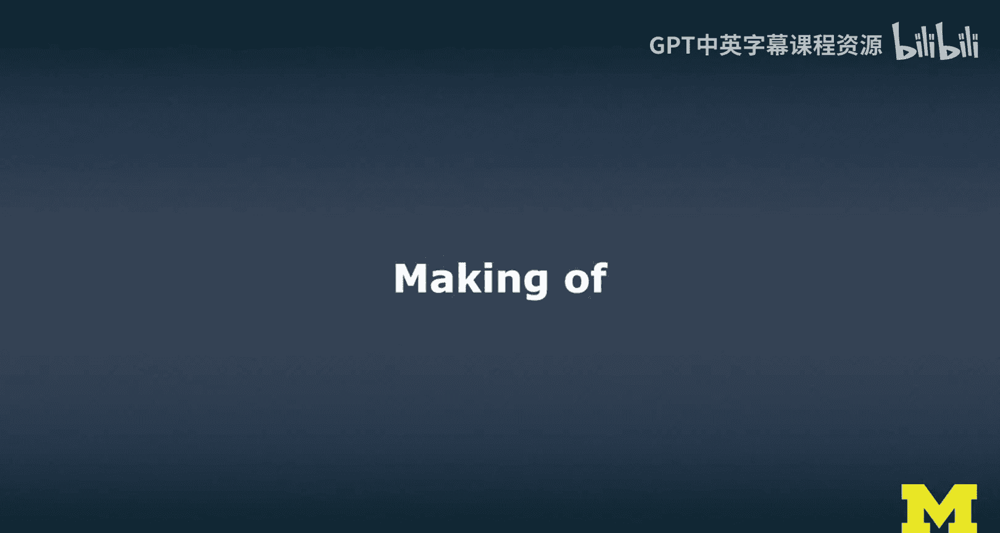

This is the making of the Xam MOoc。 So in this video I want to go a little bit behind the stage and I want to share a little bit how we have worked on this XamOC and specifically how was what my process was to actually capture all these demos and obviously I had to develop a lot of stuff myself So the Xam MOoc is really a larger set of MOocC。

 it's a specialization and MOoc specialization So it actually consists of three courses and what you see here is what we internally call the detailed outline so where we plan everything learning goals。

 how we structure the modules， a combination of videos， exercises， readings and so forth。

 then obviously course production wise I often started with filming a lot of the demos then I embedded them in lectures sometimes I did live demos during lectures but this can be。

Cedious for my production team is's not always clear whether a demo was the success or not。

 although my facial expressions usually tell interviews。

 we did a lot of interviews and we mixed them in。 And I worked on the exercises actually throughout。

 But really， at the end， when I had most of all this done。😊。

I was really shifting back to the exercises， finishing the exercises。

 actually doing these exercises myself， so I added an extra week and we were already tight on schedule。

 but I really wanted to do a lot of the exercises myself。

 recorded myself over multiple evenings and transformed the studio which is actually my study and I talk about this multiple times throughout this move so it's been quite crazy。

Collected a lot of and produced a lot of the readings。 So by readings。

 I actually mean a lot of the stuff that goes directly on Coursera。

 which is where this MOocC will launch and be hosted。

 So there's a lot of text and material to guide you through this specialization and then also the quizzes。

 and we had drafted each of these。 I would say we did like a horizontal prototype of each of these in the first three months but this has been a year of work and the final the final recordings here。

 I would say I spent three months， almost full time locked in thanks to Covid-19。

 You'd sort of say on all this。 So it's definitely been。A big， big effort。

 And while I'm gonna miss it， I'm also happy it's kind of done。

So what I want to do now is I want to look at a few of the sequences Ive probably put together too many and I'll tell you a little bit more about how we did them。

 So this is not so much about why they are there and what you can learn from them。

 This is really like I mean maybe a little bit of why I wanted it and why I wanted it to be done this way to communicate the materials better to our learners but the idea is to give you some inspiration for how you might be doing demos and recordings of those demos and even live demos using some of the techniques that I have well。

 more or less painfully figured out while I was working on this XO specialization。

 So I hope this is useful And so let's let's go in there and let's get started。

 So one of the first lectures is the what is XR lecture。 And we first did a very traditional studio。

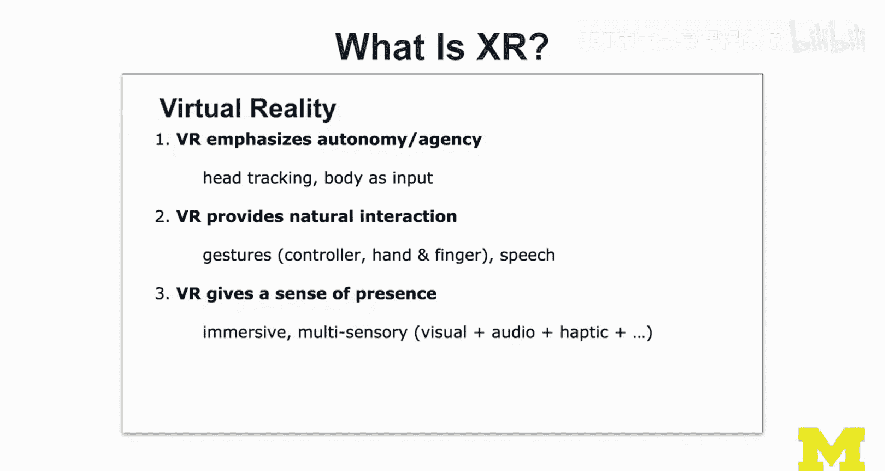

but I already attempted to bring in all these devices to show off a little bit how they work。

 to discuss the concepts。 I see me use the Oculus quest and was I would be talking about some of the fundamental differences in terms of tracking and how things work and VR versus AR。

 So that was really important。 So I thought it would be good to put on these headsets， for example。

 just bring the headsets with you and then also show differences between augmented reality and virtual reality。

 So we cut this nicely together in the in the studio at this time。

 we were actually still working in a film studio。 we still had a very professional setup。And。Yeah。

 I would do a mix of。Slides and then putting things on my head。 So in this case。

 I was still working with the Hollands。1。 we were waiting for the Hollands 2 for a long time。

 It finally came， and we were able to embed it in。😊。

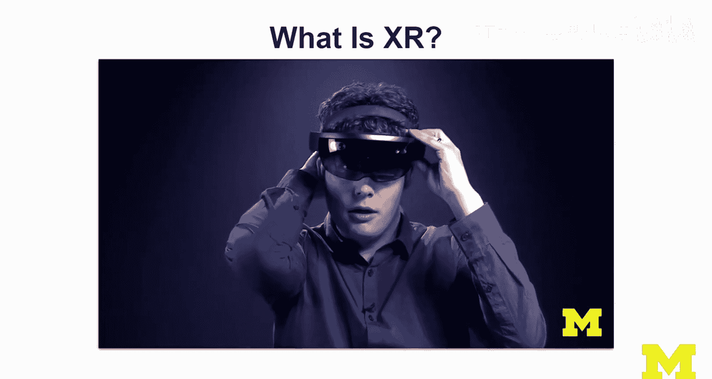

In the MOC， I actually created a few examples so that I can show off。

Things on the Hollands too I really like how we did some of these shots was very creative。

 and I thought it would be cool， so from time to time to show things behind the scenes。

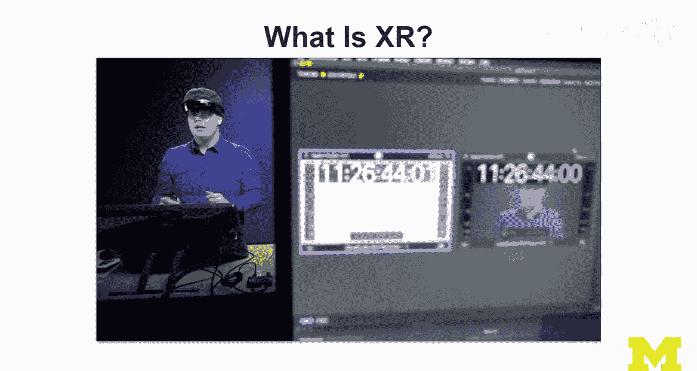

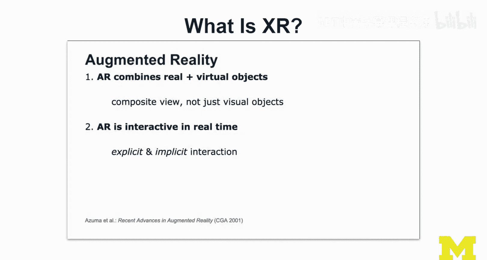

And then we did a few weeks later we felt like hey we should do this lecture again。

 I think we did it like three times or something， I don't know。

 this is one where we're using mixed capture after an extensive calibration process using live here so live on top of steam VR and then using the Os Rift and what happens is we do a composition of obviously me standing in this room and behind me is actually a green screen you can see that we fill in the virtual content and then I can sketch midair and this would be a great way for students I hope who are not in VR to still see。

And they don't have to do the mental stuff themselves。 We can do the composition。In this way。

 because we have the direct mapping of the virtual and the physical world。

 and you see it in a really like how it should be in augmented reality in a composite。

AVi the traditionally， I would。

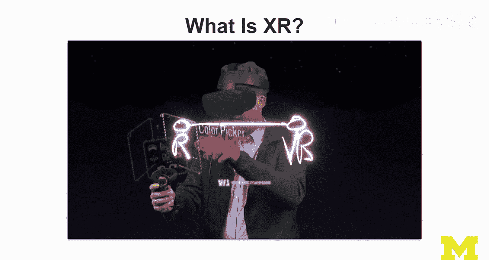

I would have a big screen behind me and I would show my first person view on something。

 so it's quite different from this calibrated camera view。 And I think this works really well。

 but we're looking for feedback from our learners。 This is how we did it。A green screen。

 and we calibrated this initially， so there's a little bit of setup。

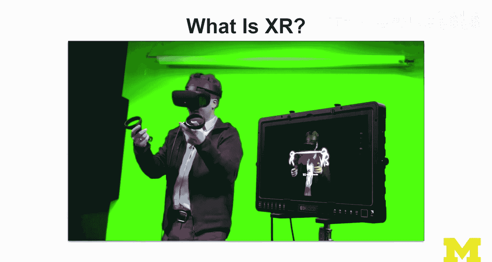

嗯。I did a lot of VR demos。 So here is me in virtual reality。 So I'm sitting in the play seat。

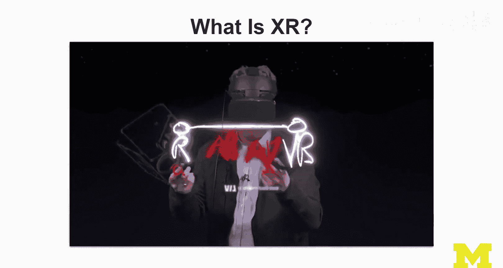

And。We are going in there。And now it was important to me that I， I get the。

The switches between the camera right so that I can show okay， a little bit of first person。

And hopefully its， it's okay for the viewers。 Obviously， I was moving a lot because it was。

Supposed to be immersive。 And I was using all the different angles to really。Hopefully。

 tell the viewers how the learners how this works and。

How the game works and what that experience is like for me and the 360 angle is to give a little bit more of an overview of the setup and really。

Feel like potentially for the learners to feel like they are there with me。

 It was really important to me。 The 360 camera placement is not ideal。But it's， it's not bad。

I was a bit limited with the lights and all that where I could put all this stuff。

So then here's one of the cool demos that I did。 This is not actually like the game before。

 This is not something I created。 This is an unreal experience mission AR。

And what was important to me here is how I。Don't just capture the whole thing， I jumped through it。

 so it's a longer story， but I wanted to have this good mix of first personson view where you do see a little bit of black on the edges。

 but that is it's a hollowlolen recording and that black is obviously transparent due to the display technology。

And it was very important to me that I can show some of this footage。 And from time to time。

 the learners will see how I go into， w， how I interact with the AR content。 Yeah。

 I mixed in some the whole thing was actually stream from my other computer to the computer。

That to the Holloland that I was using in a different room， it was an interesting setup。

 and then I was able to mix the unreal engine footage。So everything was running in the Un engine。

 And then through holographical moing， it was actually。Visible on the hos。

 So it was basically a remote rendering on the hos。And that's why you have these black。

So outlines around these objects。 sometimes it's very visible。

 And I try to make it a little bit nicer by showing， for example。

 this as the original unreal what what what happens in the engine。

 This is how I see it on the Holends。

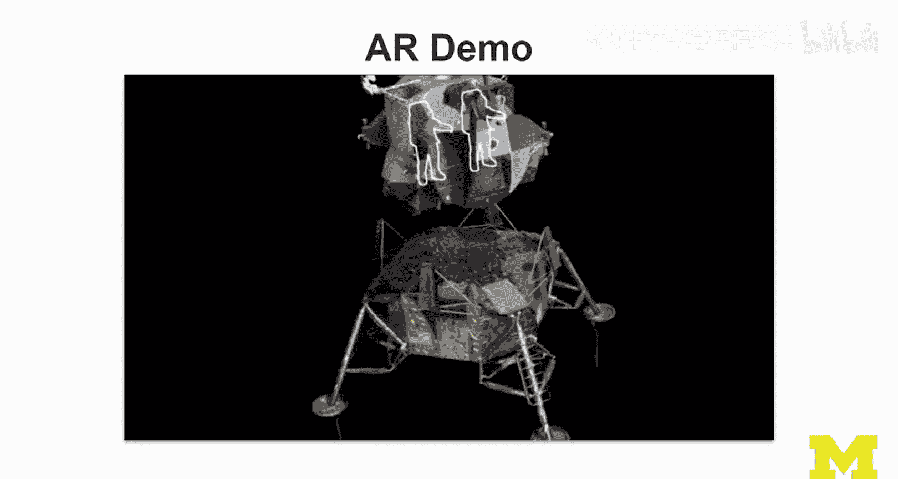

And then from time to time， now comes my favorite scene。Where Nil Armstrong actually comes out。

And you can， you can， you can。Have him come out so you can click this。

 And I wanted this interaction to happen。 There was a little bit of a tracking issue for a second。

 but I， I didn't change anything in post。 I just wanted it to be like that。

And then he comes out and I'll look at him。And I think during the recording for a few seconds。

 I actually forgot that I was recording this for the MOoc， it was just really cool。

 and here I played a little bit with image stabilization techniques。And zooming in。

 So a little bit of post production in Premiere Pro。For that chart so that I get that one right。

 But this is then just， again， Holloland footage。That I show。 And then after this shot。

I also wanted to show the learners a little bit like how you can like。Obviously。

 interact with this while I'm filming， I don't want to like do this all the time。 like go close。

 go back。 And I wanted to， I think my role as is more like the role of the cameraman here。

 So you want to be stable。 But then from time to time。

 I want to jump into the role of the user and a user would do this。 Like they would go much closer。

 They would play with this content much more。 but it is not the it is not the best way to communicate。

 I feel these kinds of experiences to learners。 And I wanted to end in the under engine that was really important to me。

 I hope that learners will make it to the end of this video to see this。😊。

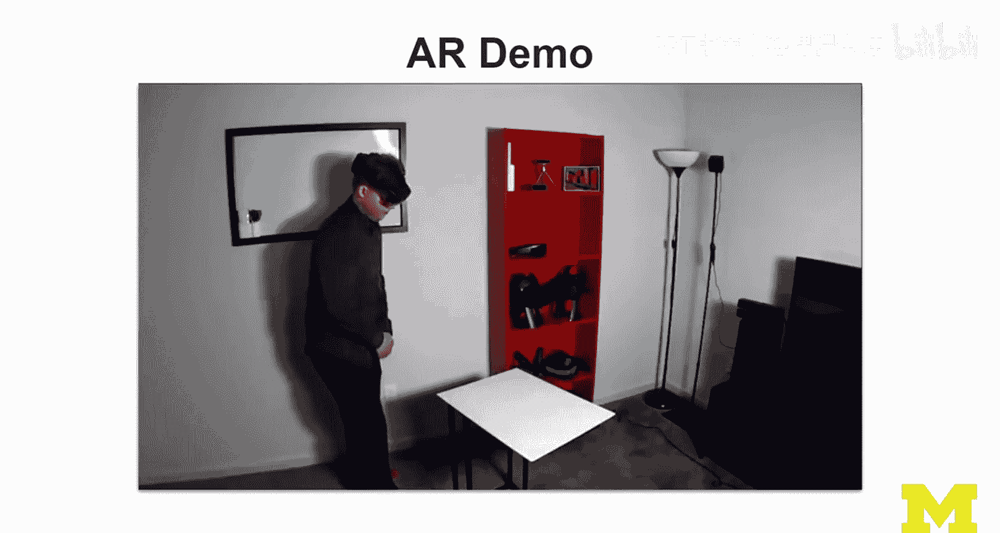

And how this was actually created through holographic remoteing stream from the Androidre Engine。

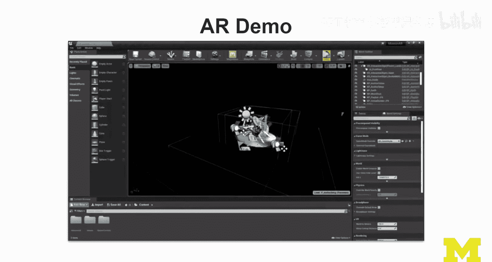

And that's pretty cool。And then throughout here， throughout the MOoc， there there will be lots of。

Videos and animations that I created in Google Slides。

 everything is created in Google Slides and so that I can also use it in classes。

Here illustrate how the field of view works and what you actually see on holiday lenss。

 given the small degrees of freedom that you have。 sorry， the field of you in terms of 35 degrees。

You do have 60 degrees of freedom。 So that is obviously cool。

And the photo that you see here is actually a trace done by one of my students helping me with the course design as a course design assistant。

 Kara Daly， she took one of the photos。That we shot earlier with me in the Hol。 So that actually。

 that face is actually me， believe it or not。诶。Yeah， I know， I know it is， it is weird。 Anyway。

 it is also fun to reveal that a little bit。 this is the making of so I should tell you some of these things。

 shouldn't I。😊，This lecture。I thought I mixed things up a little bit。

 so I got my glasses and a beard。But that beard was obviously not grown。 It wasn't real。

 It was supposed to be a lecture on key issues。 And then。The glasses are real。

 So I wanted to reveal this， obviously。 And then I thought， hey。

I need to use the snap camera to put a lens there， and then dis able。Disable this。

And here is a very different shot where I was doing a composition I was actually I spent this additional week。

 as I said， to do all the exercises in the second course to do this welcome to the Ho track I wanted。

I wanted to see what if I did all the steps myself。

 how long would it take me would my students learn something， I think they would。

 I tried this video out just recently in my residential course and I asked the students if they had to remove some of the steps which ones do they think are not so critical and which ones are the most critical steps and obviously I show off a little bit of the 360 techniques that I was working on in my research and would be important to me that people tried this out also several practitioners have already adopted these techniques I do want to I did want to show the whole process。

 all the steps actually still storyboarding even in Vr here using Google Tithbrush it was important to me。

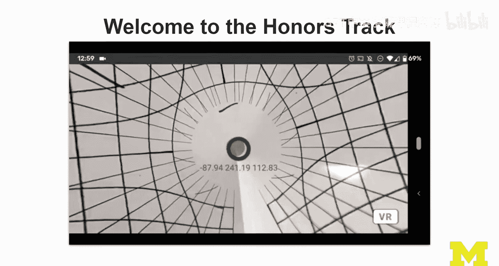

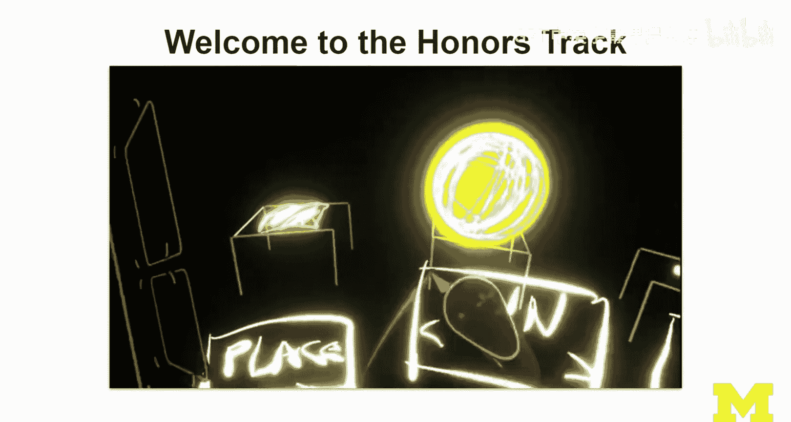

that I show the variety of tools， not just one tool。

 and then as you can see from time to time I go in and out to show a little bit， okay。

 this is what happens in virtual reality and then this is what happens what Michael does in what I do in the study。

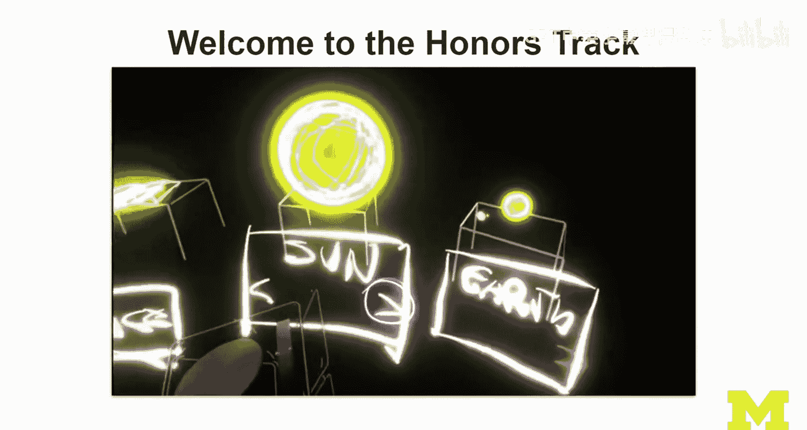

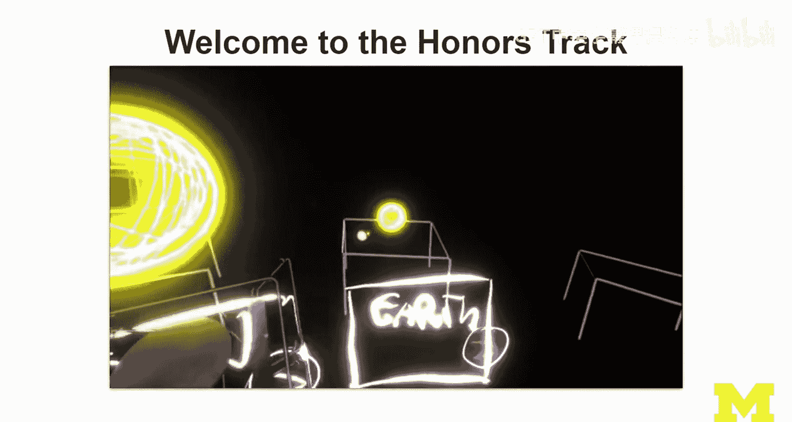

So as we were filming this， and I did a little bit of time laps here and there to。

S thingss this is actually one of my favorite videos， this was one week of work。

And it's actually pretty long It' five minutes。 There's too much stuff in there。 Anyway。

 I wanted it to be， to feel like， okay， I， the learners should build the confidence that they can do this and also learn from this experience。

 And the fact that my sketches， like this sun here actually looks like ice cream。

Rather than anything super professional。 that was， that was， I think。

 a funny but useful side effect because if everything looked like this。

These are actually cutouts from paper then maybe and I asked students to sketch like this。

 then maybe that would be a little bit intimidating and here you can see me。

We're going into the physical prototypehping stage now， we're doing clay modeling here。

 which is something that I explore my research that I strongly believe in leading up to a diorama。

And yeah， so I think it's also a little bit of fun。

 And then I actually take these things and do AR compositions with them。

 really taking into this diorama stage and then mixing and merg。 So this。

 I have recorded with software that I created myself。😊。

And with some support from another student that didn an independent study with me， Sda Rajaram。

And we wanted to improve my proto AR and 360 pro camera and capturecha tools。

 So they were previously developed by me in research。

 but then I wanted to refine them a little bit with students。 And。

 And we also used obviously professional tools like。

reality composer from Apple and also Adobe Arrow This one is a cool shot we did。

 I just put a GoPro on and then we were in the academic innovations in one of their labs and I'm showing off one of the prototypes on my iPad here。

And I wanted to basically show this 360 prototype we just saw on paper。

 I wanted to show what that experience looks like， so in the evaluating XR experiences lecture this is where you can see this and hear me talk about how this is valuable and what the kind of testing we can do with these materials and so GoProshot。

So here I'm doing， we are now in the third course and I'm talking about first steps。

 so we are going towards the end now。I do have a few shots in there that I thought I wanted to discuss。

 So this is on screen capture and then using O B， S。 So streamnabs O B S to live switch。

 So this is live。 This is not no post production。 This video is not edited yet。I do all this。

 Just live A。Using multiple cameras。 but I don't even do the composition。

 So for me to switch from the screen capture to the GoPro for that we have to do editing。

 I cannot the GoPro using GoPro as a webcam just came out and I wanted to try it out。

 but I won't be able to fit it into the into the MOoc。 But at some stage， I was， I think right now。

 I have。

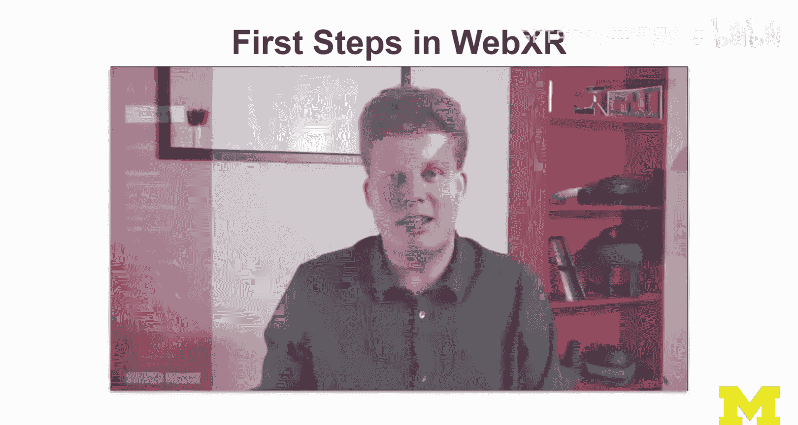

4 cameras connected， four virtual cameras， Logitech。Which is update， I mean。

 I can actually switch there now。I can switch to the camera， so you see me there。

 can switch to the on screen recording。This one is currently not set up。

 but I can get it in a second， and then I have a game capture and a snap camera。

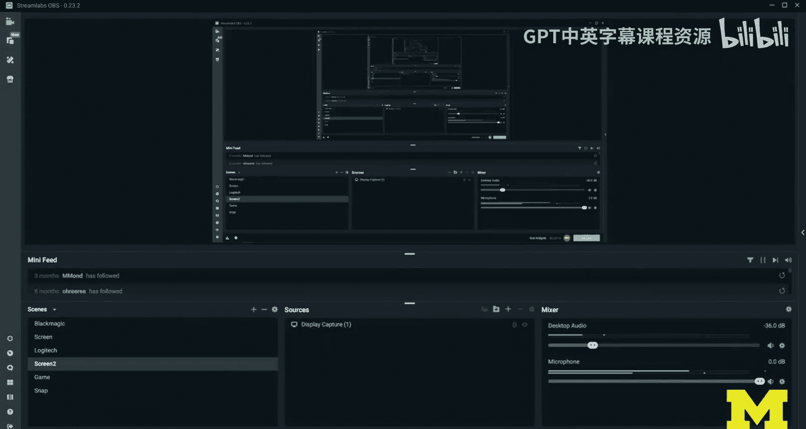

And so all this is done kind of in life。 And I'm just gonna start the。Logitech capture here。

 So you see。Camera， this one here。 Okay， and I used that a lot for like any kind of marker based AR。

 So then I share the camera with a browser。Yes， we're gonna access the camera。 There is the camera。

 I bring up the marker and we have A working so I can do live things and I。I。

 I think this adds a lot to the learner's experience， but。

Requires that you set up all these projects beforehand and actually then。

Mix it And often I did demos before then I did voice over to these demos so I can share these materials with my students in my residential courses and then I did I embedded these videos into my lectures and then I did another voice over over those。

 I worked on a lot of concept projects。 So lots of little aframe projects like this one here to explain ray casting and hit testing。

And I recorded this from three different perspectives and then I put it together。

 but it's all recorded through a VR headset I'm actually using the acuism mirror here。

 and I'm configuring it so that it's just showing what one of the ISCs the left eye and made everything white in the background the controllers to be visible。

 only use a few colors and then guide learners so that they understand。The concepts。

 and I thought this I like those videos。 I obviously implemented lots of examples just to support the teaching。

And those are actually available as Code pen projects， so yeah， I mean。

 you could show this off in your own classes if you wanted to and maybe acknowledge this work here。

A lot of technical demos， and I'm going to go full screen here because this one needs it。

This is one of the AR core demos。 and I'm showing some of the latest features here。

 depth lab was just had just come out。 It was actually a paper we discussed at。Wist。

 the WIS conference， great paper， actually。 And so this is the related tools stack that is now being available。

 be made available。To unity developers on top of the Air core platform。

 what I show here is actually how depth。Work， depth sensing based on software based A。

 So just using A core。 this is not Google To。 There has no depth camera on this phone。

 It's just RGB camera doing triangization using bio。 It's a visual inertial oometry。

And then these heat maps just always look so cool that I really wanted to show。

 and then I had recorded onscreen so which I show here on the left and then I just imposed。

 I just composed them and had a time seeing them this is the GoPro recording and I thought it's good for learners to see because they cannot always see directly what's on the screen to have this close up view here on the left I do this a lot then I kept this as a consistent style。

 So a lot of examples with the latest technology， the iPad fourth generation the iPad Pro with LiDar and the Hollands2 as that you can see up there they came out and I wanted to really use both in the MOOC。

 we only had one iPad。 So we were also doing a research project on the iPad。 So Schta again。

 my student prepared a demo that is one of the Apple demos here and just for one day I just borrowed the iPad from her and gave it back to her the next day so that she can continue doing the research。

And。This is a cooler the demo where you can see the Liar scan。

 the mesh and the background and then the classification on top of it。

 and that is it's important to show these things and to show them live， I think。

 and then again captured with the GoPro and then showing all the things where it works and where it doesn't work。

That's why I， I mean， for example， the glass table here is a lot of objects in my study that are not great for AR and trackingre like the glass table。

 any kind of black surfaces。Some not so well lit areas。

 lots of objects that nobody knows what they are because they are future generation technologies。

 if you will。 And so obviously， doesn't get a lot of the things right。 And here， Macs AR。

 So I set up with a stand in this study。 And I show occlusion here。 So and really。

 it was hard for me to gauge。 I it actually working。 So I did it three times。

 I think because I wanted the learners to have the good view and have the composition of physical。

 So the top part。 And then what the iPad produces as I go through this virtual v。

 And then at some stage， obviously my hand should be occluing the virtual object。 And it did work。

 And so it wasn't okay。 It was a success。嗯。Finally， going more towards He from handhel to head1 AR。

 So you build a demo using mixed reality toolkit is's actually a toolkit that I really enjoy working with。

 and I have good connections to the developers， Julia Schwartz and Sot Delmark。

And they also visited my course， my residential course well remotely， but it's great。 Anyway。

 so I built this demo。 which shows a couple of things。

 It's a on screen recording from the Hollands with a little bit from now。

 and then I'm going to the outside。 So it was a combination of GoPro。And the Hoolans app shows the。

 the mesh。 and I enabled physics。 And then I can start playing in the studio。 It's actually。

 whileow this's conceptual and not too fancy。 This is one of my favorite movies。

Because obviously I created the software myself， I guess I mean， I was using the mixed they took it。

 but it does show a lot of their concepts。So here's an example of an advanced techniques lecture showing a lot of the slides that I edited。

 this is an all Nier。Because I put together all these different techniques that I always wanted to explain I never found good explanations。

 redirective walking， procedure generation， object tracking， 3D reconstruction。

 so registration and tracking is what I show here so we do object recognition first。😊。

For which there are libraries that are actually out of scope。 so a lot of the did I did show body ps。

 I did show PoNe， but I didn't show PosNe， but'm。Media pipe。

 I'm obviously familiar with a lot of these tracking libraries。

 but somewhere you had to do of the line， right， And so I'll show conceptually at least how registration and tracking works。

 how object recognition works。You can work with macros and Winhorria。

 we can set up model tracking in Wihorria， and so you could probably get this pedal to work。

In any case， I just wanted to show that a lot of the lectures are visual without demos。

 they're just like slide compositions and tedious animations in Google slides。

 but I think they're actually quite effective and I'm actually proud of them。

And then from time to time I mixed in some research。

 So here is a whole research project that we implemented like this idea of presenting a research paper。

 but not presenting it as a paper I thought was fascinating to me So when I did the X research lecture。

I was just thinking I would give a lecture like how to do research and whatnot。

 but then I was thinking， no no， that's probably not as relevant to a lot of the learners out there。

 It's probably better to take a user research approach more rather than academic research approach and then show all the prototypes。

 how we build the markers。 You can see the Tshirs here。

 This is the final version of the marker design。How the demos work。

 how our pilot tests worked when we brought in the the a bunch of testers， so actually students。

How some of our visualization techniques work。 So this is actually some of the core part of the research。

 but you can explain it so that because it is a lot of my research is very practical and this would actually hopefully speak to practitioners like this idea of interaction tracking and that you can actually。

You can actually， you know， analyze sessions， record sessions in mixed reality。

With some of our tools， and。And he was our user study and it's cool because it shows it includes a think aloud and yeah I thought this is a cool lecture and it works pretty well and hope that learners out there appreciate that I built in some of the research it's obviously important to me。

 that's my job。 I do research。 I'm only like I don't know， 30% teaching or something。

 the majority of my work is obviously research So。😊，This is my long making of。

 but I'm going to close by just going over the film sets that we used and some of the equipment。

So I'll just show everything。 So initially we started out in the lecture studio。

 So that is with academic innovation at the University of Michigan， has like a nice setup。

 They have all kinds of displays， clearearboard as well。

 light boards even we just used the wake pen and touch display most of the time。

 all in one capture solution that they have set up nicely from time to time we moved to a green screen studio。

 That's why we did a mixed reality capture stuff using my lab equipment。

 So the O Ri S moved my computer over into the lab of academic innovation and we collaborate on that Nex and I had a lot of fun like two days of filming that way。

Everything else， and I would say 90% of what you see in this course was recorded by me alone at home in my study with lona equipment。

 so don't come here and think you will find all this。

 This is lona equipment from University of Michigan。So I was using a portable Home studio。

 which is a solution that academic innovation came up with and that uses a relatively professional camera that is this one。

 this is the Sony Nx30 U。That's the one。m usinging a GoPro so that would be you but we need to mix in this later so youre the GoPro and you're just one of two my other one is somewhere else I don awareness I was lying over there and yeah I have a lot of equipment just like here。

Around the study I can show and I'm definitely going to mix in one video of my bunny because I promised to the team I would do this。

And I'll also show a little bit of the messy setup here。And。I was using Rico Theta V。

 so that's this one here for a lot of the recording for a lot of， I mean， I used it a few times。

 so 360 capture。Academic innovation in Alex they have much cooler 360 cameras。

 but this is the one I can use at home and this is not too expensive and you can if you wanted to use it in the way I used it to show off a little bit more immersive early and closer bring content closer to your learners。

 I think that would be the way to go just don't put it like in the middle so follow some best practices with how to position a 360 camera which is more like somebody seeing next to you that would be a good position that's what I tried and I was like driving and things like that so。

Don't think 360， you need to put it really in the middle or something。 So there are some tips here。

 obviously using all these devices that are in the background。

 And then I put them up here next to me so I can grab them。 So Hollands to my。

My latest and in many ways， also the greatest device that I have， obviously quite expensive。

Bough two of them， and I was able to show one of them in the MO。

 and then we did research in another one， so 20 and2 for now。We have like 7 Hollens1。

 They were all donated from Microsoft。 That was really great。

 But the latest ones I had to buy Ocus Rift is。 So if you feel like。😊，I mean。

 I could have benefited from more support just to be clear industry， if you watched this。

 you could have helped made things a little easier on my research budget， but I'm fine。

 I'm doing okay。 so don't worry， and this is the O as rift as and then obviously cardboard Hollow Ki。

 the pocket 360 as this guy oops。😊，This guy here。I just think it's cool。 I always take it to classes。

 I always have it my backpack when I teach residentially and then phone goes in there。嗯。就。

And then I can do a little bit of。VR and AR on the go without walking around with all the expensive things。

 And this is less than $15。 So you could buy this and even buy this for your students。

 So just very quickly， I used OS for video capture， screen capture。

 actually streamreamlas ObS and OS studio。 I used AZ screen recorder on the smartphone。

 I used sidequest Oculus link Oculus mirror to get some of the Ocus Que footage together and then Ocus Mi。

 I used to both the quest and the rift S Steam Vr live mixedcast for mixed reality capture。

 I used Snapchat camera for the funny key issues lecture。 we used Zoom obviously for our interviews。

 I did do a lot of pre-production as I said initially I would normally do videos and demos first and embed them in my lecture。

 So I got better with Adobe Premier Pro I did even 360 cutting， which I hadn't done before。

 so that was fun。I did a lot of immersive authoring in tothbrushqui blocks， medium，arrow。

 reality composer。 These are the ones that made it。 I considered additional tools。

 and gravity sketch we have， for example， but I didn't show it。 It costs money。

 and I thought it's not。No， Im not actually very good with it。

 I didn't even show quill in the end I thing because I sucked it， but I did try it out before。

 Anyway， I did love development myself。 Obviously， in a frame， code penage， Chrome Firefox Unity。

 Unreal lens studio before Fouria studio， although before Fouria studio part was like one minute to be honest。

 the majority of work is done in a frame and unity。 And then using。

 obviously all the browser stuff here。 I did play a little bit of games。

 So my third ready one was cool， half life to show。 And then I must say。😊。

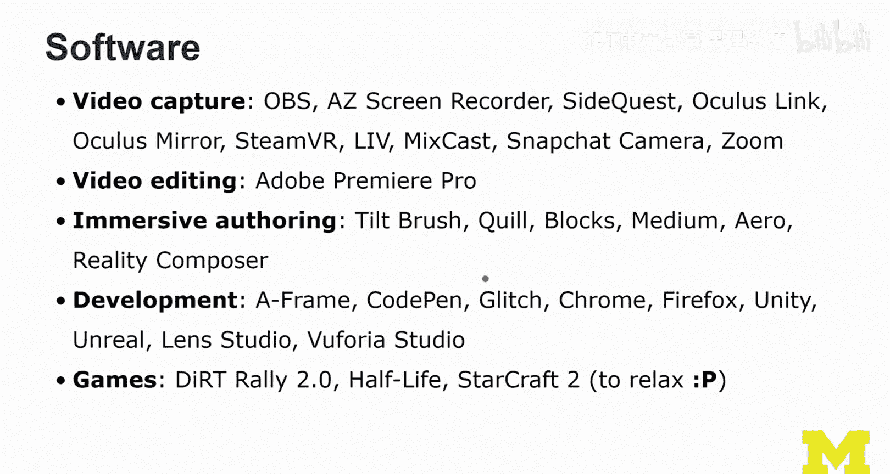

From time to time， I needed a break and I played Starcraft too， where I became a master again。

 finally。And that was good。 So I say to relax， but actually。😊。

It was to do a little bit of competitive stuff as well。I wanted to， actually。

 I wanted to thank a lot of people。 And what I'm going to do is I'm just going to end here and。

Show my acknowledgecments。It's a little bit of upset。 I'm sure in the video。 Oh。

 you're looking at the cube。 let me take it。Put it there。So I'm sure that not too far in the future。

We would be able to interact seamlessly。Between the physical。The living world and。

The butel that you can see here on the left。And so this is just doing me a favor because people wanted to see the bunny。

 that one and only Bny that knows everything about XR now。She heard everything。Okay， so。嗯。

