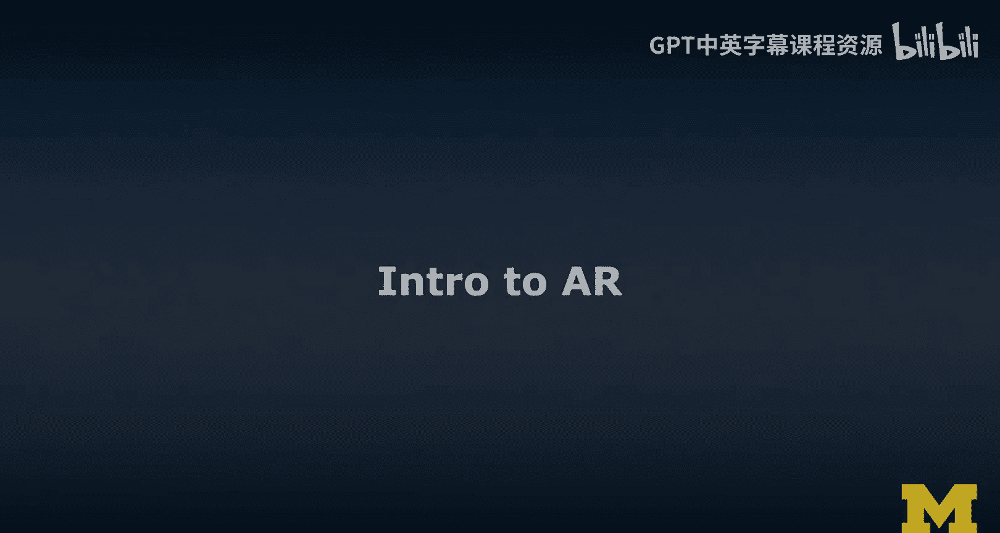
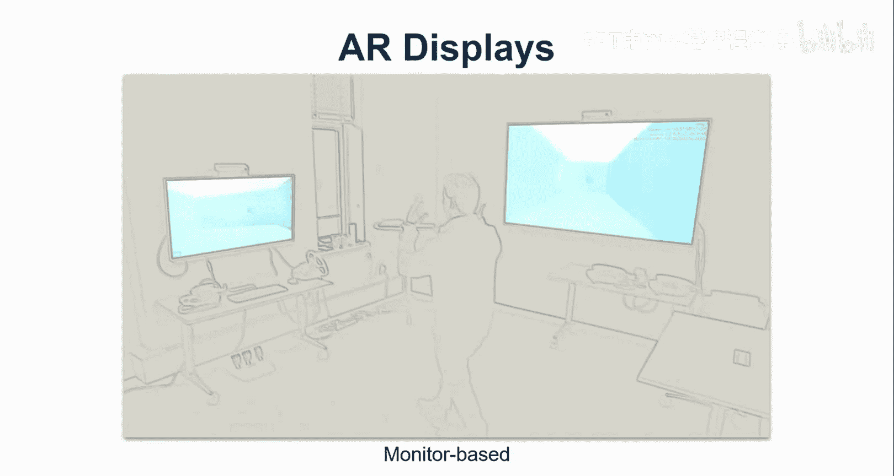

# 密歇根大学《面向所有人的扩展现实（介绍⧸设计⧸开发）｜Extended Reality for Everybody Specialization》中英字幕 p13 12_增强现实导论.zh_en -BV1jM4m1k73q_p13-

In this segment， we're going to talk about the key concepts of augmented reality。

 I've done a similar version of this four concepts about virtual reality and now we are looking more specifically into concepts to do with augmented reality I'll actually show an example scene here on the Hollens too this is the hand interactions example that they have and it's actually really quite cool and you know a lot of things are going on in such an example so I can grab things。

 I have hand tracking I can。😊，Track multiple hands。 I can implement gestures。 I can resize objects。

 I can use。You know， kind of like what you know from the phone is pinch to scale or zoom。

You can do these things in AR with your hands。Here I'm playing the piano with a little bit of relatively。

Good finger tracking， so not just hand tracking， but actually fully articulated finger tracking。

 although the small finger here causes some issues。

This is an example of really going through a scene full with widgets and things to play around that implement different kind of。

Behaviors， most important thing is obviously how I'm experiencing this content in the revolt。

 It's placed。 It's anchored。 It's like stable。 It is there。 I'm using a augmented reality headset。

 The Holloenss， too， It is like on my head。And I'm experiencing this merged view of the。

Virtual content。 There is kind of like an overlay onto the real world。 It's a composite view。

 And this is really also some of the key definitions of augmented reality。

So here I'm using a similar structure to this same type of information on virtual reality。

 So we're going to start with the five Ws， you know the who， what， why and so on。

 but in this case specific to AR， we're going to talk about the key concepts。

 what makes something AR augmented reality。So there are some key characteristics。

 We're going to learn about technologies and we see lots of demos throughout。

 I also have a video focused on technologies that is really separate from these concepts and more dedicated to demonstrating how these concepts are implemented in current technologies。

So I think of this content here as like the primer two AR and before we actually jump into the technologies。

 it's important to get a sense of you know what augmented reality is really about and what are some of the key concepts because frankly。

 the technology doesn't always live up to some of these concepts and so it's important to separate those two concepts and technologies are really the implementation of these concepts。

So here's the five ws for AR， the who， the what， the when， the where and the why， who interestingly。

 is similar to some of the Vr who's in this space。 I do mention Google and Microsoft again。

 but Apple and magic leap are like to different companies here。

 And so Google obviously had Google Glass。 And Glass was like really created a lot of hype around augmented reality。

 Although technically if you really go strictly by the definitions by the key characteristics of A。

 Google Glas is actually not really AR， it's just it's like a heads up display。

 just like a little a little projector in front of your eyes。😊。

But it doesn't the content is not really like part of the real world。

 It's more like an overlay and information overlay。 So it is very， a very weak form of AR。

 I'm gonna talk about that concept of weak AR as well。 Then obviously。

 some of the latest examples are A kit and A core or smartphones from Apple and Google。

 And then Hollands 1 and 2 from Microsoft。 This is at the time of the recording。

And the magic leap1 was still around。So。When you asked me when did this whole AR thing actually start。

 Well， I would say there was a really early start then nothing。 and then this like wave of things。

 Sudden it's everywhere。 So one of the very first experiences was the sort of demo 1968。

 kind of like heads up displayed， it had to be mounted really to the ceiling。

 So was not head mounted was ceilinging mounted in many ways like this submarine periiscope kind of thing。

 and well， then many， many， many years later in 2013， Google Glas came out。

 And it was really a hype around AR is gonna going to be revolutionizing everything。

 And as I said Google Glass is technically in many ways not really AR。

 it doesn't abide by all the definitions and the characteristics。 but， let's just say it was。😊。

And Hollands one， I think， was really another。And I would say。On the and I would say on the headsets。

 space Hollens1 is definitely interesting and key example here when it comes to AR。

 And now the Hollands 2 is even more advanced。 and well talk a little bit about some of the differences as well。

 And then in 2017， we suddenly saw like make AR making it to our smartphones。

 And there was this idea that。😊，The vendors are using our smartphones to figure out all the kinds of issues with tracking and display perception。

 So， for example， that virtual content should be occluded if it is occluded by a real physical object or a human。

 and this is something that is only now being available in 2000 and 192020 its people occlusion with AirK 3。

5 is finally there。 And so on the smartphones。 And so there was this idea that the main vendors and the key players in the space are using the smartphone。

Platform to figure out and iron out all these issues and then really make it to their headsets and maybe wearable and always on AR is going to happen once we have figured out all kinds of issues。

 including obviously， the display technology and battery， for example。

So when you ask me where is AR well， it used to be just in research labs。

 you could come visit Michigan and I would show you some AR things。

 but now it's actually really in your pocket if your smartphone happens to be capable of AR core and AR kit running those kinds of platforms。

And it also used to be just an enterprise context now enterprise contexts are being retargeted for business business opportunities。

 so MagLiap the company is now targeting the enterprise context just like Holloends and Microsoft has done before there's still not a lot of consumers that actually have access to AR headsets。

 I would say it's predominantly the smartphones， but I would say now it's also with the consumers。

Why I think there are some really cool opportunities that when it comes to different kinds of domains like。

 for example， education， when you blend the real and the virtual content and do it in a way so that like the real content and the virtual content they feel to be part of the same world I think that's when it really becomes a very effective experience so I said Googlelass is not really augmented reality and I often do this to you know have an interesting discussion around it and have my students figure it out。

 so I give you the definition by the book augmented reality。

 we said it's combining real and virtual content， it's a composite view， not just visual objects。

 I always say that although the paper in which this is based it's a literature review from a Zoom at or 1990s 1997 so really a long time ago and they mostly talked about visual content but I just say not just visual objects here it's interactive in real time。

This interaction， don't think of it as like you can click and talk not that kind of interaction。

 but actually as the rendering is interactive in real time。

 you're looking around so the implicit part of the interaction that works and obviously the expert interaction is also supported like you clicking things。

 but originally it's interactive and real time really meant it's like real time graphics overlay on the real world。

 it's according to the right perspective， which means we have to figure out your pose the pose so orientation and position of the headset relative to the real world。

😊，And it's registered in 3D， and so this means it really is able to determine when a new 3D objects comes in。

 we can place it in the world and it'll be aligned and it'll be appear， it's like anchored， fixed。

 it'll be rendered according to where it is in the physical world and this is called registration。So。

 these are the。3 key characteristics。 Now Google Glass obviously fails to meet which one。 Well。

 the registration in 3D， it is really just a heads up display。

 the content that it displays to you is not anchored in in the real world。

 It doesn't actually it's oftentimes it's not 3D even the content itself。

 And so so think about it that way。So in my mind， key characteristic of AR is really blending of environments。

 both the physical and the virtual world。 I can actually see those virtual objects as if they were part of the physical world。

 that is also my my understanding of。The registration。

 so I think of registration as hologram illusion。And for VR， I said， in my mind。

 VR has to do with an immersive task for AR， in my mind， it's about an information task。

 so the key thing is not immersion。 the key thing is actually giving me access to virtual information。

 virtual objects that really are placed in an intuitive and a meaningful way with will。😊。

So me looking at some kind of virtual content that has no relationship to the real world is not a good use of AR。

 and I would discourage from those kinds of experiences。

 There really has to be a connection to the real world。

 Otherwise we might as well do it in VR or just as a 3D interfaceFs on a screen。

 So that's something to think about。So next， let's quickly talk about AR displays。 So for VR。

 we had the head monitor display， and we had this idea of the cave。 and for AR。

 we have a few more options。 So we can have a headwar display， like the Ho lens too。

 we can have a spatial or projective display。 So really this is like projectors projecting into the world。

 and usually some kind of camera， or sensor tracking you to render the virtual content according to your perspective。

😊，It gives you like this 3D effect， this illusion， this depth illusion。

And the parallax and all those things have come with it according to your distance。To the content。

We can have handheld AR， so that's smartphone based we can have monitorto based ARs。

 but this is more than just looking at a desktop screen that is 3D。

 It actually registers you and your location， your pose relative to the screen and actually changes the rendering on the screen accordingly。

 I'll show you some of these I'll show you examples of each of these。😊，So in the next video。

 we're gonna to look at a quick example from our XDAR project。

 which has really focused on bridging multiple AR display technologies。

 you will see a user wearing a Hollens you will see a user playing with a connect based projection based we call this procam setup projector and camera so the connect here is the camera So let's look at the first three AR displays I just mentioned so in the following you will see a video of three of my former students playing kind of like a laser shooting game inspired from Rob array but using three different kinds of AR displays。

 So you will see one student is wearing the Hollolens So it's a headw display another student is playing with a room or live setup So this is actually a proca or projector and camera set up with projection mapping So lots of things coming together that I'll explain a little bit more in the technologies parts as well。

As a form of spatial augmented reality， so she's not wearing anything the content is rendered according to her perspective and then we see a smartphone user at the time actually using Google To。

 a platform that has now been superseded by AR Co。So let's look at this example video。

 There's quite a number of things going on。 you see again a Hollands user more or less in the middle on the left。

 we see the student with the projector and connect setup looking at the projection on the wall。

And you see inlays of what the Hollands users sees on the left。

 you obviously see the projection on the wall， but it's not according to your perspective。

 It's rendered according to her perspective。 And then on the right。

 you see a Google To user is basically a form of smartphone based AR。

And so now they can play together， it's networked， but the point here is to illustrate these three AR displays。

Let's quickly focus on just the projection the program setup。

 the projection and the camera setup up here， the camera has a K， which can do skeletal tracking。

 I'll give you a demo of this data It's really quite cool。

 And that way we can figure out basically your posese relative to the projector and then we can do the projection accordingly。

So now I'm going to show you the fourth type of error display， which is monitor based。

 but keep in mind， it still has to you know follow the key definitions， the key characteristics。

 So all three have to go on。 It has to be sub merging of the real and the virtual world it has to be interactive in real time and it has to be registered in 3D。

So I call this example AR mirrors。 This is really what it is。

 Each of these displays that you see here on the wall。

 This is in my lab and early days of my lab is accompanied by a connect mountain on top。

 And that connect tracks me。 And then I can actually render a 3D model of the lab。

 according to my well position。😊，And orientation towards the display。

This actually mimics the effect that it happens when you look into a mirror。 I mean。

 you looking around the mirror like this， you would see more or less of the room behind you。

 and that is exactly the kind of experience I wanted to create in this AR mirror examples。

 Now the cool thing about monitor-based AR is that I don't actually have to wear anything。

 but I have to look at this screen and that screen kind of like has to well show a version of me in this case。

 there was a green ball。 if you notice it was my head。

 I wasn't really done with this research project at the time of the recording。

Obviously with thick connect， we can render a full scale and I'll show you some of these things later。

 but so monitor based AR is also quite an interesting way。

 The most common way to experience AR for us is on a smartphone these days。

 or if you have access to one of these guys behind me the Holen one or two or magic leap。

 which I actually don't have here。

