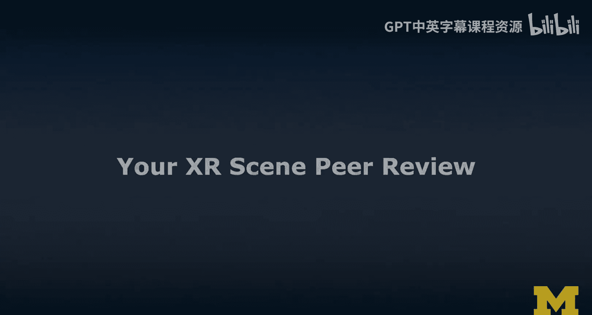
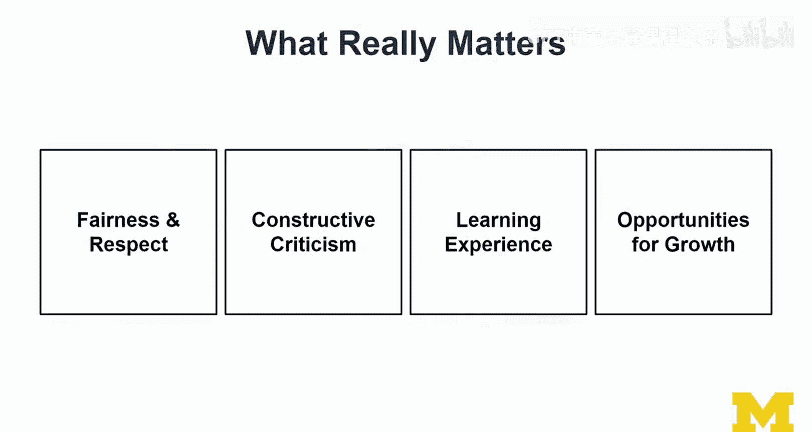
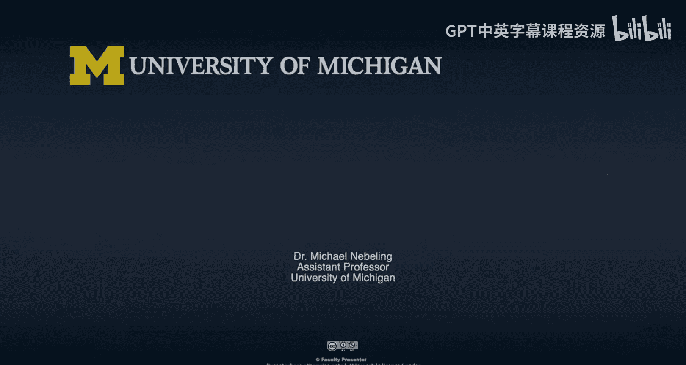

# 面向所有人的扩展现实：第47章：XR场景同行评审 👥

在本节课中，我们将学习如何进行XR场景的同行评审。这是“诚实路径”的最终任务，意味着你已经完成了3D、VR和AR场景的创建。我们将探讨如何以建设性的方式评审彼此的作品，并从中学习。

---

## 概述

同行评审是一个相互学习和提供反馈的过程。你已经完成了三个核心场景的构建，现在需要评审其他学习者的作品。这个过程旨在创造一个舒适、积极的学习环境，通过建设性的反馈帮助彼此成长。

---

## 评审环境与心态

上一节我们介绍了课程概述，本节中我们来看看评审时应有的心态和环境。

评审应该在一个建设性的、舒适的学习环境中进行。请务必友善对待彼此。提供批评和反馈是可以的，但目标应该是提供有帮助的、建设性的意见。

如果某个功能无法运行，直接指责“它不工作”没有帮助。更有价值的反馈是告诉对方你是如何让它成功运行的。请将同行评审视为一个互相帮助的机会。

---

## 评审任务内容

现在，我们来具体看看评审任务包含哪些内容。

你的任务是评审提交的XR原型。这些提交物通常包括描述、图片和视频，而不是代码。虽然有些学习者可能会粘贴代码，但评审重点应放在文本描述以及证明项目进展的图片和视频证据上。

提交不完整的材料通常不是一个好主意，因为这可能只会带来负面反馈。我们的目标是从彼此的开发过程和遇到的挑战中学习。

你需要对同伴产生同理心。他们可能面临技术限制，或者无法使用你所拥有的先进设备。

---

## 评审写作模板：我喜欢/我希望/如果…会怎样

以下是撰写评审时推荐使用的模板，它能帮助你组织建设性的反馈。

这个模板以积极肯定开始，然后提出改进的希望，最后给出具体的建议。这是一种在设计类课程中常用的标准方法。

*   **我喜欢…**：从积极的一面开始。指出作品中你欣赏或认为成功的部分。
*   **我希望…**：提出一个合理的、客观的改进机会。避免主观偏好（例如“我希望它是蓝色的，因为我喜欢蓝色”）。
*   **如果…会怎样**：提供具体的建议，说明如何实现上述改进。例如，如果涉及颜色，可以说明在Unity编辑器中创建和修改材质的步骤。

使用这个模板可以设定正确的基调，确保反馈是建设性的。

---

## 评审焦点与学习目标

在开始评审具体作品前，了解应该关注哪些方面以及我们能学到什么非常重要。

你应该主要关注VR和AR场景，当然3D场景也值得考虑。评审时，可以结合从本课程第二门课（如果学过）中学到的用户体验知识，提供更全面的反馈。

你应该评审**2到3个**原型（具体数量请以最终任务说明为准）。评审过多或过少都不太合适。

通过这个过程，预期你将获得以下成果：
1.  对如何创建XR（VR和AR）场景有更全面的了解。
2.  了解不同平台（如Unity、Unreal、WebXR/A-Frame）开发的共性与差异。
3.  学习他人的开发方法、解决方案和问题解决技巧。

---

## 评审时需要关注的具体方面

上一节我们明确了学习目标，本节中我们来看看评审时需要考察的具体维度。

在评审时，请关注以下几个方面：

*   **体验类型**：这是3D、VR还是AR场景？观察同一创意在不同媒介（3D -> VR -> AR）下的演变会非常有趣。
*   **平台与工具**：作品是使用WebXR、Unity还是Unreal创建的？注意你对该平台的经验。
*   **提交材料**：仔细阅读所有文字描述、查看截图和视频。
*   **方法运用**：关注创作者如何使用课程教授的方法。这不是评判对错，而是学习不同的解读和应用方式。
*   **工具使用与创意**：可以就功能选择、动画实现方式等提出替代方案建议。同时，欣赏作品的创意和实现方式。
*   **隐含的问题**：留意字里行间是否透露出创作者需要帮助。如果你有相关工具的经验，可以主动分享。

请避免过多评论你认为对方投入的努力或作品质量，因为这通常只是猜测。除非对方说明，我们并不了解其背后的具体挑战。

---

## 核心原则与总结

在本节课的最后，我们来总结一下同行评审中最重要的一些原则。

本节课中我们一起学习了如何进行有效的XR场景同行评审。以下是需要牢记的核心原则：

1.  **公平与尊重**：这是最重要的原则。所有完成“诚实路径”的学习者都付出了巨大努力，值得尊重。
2.  **建设性批评**：遵循“我喜欢/我希望/如果…会怎样”的模板，确保反馈有帮助。
3.  **视为学习体验**：这不是教学，而是共同学习。如果你更有经验，可以分享知识，但请提供足够的背景和上下文，甚至可以指引同伴回顾课程中的相关讲座。
4.  **识别成长机会**：不仅为同伴，也为你自己。通过评审他人的工作，反思自己可以如何改进和成长。

恭喜你走到这一步！你应该为自己的成就感到自豪，并将这些作品放入你的作品集中。现在，让我们开始互相学习，庆祝彼此的成果吧。