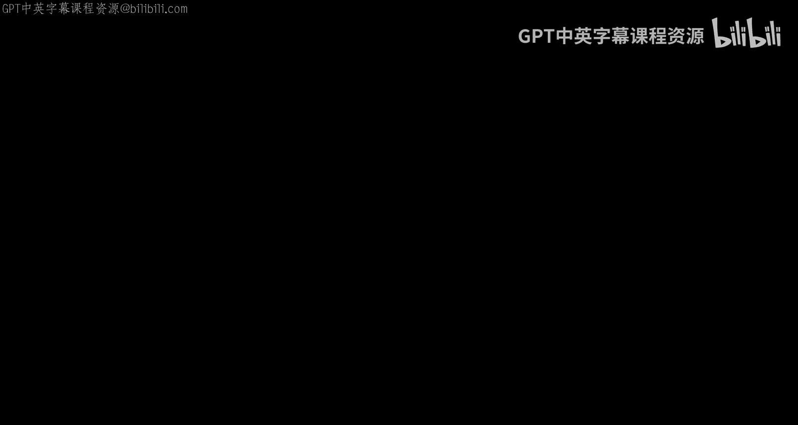
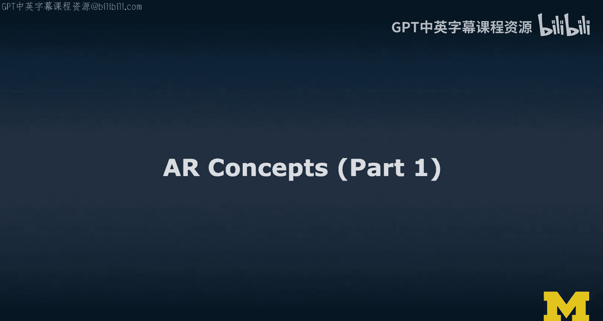
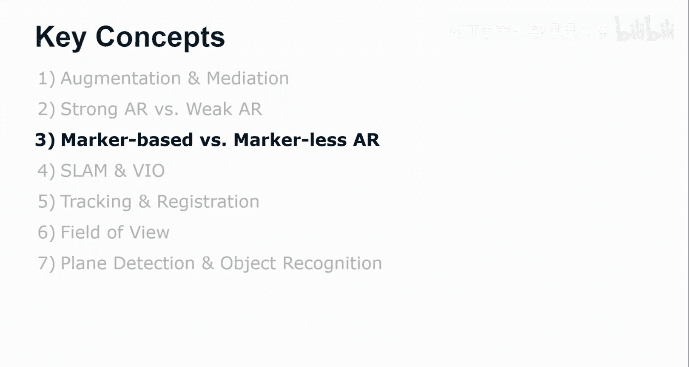
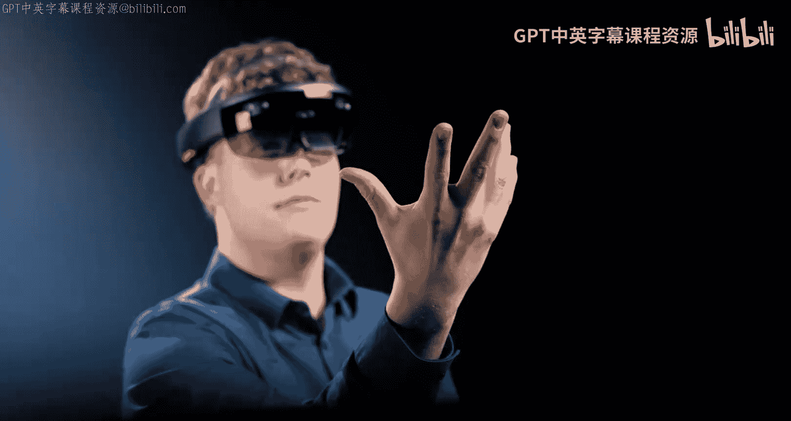
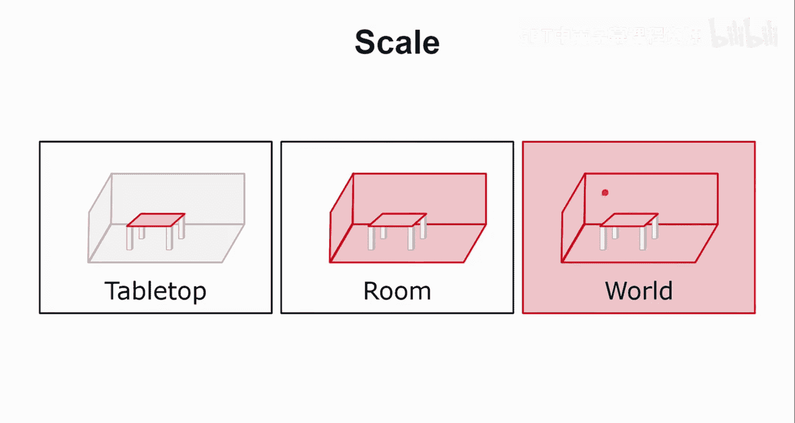
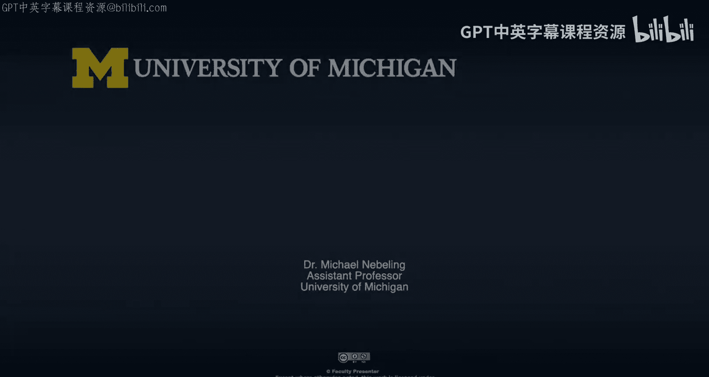
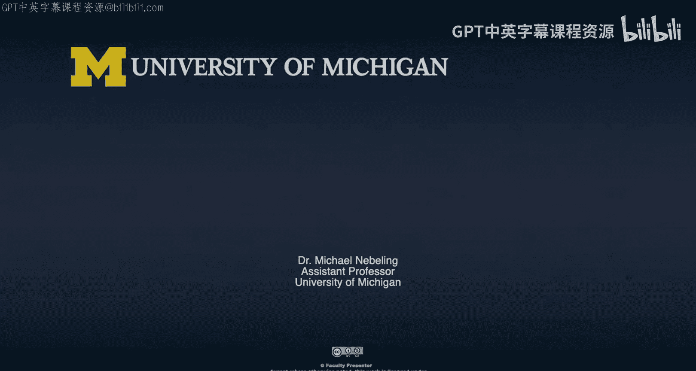

# 扩展现实核心概念：第1部分：AR基础概念与分类





在本节课中，我们将学习增强现实（AR）的一些核心概念。我们将从“增强”与“中介”这两个基本理念开始，区分“强AR”与“弱AR”，并探讨“基于标记的AR”与“无标记AR”的技术差异。最后，我们会介绍一些支撑这些体验的关键技术术语。

## 增强与中介

上一节我们了解了AR的基本定义，本节中我们来看看AR体验的两个核心维度：增强与中介。

**增强** 指的是将虚拟内容作为覆盖层引入现实世界。这个概念可以用现实-虚拟连续体来理解。从完全的现实到完全的虚拟现实，**增强现实** 位于靠近现实的一端，主要叠加虚拟内容；而**增强虚拟现实** 则更靠近虚拟一端，以虚拟内容为主，融入部分现实元素。**混合现实** 则涵盖了整个光谱。增强的程度，可以理解为叠加到现实世界上的虚拟内容的数量。

**中介** 则沿着同一个光谱发生。引入的虚拟内容越多，我们对世界感知的“中介”或“调解”程度就越高。因此，AR不仅仅是向视野中添加虚拟物体，它还包括**减损现实** 的概念，即可以移除物体或让周围世界看起来完全不同。这既令人兴奋，也潜藏风险。“中介”一词强调了我们可以调解你对周围环境的感知这一事实，未来在AR广告等领域，我们会越来越多地看到这一点。

以下是这两种理念的一些具体例子：

**在增强方面：**
*   **信息叠加：** 例如导航箭头、产品标签。
*   **空间锚定物体：** 虚拟物体被固定在真实空间中的特定位置，看起来像是世界的一部分。
*   **空间音频：** 即使没有视觉内容，如果音频遵守空间规则（例如，虚拟声源仿佛来自房间某个角落），这也属于AR范畴。

**在中介方面：**
*   **美化滤镜：** 如Snapchat滤镜，让你看起来更美或更年轻（后者也可视为一种减损现实）。
*   **物体移除与替换：** 例如，移除我身后的书架并用其他东西替换，从而操纵我们对世界的感知。
*   **设计中的黑暗模式：** 这涉及到设计伦理，我们将在后续课程中详细讨论。

## 强AR与弱AR

理解了AR的基本作用后，我们来看看如何根据体验的深度对AR进行分类：强AR与弱AR。

在现实-虚拟连续体上，**弱AR** 更靠近现实一端，而**强AR** 则向虚拟方向移动，但尚未脱离AR范畴。以下是它们的主要区别：





**强AR的特点：**
*   **高精度追踪：** 虚拟物体与真实世界对齐准确。
*   **完整的语义理解：** 系统真正理解周围环境（例如，这是桌子，那是墙）。
*   **支持自然/本能交互：** 例如，通过手势、凝视进行交互。
*   **头戴式AR显示器：** 如Microsoft HoloLens，是强AR的典型代表。

**弱AR的特点：**
*   **粗略或不精确的追踪：** 例如早期的《Pokemon GO》，虚拟物体只是简单地叠加在相机画面上。
*   **对环境无认知：** 系统不了解周围环境的几何或语义信息。
*   **交互方式隐晦：** 主要是基于相机的简单交互（如点击屏幕），体验感较弱。
*   **手持式AR显示器：** 如智能手机，通常只作为一个观察虚拟世界的“镜头”，同时看到的虚拟内容有限，常限于桌面AR体验。

## 基于标记的AR与无标记AR

接下来，我们将深入两种实现AR的关键技术路径：基于标记的AR和无标记AR。为了说明，假设我们使用HoloLens观察一个场景。

在基于标记的AR中，我们需要一个预先设计好的**标记**（或称为基准点），例如一个特殊的图案。设备上的应用会预先训练识别这个标记。当摄像头看到这个标记时，系统会：
1.  以设备初始位置为原点建立一个三维坐标系。
2.  通过分析标记在图像中的大小、角度和变形，计算出标记相对于设备的精确位置和方向（即姿态）。
3.  基于这个计算出的坐标系，将虚拟内容稳定地锚定在标记所在的位置。

**核心公式/概念：**
设备通过求解**透视n点问题** 来计算标记的姿态。简单来说，就是根据已知的标记3D模型点与其在2D图像上的投影点，反推出相机的位姿。

```pseudocode
// 简化流程
已知：标记的3D模型坐标，标记在2D图像上的坐标
求解：相机的旋转矩阵(R)和平移向量(t)
使得：2D投影点 = 投影函数(3D模型点, R, t)
```

无标记AR则无需特定的预先打印的标记。其工作原理是：
1.  设备在移动过程中，通过摄像头主动寻找环境中的**特征点**（例如桌角、纹理鲜明的点）。
2.  系统持续跟踪这些特征点在连续帧之间的移动。
3.  通过分析这些特征点的运动，并结合设备自带的惯性测量单元（IMU，如陀螺仪、加速度计）数据，推断出设备自身在三维空间中的运动轨迹和位置变化。

**核心概念：**
这涉及到**视觉里程计** 和**SLAM** 技术。设备通过比较连续图像帧，估算自身运动，并同时构建环境地图。

这两种方式也影响了AR体验的规模：
*   **基于标记的AR** 通常适用于**桌面级** 体验，因为需要标记始终在视野内。
*   **无标记的AR** 可以实现**房间级** 乃至**世界级** 的体验。通过持续追踪环境特征，用户可以在更大范围内自由移动。未来，通过“AR云”等技术映射整个世界，将可能实现全球规模的持久性AR体验。

## 总结







本节课中，我们一起学习了增强现实的核心概念。我们首先区分了“增强”与“中介”的理念，明白了AR不仅能添加内容，还能调解感知。接着，我们对比了“强AR”与“弱AR”，了解了不同深度的AR体验。最后，我们深入探讨了“基于标记的AR”和“无标记的AR”的技术原理与适用场景，理解了从依赖特定标记到利用环境自然特征进行追踪的技术演进，以及它们所支持的不同规模的应用。这些基础概念为我们后续学习具体的AR技术与设计打下了坚实的基础。