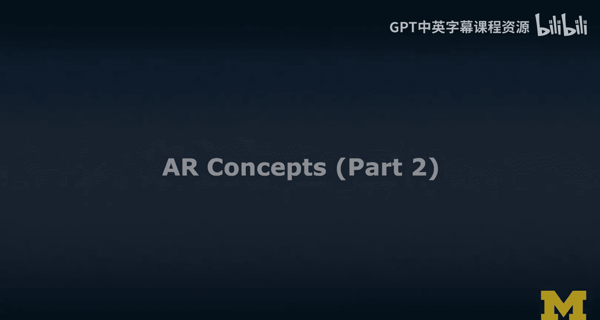
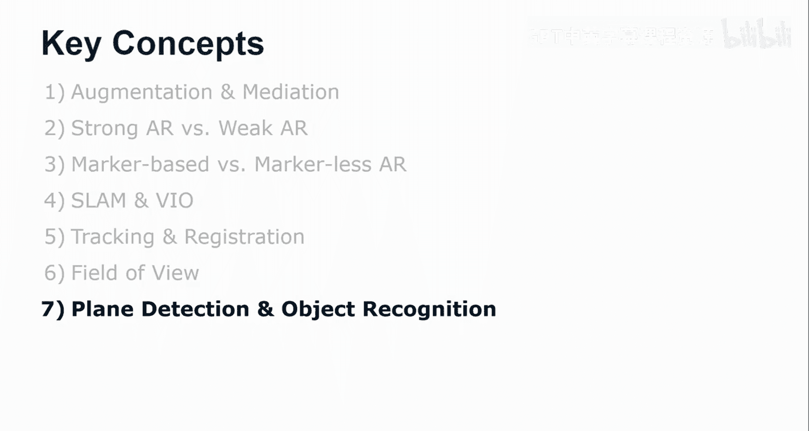

# 密歇根大学《面向所有人的扩展现实（介绍⧸设计⧸开发）｜Extended Reality for Everybody Specialization》中英字幕 p15 14_AR核心概念第二部分.zh_en -BV1jM4m1k73q_p15-

So let's look a little bit more under the hood。 I just thought I need to introduce these two concepts。

 Slam and vi。 so because visual inertial oometry is like this key thing that was associated with AR core and AR Ki。

 And so people have been talking about this all the time。

 And if you want to participate in some of these discussions， you want to be cool。

 you should say things like slam and visual inertial oometry so。😊。

TheS is simaneous localization and mapping。 The algorithm works by tracking key points over a sequence of camera frames like image by image by image。

And then it actually tracks them。 So it really determines the trajectory of them。

 and then it develops an estimate of these points in 3D positions。

 So basically triangulation through multiple frames。And it can actually。

 from these estimates of these 3D positions， it can actually determine the camera pose。

W whichch could have observed those points。 And if you do this for a sufficient number of points。

 you can solve both for the motion of how the camera moves through space and structure。

 so you can do both localization and mapping of the space around you。

 Now this is an intuitive explanation of slam slam has really been active research area for many。

 many years， the actually dedicated conferences， research conferences to that。😊，And to be honest。

I am not a computer graphics person or robotics person。

 so I've never really implemented a slam system myself。 Now， luckily。

 we have all kinds of frameworks and tools that help us work around this。

 So having this intuition for how slam works and what it does at the algorithmic level。

 even though it's maybe not technically fully accurate。

 is fully sufficient at this time to understand the concept。

 So visual inertial dormory works by tracking the pose via the camera。

 which actually does match a point in the rear world to a pixel on the camera sensor and actually doing this each frame。

😊，It tracks also the pose via the inertia measurement unit。 Now。

 the inertia measurement unit is not as accurate when it comes to position。

 but it very accurate when it comes to orientation。

 So it processes both the exonometer and the Javacope data from your smartphone。

Then it combines those two， the visual information of the pose and the IMU acquired pose。

 and it analyzes those measurements from both systems。Over time。

 so it does this like a little bit over time and then determines the best estimate of 3D position when I say time。

 this is still real time， right， this is between frames。

 but we have like 60 frames per second so we can do this really。

 really quickly on smartphones these days。So now that I've listed out SM and bio SM really can be implemented just like with the camera and doesn't the latest slam algorithms don't need a special hardware。

 like a depth camera we can just use the RGB camera， the normal camera of your phone。

And Vi actually so visual inertial autoometry in many ways。

 makes this even a little bit more robust because it also considers the IMU and it makes SM work on mobile。

 which used to be a challenge so we can do this really quickly， really fast。

 we can recover one thing you should try out to mess up the tracking is like shake your phone during an AR experience and then see when it actually recovers So when it refines the positions。

😊，Another thing that you'll notice when you run an AR application on your phone is that it always asks you to move around a little bit initially to establish tracking is what they say。

 well， this is when it actually builds these key points and so you're basically helping the application build a well a geometry。

So you're actually helping the application build a coordinate system of the world around you。

 and then it'll work as expected。So this brings me to the two concepts of tracking and registration。

 which I've just used as if they were clear， but let us illustrate this a little bit。

 So tracking is locating the position of the user's viewpoint when the view so is actually moving so you're moving like through the 3D space so like walking like here so and we can track how the position of your headset and therefore your head has changed。

And we can render the scene differently according to your new perspective。Now。

 so we can track how you move through 3D space and now registration in 3D is what I said is one of the key characteristics so of AR。

 so registration is really the process of positioning virtual objects with respect to the real world。

😊，So let's say you're bring in your hand doing this Hollands gesture and then we're bringing this cube and we can use the hand position which we were tracking before as a reference point can relative to that point can bring up the cube maybe so that it appears above your hand and we can use the last known position of the hand and we do have a coordinate system already established and so we can place the cube at this location so slightly above on why and then copy paste the rest and it'll up appear it'll be registered there and now if we continue to track the device。

 we can obviously render the perspective on that cube all the time accurately。

 so tracking and registration really work together。I will quickly jump to the field of view。 Now。

 the field of view is one of the most disappointing things that you will probably have with a headset。

 Even the latest generation of air headsets don't have a very large field of view。

 So rather than you seeing the cube like this。 What would actually happen on a Hollolins 1 where you have a 35 degrees field of view like this angle here。

 roughly。You would see only portions of that cube。 It would be cut off。

 and you would have to move your head upwards to actually see the rest of the cube。

 And this can be a little disappointing because obviously。

 everything else that is not in the field of you is just the real world， so。

So while in the promotional videos， it always looks like while in a third person or promotional videos。

 when they introduced the Holloends， for example， it always looks like you would see this whole content。

 what you actually do see is only this cut of portion。

 And so you need to think about how to build in visual cues into this area。

 the field of view that is actually can actually be augmented with virtual content。

 So you could like， for example， if this were an important object that should be in the entire view。

 you could， for example， draw in little markers that would say that would visual cues that would actually make the user move up their head。

But to be honest， if I look at 3D object like this， this is a 3D primitive， I expect it to be a cube。

 it could be a building， it could be larger， it may not be a cube， it might actually be a larger box。

 I would probably explore it more by looking upwards。In general， the smaller the content。

 the better it can be viewed with AR headsets and larger content is just like really difficult to view and therefore also to conceive like really like how big the object really is。

So。What would be very hard right now is this really this idea of diminished reality， like really。

Poring， transforming everything around me， blending in ads or whatever。

 I'll show you some examples later。 we're looking at hyperrety as one of those concept videos that I think are very interesting concepts of the future also a little bit scary to be honest。

 when it comes to augmented reality in the future。 but so in many ways。

 we can be happy that the AR headsets right now are actually quite limited and break this suspension of disbelief all the time。

 just by being limited in terms of the field of view for example。

 but this concept will still be around for a while。

 the field of view really having perfect augmentation， if you will。

 like all around you with AR that will require a little bit more research， I would say。

 and also technological advances。😊，Because even from the Hollands1 to the Hollands  too。

 I'm not even sure， like I've seen different ways of calculating the field of view but and one way is to say it's twice as large。

 but thats more like in terms of the area that you see。 But overall。

 it doesn't actually add a lot to it。 So it's not like double or something like that。

 So that's just something to keep in mind。 So for the next few years。

 you might still be a little disappointed initially。

 But then when we finally have all these fully augmented A of views we can also we have to be careful of all these scary scenarios that this enables。

Finally， key concepts are also plane detection and object recognition。

 I think you you need to understand some of these concepts to understand how current AR devices actually work。

So I'll show you an example here of me using the Google measure app。

 and what I'm going to do now is I'm actually going to measure the size of the screen that you see sometimes behind me in some of the angles。

 So it's supposed to be a 57"ch display and I'm going to measure。

And while the measurement is interesting as an app， it's also an AR application。

 What I wanted you to focus on is how it visualizes the plane。

 It actually understands the orientation of this display play， so it sees a surface there。

 it also sees a surface on the floor sometimes and it understands the normal。

 So the orientation of that surface and it actually draws that into the view。

For me into the A view and this is actually good design。

 and so we'll talk a little more about this in other parts of this MOC specialization。

My second example here is Google lens。 So when it comes to object recognition。

 I was playing around a little bit， obviously here in the studio。

 Google lens is often associated with like this way of translating menus or like translating from one language into the other。

 But you can actually just like make this text on my screen。😊，You can copy paste it。

 You can read it out。 so you can do some of these things with Google Lens。

 which is really an impressive tool， if you will， some basic AR。Okay， so you can do that。

 but you can also really detect objects。 so you can walk around and use the camera。

 And in order to make AR really a thing so that we can start to interact with these objects meaningfully。

 We need to understand what they are。 In this case。

 it was able to detect the type of wheel that I was using。

And if the computer actually knows what kind of equipment。

 what kind of physical objects are around the user。

 the augmented reality experience can be a lot more meaningful and so this kind of semantic understanding of the environment around us is still one of the key barriers right now to technological innovation。

It has to do both with really like building this understanding of the world。

 So machine learning is like the term that you would probably think right now。

So that the computers can actually see， we call this computer vision。

 they actually understand the computer actually sees like a human understands， builds a perception。

And semantic labeling and understands that it is a chair and even understands what kind of chair it is。

 So some of these things are still a little bit away。 and we may see early examples of this。

 but we are not there yet when it comes to really semantic understanding。

 I'll show you some examples of where we are on the iPad， for example， now。

 we can detect people and we can use those as information to， for example， occlude content。

Or we can like walk around， I will walk around in the studio and I'll show you how it detects and understands what some of these objects are so wall behind me there's a window opposite。

 there's this seat or chair that I'm sitting on。So this is the end of the AR concepts lecture。

 and I'm going to talk about AR technologies really that implement some of these concepts。

In a separate video， So I chose key concepts that I think are key concepts we started from the characteristics。

 and then I went through a couple of key terms， including down to some of the algorithms。

 I hope that you thought this was interesting and useful I think understanding these concepts is really important so that we also get a better sense of these technologies and their limitations once those limitations are overcome however。

 we may enter a very different world and discussion around some of these technologies。

 So in later portions of this MOoc we really talk about ethics and also privacy and security concerns which really have to do a lot with both AR and VR。

 So I'll see you there。

