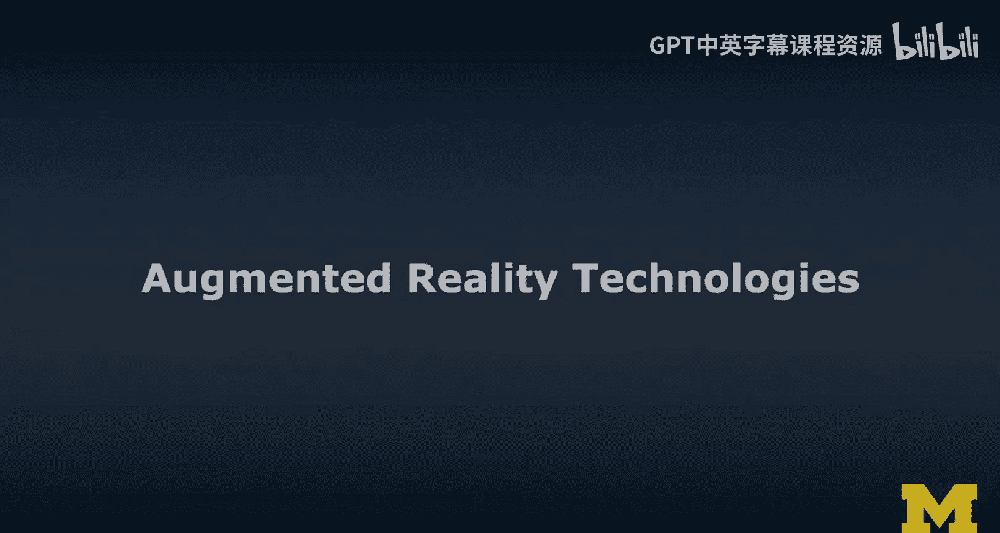
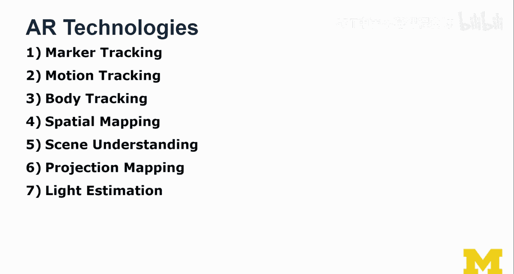
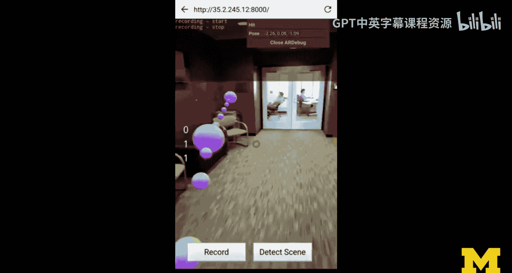
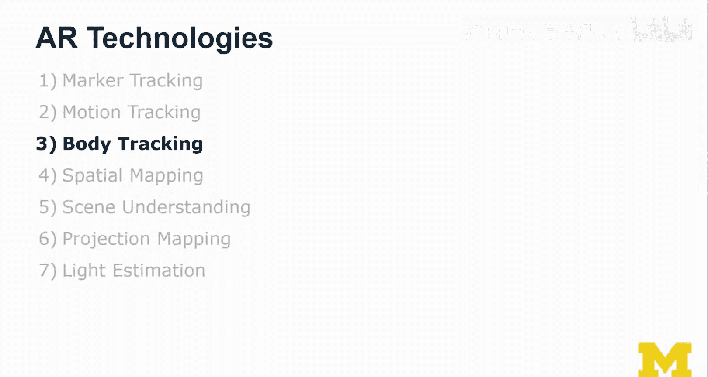
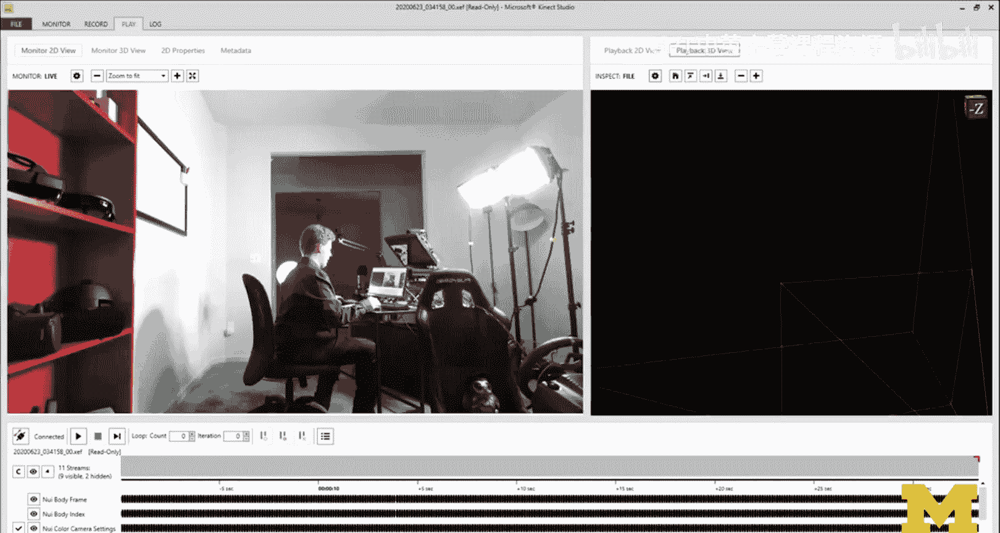
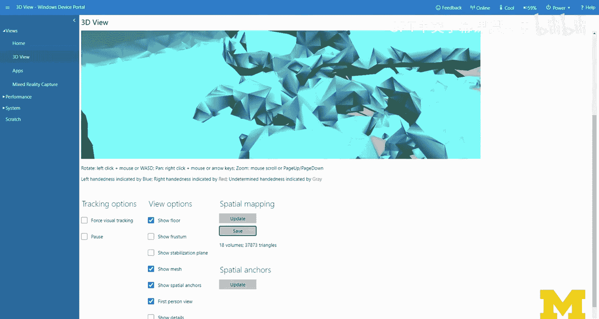
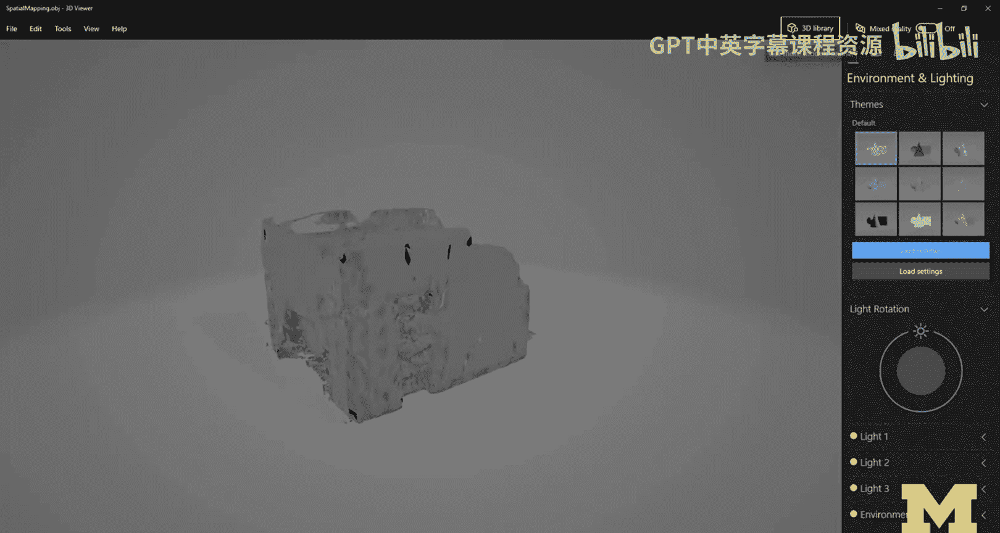
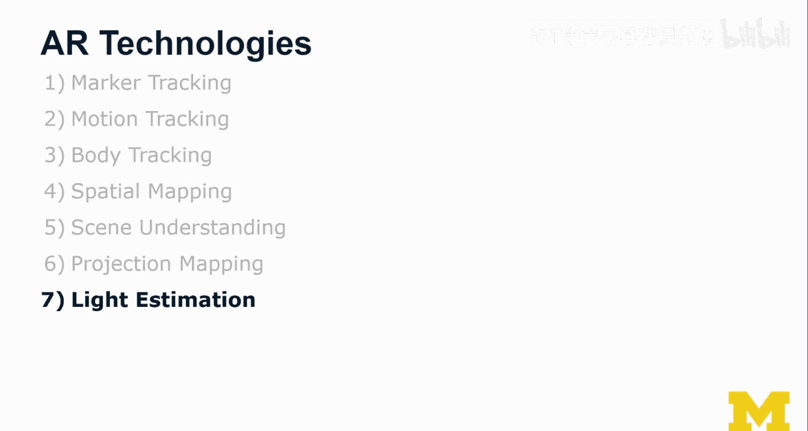
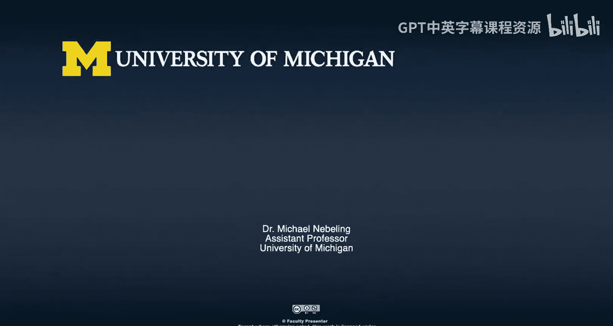

# 密歇根大学《面向所有人的扩展现实（介绍⧸设计⧸开发）｜Extended Reality for Everybody Specialization》中英字幕 p16 15_AR关键技术.zh_en -BV1jM4m1k73q_p16-

In this video， we're gonna talk about augmented reality technologies。

 We're not just gonna talk about them。 We're actually gonna look at them。 Okay， so the whole idea is。

 we're not going to start with the Hol， but like。This is one of the latest devices。

 the whole idea is to understand。All the technologies that are actually coming together in a device like this in order to get this to work。

 It's actually been years of research and development before a device like the Hollands2。

 which this is。Can appear on the market and actually push us just a little bit further again in this space。

I'm going leave that here， and we're going to talk about augmented reality technologies。

 So we're gonna to learn about a few AR technologies。

 and these are actually all enabling and building on top of each other。

 We're going to start up with mark tracking。 We're going to look at motion tracking。 in this case。

 like tracking a device through 3D space without markers actually so mark or less， if you will。

 We're going to learn about body tracking。 learn tracking bodies。

 We're looking at the K understanding the skeletal tracking of the K and also looking into its depth sensing capabilities。

 We're going to lead over the spatial mapping because that is something that the Hollens can do。

 It actually creates a 3D mesh of the world around you。 basically a copy。

 a 3D copy if you will 3D scan people often like to say 3D scan。

And then it actually does a little bit of scene understanding on top of it。

 but I'm going to show you also where we are with some of the mobile platforms at the moment and I'm going to show you AR kit and some of the scene understanding there。

 we're going talk about projection mapping because if you have all these things you can do also projectionbased AR So not I always want you to not just think in terms of mobile or headwn AR but also let's not forget about anything to do with spatial AR or monitor-based AR。

 Finally I think we're going talk about a key ingredient to actually make AR content appear as part of the environment and that is actually light estimation。

 I'm going to show you an example there as well。 it's not exactly what I had in mind。

 but you will really see the difference that way so let's get started。

 So this lecture is really build around number of demonstrations for each of these technologies。

 And so I'm just going to get started with a first demonstration on market tracking。

In this video， I'm gonna show marker based AR。 So I'm gonna actually basically show this marker to the camera。

 I'm using A R G S here quick and simple， andm gonna。Just。Give you the demo。

 So this is now me in a web browser。 And it's also。

 it's using a slightly different camera the one that I have over there and。

As I now bring in this marker into the view， you can see how the camera is kind of like tracking that marker and relatively accurately detect the。

The pose and the orientation of the sheet of paper。

 I have to pay attention that I'm not occluing it As soon as I'm occluding it。

 it has a hard time obviously seeing the marker。 So the way I've printed it here allows me to move it。

 And it's also at a really nice size for the camera。 So then the tracking works pretty， pretty well。

Rative robust so we can even let it fall and that didn't work so well but so this is at the core of a lot of the AR things that we show in fact I believe that MAA based AR is very good for prototyping。

 so there's something that we'll explore in later segments of the courses here。😊。

As part of the XM MOC。And yeah， I just， I'm just still excited。 they don't have to look like this。

 they can actually be customized， they can look and blend in。

 they can look more like the environment， they can blend in little more they can look more like QR codes if that's what you want so you could embed URL and then have people both use it to open and launch your product or interface or whatever it is。

😊，And then also use it to augment the experience。So yeah， I think this is pretty cool stuff still。

 and even though we have more advanced MAA， less AR technologies and devices。😊。

I don't think that as a designer， you can live without marker based。

Prototyping and rapid exploration is just so much faster so that was my first demo on marker tracking and now we're going to look at motion tracking what I mean by motion tracking is like understanding how a device like the smartphone or the Hollolens how they really understand where they are in 3D space without holding markers up in front of them。

😊，So let's look at this。So in this example we see my student Rob。

 former PhD student actually go through the School of Information。

 AR corere just came out and we started playing around with AR corere and getting it to work in the web。

 so this is a3 JS scene， those of you familiar with these technologies will notice。Anyway。

 we're going through the building， we're actually walking up some steps。

 we're walking around with a smartphone and we're dropping landmarks， if you will。

 we call them breadcrumbs so that you can actually go back and find your way back。

And what this really demonstrates is how accurate the tracking actually is and how well AR core as a smartphone without any special cameras。

 it's really just software based。Augmented reality and the tracking。

 How well can actually maintain the tracking。 Let me show you a second example here。 So this is Rob。

 again， demonstrating one of his prototypes in the lab。 in this case。

 we are just calibrating this display to the smartphone。

 And what we can then do is actually right on it。 So the way this works is we are actually moving the smartphone just like the way we want to write。

 And so it becomes kind of like a laser pointer， if you will。

 So we' played around with this quite a bit。 he was quite proud of this digital prototype。

 So that was Rob， and that was one of his projects。 AR manageragerie that we worked on。

 We were really exploring mobilebased AR。 And what can we do with it。

 And now way that we have these tools。 So that was really interesting。😊。

So so far I've shown you marker and motion tracking。

 so so far we can understand a little bit of the environment， not too much yet for good AR。

 we also need to understand quite a bit more。 actually we need to understand people and I'll explain in a little bit more depth later why this is important。

 So I'm going to show you quite an extensive demo here of the Connect。

I've prerecorded this， a little bit of， you know， karate， I still got it in me。And a little bit。

 at least。 And this is Mavahi Gary。 And anyway， so I'm going back to the computer。

And I'm now going to replay this recording。 This is actually a connect recording。

 So the connect is a。Well， a depth camera， if you will。

 And it can also do this kind of skeletleta tracking。 So what you will see， if you look at the left。

 that's the original image on the right， there is actually。A skeleton drawn in。

And that is the estimated scaleke and sometimes these lines are a little bit thinner that's when we're not exactly sure because we can't see the joints and we can't be sure。

 but in any case they actually can do quite a few things。 it helps as a depth camera。

 You see a big shadow behind me that is the camera couldn't see behind me。

But you do see a kind of 3D reconstruction frame by frames in real time，3D reconstruction of my body。

 And I'm going to play around with a few settings here。

And one thing I wanted to show you is this kind of what they call the surface mesh with normals。

ll it'll look very interesting。

Itll look like a plastic version of Michael。 What you also see me do on the right。

 I'm actually moving around this 3DC。 And this is not like I'm not actually moving the Kinect。

 I'm just moving the perspective on that recording。 And obviously。

 I cannot see behind me because we didn't actually record it。

 We didn't have a kin behind me so we couldn't actually see behind me。

And so the can actually do quite a bit of stuff here and quite a lot of things。

So what do we have for now， well， we understood marker tracking and then we did motion tracking。

 So basically the devices find their own markers and they're going through 3D space and doing slam or visual inertial autoometry that we learned about in the concepts。

Then we learned a little bit about connect。 The Connect is actually quite advanced。

 The reason I wanted to show you the connect is because if you think about it in this Hollen is actually a connect in there。

 now a connect with which we are like walking around the demo that I just gave you the connect was stationary and it was pointing at me and basically did a 3D reconstruction of me and the world behind me now if you have a connect in there and you're walking around with it on your hand youre actually scanning the environment all the time。

 and we are getting what is called a point cloud of this or the spatial mesh we call the spatial mesh and there is just a 3D information。

 So the really hard part would actually be making sense of this kind of like spatial mesh and I'll show you spatial mapping first and then we actually also going to talk about scene understanding so really the sense making part。

😊，I have x rays coming out of my hands and when I tap， it really reads the environment nicely。

I'm going to show you a little bit of a different demoulator， with this。

🎼We'll see much better how that mesh is being built， but it really is quite impressive。

 And of course， the color effects they shows look really nice。

 and this can also be done up into this area here。And it really。

When you like at a distance and you're doing this on the floor。

 it's just nice how it travels through the entire room。Like a little wave。 We can actually。

AndGo here into the software。And。We can save this mesh， it'll download it for me。

And then。I can open it。诶嗰嚟。

Quickly recolour this and a color scheme that I think makes sense。 And then when we zoom in here。

 it does look a little bit。Chaotic the traces of where the lights are and here's my capture station。

 the seat is a little bit visible。诶。And then the shell。Not so well captured over there。

The light is really interesting。 You're going to insert this chair。

 That's the example I wanted to show。So now we have a virtual chair can put it on the floor。嗯。Okay。

So the hand obviously is to stay in view of the device， otherwise it cannot track it。

And then make it a little bit larger。That's roughly where to replace it。So。Now。

 it's like a good chair。 It has。It still seems a little bit higher than this one， but it's fine。

And now what I'm going to do is I'm going to drag it and actuallym going to place it over there。

On the floor。诶都。Like this。And what I want to demonstrate now is when I sit down and I'm behind this chair。

 you can see how it renders the occlusions。Around the black chair。And this is。

It's one of the hard things to keep with the illusion that this is an object that is part of the real world。

 we need to be occludeed by virtual and physical objects， obviously like this chair here。

So that was a first application of the spatialship mesh。 We can do occlusion now。

 and that is really important so that these virtual objects really feel like they are part of the world around us in front of us as well。

 and occluded by both virtual and physical objects。 So that's pretty fundamental。

 What I haven't figured out yet at this stage is okay。

 we have a 3D reconstruction of the environment， we can do quite a bit。

 But do we really understand what we see。 Well， and the answer to this at the moment is that the devices are well。

 they're getting better at this， but they don't actually yet at least at this stage。

 and know exactly what they're looking at but they are getting better at this every minute。😊。

So here I'm going to show you an example of scene understanding。Alright。

 so were trying to just walk a little bit through the environment here。With the iPad， and it can see。

All these different kinds of。um。Surfaces。 so this is using。The lightar。And has a relatively。Good。😔。

Understanding of these different kinds of environments。 And it does have。Basic semantics， so。

This was characterized as a seat。 It's probably a bit hard to read the label。um。

So this should be a table。It is none。能。Then， doesn't know。Basically， when I look up there。

I is a window。It gets dead despite the light source， which is unusual。Sensensitive studio。

And here we have a seat。So it gets that， right。It knows where the floor is。

And this is hard because it's a glass table。And it just doesn't know exactly what all these things are。

Otherwise。Pretty good。 So that's a wall。 That's pretty easy。um。So。It does look nice。

And this is the semantic scene understanding。And labeling。So in this example， I am showing。The iPad。

 AR kit， people segmentation， and then occlusion as a result of this。

 So there is a virtual base in front of me that you can see is not real， but you see it on the iPad。

And then my hand， I actually like trying to go through this。

 and obviously my hand should actually occlude the virtual object when my hand is in front of it。

And then as I reach through the vs at some stage Mahan should appear behind it。

 so what happens here behind the scenes is actually analyzing what the cameras sees。

 trying to find a person in there and then segmenting out this person so basically extracting this person from every image and figuring out the depth。

 the distance of that， well part of the human body to the camera and then adjusting the rendering accordingly so that the flower or the vs are actually appearing behind or in front。

Of the arm， my arm。So that's cool right， quite impressive set of technologies that we have so far with that we can actually do a lot。

 so we have seen understanding and that will improve in the next few years， so that's exciting。😊。

What we're gonna to do last is actually look at two more things。

 I wanted to show you a little bit of projection mapping just so that we also understand spatial AR a little bit better that I introduced you to in the concepts And then finally。

 we're gonna look at light estimation have a little bit of a demo there as well。

 So in this example we're showing two things。 we're showing we're actually in the lab here。

 It's a little bit of an order recording on the holens1。

 there is a projection setup that is actually using projection mapping to go to render between these two walls。

 So the image is actually distorted to make it fit if you think about how geometry works。

 That's how it works。 In any case， we also see a holens a rendered cube in front of it and what we're actually using we're using the connect that is also there to track the position of the user and just the projection accordingly。

 So we can actually have these virtual cubes appear。 just like you would view them on a holen。

 but you don't actually have to wear anything。So I'm showing here a projection mapping solution。

 Microsoft， the rumor life Tookit coming out of Microsoft Research。We set this up in the lab。

 and it's actually quite cool。So。This was a short demo。

 but it showed a few things coming together and what you could also see is how with projection mapping and a relatively nice setup we can make it possible for people to see augmented reality even without vary a Hollens and the experience can be very similar if you noticed how the Hollenens cubes were basically occluding and working in a very similar fashion as was the projection in the background。

And in reality， of course you wouldn't want to have both。

 like there's no need to have a headset and the projection。

 as a concept and but I wanted you to be able to see these two technologies and compare them a little bit。

Alright， finally， we're gonna do light estimation。 This is really the last part we're gonna look at。

 And here I have an example。 All I'm gonna do is place my phone on the table。

 and then I'm gonna find the light switch。😊。

This is AR corere elements as an example， so I'm trying to find the light switch。 and you know。

 as I switch it。It actually does change。 It detects this。 So the phone can actually detect the light。

 the amount of light in the room and can adjust the content to make it like a night scene。嗯。

And this actually makes it now fit better into this environment， when it's dark。

 and the brighter version， as you can see here， blends in more nicely during the day。

 And that's actually all there is to it in the future。

 there will be better examples and more examples of light estimation right now。

 not a lot of applications actually make use of light estimation。

 This is also something we are still really figuring out， I mean。

 it's very hard Like if you're inserting content over there。 but your phone is here。

 and it has a light sensor。 It knows what the light is here。

 It doesn't know what the light is over there。 So it has to estimate。 How do you estimate this。

 And why do we have to estimate so that we can adjust the lighting and the rendering essentially of the objects that the virtual objects that we want to insert into the scene over there to make it fit the light conditions over there。

😊，And so with that， we could also talk about spatial audio。

 and I did show that in the VR concepts and technology section。 So that applies here as well。

 So I've walked you through quite a number of fundamental technologies。 If you put them all together。

 you really have a nice AR experience。 and that was the point of this whole lecture。😊。

