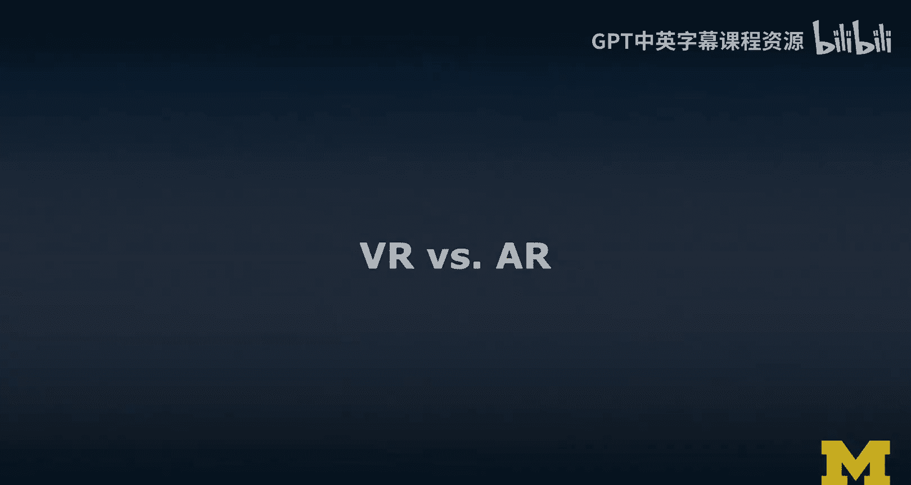
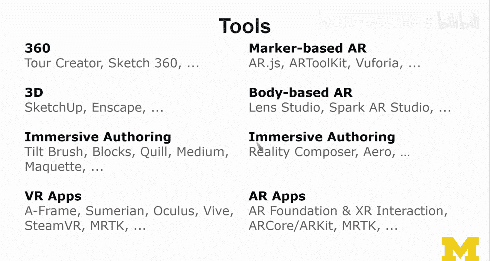

# 扩展现实入门：17：VR与AR对比分析 📊

在本节课中，我们将学习如何为项目选择合适的扩展现实技术。我们将探讨VR与AR的核心差异，分析各自的适用场景，并构建一个实用的决策树来指导技术选择。

---

## 概述

上一节我们介绍了VR与AR的基本概念和技术细节。本节中，我们将深入探讨如何在实际项目中做出明智的技术选择。我们将分析VR与AR各自的优势、局限性和适用场景，并构建一个决策框架来帮助您回答“何时选择VR，何时选择AR”这一关键问题。

---

## VR的理想应用场景 🥽

VR技术最适合以下类型的体验：

以下是VR技术表现突出的几个关键领域：

*   **丰富的视觉元素**：VR能提供沉浸式的3D视觉环境，让用户感觉被内容包围。
*   **3D空间交互**：用户可以在虚拟空间中自由移动、观察并与3D对象进行交互。
*   **物理/直接操作**：通过控制器或手部追踪，用户可以直接操控虚拟物体。
*   **无限尺度的交互**：VR允许创建极大或极小的虚拟对象，用户仍能通过移动和观察来理解和交互。公式表示为：`交互尺度 ∈ (0, +∞)`。

---

## AR的理想应用场景 📱

AR技术则在以下场景中表现出色：

以下是AR技术最具优势的应用方向：

*   **适量的视觉元素**：AR将虚拟内容叠加在现实世界上，而非完全替代。
*   **3D空间与物理操作**：与现实世界结合的3D交互同样有效，有时甚至更直观。
*   **1:1比例的交互**：AR最擅长展示与现实物体等大（或稍大）的虚拟内容，例如家具摆放预览。公式表示为：`交互尺度 ≈ 1`。

---

## VR的不适用场景 ⚠️

在以下情况中，VR可能不是最佳选择：

以下是VR技术面临挑战或效果不佳的场景：

*   **大量非视觉元素**：如果体验主要依赖音频、触觉或其他感官，VR的视觉沉浸优势无法发挥。
*   **大量文本阅读或输入**：在VR中进行长时间阅读或文本输入容易导致疲劳，且目前输入方式仍不够便捷。
*   **需要触觉反馈**：除非有专门的物理外设，否则在纯虚拟环境中提供精准触觉反馈非常困难。
*   **需要连接现实世界**：如果应用的核心依赖于对真实环境的感知或交互，VR的封闭特性将成为障碍。

---

## AR的不适用场景 ⚠️

同样，AR技术也有其局限性：

以下是AR技术可能无法满足需求的场景：

*   **大量非视觉元素**：虽然可能，但纯音频等非视觉主导的AR体验并不常见。
*   **大量文本阅读或输入**：与VR类似，在移动设备或头显上处理大量文本体验不佳。
*   **需要触觉反馈**：除非虚拟交互能与真实物体精确对应（例如，手直接触摸真实桌面），否则提供触觉反馈同样困难。
*   **与现实世界无关**：如果应用内容完全独立于用户所处的物理环境，那么使用AR技术就失去了意义，应考虑VR。

---

## 技术选择考量 🛠️

在做出VR或AR的初步决策后，我们还需要考虑具体的技术实现选项。

上一节我们分析了场景适配性，本节中我们来看看具体的技术选型。这包括显示设备、追踪方式和开发工具等多个层面。

### 显示与追踪技术

*   **VR显示**：从手机盒子（如Cardboard）到高端一体机（如Oculus Quest系列），选择取决于对沉浸感、性能和成本的要求。
*   **AR显示**：涵盖从智能手机、手持设备到头戴式显示器（如HoloLens、Magic Leap）的广阔谱系。
*   **追踪技术**：需在3DoF（三自由度）与6DoF（六自由度）、Outside-in与Inside-out追踪之间做出选择。同时考虑是否需要手部追踪、眼球追踪或控制器。

### AR特有的技术决策

对于AR项目，还需额外考虑：

*   **基于标记（Marker-based） vs 无标记（Markerless）**：这决定了应用如何识别和锚定虚拟内容到现实世界。
*   **环境理解深度**：仅需检测平面，还是需要生成完整的3D空间网格？后者通常需要深度摄像头（如Kinect、RealSense）。
*   **物体追踪**：是否需要识别和追踪特定的真实物体？这可以通过预先设置标记、训练机器学习模型来实现。

### 平台与工具生态

技术选型也离不开对平台和工具链的考察：

*   **平台碎片化**：VR和AR的设备生态日益复杂，从低端到高端，支持哪些平台直接影响用户体验和开发成本。
*   **设计与开发工具**：工具链选择广泛。
    *   **设计端**：包括360度内容创作工具、沉浸式VR设计工具等。
    *   **开发端**：例如Unity的AR Foundation、VR交互工具包（XR Interaction Toolkit）、微软的MRTK等框架和SDK。

---

## 决策树框架 🌳

综合以上分析，我们可以形成一个初步的决策思路：

以下是指导技术选型的关键问题流程：

1.  **核心需求是否依赖真实环境？**
    *   **是** -> 优先考虑**AR**。
    *   **否** -> 进入下一步。
2.  **体验是否需要完全沉浸的封闭视觉环境？**
    *   **是** -> 优先考虑**VR**。
    *   **否** -> 可能适合**轻量级AR**或非XR方案。
3.  **内容交互尺度是否远超或远小于真实人体尺度？**
    *   **是** -> **VR**更能胜任。
    *   **否**（接近1:1尺度）-> **AR**更有优势。
4.  **评估技术限制**：对照前述VR/AR的不适用场景清单，检查项目是否存在这些“硬伤”。
5.  **选择具体技术栈**：根据项目预算、目标用户设备和团队技能，确定具体的显示设备、追踪方案和开发工具。

---

## 总结

本节课中，我们一起学习了如何对比分析VR与AR技术。我们明确了它们各自理想的应用场景（VR擅长无限尺度的沉浸体验，AR擅长1:1尺度的现实增强），也指出了它们各自的局限。通过引入一个包含显示、追踪、平台和工具的技术选择框架，我们最终构建了一个实用的决策树。这个决策树能帮助您在项目初期，系统地思考并回答“应该选择VR、AR还是其他技术”这一核心问题。记住，最好的选择始终源于对项目目标、用户需求和现实约束的深刻理解。