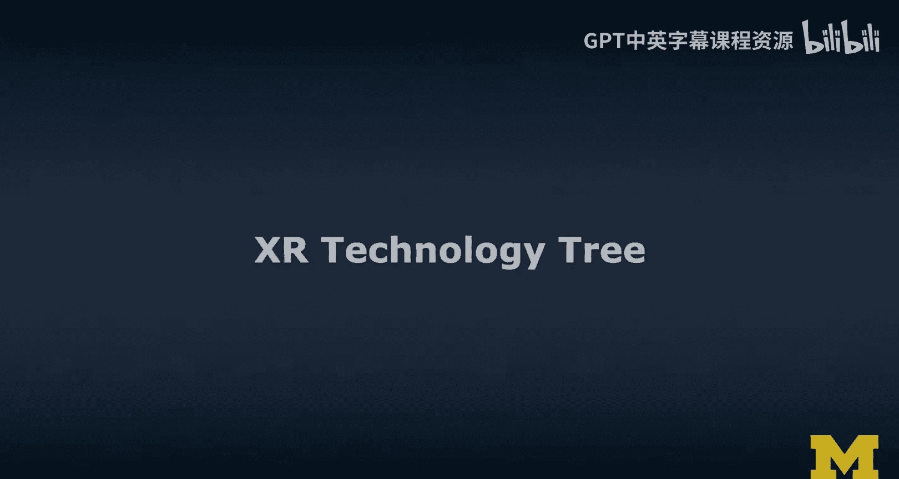
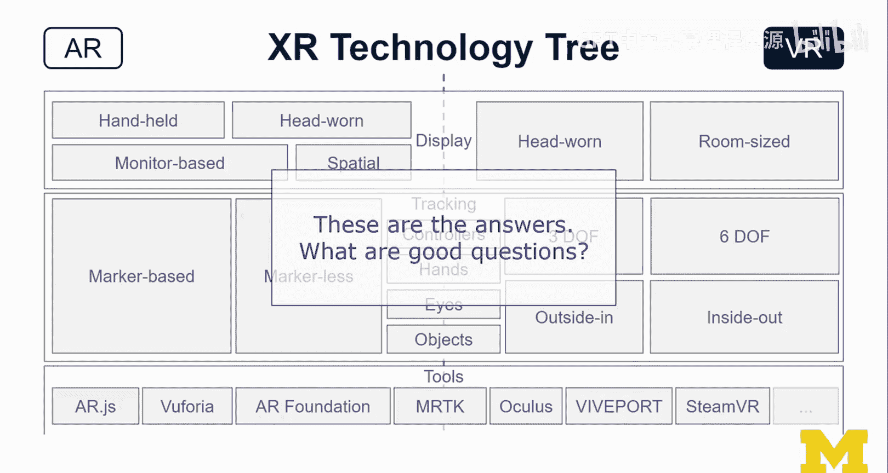

# 扩展现实技术：第18章：XR技术体系树 🌳

在本节课中，我们将学习如何构建和理解扩展现实（XR）的技术体系。我们将通过一个“技术树”模型，系统地梳理增强现实（AR）与虚拟现实（VR）在显示、追踪、输入和开发工具等方面的核心组件与选择路径。

---

在绘制决策树之前，我们先来构建一个技术树。我对此进行了一些思考。

我将在左侧列出AR相关技术，右侧列出VR相关技术。首先，我们从显示技术开始讨论，这部分内容会有些重复，因为之前已经介绍过这些显示类型。

😊 接着，我将AR空间（A-Space）按**基于标记（Marker-based）** 和**无标记（Markerless）** 来划分，将VR空间（V-Space）按**3自由度（3DoF）** 和**6自由度（6DoF）** 追踪，以及**由外向内（Outside-in）** 和**由内向外（Inside-out）** 追踪来划分。这些不同组合对应着不同类型的头显设备。

在AR和VR之间，我们通常有一个共同点：需要追踪控制器。至少需要从控制器接收输入。即使是HoloLens也有一个像小点击器一样的控制器。我通常不使用它，而是依赖手势操作。因此，控制器和手部追踪都很重要。

无论是VR还是AR，眼动追踪技术现在在这些头显设备上正变得越来越普及。此外，追踪额外物体通常需要额外的库和工具，但本课程不会深入探讨这部分内容。

在工具方面，我刚刚勾勒出了一个思维模型的雏形，这更多是开发层面的一个版本。从**AR.js**和**Bhorzia**（它们主要围绕基于标记的应用开发）到**AR Foundation**（更侧重于基于智能手机的AR开发，例如ARKit和ARCore），再到**MRTK**（微软的混合现实工具包，实际上横跨了AR和VR领域，我把它放在中间）。然后，我们还有更偏向VR的开发工具包，包括一些主流头显的SDK以及**SteamVR**。

这些都是你可以选择的软件开发工具包（SDK）。在绘制这张图时，我实际上在思考两件事。我称之为XR技术树。我想到了像《星际争霸》这样的策略游戏，为了赋予我的单位某些能力，我必须在游戏过程中研究一些科技。让我快速说明一下。

看待这棵技术树的一种方式是：为了最终使用**AR Foundation**，你必须研究AR技术，选择手持设备，并研究无标记技术，然后你才能真正使用AR Foundation。

😊 另一种路径是，如果你选择AR、手持设备和基于标记的技术，那么你最终可能会使用**AR.js**或**Bhorzia**。如果你倾向于使用Unity，你会选择Bhorzia；如果你倾向于A-Frame、WebXR等基于Web的方法，那么你会选择AR.js。这里还有许多其他工具，比如Vuforia，我本可以选择它。

无论如何，这是第一种看待它的方式。

但我构思这张图时想到的第二件事，实际上是电视节目《危险边缘》（Jeopardy!）。为什么这么说呢？如果你了解这个游戏，它的玩法是你看到答案，然后必须提出正确的问题。

😊 所以，如果你看这棵树，这棵树实际上包含了所有答案。但为了利用这棵树，你必须知道如何提出好的问题。《危险边缘》中最厉害的人就是能提出正确问题的人。让我再举个例子。

😊 如果你看到“AR 800”这个提示，它可能会显示“AR Foundation”。那么你应该提出的问题是：“什么是基于无标记、智能手机、手持设备的AR工具包？”然后你可以回答：“是Unity的AR Foundation。”这就是正确答案。

如果你看到“VR 800”的提示，答案是“SteamVR”，那么问题应该是：“什么是头戴式虚拟现实平台，允许你为支持3DoF或6DoF、由外向内或由内向外追踪的HMD进行编程？”基本上涵盖了所有主流头显。那么答案就是SteamVR。

这与另一种情况相反，比如提示是“VR 600”，答案是“Oculus”。你可能会想到Oculus Rift或Oculus Quest。那么问题应该是：“什么是软件开发工具包，允许我为支持6自由度、由内向外追踪的头戴式显示器编程？”你可以看到这里的区别，SteamVR因为跨平台而覆盖了整个VR领域，但它仍然是纯VR。

如果答案是“MRTK”（混合现实工具包），那么问题应该是：“什么是允许我为AR或VR、手持或头戴式、基于标记或无标记、或6自由度虚拟现实头显编程的工具包？”那么答案就是MRTK。因为根据我的经验，我成功地用MRTK为ARCore（智能手机）、HoloLens（头戴式AR）和Oculus Rift S（6自由度、由内向外追踪的头戴式VR）进行过编程。

当你了解所有答案时，就能提出正确的问题，这很有趣。这正是我想通过这棵技术树说明的。这棵树包含了所有答案，其中许多是隐含的。我能相对轻松地建立这些联系，是因为我在这个领域工作了一段时间。

😊 因此，为了在这个领域中导航，我在思考：我们可以像在《危险边缘》中那样提出哪些好问题？

---

---

**总结**

本节课中，我们一起学习了如何通过构建一棵XR技术体系树来系统化地理解扩展现实技术。我们按照AR和VR两大方向，梳理了从显示技术、空间追踪（如`3DoF`、`6DoF`、`Outside-in`、`Inside-out`）到输入方式（控制器、手部、眼动追踪）以及核心开发工具（如**AR Foundation**、**MRTK**、**SteamVR**）的完整脉络。更重要的是，我们学会了像玩策略游戏或《危险边缘》一样，通过提出正确的问题（例如，“我需要一个支持智能手机无标记AR开发的Unity工具包”），来在这棵“答案之树”中找到最适合自己项目的技术路径。掌握这种“提问”思维，将帮助你在复杂的XR技术生态中做出明智的决策。