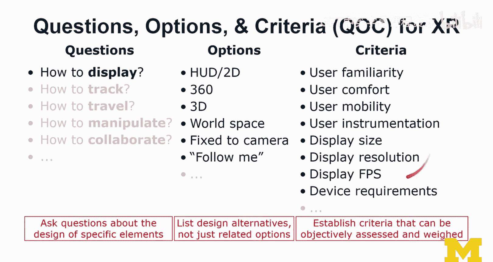
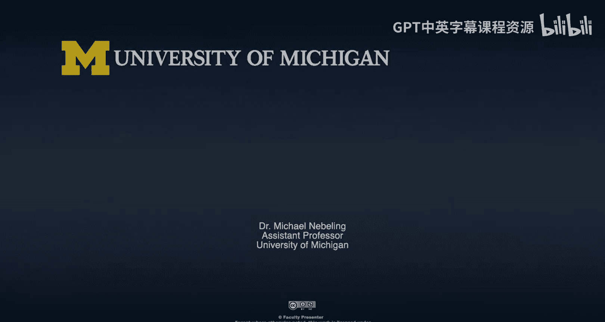

# 扩展现实技术选型实践：第20课：XR技术选型练习

在本节课中，我们将通过一个实践练习，学习如何为不同的应用场景选择和推荐合适的扩展现实技术。我们将采用一种系统化的分析方法，帮助你理解在XR项目决策中需要考虑的各种因素。

上一节我们介绍了XR技术的整体框架，本节中我们来看看如何将这些知识应用于实际场景的决策。

## 练习概述

我们的任务是：为给定的场景推荐合适的XR技术。你需要从四个场景中选择一个进行分析。以下是具体的操作步骤：

1.  首先，浏览所有四个场景，并选择一个你感兴趣的。
2.  沿着“现实-虚拟连续体”的谱系，考虑所有可能的技术实现方式。
3.  回顾“XR技术树”，收集所有可行的技术选项。这些选项将构成我们后续“问题-选项-标准”分析的一部分。
4.  深入思考并列出关键问题。确立评估标准，并尽可能系统地进行QOC分析。
5.  （可选）选择另一个场景进行QOC分析，并比较不同方案。

对于大多数场景，通常存在多种实现方式，没有绝对的对错。你在技术树中做出的每个选择，都会对用户覆盖范围、体验、项目规模和范围产生影响。

## 练习目标

通过完成这个练习，你将能够：
*   学习一种基于场景的技术选型方法，这是人机交互领域常用的决策思维方式。
*   更清楚地知道在为客户做推荐时应该提出哪些关键问题。
*   建立一个更全面的决策评估标准列表，虽然不完整，但可以作为未来决策的基础。

## 场景介绍

以下是四个供你分析的场景描述。

### 场景一：家居装饰

这个场景可能涉及协作解决方案，并侧重于增强现实领域。用户希望预览不同的家居装饰效果，例如更换地毯、家具或墙面装饰。

你需要思考：应该使用哪种技术？需要考虑哪些标准？有哪些可选方案？应该提出哪些关键问题？

### 场景二：客厅游戏

这个场景仍然发生在客厅，但焦点是玩游戏。这是一个协作游戏，可能涉及多种技术。图中展示了空间AR、可穿戴AR头显和手持AR设备。

需要考虑的是：如果你想支持玩家进行游戏，而这些玩家可能在同一房间，也可能在不同地点，这是否会影响你的技术选择？远程协作可能需要额外的技术支持。

### 场景三：课堂讲座

这个场景中，一位教师或讲师在前方讲解，例如介绍太阳系，并展示行星模型。他们希望学生能够通过某种AR或VR技术来观察。

你可以考虑AR方案，也可以思考完全使用虚拟现实的版本是否会更简单。本场景的核心目标是让讲师能够讲解，并让教室里的学生通过AR或VR版本进行观察。

### 场景四：团队会议

这个场景涉及的人数较少，但协作性更强。可以考虑使用VR和AR设备，主要是头显，但也可以探索如何利用手持AR设备甚至空间AR来实现。

会议中可能存在物理资产，比如海报，你可能希望将信息投影到物理对象上；图中的骨架模型也可能是完全虚拟的。你可以自由解读这个场景，目标是提出你认为最佳的实施方案。

## 分析方法指导

在分析时，请考虑整个技术谱系，即“现实-虚拟现实连续体”上的所有显示技术，而不仅仅是图中明确展示的。广泛探索你在AR和VR概念与技术课程中学到的所有内容。

具体分析方法上，我建议你采用系统化的“问题-选项-标准”分析框架。

以下是QOC分析的一个示例，它主要关注用户界面设计：
*   **问题**：列出关于场景中特定设计元素的问题。
*   **选项**：针对每个问题，列出设计备选方案。寻找对立的选项，而不仅仅是相关的。
*   **标准**：建立可以客观评估和权衡的标准。
*   **决策**：基于这些标准做出最终推荐。

例如，在为不同显示技术布局选项时，可以考虑用户熟悉度、舒适性、移动性、设备要求等标准。

我强烈鼓励你遵循QOC分析来更系统地进行技术推荐。这可能感觉有些繁琐，但这很重要。只有当你完整地走过这个过程，你才能在未来知道哪些步骤可以简化，哪些步骤在特定项目中至关重要。

这种方法将训练你的思维，帮助你建立更接近设计思维的思考模式，这对于我们如何塑造XR空间非常有用。

我希望你能享受这个练习，并期待看到你提出的有趣技术方案。这个练习旨在帮助你更好地驾驭整个XR技术设计空间，理清所有可做的选择。

本节课中我们一起学习了如何通过系统化的QOC分析方法，为具体的XR应用场景进行技术选型。我们分析了四个不同的场景，并探讨了在决策过程中需要考虑的关键问题、可行选项和评估标准。掌握这种方法将帮助你在未来的XR项目中做出更明智、更全面的技术决策。