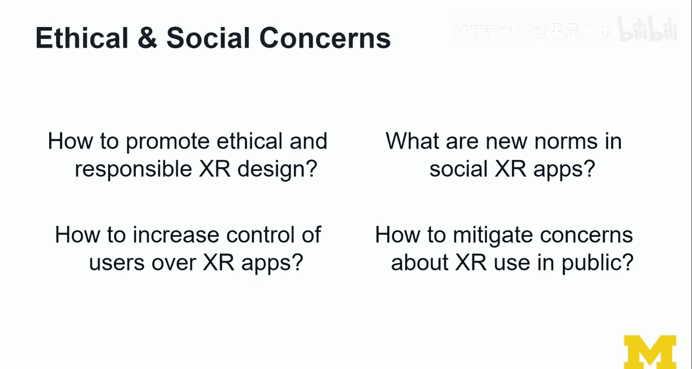
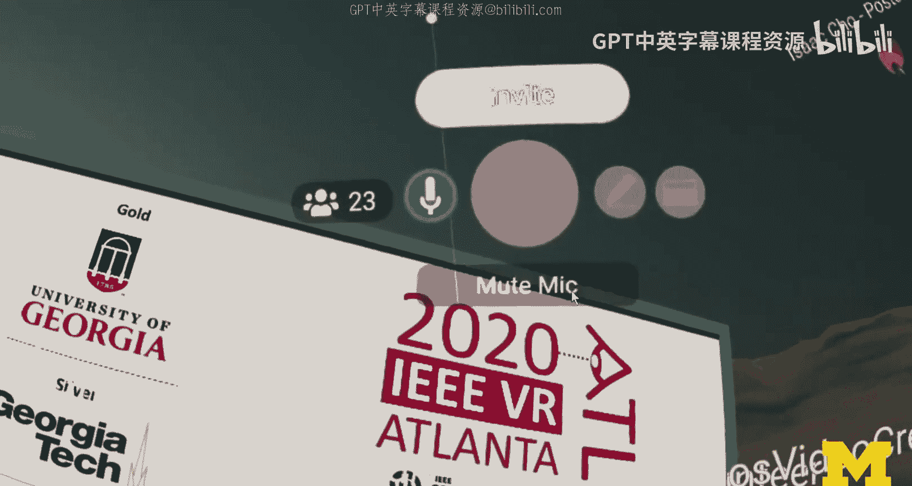

# 密歇根大学《面向所有人的扩展现实（介绍⧸设计⧸开发）｜Extended Reality for Everybody Specialization》中英字幕 p25 24_伦理与社会关切.zh_en -BV1jM4m1k73q_p25-

So what I'm going to do now for each of these groups of topics or larger issues。

 I'm going to ask a few key questions that I think we should concern ourselves with as we are thinking through some of these issues。

So the the first important question I asked here is how to promote ethical and responsible Xr design。

 This is really a question that is really important to me。

 It is inspired and informed by many discussions with colleagues and and other designers in the space。

 And I think it's really important。 and we don't actually know that yet。 I mean， I mean， theyre like。

 when you create an AR or VR app， it goes to an app store and then it will be reviewed by somebody potentially。

 and then it will be determined whether that app is kind of save to be used。

And then it goes out to the users and then we don't know when happens because we can't anticipate all the kinds of context of which these apps are being used and so how do we actually establish some kind of process and policy to actually govern some of this。

 it's really a big question。So how to increase control of users over XR apps？

So another big question that I'm thinking about a lot on the ethical side is how to increase control of users over XR apps。

I mean， the whole idea of ethical and responsible design is to be transparent and to give control to users。

And also make it safe， obviously。If you look at the current X experiences。

 the apps that you can download and try out。 I mean， they're not customizable。 I mean。

 they're just come in some standard configuration， basically more or less do what they the best。

 the most they can do in terms of what the devices allow them to do。

 So the limit is really more like the technology not like whether we should be using all these sensors is more like。

 we have access to all these sensors。 And so how do we give control to users。

 So maybe I want to trade off some accuracy and tracking if it means that you don't know everything that I have in my household。

 I mean， you as the developer of that Xr app。 And so I think obviously they're also obviously this also plays into accessibility issues that I'm gonna talk about later。

😊，What are new norms in social Xr apps That is an interesting question there's a lot of social and meeting oriented AR and especially VR apps so all space is a popular example it used to be second life and had all kinds of interesting issues around it and so it's a lot of issues in that space Harment is a really big one and how do you actually police this and is it okay to have like should we have real people observe what other people do and are they allowed to judge them。

 can they police them and should they be visible or not all kinds of issues there and what happens if you ban somebody from these platforms and should you ban and what's the threshold to banning it's really difficult。

 how do you trace identity and how do you make sure that this person uses that ID but then also has another ID？

All these issues。 How to mitigate concerns about XR use in public。 That， to me。

 is a big one because right now， I mean， when you walk around with the smartphone， that's fine。

 I mean。Legally， it's probably not。 And it's also like not the smartest thing to do。

 depending on how you walk around with it。 It's not the safest thing to do at least。

But nobody looks at you in a weird way。 If you take out your smartphone。 But if you were。

 let's say at the bus stop and you took out your VR headset。

Or you put some kind of glasses on your head， more like AR technology。

What do you think is going to go through people's minds around you and how do we mitigate those concerns Now。

 one way that is often done is through extensive advertising。

 So I suspect when Apple comes out with their new kind of whatever it is， glasses。

 itll be it'll look so cool and videos， it'll be heavily promoted。 and then at some stage。

 it'll be fine。 People may want to have that。😊，And maybe it'll mitigate some of the concerns。

 but overall this is something that society will figure out and what we need to do is actually make sure that we get a lot of the other issues right。

 so accessibility， equity， privacy and security and make those safe and customizable and maybe then trusts into these technologies will increase also a big issue is and I'll bring it up in a second is actually what happens with the data that's being connected。

And who processes has access to it。 And I think that who question is a really big thing。

 If you're a fan of that who company， and it'll be fine for you， but it may not be fine for others。

 And so that's something to really think about。So looking at the two issues on the right as one example in this space is really hard to give concrete examples is so broad。

 but let's revisit quickly when I went to IEEE VR conference in virtual reality so this was an interesting experience because a lot of people knew okay this is one of the first now remote conferences due to COVID-19 this is obviously a conference where people are very enthusiastic and interested and supportive to some extent at least of these technologies and so on the social XR side it was interesting because I did have I met a lot of people in VR I had interesting discussions talking to the avatars and it felt a little bit like meeting people at a conference at the rear conference so that was fine there were no weird moments but that was because it was overall a professional event the organizers also made sure that a lot of information was provided beforehand。

😊。

to really make sure this is a professional event and obviously people have a certain reputation and a responsibility when they go to these events and so kind of was fine。

ISo I'm one of the users of these VR devices I didn't use it all the time。

 So I saw a lot of people overall， though that didn't use VR devices。

 I'm not sure whether it has to do with them having specific concerns about these technologies are just like because it's very tedious and cumbersome right now the way it was set up you lots of little virtual reality rooms limited to like 20 people or something。

 it was really hard to find somebody just because of bandwidth and other kinds of issues we had to it's hard to scale these kinds of events it's the same with finding a big conference venue in the real world but it's much more solvable in actually in the virtual world because we can add more compute。

 if you will and then we can support larger meetings and venues wouldn't be such a big deal。

 I mean you still need to figure out some of the technical issues there no doubt。 But overall。

 it wasn't。Inesting experience and really played into some of these ethical and social concerns that I was just talking about。

 So one thing that was also noticeable with the VR conference was that actually attendance was virtual attendance was a lot higher normally this is a venue that is limited to I don't know。

4 to 800 people and in this time they had many more I've never been to VR to this conference before and so in many ways it actually had some interesting impact on the shape and the scale of the conference so maybe because the barrier to going there was relatively low it was for free as well and and so it kind of attracteded more people than usual that does mean that these Xr technologies are now enjoying more acceptance automatically shouldn't be interpreted this way。

 It's just interesting moving these venues into this kind of like online format。

Supporting it with a relatively state of the art virtual reality。

 technologies actually did have quite an interesting impact on how this whole conference played out。

