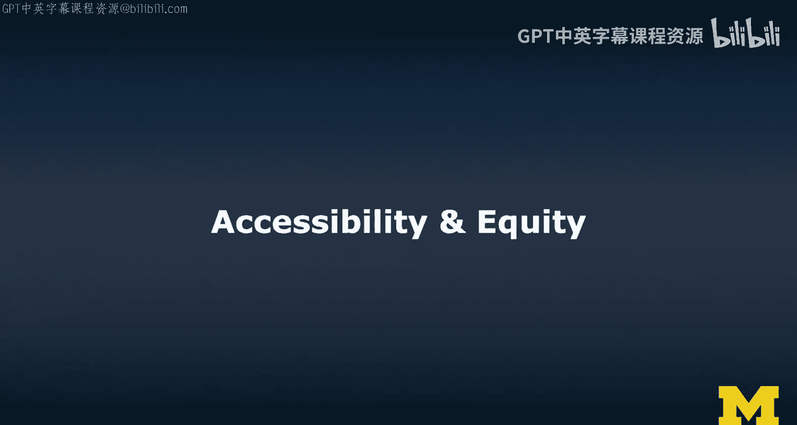
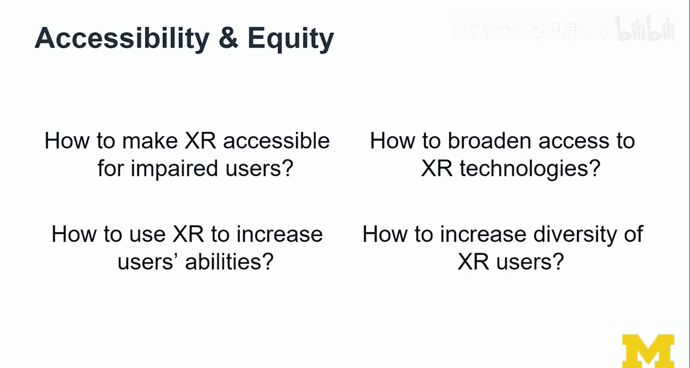
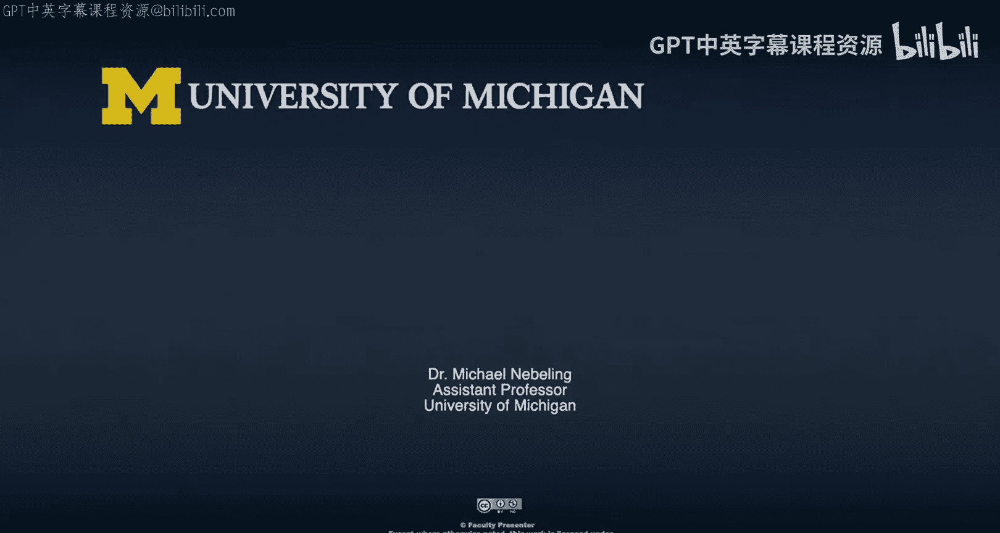

# 扩展现实（XR）入门：第26讲：可及性与公平性

在本节课中，我们将探讨扩展现实（XR）领域中的两个核心议题：**可及性**与**公平性**。我们将学习如何让XR技术服务于残障用户，以及如何利用XR增强用户的能力，并思考如何扩大XR技术的使用人群，促进多样性。

---

## 如何让XR对残障用户可及？

一个萦绕在我脑海中的重要问题是：如何让XR对残障用户可及？这确实是一个重大问题，也可能是人们最初听到“XR与可及性”时首先想到的。

目前，虚拟现实（VR）体验本质上是视觉主导的，而我们如今设计的增强现实（AR）体验也主要是视觉性的。因此，我们对视障用户的支持相对薄弱，现阶段实际上并未真正为他们设计。如何使其变得可及，这是一个大问题。

该领域的一个项目范例是 **Seeing VR**。这是微软研究院的一个研究项目，也是一个非常有影响力的**人机交互研究**。它是一个面向开发者的工具包，用于检查他们的应用程序。开发者可以尝试不同的视觉模拟模式，在一定程度上模拟不同类型的视觉障碍，并据此进行检查，确保以正确的方式调整界面。这是一个工具和努力的绝佳范例，也是一个我们需要看到更多成果的研究方向。

---

## 如何利用XR增强用户能力？

可及性实际上包含两个方面：一是如何让XR变得可及；二是如何利用XR来**增强用户的能力**。这两者略有不同。

现在，我们思考的是如何为目前视力不佳的人提供“视觉”。鉴于其中一些技术已经相当先进，尤其是在AR领域（我们拥有良好的空间映射、物体检测、地理理解能力，并且通过场景理解在语义层也取得了良好进展），我们实际上可以实时告诉用户他们正在看什么。这意味着，你可以为增强现实提供一个“屏幕阅读器”。虽然如何设计它仍然是一个大问题，但这可能非常强大。

在可及性方面，我想分享的一个例子是 **IGym** 项目，它同时也关乎公平性，因为它能平衡竞争环境，让更多人参与进来。这是我在密歇根大学与同事们合作的项目。IGym 是一个增强现实地板投影系统应用，旨在创建包容性健身房，支持适应性运动，让坐轮椅的儿童可以与其他坐轮椅的儿童（包括手动轮椅）以及健全儿童一起比赛。

我们进行了非常有趣的用户研究。整个研究设计的核心是如何确保公平。我们引入了一些家庭，孩子们带着他们的轮椅和朋友或兄弟姐妹一起来参与。我们以传统的用户研究方式进行，仔细思考了如何对战，其中涉及一些训练，甚至有一个完整的算法来帮助调整系统以进行平衡。

平衡是一个重要问题。实际上，我们并未完全做好平衡，系统有点“过度平衡”了，导致轮椅使用者经常战胜健全儿童。在某些情况下，这反而带来了新的感受，比如健全的孩子可能会想：“这是我第一次被弟弟/妹妹打败。” 这本身也是一种前所未有的体验。

从设计和开发的角度看，这个AR组件相对简单，但产生了很大影响。这也是一个重要经验：有时不需要复杂或超级先进的技术，简单的方法也能产生巨大效果。IGym 是一个很酷的例子，我们利用增强现实和一些额外手段（例如一个“踢球”按钮，可以虚拟地扩展你周围的个人空间来踢球），来增强用户的能力。

---

## 如何扩大XR技术的使用范围并促进公平？

这直接引向了与公平性相关的更多问题：我们如何**扩大XR技术的使用范围**？随着越来越多人拥有这些设备，我们何时能期望所有学生都拥有XR设备并尝试相关内容？在多大程度上我们仍需提供设备？目前，至少在西方世界的课堂上，我们可以说“用谷歌搜索这个”或“拿出你的笔记本电脑/手机”，但我们还不能说“让我们用VR/AR看看这个”。这是因为设备昂贵，人们对技术存在诸多担忧，这阻碍了采用。技术本身也尚未完全令人信服，虽然有像IGym这样很酷的例子，但我们需要更多这样的正面案例来展示潜力，从而扩大使用范围。我们需要从正面和负面例子中学习，但正面例子通常影响力更大，至少破坏性更小。

---

## 如何增加XR用户的多样性？

最后，另一个我经常思考的问题是：如何**增加XR用户的多样性**？目前的技术和例子大多来自西方世界。我怀疑在性别平衡上，AR/VR技术用户可能更多是男性（虽然没有具体数据），用户可能也更年轻。这可能是一种刻板印象，但基于现有观察和信息，这可能是事实。

因此，我们如何增加XR用户的多样性？是通过设计吗？这些设备是否需要看起来更时尚、更像时尚单品？外形因素肯定是一个问题，但我认为还有其他因素在起作用，例如**运动眩晕**。

一个事实是，女性用户更容易或更频繁地经历运动眩晕。运动眩晕意味着你在头显中感到头晕、恶心和非常不适。虽然男性用户也会发生，但女性用户更常见。从我自己的课堂教学经验来看也是如此。

我们可以从设计角度采取一些措施。例如，当你在虚拟空间中导航时，如果身体的实际感知与虚拟现实中的情况不匹配，就容易发生眩晕。因此，如果无法正确匹配，或者你同时看到太多内容（比如周边视觉），可以尝试更多地聚焦于中央凹区域，淡化一些周边视觉。在移动时暂时限制部分视野，就是一项改善体验的技术。这个领域也需要更多研究。

---

## 总结

本节课我们一起学习了XR领域的可及性与公平性。我们探讨了如何让XR技术对残障用户（尤其是视障用户）可及，并介绍了 **Seeing VR** 这样的工具。我们也学习了如何利用XR（如 **IGym** 项目）来增强用户的能力，创造更包容的体验。此外，我们还讨论了扩大XR技术使用范围所面临的挑战（如成本、认知），以及如何通过展示有影响力的应用来促进采用。最后，我们审视了增加XR用户多样性的重要性，并特别提到了女性用户更易遭遇运动眩晕的问题及其潜在的设计缓解方案。推动XR的可及性、公平性与多样性，对于这项技术的健康与长远发展至关重要。