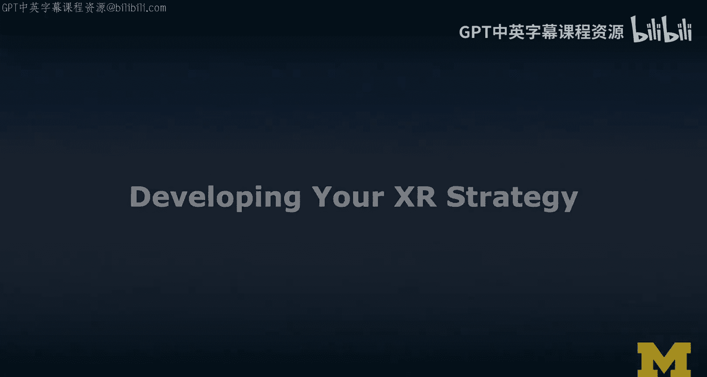
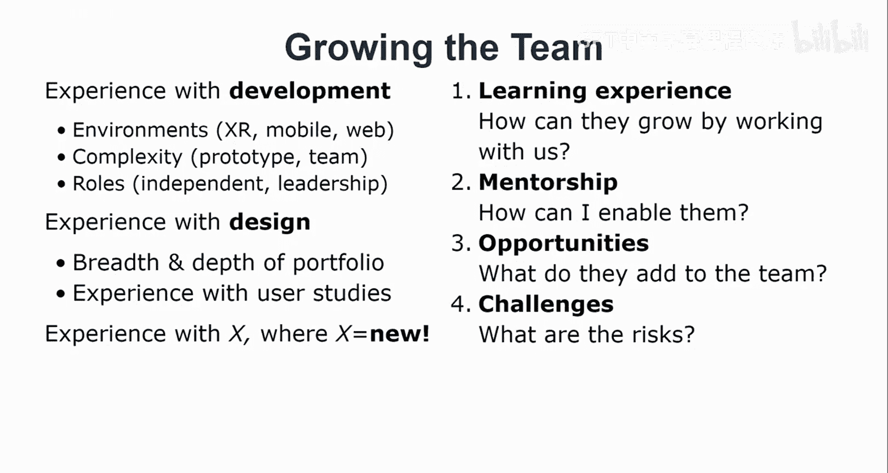
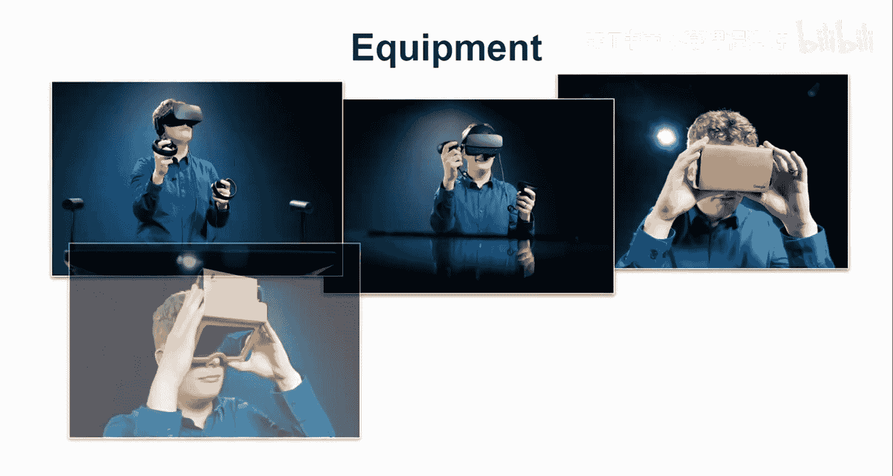
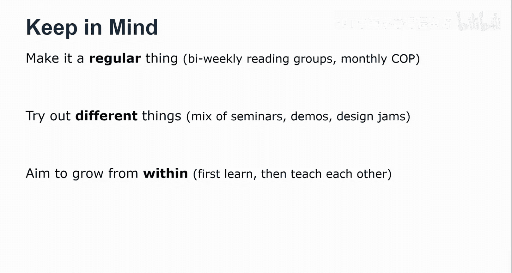
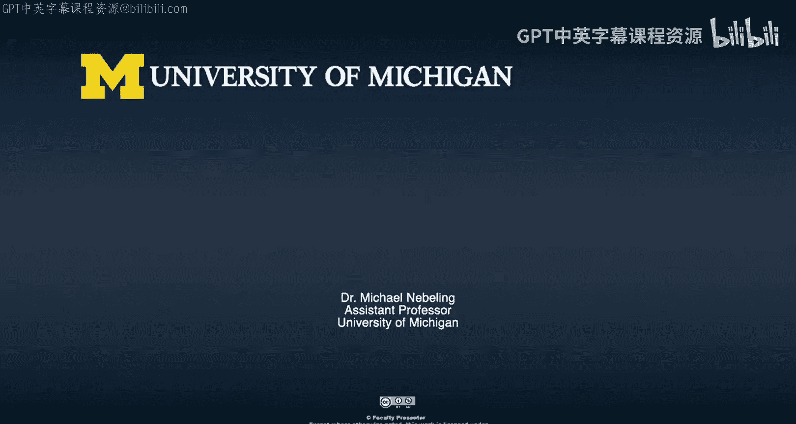

# 密歇根大学《面向所有人的扩展现实（介绍⧸设计⧸开发）｜Extended Reality for Everybody Specialization》中英字幕 p30 29_XR战略规划方法论.zh_en -BV1jM4m1k73q_p30-

In this video we're going to talk about developing your XR strategy so this is really designed to be a lecturer around this idea of growing your experience。

 your knowledge， your team your equipment making a good strategic decisions now I'm not a businessman。

 I mean what do I know about XR strategy so I would argue that over the last five years I have developed a little bit of a strategy so as a professor at the University of Michigan obviously my role is to do research so I have to grow a team in fact I actually have to train students and I chose to train students in this area of XR then I'm also involved in some of the more strategic decisions at the University of Michigan so currently I'm the XR faculty innovator and residence as part of the University of Michigan wide XR initiative。

That actually spans and all 19 schools and colleges still。

 I don't know too much about business or don't think of this as a business strategy lecture。

 but think of it as a well， a lecture where Im trying to share some of the insights I've gained over the past few years。

 so I wanted to。Start at the beginning。 what are really the considerations that you have to make I was thinking well。

 you have to think about knowledge so what knowledge do we actually have on the team and what do you want to learn so what do you want the team to learn how to diversify where to acquire new knowledge so we're going to talk about that I love it that obviously is a lot about team So strategic considerations have a lot to do with team building and what kinds of talent do you need to have on your team so what roles do you have right now and what is actually a good composition。

 what are new roles you need to create obviously XR is a lot about equipment。

 So basically just buying things when there is a need and a need means there is a project and potentially funding behind the project also what kinds of tools what kinds of tools do I learn and what kinds of how do I embed them into the process。

 what is the workflow and then users， first of all。

 obviously if you have a product or service in this space who？

Are your users and the target users and then what tasks do you want to enable， obviously？

What problems do you want to solve， but that's obviously the first important thing to ask。Now。

 I'm going to talk about each of these。 So knowledge， team， equipment and users。

 And so we're going to go through each of these and thinking we' are taking a mindset of growth。

 a growth mindset here， so。On the knowledge side。 so it helps to have knowledge。

 obviously in the applications。 I don't mean like I've played beatabber and Pokemon Go。 I mean。

 that's maybe the first step。 No I mean， really like having an overview of the kinds of applications that out there。

 We need to have decent knowledge about the technologies for any kind of new solution that we create or want to create。

 really have have to have a basic understanding of what kinds of technological options do we have。

 You definitely want knowledge in the space of what are the key issues right So somebody who thinks through the social。

 the ethical concerns the ethical concerns are really important and how they influence design。

 how they drive design， how they inform design。 You want to have knowledge in design in this space。

 obviously a traditional or let's say a very basic UX background is a good start。

 You want to have knowledge in the development tools and environments you want to have an understanding of how to build against some of these technologies。

 What a fast and rapid。Test driven development cycles， How do you quickly deploy to these platforms。

 how to debug and what debug actually means and how do you inspect XI experiences。

 So that's definitely what I want to have knowledge you also want to。

Have knowledge on the management side so building a team of people that can innovate and work in this exercise space is hard。

 It definitely requires experimentation。 I'm not sure I have the solution I've been experimenting over the last few years。

 obviously management also has to do with financial decisions and including also what kinds of equipment and tools you may want to acquire and invest So growing the knowledge。

 Well it often just takes one person and evangelist like this person here。

 a VR adopter walking around and showing it to other people。

 a strategy that we've often used and this maybe works best in academic context but in general is a reading group。

 like bringing together people from a variety of research groups or research area so I'm involved in a few reading groups。

 not always as active as I wished， but is one。By academic innovation here。

 that's an entity at the University of Michigan， it's quite broad drawing in a lot of people and we did a reading group around XR。

 one thing that I think is very useful is a community of practice having this opportunity。

 maybe once a month to gather and bring together people from across the well institution let's say so the university or the company or the little team that you work on maybe bring in people from the outside for some technology demos we've done this quite a few times let's talk about the team so when it comes to the team obviously you can think terms of roles so I need the designer on my team do I need more than one designer I don't know I need at least one developer。

 somebody who really understands that technology， maybe somebody who knows unity。

Do I need the manager， Am I the manager， So that's something to think about in the X space。

 How much is there place for artists is actually a really strong place for artists and it's a really good place。

 and then researchers researchers are really both on the academic side or user experience research side。

 So a little bit more practitioner oriented， like finding ways of well finding bugs and finding issues and improving the product as opposed to finding evidence for a hypothesis and and doing somewhat more rigorous scientific research how much do you need to have somebody with an entrepreneur character on your team。

 So somebody who manages and goes beyond and maybe drives innovation and also things about acquiring funding。

😊，So I feel like as a professor， I'm like in each of these roles a little bit。

 but I'm going to share a little bit my strategy of how I've tried to grow。My team at least。

 So the first thing I usually look for still is actually experience with development。

 and just like these technologies are quite technical。 So in some sense， it's a filtering mechanism。

😊，If you're not technical， that doesn't mean that I will not look at your materials。

 but I'm looking for experience with XR， any kind of development experience with XR。If not。

 then at least some kind of mobile web development experience。 I'm looking for a portfolio。

 I'm looking for projects in that portfolio。 and I'm looking for the complexity of the prototypes that were created。

 and also the， the size and the complexity of the composition of the teams。😊。

That somebody has worked in， so have they worked actually in teams or is everything individual？

I'm looking for roles， whether there is a lot of independent work or a lot of well teamwork。

 and then to which extent was it leadership， and that's something that I'll just think about。

I am looking for experience with design， this is often still very necessary。

 but most of the times I'm looking for somebody who can bridge both design and development I'm very interested in whether somebody has experience with running and designing and conducting user studies。

So that was very important。And finally， obviously， there's always this adding this any kind of talent to the team。

 So is there experience with X where X is really new and if if this new thing would be significant。

 there's always a place in my team， at least。And then when I bring somebody into the team。

 I'm usually thinking about how to make this a productive and useful learning experience for the new team member。

 I'm asking myself， how can they grow by working with us like what do they get out of it。

 what what can we provide， In fact， mentorship is something that I really think about。

 can I actually， how can I enable them， what can I provide are there。

Things that they need to grow in， and do I have the knowledge and experience to support them and do I have the time？

And then I'm looking at opportunities。 So what do they actually add to the team if they were to join us and this is a little bit more generic。

And I do make a risk analysis， so I'm thinking about the challenges of bringing somebody into the team。

 so how much overlap is there with existing skills， how much do we grow。

I'm thinking about team dynamics and all of those usual things as well。

 So that is not specific to XR。

Thinking about equipment so throughout this course we've really made an effort of bringing in all the equipment or a lot of the equipment that I have access to some of it I bought。

 some of it I was given by vendors sometimes the school chipped in some money but a lot of it was actually me sourcing。

 if you will， the equipment and I just show basic devices here。

 but there's a lot more custom stuff in my lab。

So this question around equipment is really an important one。

 So when can you use an off the shelf device and which of these do you actually buy growing the equipment。

 really， I would say， first of all， your firm is a great start。 I mean。

 if you're not running a team or something， if you're just by yourself or exploring this in a little group。

Really start from what you have， which most likely is a smartphone and then explore ways of turning it into an A device or Mac based or even Mac less if it has support for it。

or into a VR device。 my approach has always been to be to go more broad rather than deep。

 So what I mean by that is I don't buy like X times the same device。

 I'd rather have a variety of devices。 So I'm aiming always for a good mix。

 both of AR and VR devices。And the beauty is when you have a variety of devices。

 they can be combined in an interesting way。 So I do have a number of just keyns still around。

 we have some Intel realosend。 So we can use some of these steps cameras to support some of our more custom kinds of setups。

 I've been building my own displays you can also combine your traditional like smartphone and touch with a Hollolen tablet or smartphone touch with a Hollolen and can build new kinds of experiences that way。

 at least that's how it's often approached and research。

 So Ive I've usually looked for this power in combination and really trying to go complementary in terms of technologies。

😊，And then what is really important to me is that we actually have equipment that is set up that is always available and ready。

 I usually try out the latest。 I try， try it out， but no need to buy it yet。 I never buy em bulk。😊。

And so one thing that I'm often asked and I don't know where I didn't really know where to fit it in。

 but I thought this is a good place is when it comes to buying new equipment。

 So look for a powerful graphics cards。 an example here is the Nvi RD X series。

 you're looking for a decent CPU I7， you can get away with less。

 the most important is really the graphics， the GP and then people always think they need a lot of Ram。

 like 32 gigs while that is cool and it's actually not that expensive。

 I think all you need is 16 gigs at least at this stage。

 unless you're really loading a lot of like know very complex model it's a lot of stuff they you need to actually keep in memory。

 But my thinking is a GPU larger than CPU larger than Ram。 So higher priority。

 So then let's think about users So internally in your team。

 you really want people to adopt more of these technologies。 So often takes one person。

 if you are a user but more like with。😊，or develop a background。

 then what you really need to do is you need to embrace these XR technologies。

 you need to learn about the methods and tools， how some of your traditional methods and tools need to be adapted。

 you need to help create design knowledge by doing not by thinking about it but by doing projects and creating。

 helping create design guidelines and revising guidelines and also creating some kind of design patterns as a researcher or instructor you really have a place here because you can shape the future of XR you're actually training the talent。

 So if you can somehow bring it into your classes as a way of growing users that would be the user base that will be really good I'm always looking for creating new learning opportunities so even in a class that is not focused on design or development or anything like that as a researcher or instructor your role is actually to spread the knowledge as a manager。

entrepreneurprene， I think you really need to know the players。

 the key players like who are actually the people where is essentially funding available and then develop some extra strategies。

 So growing the users really could be through seminars right So you have an evangelist or somebody who knows the stuff and then talks about it。

 I think betterette is actually giving demos。 So really learning by doing or trying things out。

 I think is very good。 workshops， it's kind of like a combination of seminars and demos。

 workshop is really much more active。 I think it is one of the best ways to learn about these things。

 one tool that I think I have used and has's been very successful actually in my little career here in Michigan is a design jams。

 side effect of each of these activities is after that somebody will walk away that has not seen Xr yet。

😊，And they will then go to the next person and maybe become an evangelist and so， you know。

This then creates an interesting cycle and hopefully it spreads the knowledge。

Yeah so that brings me to the end， at least I wanted to convey a few ways to think about XR strategy。

 not just in terms of promotion and marketing， but really a much broader view on things so how do you what kind of knowledge do you have。

 how do you grow the knowledge， who do you have on the team， how do you grow the team， equipment。

 how do you make good decisions there and then users and users was really broad。

 not just like the users that youre designing for， but also like growing the user。

 the user base of XR？Okay， so let's wrap up here， keep in mind。Whatever you do in this X space。

 make it a regular thing， so maybe biweek reading groups or maybe even weekly。

 some kind of monthly community of practice， some kind of ritual that people know is happening and if they miss out on one opportunity they know the next one is coming up。

😊，I would always encourage you to try out different things。 So go for a mix。

 I've been experimenting over the last few years。 I've tried out a mix of kind of like seminars。

 demos， design jams， all these kinds of things。And interest in these things also shifts。

 I don't think that you have to stick to one of those。

 You can offer different kinds of these opportunities to。

For others in the community to engage with you， I think you should aim to grow from within。

So obviously it's nice to look for collaborators and like minded people outside your groups and your teams。

But bringing in knowledge from the outside is not as effective， I would say。

 and so don't just look for other people working in the X space， but be strategic also here。

Bring in enthusiasts from the outside。 so by enthusiasts， I mean。

 people who are passionate potentially about XR， but they are primarily domain experts in their specific domains。

Again， I hope this was kind of useful and look forward to some of the feedback and hearing some of your thoughts about this lecture。

 I'm sure I can improve some aspects also with your help and over the next few years but this is the knowledge that I thought I could share at this stage and maybe it's the starting point for an interesting discussion among us and also learning about other strategies that others have employed。

So well， thanks for watching this。

