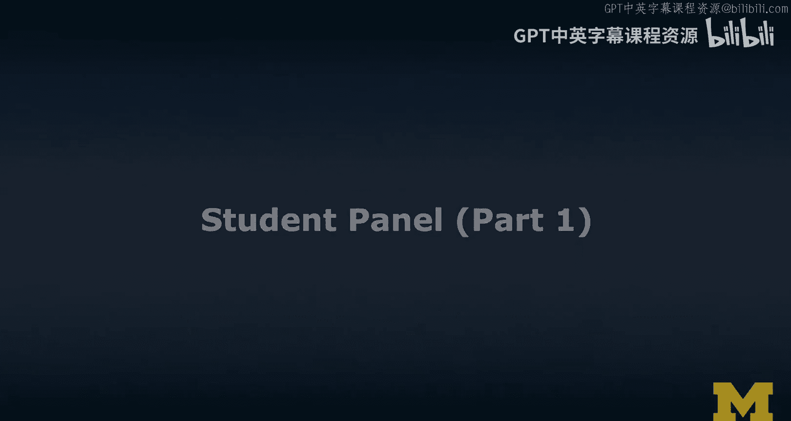
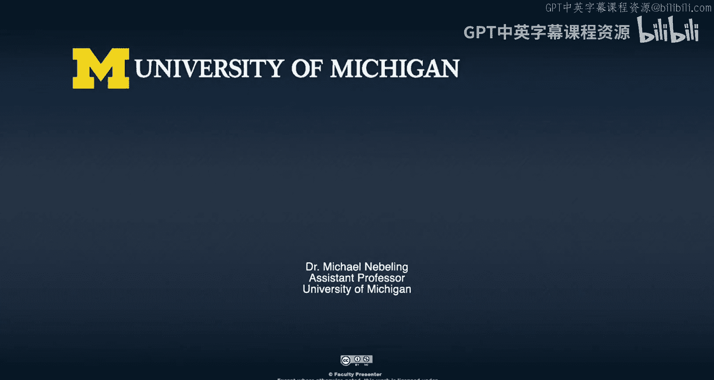

# 扩展现实（XR）学生论坛：第一部分：学生主导的XR社区建设

在本节课中，我们将学习密歇根大学学生主导的“替代现实倡议”（ARI）社区如何从零开始，通过组织活动、研讨会和会议来推广XR技术。我们将了解他们的组织结构、活动内容以及面临的挑战。

---

大家好，在这个环节，我想讨论一些学生倡议，特别是密歇根大学校园内的一个学生倡议——“替代现实倡议”。我邀请了几位几年前结识、在该领域非常活跃的学生。我们将讨论他们遇到的挑战，以及这个总体上相当成功的倡议是如何运作的。我们先向大家介绍一下自己。从你们开始，说说你们是谁，以及在“替代现实倡议”中的角色，然后我们就可以开始了。

我叫Matthew Yussova，是“替代现实倡议”的现任联合主席，也是联合创始人之一。

大家好，接下来是我。我叫Bessta En，是现任联合主席。

大家好，我叫Michael Deang，是ARI的联合创始人和前主席。

很好，我是在和所有的主席们对话。这很棒。那么，这是一个学生倡议。几年前我参加你们第一次启动会议时，印象特别深刻的是你们在这个倡议中表现出的专业性。当时Michael是主席，周围还有几位其他成员。请告诉我，在组织架构上，你们是如何运作的？进展如何？有多少其他主席或团队成员？有哪些类型的角色？你们内部是如何组织的？让我们从这个话题开始。

当我们开始时，我们就像一群来自不同背景的学生。我们发布了一个Facebook公告，试图寻找其他对VR和AR领域感兴趣的学生。Matthew和我就是这样走到一起的。从那以后，我们开始组建一个正式的学生组织，设立了不同的角色和领导结构。过去几年，我们团队的成员也发生了变化。

是的，目前我们设有不同的职位。我们一直有副主席，现在是联合主席。除此之外，我们通常有专人负责会议期间的研讨会。现在有了项目团队，我们也有项目团队的负责人。我们还通过会议和不同类型的拓展活动举办各种社区活动。因此，我们有一批不同的领导成员来担任这些角色。目前团队中有八位不同的领导成员，这样我们可以把工作分配给每个人。

这包括像市场营销，我想，还有关于你们各种倡议的沟通。我很自豪能每周收到你们的通讯。那么，还有其他什么事情在进行中？Bessta，你目前主要负责什么？

目前，作为联合主席，我主要专注于研讨会和开发方面。我帮助组织研讨会，确保我们每次研讨会会议都有新的、不同的内容。我们也会用一些社区活动来平衡这些，比如电影之夜、游戏之夜，以建立我们团队的社区感。

基本上，我想主要是对XR感兴趣的学生。你们是如何招募的？你们希望什么样的人成为你们社区的一部分？

在大多数情况下，我们欢迎任何人。我们向校园内的任何本科生或研究生开放。大多数情况下，我们的学生确实更偏向技术或STEM背景。很多学生来自计算机科学或其他类似专业。至于我们如何实际招募学生，我们会在校园内的不同活动中进行招募，例如密歇根大学的“Festifall”和“Northfest”。研究生院也有他们自己的活动。通过这些活动，我们能够获得广泛的接触。通常，在“Northfest”和“Festifall”期间，我们能让大约250到300名本科生注册我们的通讯。通过研究生院的活动，我们还能让大约50名研究生注册。这确实是我们建立社区的方式。无论他们是否实际参加我们的会议，我们至少能把我们的信息传递给他们，无论是关于我们每周会议的信息，还是我们看到的任何工作机会，或者我们举办的任何活动。我们也不区分经验水平。有些经验更丰富的人会来参加我们的会议，也有刚刚起步的人。我们确保我们的研讨会内容对这两类人都适用，因为我们希望新人能够学习，也希望有经验的人能有一些挑战。

补充一点，我们创建ARI时，设想学生将经历四个不同的领域：从探索XR技术开始，然后通过我们的研讨会学习，接着构建不同的项目，最后与XR行业的其他学生或人士建立联系。这样，我们可以吸引处于XR旅程不同阶段的各种学生。

这很棒，对于想要启动倡议的人来说，这里有很多有用的建议。我听到的一些要素包括研讨会。ARI给我的印象一直是，人们聚在一起学习XR。你们能举一些你们举办过的研讨会的例子吗？

我们的一些研讨会非常技术性。例如，我们有一个通过Unity进行的Oculus Rift研讨会，教授Oculus Rift的基本编程和控制。我们有一些增强现实研讨会，比如创建Snapchat滤镜，这是一个更有趣的研讨会。然后我们还有一些不直接与XR相关的，比如Blender建模教程，这样人们可以制作自己的资源并导入到他们的VR/AR项目中。我们试图通过研讨会涵盖很多基础内容。

这些研讨会是由你们组织的，对吧？我记得参加了一些研讨会，至少我参加的那些是其他学生在主讲。这是常态吗？那天是特殊情况吗？

在大多数情况下，是我们，也就是我们的领导成员，来举办研讨会。通常，我们的领导成员需要几周，甚至几个月的时间来准备研讨会材料、进行练习，并为这些研讨会在我们的网站上创建在线博客，以便其他学生可以跟着学习。所以大多数情况下是我们自己举办。不过，就像你说的，我们有时也会邀请其他学生组织或公司的嘉宾来举办他们自己的研讨会。例如，去年我们有一个HoloLens研讨会，就不是我们自己举办的，而是由另一个学生组织为我们做的。

这很酷。我听到Michael和Matthew提到，要借助其他活动来真正扩大影响力，数字确实令人印象深刻。我甚至不知道有这么多人对XR感兴趣，因为在我的课堂上可能只看到大约40名学生。我同意，硕士课程的候补名单更长，但我想在本科层面，你们有很多本科生成员，而且我想你们自己实际上也是本科生，所以你们目前是他们的大本营，我认为你们做得非常好。

我们有研讨会。我知道在某个阶段，我们真的需要谈谈最令人兴奋的部分之一，那就是你们自己的会议。但除了研讨会，我也注意到很多有趣的活动。你说过《Beat Saber》锦标赛是其中之一。你们还做了哪些事情来保持社区的高参与度？

我们做过的一些事情包括《Beat Saber》锦标赛，这是比较有趣的活动之一，我们也试图让俱乐部外的人加入这些有趣的活动。我们还举办一些电影之夜或电视剧之夜，观看与VR或AR相关的内容。我记得有一次我们看了一集《黑镜》，非常有趣。这些是我能想到的，但我们试图让外面的学生来参加这些活动，因为这比研讨会更像是一种有趣的体验。

是的，除了做这类社区活动来吸引我们的社区，我们还开始做项目团队。这帮助我们拥有一个核心学生群体，他们某种程度上“被迫”参加我们所有的会议，这有助于我们的成员留存。通过项目团队，五到七名学生组成小组，共同完成他们想出的项目。他们参加我们的每次会议，与我们的领导成员会面，讨论进展，可能还会学习不同的项目管理方法。过去这一年，他们有机会与Michael你见面，从你那里获得一些指导，并在他们继续工作的过程中得到其他建议。

是的，但我想我们担心的一件事是，如何为学生设定正确的激励措施，让他们坚持完成一个本质上只是为了自己学习的完整项目。我们当时认为我应该更多参与的一个原因是，也许我可以给他们一些学分。但最终，他们似乎都只是为了乐趣而做。我不记得有人问过我是否可以将此作为独立研究。所以激励似乎主要是“我只是想了解这些东西”。但学生们有具体的目标吗？他们想在XR行业找到工作吗？或者他们是如何看待的？除了乐趣之外，他们的动机是什么？显然，背后是否有职业动机和目标？

我认为目前是混合状态。我知道一些学生目前在这个行业工作，无论是通过实习还是咨询工作。但对于我们的大部分学生，包括我自己，很多这只是因为这是一个有趣的领域，他们喜欢这项技术，认为它未来可能有很多不同的应用，所以想现在了解更多。当然，在校园里，我们是学生，尤其是本科生，来学习XR的主要资源之一。是的，我确实认为有些人想专业地进入这个领域。至于项目团队，目前他们的目的只是创建一个项目。你之前提到了我们的会议，我们也让我们的学生项目团队在我们的会议上展示，展示他们的工作，向在场的其他公司或与会者展示。

是的，但我必须说，对于自主学习和项目，项目的质量相当高。他们基本上是通过你们的研讨会和自己的参与自学成才的。显然，我注意到很多技术背景的学生，所以他们有很多技术技能。如果你会编程，你可以在XR领域做很多事情。我想你们未来可能想做出一些改变，以吸引更多人，但质量确实很好。

我想继续谈谈过去两年可能的一个亮点。我参加了你们的会议——XR Midwest会议。我记得Michael和Matthew你们去年启动了它，然后今年不得不再次举办。你们能多告诉我们一些关于XR Midwest会议的目标吗？谁来了？你们的主要收获是什么？

是的，最初举办会议的想法是，我们身处中西部。当我们启动ARI时，我们一直面临的一个困难是，在校外找不到太多资源来支持我们。在中西部，没有那么多大公司总部设在这里，大多数都在西海岸，也许东海岸，南部和德克萨斯也有一些。但在中西部这里，无论是公司关系还是不同活动的机会真的不多。我们最终从申请的一个项目中获得了额外资金，并决定用这笔额外资金举办一个会议。第一年我们没有赞助商，几乎一切都是我们自己做的。然后我们能够邀请到大约八、九家不同的中西部公司来向学生展示，谈论他们如何在中西部工作，谈论他们的产品，以激励我们的学生和其他与会者更多地了解这个行业，看看外面有什么机会。我认为在2019年第一年，我们最终有大约80名与会者，10位演讲者。总的来说，我们从那次活动中得到了很多非常好的反馈。举办XR Midwest的另一个动机基本上是试图汇集我们从行业内外人士那里获得的所有不同资源和知识，并试图提高其可及性。对于我们团队的许多成员来说，我们有机会参加美国各地的XR行业会议或XR黑客松。但对于许多这样的大型活动，你有机会与行业人士建立联系，或者在黑客松上从事非常令人兴奋的项目，对许多学生来说，参加这样的活动费用高昂，通常需要数百美元。既然在中西部还没有其他类似的大型活动，我们也知道中西部对XR感兴趣的学生和专业人士社区正在不断增长。举办XR Midwest本质上也是我们回馈更广泛社区的方式，而不仅仅是大学内的倡议。

说得很好，真的很酷，也非常成功。今年它不得不转为线上，但出席人数非常高。对今年这个版本的会议有什么主要的收获吗？

是的，今年就像你说的，我们必须从线下转为线上，这给了我们大约两周半的时间来做这件事。嗯，是的，没有太多时间重新启动整个营销活动来争取与会者，但最终结果如你所说，我认为活动当天我们有大约200名独立访客，或者有300个注册。但我的主要收获是，无论发生什么，人们总是会对这个话题感兴趣。所以，无论我们是线下举办还是通过Zoom线上举办，无论如何我们都会吸引到人，无论如何我们都能够传播信息，或者像Michael说的，能够回馈我们的社区。对于线上版本，我们真的不仅关注密歇根大学的学生，还关注吸引密歇根州乃至我们营销目标中西部地区的与会者。所以基本上，无论如何，我们总是能让人们感兴趣。只要我们能够把我们的信息传播出去，并解释我们举办会议的原因，我认为我们就能取得成功。

好的，所以ARI一直是校园内本科生XR领域的主要推动力之一。但除了ARI，你们认为校园内甚至校外的学生还有哪些学习XR的机会？能举一些例子吗？

我们一直在做的一件事是邀请在这个领域工作的教授或人士来我们的会议，谈论除了ARI之外探索XR的机会。这可以通过校园内的研究机会，或者我们通过通讯发布的一些工作机会来实现。我们也鼓励学生在ARI之外做项目，比如通过参加黑客松。我记得第一年宣布这些黑客松时，只有两名学生，我和Michael参加了第一个。然后第二年人数增加了，我们有四名学生参加了黑客松。所以我们一直在推动我们的学生在大学校园内外探索XR。

---

本节课中，我们一起学习了密歇根大学“替代现实倡议”（ARI）学生社区的建设经验。我们了解到，一个成功的XR学生社区可以通过以下方式建立：从兴趣小组起步并逐步正规化，设立清晰的组织架构和角色分工，通过校园活动广泛招募成员，并举办涵盖不同技能水平的研讨会和有趣的社区活动来保持参与度。此外，创建项目团队和举办区域性会议（如XR Midwest）能有效提升学习深度和行业连接。学生的参与动机混合了兴趣探索和职业发展，而社区的成功关键在于提供持续的学习资源、实践机会和行业网络。