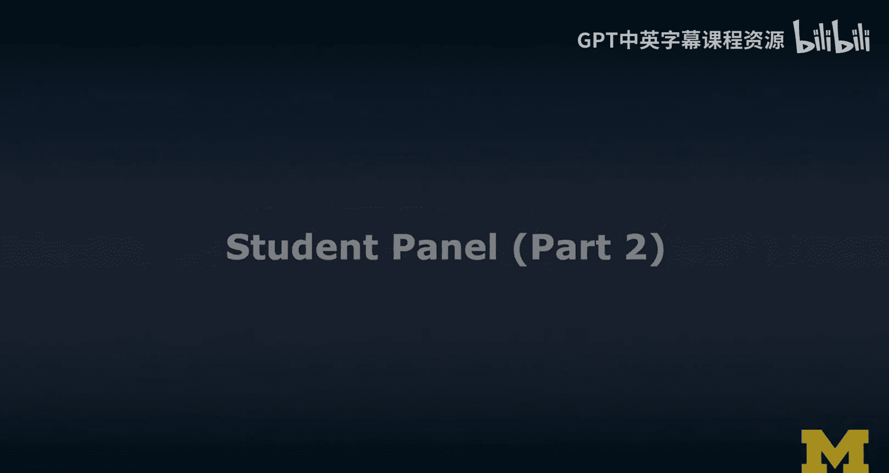
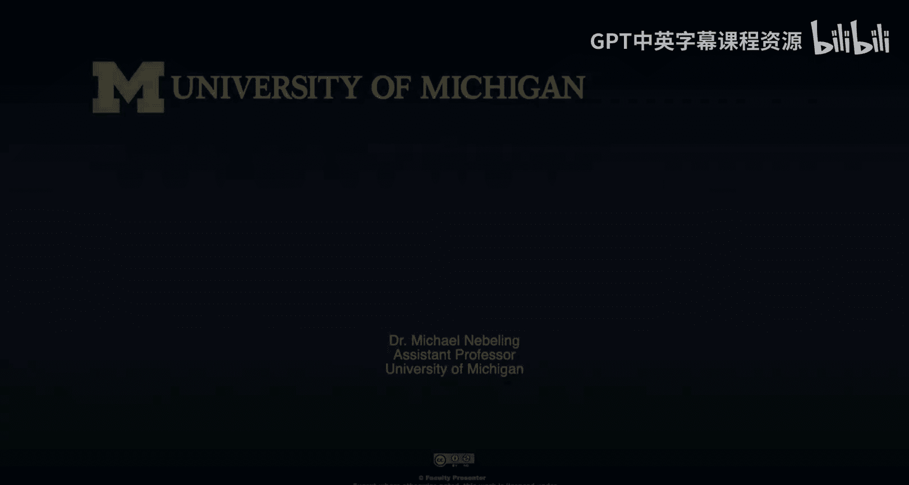
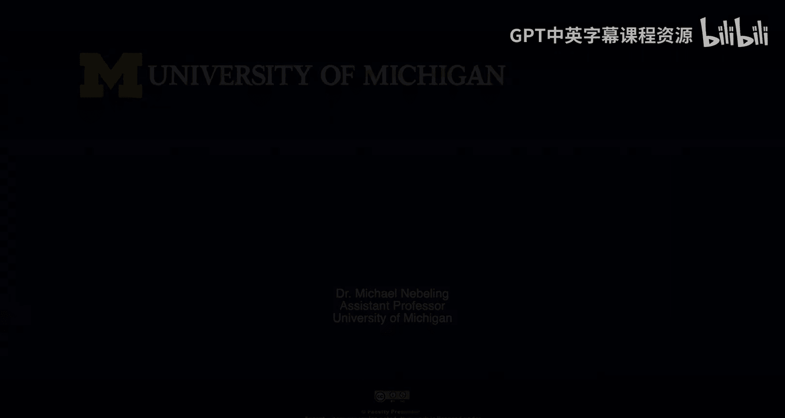

# 扩展现实学生论坛：第二部分：学生倡议的挑战与展望

在本节课中，我们将继续探讨学生主导的扩展现实（XR）倡议。我们将重点关注学生领袖在推动此类倡议时遇到的实际挑战、他们采取的应对策略，以及他们对XR领域未来发展的展望。

上一节我们介绍了“替代现实”倡议的成功故事，本节中我们来看看他们在发展过程中遇到的具体困难以及如何应对。

## 学生领导力的个人收益

首先，我们探讨学生领导者从这类倡议中获得了哪些个人与职业上的收益。

**问题**：领导这样的倡议对你们作为学生和未来的职业发展有何益处？你们是否立志成为XR领域的未来领袖？

**回答**：我们成立了一个名为 **ICXR（Intercollegiate XR Community）** 的组织，旨在联合美国各地的大学，共享资源和建议，以吸引更多学生进入XR领域。在我的职业生涯以及我为各个组织（如“替代现实”倡议和线上社交VR社区）所做的贡献中，核心原则始终是 **“吸引更多人进入XR领域”**。因为这不仅能培养更多开发者，也能带来更多用户，共同推动XR走向主流未来。

## 倡议发展中的具体挑战与应对

在谈论成功的同时，我们也必须面对挑战。以下是“替代现实”倡议遇到的一些主要困难及其解决方案。

### 挑战一：技术资源的可用性

**问题描述**：起步阶段，XR技术较新，资源有限。
*   **初期状况**：学校可视化工作室最初只有2-3台连接电脑的头显。团队需要自购设备，并在技术层面遇到困难，这导致早期更侧重于增强现实（AR）。
*   **解决方案与现状**：随着虚拟现实（VR）的普及和社区兴趣的增长，学校加大了对该技术的支持。如今，可视化工作室配备了多种头显，并有专业 staff 提供技术支持，已成为成员会议和工作的绝佳场所。**技术可用性从最初的挑战，转变为推动我们成长和教学能力提升的关键因素。**

### 挑战二：成员参与度与留存率

**问题描述**：作为学生倡议，活动参与度受学期周期（如考试）影响很大，难以维持工作坊的活跃度和参与人数。

以下是他们应对参与度挑战的具体策略：

**策略列表**：
*   **持续进行招新**：通过大型招新活动不断扩充邮件列表，即使不是所有人都参会，也能扩大潜在受众基础。
*   **优化活动节奏**：减少纯技术工作坊的频率，增加社区活动和非技术性聚会（如游戏之夜、电影之夜、披萨聚餐）。采用 **“技术工作坊”与“社区活动”交替进行** 的模式。
*   **活动形式多样化**：这既能吸引不同技术水平的学生（高级开发者可能觉得基础工作坊不适用），也能满足那些只想参与社区、了解XR而非专注开发的学生。

**效果**：通过上述策略，最近一年的留存率显著提高。首次会议有约50人参加，后续会议平均能保持25-30人。

### 挑战三：启动阶段的资源与指导获取

**问题描述**：作为大一新生，在启动倡议时，难以获得教职员工的关注和实质性指导。

**应对过程**：
1.  **尝试联系校内资源**：向所有从事XR研究的教授和教职工发送邮件，寻求关于校内XR生态系统的信息、指导或反馈。
2.  **结果**：虽然通过暑期视频会议与部分人建立了联系（例如与Michael教授），但大多数联系未能深入，未能获得持续支持。
3.  **策略转向**：将重点转向其他学生。团队与约 **50名** 来自其他大学、运营XR组织的学生交流，了解他们的成功经验、活动类型以及失败教训。
4.  **结论**：“替代现实”倡议的许多成功模式，都源于从这些活跃学生社区获得的建议和反馈。**学生社群间的互助是成功的重要因素。**

## 当前与未来的挑战及愿望

了解了过去的挑战后，让我们展望未来。当前最大的障碍是什么？如果许愿，希望获得什么支持？

**核心挑战**：**克服XR未来发展的不确定性**。
许多学生最初对XR技术充满热情，但将这种兴趣转化为职业追求面临挑战。因为目前行业中的许多人是从其他领域（如游戏、软件）转型而来。而像我们这样的学生，属于 **“首批”** 直接从大学开始探索XR并计划以此职业的学生群体。我们正在尝试为后来者开辟一条道路，但在XR发展速度和具体机会尚不明朗的情况下，这是一项艰巨的任务。

**愿望**：希望有更多清晰的路径和案例，展示学生如何能在XR领域规划职业生涯，尤其是在这个领域仍在快速演变和成长的阶段。

## 总结

本节课中我们一起学习了学生XR倡议所面临的多维度挑战：
1.  **资源挑战**：从技术设备匮乏到获得学校支持，体现了基础设施的重要性。
2.  **运营挑战**：通过持续招新、活动多样化（交替进行 **`技术工作坊`** 和 **`社区活动`**）来提升成员参与度和留存率。
3.  **启动挑战**：在难以获得自上而下指导时，转向**平行学生社群**寻求经验与支持是有效的策略。
4.  **未来挑战**：最大的长期挑战在于**应对XR行业发展的不确定性**，并为学生探索职业道路提供更多参考。

“替代现实”倡议是一个几乎完全由学生自主驱动并取得成功的典范。它展示了即使在没有大量初始支持的情况下，通过学生间的协作、坚持和灵活的策略调整，也能建立起一个有影响力的社区。对于有志于启动类似项目的学习者来说，这个故事提供了宝贵的经验和鼓舞。