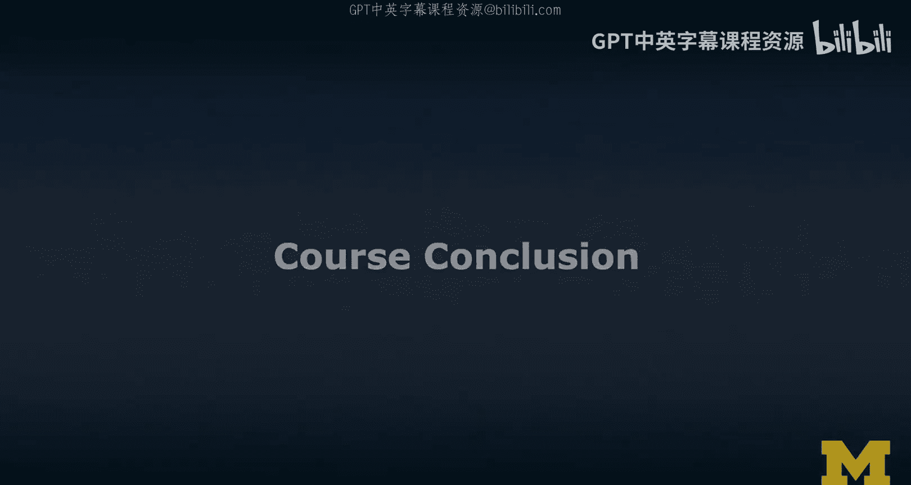
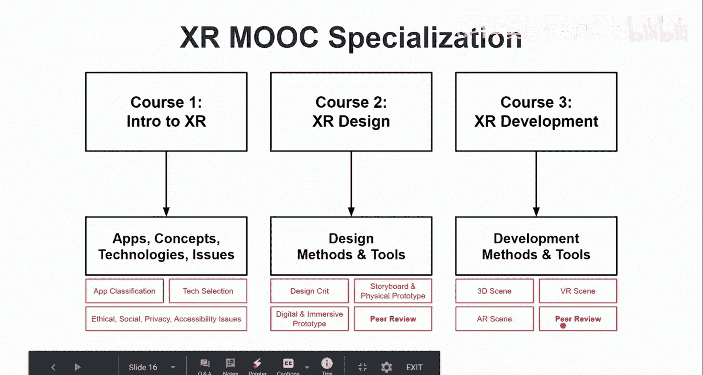
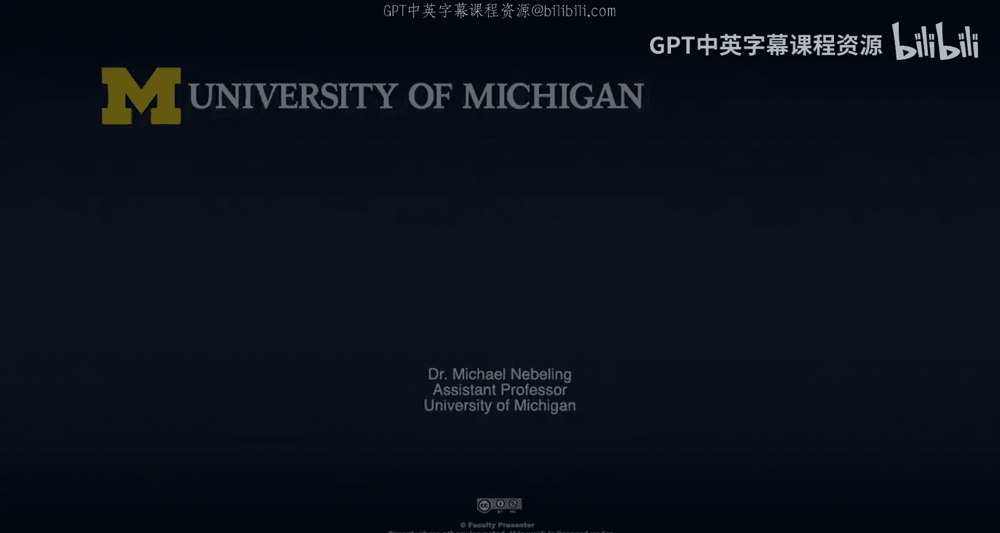
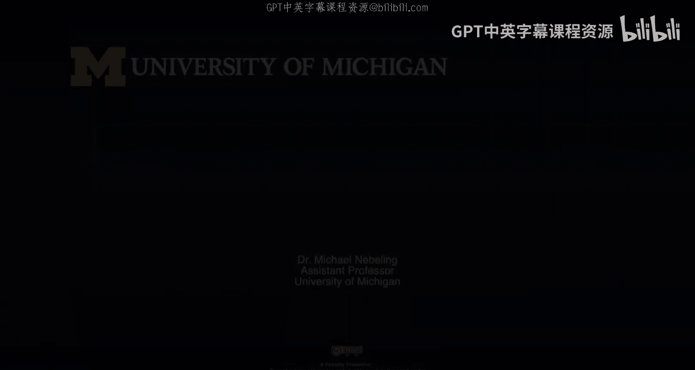

# 扩展现实（XR）专项课程：1：课程总结 🎉

在本节课中，我们将对《面向所有人的扩展现实》专项课程的第一门课进行总结。我们将回顾所学到的核心概念、技术、趋势与策略，并展望后续课程的内容。

---

## 课程概述

恭喜你完成了扩展现实（XR）专项课程的第一门课。本课程的核心目标是为你建立XR领域的知识基础。我们重点学习了相关术语、核心概念与技术，探讨了行业趋势，并讨论了相关的社会议题与战略思考。这些内容为你深入理解这个快速发展的领域提供了初步但全面的视角。

## 核心概念回顾

上一节我们介绍了课程的整体目标，本节中我们来回顾一下学到的几个最核心的概念。

首先，我们从根本上区分了**虚拟现实（VR）** 与**增强现实（AR）**。你现在应该明确：
*   **虚拟现实（VR）**：用计算机生成的环境**取代**现实世界。公式可表示为：`用户体验 = 完全虚拟的环境`。
*   **增强现实（AR）**：将数字信息叠加到现实世界中，从而**增强**现实。公式可表示为：`用户体验 = 真实世界 + 叠加的数字信息`。

需要强调的是，这两个术语中的“R（现实）”含义不同。在AR中，“R”指的是**真实世界**；而在VR中，“R”指的是**计算机生成的合成世界**。

我们还学习了**现实-虚拟连续统**，这是一个用于理解从完全现实到完全虚拟的各种混合体验的模型。我们通过练习，将现有的应用分类放置在这个连续统上。

## 技术与方法学习

在掌握了基本概念后，我们深入了解了驱动VR和AR的各种技术，构建了自己的“技术知识树”。这帮助我们理解不同技术方案及其关联。

更重要的是，我们学习了一种名为 **“问题-选项-标准”（QOC）** 的设计空间分析方法。以下是其核心步骤：
1.  **提出问题**：针对你想要设计的功能或体验，提出根本性问题。
2.  **列出选项**：为每个问题找出所有可能的技术或设计选项。
3.  **制定标准**：建立评估这些选项优劣的准则。

这种方法将技术讨论结构化，便于与团队成员或潜在用户进行有意义的探讨，而不是空泛地谈论技术。

## 行业趋势与议题

接下来，我们从人机交互（HCI）的视角探讨了XR的演进趋势，涵盖了**人、任务、技术**和**环境**四个维度的变化。

我们观察到一些关键趋势：
*   **社交化与多用户体验**：支持多用户、跨设备的AR/VR社交应用正在兴起。
*   **包容性设计**：从服务特定用户，转向为包括残障人士在内的所有用户提供无障碍体验。
*   **情境泛在化**：AR体验正从特定场景（如工作区）走向“始终在线、随时可用”。
*   **技术集成化**：设备从有线走向独立，再进一步向**内置化**发展，更多普通设备将集成AR能力。
*   **计算模式演化**：计算任务从依赖额外硬件，到软件处理，再到云端协同。
*   **应用形态融合**：从独立的XR应用，发展到应用内包含XR模式，未来可能实现根据任务和用户偏好，在AR与VR间无缝切换内容的**跨现实（Cross-Reality）** 体验。

同时，我们也必须关注XR发展带来的重大社会与伦理议题，主要包括：
*   社交与伦理问题
*   可访问性与公平性
*   隐私与安全

## 个人与团队战略

在课程的最后部分，我们探讨了个人与团队在XR领域的成长战略。核心是培养**成长型思维**，持续学习并构建多元化的团队。策略涉及知识积累、团队建设、设备选型和用户理解。XR本身就是一项战略选择，关乎你选择参与的项目、秉持的信念以及对行业方向的判断。

## 专项课程展望

本课程是整个XR专项课程的第一部分，侧重于**知识与认知塑造**。

后续还有两门深入课程：
1.  **设计篇**：专注于设计思维、原型制作（包括实体、数字及沉浸式原型），并通过实际项目进行实践。
2.  **开发篇**：专注于开发工具链，引导你从2D思维转向3D开发，具体学习构建VR和AR场景，无需深厚的计算机图形学背景。

这两门课的内容相互衔接，你将完成一个完整的项目并参与同行评审。

## 总结

本节课中，我们一起回顾了XR入门课程的全部要点。我们从区分VR与AR开始，学习了核心技术、分析问题的QOC方法，洞察了行业趋势与挑战，并探讨了个人发展策略。现在，你已经对这个快速演进的领域有了扎实的概览，为进行批判性讨论和进一步深入学习打下了坚实基础。

我邀请你继续加入后续课程，更深入地参与XR的设计与开发，共同成为这个领域的实践者和塑造者。感谢你的参与，期待在未来的学习中再次相遇！