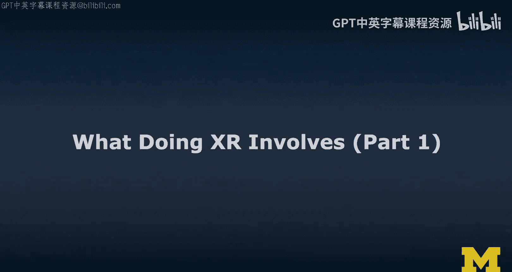
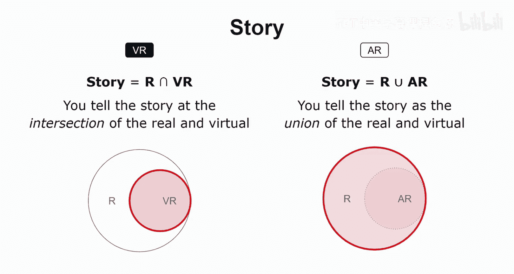

# 密歇根大学《面向所有人的扩展现实（介绍⧸设计⧸开发）｜Extended Reality for Everybody Specialization》中英字幕 p39 2_XR开发要素解析第一部分.zh_en -BV1jM4m1k73q_p39-

In this video， we're going to talk about what doing XR involves。 we're not actually doing XR yet。

 So this is not the video that goes through all the design and development activities that are out there。

 Now in this one， I really want to provide an overview And I want to draw an analogy to filmmaking Because in many ways。

 I think creating an XR experience is similar to making a movie。 Why do I say that。 Well。

 think about it。 So creating a movie is really a creative， complex task。

 It usually involves lots of people in different roles。

 So from the director and the person writing the script to the director of photography or the cameraman。

 then you need actors bringing the characters to life。

 you need somebody who takes care of light of sound and then obviously special effects right we often go to the movies and really talk about two things either great story or great special effects。

 Now the best movies get both right。 And with XR。😊。

The same so we have a story that we somehow have to convey in VR or in AR。

 and I'll think about story in a variety of ways and I'll explain that a little bit more to you。😊。

The other reason why I chose filmmaking as this analogy is because everybody can make movies these days we can just use all smartphones to record things and then share and you don't actually have to have formal training and with XR it's the same there's lots of tools out there so we will increasingly see hobbyists creating XR experiences now that is both cool but also dangerous because it would be better if we really understood X design if we were ethically responsible and would really pay attention to you know making our users feel comfortable and safe in these X experiences and there are and there are lots of examples out there where this is not always the case so。

😊，Let's take a step back and define a few key terms。 and you've heard about these terms before。

 So I'm going to draw out the reality virtual reality continuum。

 So I put reality on one side of the spectrum， and then I put virtual reality on the other side of the spectrum。

 So now if you were to add AR， it would be roughly here because it is mostly augmenting the physical world。

 You see mostly the physical world and then we are adding in some virtual content superimposed and so merging with a physical world。

 Now the more virtual content we add， the more we are entering this space of augmented virtual reality。

 So this is mostly virtual content and we are incorporating elements from the physical world。

 So now that is an interesting design dimension that you have here。

 and it is really a continuum to refer to this this part of the spectrum。

 we often use the term mixed reality。 mixed reality refers to the inner part of the spectrum doesn't necessarily include VR。

 and to most people it's almost like a synonym to AR。

 but as you can see in this visualization that would be ignore。

All the things we can do in augmented virtual。So I often use the term XR and some people refer to XR as extended reality。

 suggesting it would be something more than all the previous AR， VR， MRR things we've seen before。

 but I just use it as a place order。 So the X is a wild card for AM and VR。

 so augmented mixed and virtual reality。So now that we have established these key terms。

 what is an X experience。 So I think of X experiences as incorporating three main elements environment。

3D characters and interactions。 So when I talk about environment。

 we really need to distinguish the physical and the virtual environment。

 So the physical environment is obviously the one in which the user is。

 And then the virtual environment is the one in which we port the user in Vr。

 the user is in this completely virtual environment。

 they may not actually have any relationship really to the physical world in which they are and in augmented reality。

 we really want to read the physical environment and meaningfully augmented with virtual content。

 So these are some of the main differences and challenges。 Also when it comes to AR and VR。

 And I'm going to expand a little bit on this idea of environment as we move forward in this video。😊。

The second main ingredient is 3D characters。 And here I have examples of avatars，3D models and data。

 Now，3D models is probably the first thing that came to your mind。

 but let's talk about avatars quickly。 I could be an avatar So somebody may have carefully captured me using some form of 3D reconstruction or maybe some kind of motion capture so that to bring me to life so that I really look like a virtual copy of the real micro。

 So that's avatars。😊，So then I said 3D models and 3D models。

 it could be that somebody a 3D artist who has skills in 3D modeling set down and carefully modeled me and then they rigby。

 which means they inserted a skeleton so that they can then start to animate me and then they can define a few key animations which then look like gestures and that way bring me to life so if I were a 3D model that would be how it's done Now I think of 3D modeling really as a separate set of skills that if you have them。

 it obviously makes you a more complete XR designer but I do think that XR design there's so many other issues we need to take care of if we think about the user experience more than any of the specific content elements。

And so this is really not a key set of skills that every XR designer has to have there's also lots of free 3D models out there so that's great and lots of platforms on which we can share 3D models so we'll introduce you to those and so you can basically get around doing XR without being a 3D artist。

😊，Finally， you may want to visualize or somehow spatially represent data so for example through sound so data could be some kind of graph that you want to plot in an immersive way to communicate to users interesting complex concepts and so I don't actually have a really great example here but I just wanted to tell you that these 3D characters are not just avatars and 3D models it could be really something a little bit more abstract。

 so for example a graph or 3D sound。3D sound is more than stereo。

 so we could have a source somewhere in the scene that emits sound and that sound would come from that direction and we would adjust the pitch in the volume accordingly。

So these were three examples of 3D characters， and there are many more。

 Let's talk about interactions。 The most important thing to distinguish with interactions is there are explicit interactions and implic interactions。

 So explicit interactions are those where the user is really aware of them。 For example。

 gestures that they know the system will recognize or speech commands that the user is aware the system will understand。

Implicit interactions are those that are not directly ask of the user。 So for example。

 in AR and VR we have a lot of implicit camerabased interactions。

 gaze head gaze or eye gazebased interactions and these are examples of implicit interactions。

 So in AR VR， we really have this interesting interplay of implicit and explicit interactions and we really need to design for that that has its own challenges and one of the main issues currently is that most design tools。

 So those geared towards non-technical users are often very limited in the kinds of interactions that they support。

 So there are toolkits and libraries out there more geared towards programmers that' introduce you to in the course focused more on development to really expand on the vocabulary of interactions that we have available as XR designers。

So if we step back a little bit， I mostly talk about content and interactions when I say content。

 I really think about both the 3D models and all the 3D characters in the scene and also the environment。

 so basically the physical environment in which the scene takes place and then the virtual environment。

 these are more like the background elements and the 3D characters are really more like the foreground elements。

But both are content elements。 Okay， so that is how I think about Xr experiences。

 the main ingredients in terms of content and interactions。

 So now I want to think a little bit more about where the experience takes place， context。

And what is really the story of the experience to come back to this analogy from filmmaking？

So when it comes to context， we really need to distinguish AR and VR。 So context。

 the physical environment around the user really impacts the virtual reality experience。 Now。

 even though you don't really see it， you design this VR environment。

 and that actually needs to fit in the real world。 Let me illustrate this quickly。

 So you are designing the inner bubble here， the VR world and it's actually somehow enclosed in reality。

 Now the virtual reality， the virtual world may be much larger physically speaking。

 then the actual physical room in which you are。 and this actually introduces interesting challenges。

 I'll introduce you to locomotion and ideas of redirected walking and then common metaphors for travel in VR for example。

 teleporting。 So we learn about all these things。 but it is important to really think about the fact that the virtual environment does normally not perfectly match the physical。

Environment in which the user is。 because we are trying to port them into a different world。

 That is often the idea behind virtual reality。 And so this introduces interesting issues and so context is really important。

 So we now think about AR。 There's more direct relationship between context and augmented reality。

 So the physical world in which you are really drives the AR experience。

 you design this AR environment， and it actually has to blend with the reality。 So it has to merge。

 it has to not just fit in， but it actually has to complement Ed or remove something from this physical world。

 And in order to do this meaningfully， you really have to understand it。 So on the Vr side。

 we really talk a lot about environmental design and on the AR side。

 we really talk a lot about environmental understanding。

And here's a key thing that I really want you to consider。 So if you're designing for AR。

 it's not just designing this inner bubble， you're actually designing the experience that includes also the real world around it。

 so it's not just a matter of putting a 3D model in front of your user and then having no relationship to the real world around you a good AR experience really takes care of this combined this merged experience and so that's why I actually highlight both aspects here。

Now， keeping with this， let's talk about story。So in VR。

 the way I think about it is you are actually telling this story at the intersection of the real and the virtual。

 So what I highlighted here in red， this boundary is really what you're working with。

 think about it this way。 The best VR experiences that I've had。

 somehow got this mapping between the physical and the virtual world really right。 So， for example。

 I was in some kind of game with the headset and it was collaborative and then I had to solve a puzzle。

 and that puzzle involved pushing virtual buttons。 Now。

 as I was pushing these buttons in most VR experiences， you don't actually have the physical。

 the haptic feedback the tangible haptic feedback。😊，But in this case。

 the physical environment really matched the virtual reality experience there were actually physical buttons that I was able to press and so this really was a really cool story and negative example would be if you had obstacles in the way that are not communicated to the user so they're like something isn't like a chairs in the way or something like that and you don't see it because you're fully immersed in this VR experience that would be really。

 really disruptive so。😊，You're really telling the story at this intersection。 Now， in A R。

 that's different because you're actually telling the story at the union of the reality and the virtual content。

 so。😊，Youre actually telling that story that I highlighted here。

 not just your virtual content and with no relationship to the real world。 Unfortunately。

 there are a lot of AR experiences out there that seem to think it's enough to just bring some kind of virtual element into the physical world。

 And that's AR。 but it's not really AR， right， this augmented reality。

 So I just thought it would be a good way to think about storytelling that way。😊。

So now that we've established this， let's take a look at an example。

