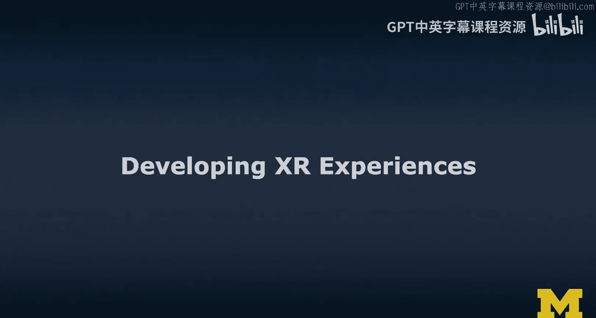
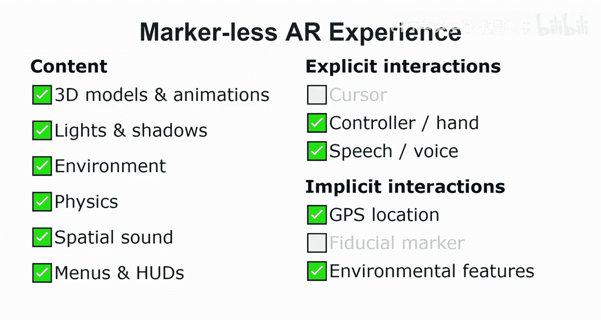
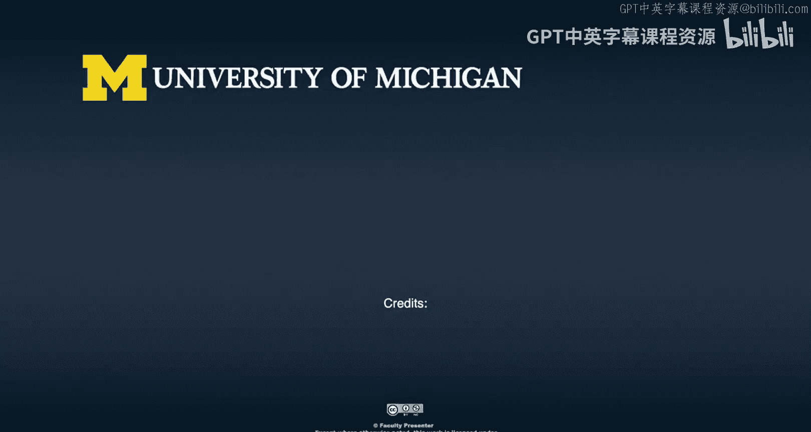

# 扩展现实开发实践：4：XR体验开发概述

在本节课中，我们将学习如何将XR设计概念转化为实际可运行的体验。我们将从基础与高级XR体验的区别入手，分析其核心构成要素，并探讨不同XR技术（如VR与AR）在实现上的具体需求。

## 从原型到产品

上一节我们介绍了故事板、物理原型和数字原型。本节中，我们来看看如何将这些原型进一步发展为可运行的“最小可行产品”。

通过之前的《狮子王》体验示例，我们完成了故事板、物理原型和数字原型的制作。目前所达到的阶段，可以称之为**最小可行产品**。接下来，需要在此基础上进行多次迭代，正式进入XR体验的开发阶段。

## XR体验的类型

当思考开发XR体验时，需要区分两种主要类型。

**基础XR体验**相对简单，但已包含几个必要组件：
*   需要在**AR**和**VR**之间做出选择。
*   通常会放置一些**3D角色或模型**。
*   必须设置至少一个**方向光**和**环境光**，才能让场景中的物体可见。

这种基础体验，可以视为一个单一的XR设计。

**高级XR体验**则更为复杂。它可能包含：
*   定制的、带有骨骼绑定和动画的**3D模型**。
*   多个**附加光源**。
*   **声音**效果。

要创建这样的高级体验，XR设计师需要扮演更多角色。例如，创建定制3D模型和动画需要具备**3D美术师**的技能，可能需要在Blender、Maya等专业3D工具中完成。虽然Unity和Unreal引擎也具备基础的建模功能，但专业工具的工作流程截然不同。

作为XR设计师，你仍需要负责场景中的**灯光布置**，并确保**3D模型的材质**设置正确。在使用网络下载的免费3D模型时，经常遇到**比例不一致**和**原点位置不统一**的问题。此外，**材质**的设置也至关重要，它决定了模型如何正确地反射光线，这些都需要设计师进行调整。

**声音**也是高级体验的重要组成部分。例如，为动物添加叫声、设置背景音乐和音效，都能极大增强沉浸感。动画的实现方式多样，既可以在Unity的动画编辑器中制作，也可以通过代码（如在A-Frame中使用JavaScript）进行脚本控制，但后者通常不是制作复杂动画的最佳方式。

## XR体验的核心构成要素

现在我们已经明确了基础与高级XR体验的区别，接下来将其分解为具体的**内容**与**交互**要素。

一个XR体验的核心内容成分包括：
*   **3D模型与动画**
*   **灯光与阴影**
*   **环境**（地形、天空盒等）
*   **物理**效果
*   **空间音效**
*   **菜单与平视显示器**

在交互方面，我们区分**显式交互**和**隐式交互**。

以下是显式交互的例子：
*   **光标/注视点**：通常基于头部或眼球运动，提供一个指示焦点的**十字准星**。
*   **控制器**：如VR手柄或手势追踪。
*   **语音命令**

以下是隐式交互的例子：
*   **基于摄像机的移动**
*   **GPS地理位置**（可影响渲染内容，如时区）
*   **基准标记**：在AR体验中常见，是一种能被摄像头识别的图案（如二维码），用于建立虚拟内容与现实世界的坐标系对应关系。在最终用户体验中，标记本身通常不扮演重要角色。
*   **环境特征**：例如，将特定物理物体带入视野，或在家具摆放应用中看向沙发，都可能触发相应的虚拟内容。

## 不同XR技术的实现需求

现在，让我们看看对于不同类型的XR体验，上述构成要素如何具体应用。我们将分别探讨**基础VR**、**沉浸式VR**、**基于标记的AR**和**无标记AR**。

### VR体验的实现

一个**基础VR体验**（如Cardboard类应用）可能仅包含：
*   少量**3D模型**（甚至只有一个）
*   **基础灯光与阴影**
*   **光标**交互

而一个**沉浸式VR体验**则会包含更多要素：
*   完整的虚拟**环境**
*   **物理**模拟
*   **空间音效**
*   **菜单**和**平视显示器**用于导航
*   更丰富的**控制器**或**手势**交互
*   可能支持**语音命令**

与基础体验相比，沉浸式体验在**显式交互**方面有显著增强。

### AR体验的实现

在AR中，我们需要区分**基于标记的AR**和**无标记AR**。

一个**基于标记的AR**体验（通常通过手持设备实现）类似于基础VR体验，但额外需要：
*   可能有一个**菜单**界面
*   可能使用**GPS**位置信息
*   **必须**使用**基准标记**来锚定内容

一个**无标记AR**体验（如由ARKit/ARCore支持的体验）则更接近沉浸式体验。它不需要物理标记，因为系统会通过计算机视觉**自行识别环境特征**来建立坐标系。这类体验通常更丰富，因为平台提供了对环境表面及其法线方向的理解。在配备空间映射和深度传感等高级传感器的设备上，甚至可以实现虚拟物体与真实环境的**物理交互**（如碰撞、投掷）。

## 总结

本节课中，我们一起学习了XR体验从设计到开发的关键步骤。我们概述了如何将原型发展为产品，区分了基础与高级XR体验的构成，并详细拆解了内容与交互的核心要素。最后，我们探讨了这些要素在不同XR技术（VR、基于标记的AR、无标记AR）中的具体应用与需求。

这部分内容旨在提供一个全面的概览。在后续课程中，我们将更深入地探索设计的各个方面，并有专门关注开发的课程来详细研究这些技术实现。希望这个《狮子王》示例能让你对XR开发涉及的内容有一个良好的初步认识。