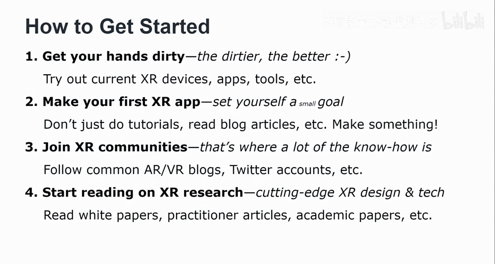

# 扩展现实（XR）入门指南：第二部分：工具、挑战与入门建议

在本节课中，我们将深入探讨XR开发中的工具选择挑战、平台碎片化问题，并为初学者提供一套实用的入门建议。我们将分析现有工具的优缺点，并学习如何在这个快速发展的领域中迈出第一步。

## 工具选择的困境：寻找“甜蜜点”

上一节我们介绍了XR的基本概念，本节中我们来看看学习过程中一个常见的难题：如何找到好的学习范例。

好的XR学习范例很难找到。社区分享的范例通常是为解决特定问题而设计的。如果这不是你试图解决的问题，作为新手开发者，你很难从中推断并应用到自己的问题上。

如果你找到了更通用的范例，它们通常又显得过于抽象和复杂。即使从这个更通用的例子出发，你也很难将其调整到你的具体用例上。这似乎是一个两难的局面。

那么，什么样的例子更好呢？也许介于“过于简单的最小化示例”和“不太复杂的完整示例”之间。我们真正追求的是这个“甜蜜点”。非常具体的例子有优势，非常通用的例子可能对有经验的开发者很有效。最小化的例子如果用例正确，或者真正模块化，你可以从许多小例子中组装你的解决方案，那也很好。一个完整但不太复杂的例子通常也是很好的学习范例。

但作为范例的创建者，很难找到这个甜蜜点。因为经验丰富的开发者需要更通用的范例，而经验不足的设计师和开发者则更需要这些较小的部分。然而，他们又需要努力从这些孤立的小例子中进行推断，想象出具体的应用场景以及如何解决自己的问题。这是一个非常有趣的问题，我们将在更侧重于开发的课程中再次讨论。

## XR工具全景图：复杂度与能力的权衡

接下来，我们来看看当前AR和VR工具的现状。我将它们分为五类，并根据你能用这些工具达到的**保真度水平**以及所需的**技能和资源**来绘制它们。

以下是主要的工具类别及其特点：

*   **简单易用但功能有限的工具**：这类工具相对容易使用，但你能用它们做的事情不多。
*   **3D建模工具**：这类工具需要一套非常不同的技能和资源，并不容易使用。如果你有网页设计或网页开发背景，使用这些工具会很困难。
*   **A-Frame、Unity和Unreal引擎**：这些工具可以达到很高的保真度，但你也需要相当多的技能，并且需要时间来培养这些技能（时间就是金钱）。
*   **沉浸式创作工具**：例如Tilt Brush和Google Blocks。它们能提供相对较高的保真度，因为你直接在VR中创作。相对于其他工具，所需的技能和资源可能没那么多，但说它们能达到很高的保真度可能有些勉强。

显然，在研究中，我们希望达到的目标是：用最少的必要技能，创造出最高保真度的解决方案。这很酷。我研究过这里的一些工具，并会在课程中与你们分享。但我不确定是否真的达到了那个象限的目标，可能有些工具在能达到的保真度方面仍然有限。但我确实认为，我成功地限制了所需的技能和资源。然而，代价是你不能原型化所有类型的体验。

所有工具的问题是，它们只允许你做这么多。有些工具对于较小的项目来说可能是“杀鸡用牛刀”，例如，你可能只需要用A-Frame就能完成。

## 现有XR工具的核心问题

建立对这片“全景图”的认识，能够进行分类，然后在所有这些不同的象限中挑选工具，我认为这是我们需要在本课程中培养的一项关键技能。

总而言之，现有XR工具的主要问题如下：

1.  **工具生态庞大**：对于新设计师来说很难入门，即使对于有经验的开发者来说也很难跟上。
2.  **设计流程是独特的拼凑**：每个项目都需要一套非常具体的工具，项目之间没有太多共性。每个AR/VR应用都需要独特的工具链。
3.  **原型工具对大多数应用来说太有限**：这是我发现的问题。
4.  **开发工具对新手、非技术型设计师来说遥不可及**。
5.  **工具内部和工具之间存在显著差距**：工具链实际上是向上优化的，这使得设计迭代变得非常困难，尤其是当你必须回到之前的工具时。

不过，我认为随着时间的推移，我们将能够解决很多这些问题。通过做更多的XR项目，我们会获得更多经验，培养出对“哪种工具合适、何时使用”的感觉。我很高兴地看到，我的学生正在构建自己的“工具箱”，他们不会试图用一个工具做所有事情，而是在每个项目中都很有创造性地探索不同类型的工具。这也是我邀请你们去做的事情，在本课程后面的部分以及其他课程中，你们会看到更多这样的机会。

## 平台碎片化：从低端到高端

最后，让我以稍微不同的方式说明之前提到的平台碎片化问题。

当你进行VR或AR开发时，你确实需要考虑从低端到高端的范围。

*   **VR方面**：基于手机的VR（如Daydream、Cardboard）和3自由度（3DoF）头显（如Oculus Go）已基本被淘汰，转而支持6自由度（6DoF）头显。这至少解决了VR方面的一部分问题。
*   **AR方面**：在低端，是基于智能手机的AR（非头显）。这里的问题是：我们是否需要用户使用任何标记？我们能否将其与应用程序很好地打包？目前趋势是向无标记（Markerless）AR发展。在高端，是AR头显，例如HoloLens。我认为最终大多数AR体验将发生在这里，但目前当你创建一个新的AR应用时，你必须决定是支持基于智能手机的AR（标记或无标记），还是针对头显。这些头显仍然相当昂贵，用户群体不大，但你可以做出非常酷的例子。

目前，平台碎片化确实是一个问题，很难绕开。在更侧重于开发的课程中，我们会详细展开并更深入地讨论这些问题。

## 给初学者的具体入门建议

现在我已经讲完了所有关键障碍，并提供了不少例子和新的思考方式。我想以一些具体的建议来结束。以下是我给你的入门建议：

1.  **亲自动手，越深入越好**：真正接触一台XR设备。它不一定是最贵的，也可以重新利用你的智能手机，通过Cardboard等手机支架将其变成AR或VR设备。尝试一些应用，并在你尝试进入创建XR体验这个领域时，认真思考工具的选择。
2.  **开始制作你的第一个XR应用**：为自己设定一个小的、可实现的目标。做一个待办事项应用、提醒应用或AR测量应用都可以。例如，测量应用是学习AR及其原理的好方法。重要的是真正去做你自己的第一个应用，而不仅仅是做教程或读博客文章。真正做出点东西，我认为这是最好的入门方式，但要记住设定一个小目标。
3.  **连接开发者社区**：当你感到对AR和VR充满热情时，认真思考如何与其他开发者建立联系。了解XR社区，那里有很多专业知识。开始关注AR/VR博客，在社交媒体（如Twitter）上关注相关人士和厂商，这是了解当前动态的好方法。
4.  **开始阅读更多关于XR研究和设计的资料**：有很多从业者在博客中分享他们的知识和经验。有些人撰写白皮书或进行市场分析，这可能对你想确定目标平台类型时有所帮助。我个人也从最新的学术论文中获益良多。

这就是我的“如何入门”建议：亲自动手；制作你的第一个XR应用，确保它是你自己的东西；加入XR社区；然后开始阅读一些XR研究和设计资料。

## 总结

本节课中我们一起学习了XR入门的关键挑战和实用步骤。我们分析了寻找合适学习范例和开发工具的困境，探讨了当前XR平台碎片化的现状。最重要的是，我们掌握了一套为初学者量身定制的行动指南：从亲身体验设备开始，通过制作一个小型应用来实践，积极融入社区获取支持，并持续学习前沿知识。这条路经经过许多学生的验证，希望能为你开启XR创作之门提供一个坚实的起点。在课程后续部分，我们将以此为基础，继续深入探索。