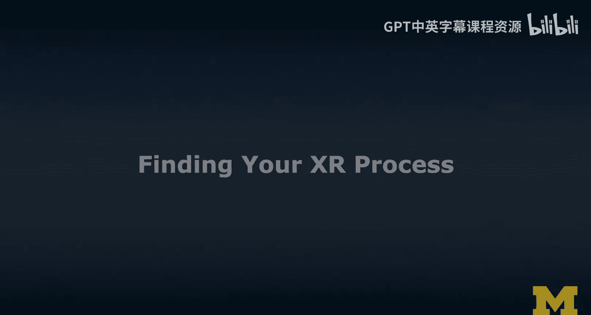
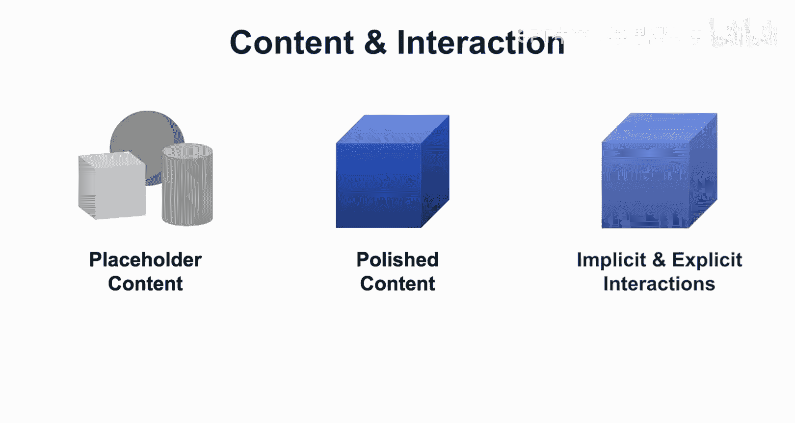
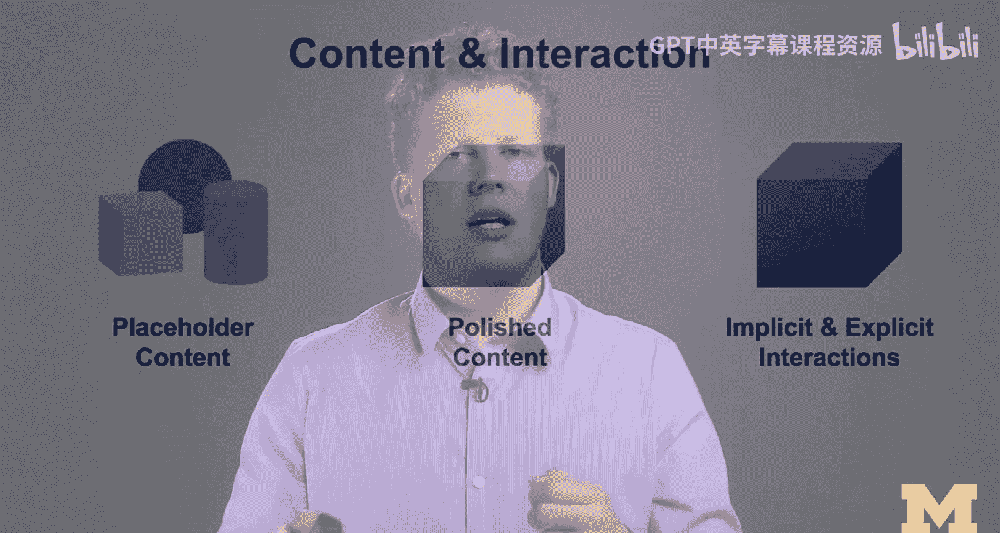
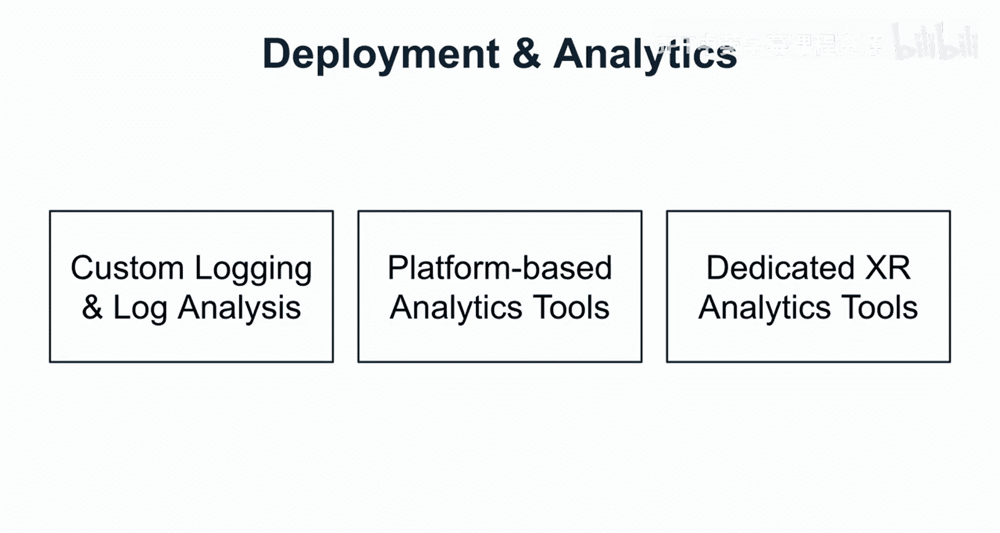
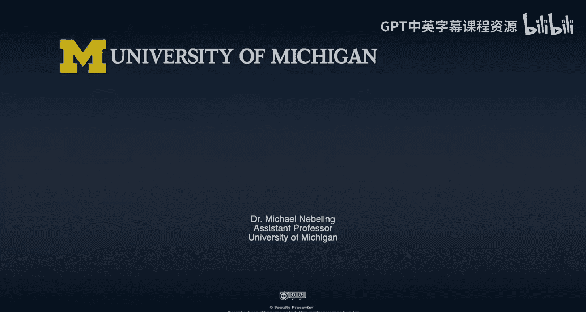

# XR开发流程优化：7：寻找你的X流程

在本节课中，我们将学习如何将传统的交互设计流程优化并应用于XR体验的开发。我们将探讨从需求发现到最终部署与分析的完整生命周期，并重点介绍不同保真度的原型设计方法。

## 概述：从交互设计到X流程

上一节我们介绍了XR开发的基础，本节中我们来看看如何系统化地构建XR体验。这个过程被称为“X流程”，它源于传统的交互设计流程，但针对XR的独特需求进行了调整。

传统的交互设计流程通常始于需求发现，理解用户需求，然后创建备选设计方案。接着，设计师与用户合作，通过可交互的原型（可以是纸质的或数字的）来测试这些设计。最后进行更全面的评估，可能发现新的需求，从而形成一个循环迭代的过程。

深入来看，交互设计流程通常包含四个步骤：界定问题、探索解决方案、寻找优质方案、以及优化方案。在这个过程中，我们需要先发散思维，考虑多种备选方案，然后收敛聚焦，做出选择。这个流程本质上是迭代的，完成一个循环后，可以再次迭代以改进产品。

## 核心步骤：X流程详解

现在，让我们将学到的交互设计流程知识转化为X流程。我认为这个过程包含四个主要步骤。

**1. 需求发现与头脑风暴**
此步骤的核心是通过场景、用例、用户画像和竞品分析来界定问题。如果你不熟悉这些术语，我将在后续章节中详细解释。

**2. 故事板与原型设计**
这是至关重要的第二步，需要进行多次迭代。以下是常见的原型设计方法：
*   **故事板与草图**：用于框定问题并构思希望用户经历的故事。
*   **实体原型**：使用纸板、纸张、透明胶片等材料制作空间模型，探索XR交互的可能性。这允许我们在使用任何数字工具之前就设计概念并探索交互。
*   **数字原型**：使用数字工具测试可行性并试验XR特有的功能，这些功能通常只有在设备上才能充分探索。

**3. 开发与测试**
在此阶段，你将使用以下工具之一创建应用程序：
*   **WebXR**
*   **Unity** 或 **Unreal** 等游戏引擎
*   基于移动开发平台或特定VR/AR工具包的**原生SDK**（如Oculus SDK、ARKit）

我同样会在其他章节中展开介绍这些选项。

**4. 部署与分析**
应用程序开发完成后，需要部署给用户使用，并持续评估其表现。这包括将应用部署到XR设备上，然后在用户使用过程中收集数据，分析应用的表现以及可改进之处。目标是基于用户与应用的交互来识别改进机会。

这就是XR应用程序的完整生命周期。

## 原型保真度：从低到高的演进

我之前使用过“保真度”这个术语，现在我想解释一下低保真度和高保真度的含义。

当我创建一个新的XR体验时，通常从纸上开始。我喜欢在纸上画草图，理清思路。但一个挑战是，大多数XR体验都是3D的，而在纸上表现3D并不容易。

因此，我更喜欢制作一个**立体模型**。立体模型就像是我场景的微型实体原型。我使用纸板、透明胶片等材料将XR体验组合起来，并进行实体探索。

从实体原型快速过渡到数字原型（尤其是VR）的最快方法是使用**360度全景**。使用双镜头360度相机，一键就能拍摄全景照片。如果录制视频，我甚至可以在空间中移动，否则就会被固定在一个位置。360度全景的一个主要限制是它没有深度信息。

如果你想在体验中向前推进，提高保真度，下一步就是进入**3D建模**。从360度全景跳到3D，市面上有很多工具，我会介绍其中一些。但更难的跳跃是进入**VR**和**AR**。

我将AR的保真度定位得比VR更高，我想表达的是，创建一个高保真度的AR体验实际上非常困难。让我们快速浏览一下这张图。

我们讨论的是刚刚提到的各种保真度，以及创建这些体验所需的技能。
*   **纸张**：位于低端。
*   **立体模型/实体原型**：要求稍高一些，需要更多时间。
*   **从立体模型到360度全景**：相对容易。我们甚至可以在实体模型内部拍摄360度全景，然后进行数字处理。
*   **从360度全景到3D**：目前没有很好的工具支持，需要我们真正在3D中构建场景。我的许多学生在此环节花费了大量时间。
*   **从3D到VR**：仍然是一个相当大的跳跃，但是可行的。
*   **从VR到AR**：需要相当多的技能。在VR中，我们可以控制整个环境并设计它，这需要一些技能。但在AR中，我们需要感知周围环境，并让我们的体验完美地融入其中，这在技术上 arguably 更难。

因此，我这样绘制图表，我认为它很好地概述了流程中的步骤、你想要达到的保真度以及每个步骤可能需要的技能。

## 内容与交互的演进

在3D建模阶段，我通常会引入3D模型。例如，一个看起来不错的3D立方体，相对容易建模，但至少具有纹理和颜色。这是更精美内容的例子。我会开始替换之前用作占位符的基本几何体，引入我真正想要的3D模型。

在那个阶段，我拥有的只是内容。现在我需要考虑**交互**。当我们思考交互时，需要区分**隐式交互**和**显式交互**。

让我举一个从隐式开始然后变成显式交互的例子。当我们使用像Google Cardboard这样的设备时，我们可以环顾四周，瞄准内容，然后可能通过设备顶部的按钮点击它。我们通常用一个光标来指示用户正在看哪里。

假设这是我们的光标，现在用户瞄准了这个立方体。他们移动过来，按下按钮，执行点击操作，我们调整3D模型并注册了这次点击。这是一个隐式交互（瞄准物体）与显式交互（点击）的结合。我们需要处理这两种情况。这只是一个使用Cardboard的简单例子，但这些都是当你提高保真度并为场景添加交互时真正需要考虑的事情。

## X流程实践：时间线与迭代

最后，我想将其放入一个时间线中，举例说明我经常在课堂上如何实施X流程。

我们通常从一个**设计概念**开始，真正确定问题框架，并思考是AR还是VR。然后，我们创建**第一个原型**，通常保真度仍然较低，可能只有基本的交互。我们真正需要在此阶段确定用于原型的平台和工具。这只是V1版本。

然后，我们可能会从用户（或在我的案例中是导师）那里获得一些初步反馈，并着手开发**第二个版本**。我经常做的是将范围缩小到两到三个关键交互。我认为以我们想要支持的交互来思考XR体验非常有帮助。有趣的是，有时你可能不得不切换一些工具，因为如果你需要处理更棘手的交互，它将决定你需要使用哪些工具。

在经过这些初始原型的一到三个版本后，我们可能会创建一个可以称为**最小可行产品**的东西，我们可以用它来运行一些初步的用户测试，获得反馈。

至此，我们从最初的设计概念出发，制作了原型（可能先在纸上，然后创建了几个数字版本），最终与用户进行了测试。我们现在拥有的是一个**设计规范**，可能以报告的形式呈现，我们可以反思学到的一些经验教训，并可以将此设计规范交给开发人员进行进一步实现。或者，如果我们意识到需要做很多改进，这只是一次设计冲刺，我们可以进行另一次设计冲刺。

当我想到设计冲刺时，我通常指的是一到两周的工作，遵循这个过程。多次迭代这个过程最终将为你带来一个非常酷的XR体验。

## 后续重点与工具选择

在本课程的后续章节中，我们将更专注于原型设计、开发与测试。

关于开发与测试，如果你还记得之前的内容，主要有三个大方向：
1.  **基于Web的路线**：通过 **WebXR**。
2.  **游戏开发路线**：通过 **Unity** 和 **Unreal**。
3.  **硬核开发路线**：如果你是经验丰富的移动开发者，可以使用 **Oculus SDK**、**ARKit** 或其他AR解决方案进行**原生开发**。

在后续课程中，我们将花更多时间在WebXR和Unity上，但也会提供资源，让你可以了解更多替代方案。

## 部署与分析策略

最后，一旦我们创建了XR体验，我们可以将其部署给用户，并且应该认真考虑分析。在此阶段，我保持非常高的层次，只是为了让我们思考三种主要方式：
1.  **自定义日志记录与分析**：许多研究人员和实践者会实施自定义日志记录并进行一些日志分析，即使是用于用户体验和可用性测试。
2.  **平台内置分析工具**：例如，Unity内置了分析功能。这些是基于平台的分析工具，更侧重于有多少人下载了你的应用以及他们大致在做什么。它们可能过于有限，无法真正理解交互中的问题所在。
3.  **专用的XR分析工具**：这些新工具允许你分析用户如何交互、交互何时失败（例如，当人们想要与不存在的内-容交互时）、何时引起挫败感或用户何时显得困惑。然而，这是一个活跃的研究领域，只有少数仍在发展的工具。

我会提供一些指针和链接，但作为本课程的一部分，我们不会在这些方面花费太多时间。

## 总结

本节课中，我们一起学习了如何将系统化的X流程应用于XR体验开发。我们从传统的交互设计流程出发，将其转化为包含需求发现、故事板与原型设计、开发测试以及部署分析四个核心步骤的X流程。我们深入探讨了从低保真度（如草图、实体模型）到高保真度（3D、VR、AR）的原型演进路径，以及所需的技能。最后，我们通过一个实践时间线了解了迭代过程，并概述了主要的开发工具和分析方法。掌握这个流程将帮助你更高效、更系统地创造出优秀的XR体验。