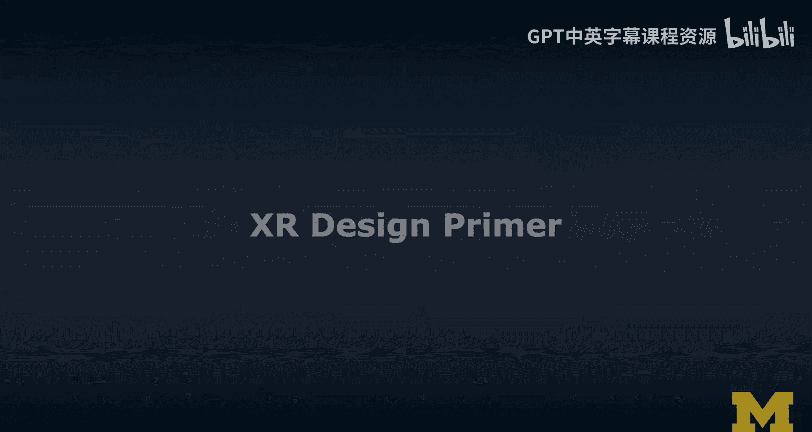
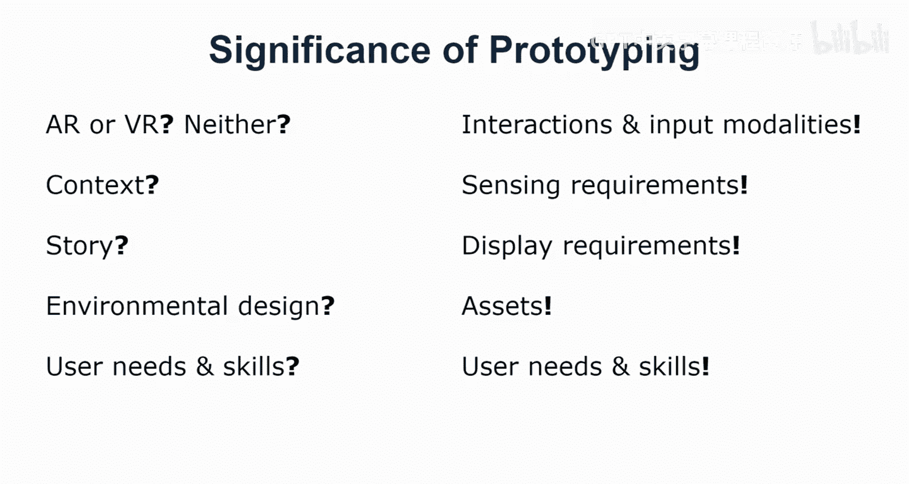
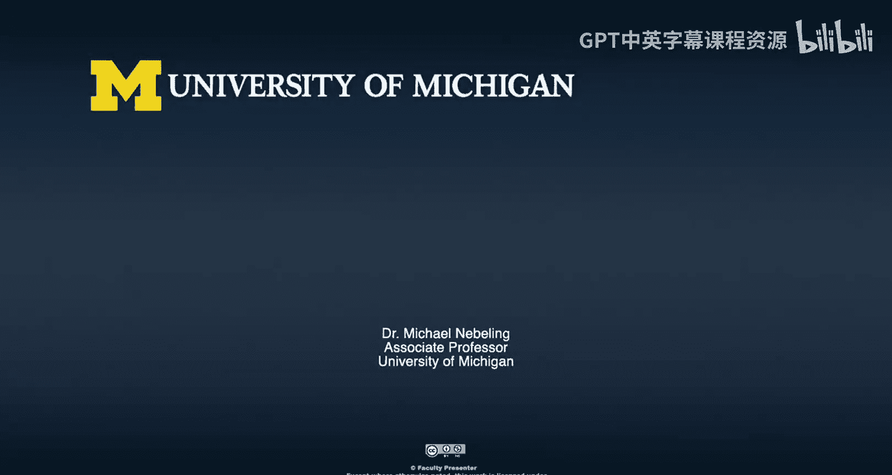

# XR设计基础：1：课程概述与设计流程

在本节课中，我们将学习扩展现实（XR）设计的基础知识，涵盖设计流程、核心方法、工具以及评估准则。我们将构建一个实用的设计工具箱，帮助你从理解问题开始，逐步完成一个可交互的原型。

---

## 设计流程概览

XR设计流程主要包含三个核心部分：**设计流程**、**方法与工具**以及**设计准则与评估**。本课程将围绕这三个部分展开。

上一节我们介绍了课程的整体结构，本节中我们来看看具体的设计流程。

### 从问题定义到设计空间分析

设计流程始于明确的问题陈述。我们通常从**竞品分析**和**设计空间分析**开始。这些步骤帮助我们更好地界定问题、理解现状，并识别现有解决方案的优势与不足。

以下是此阶段的关键活动：
*   **理解问题**：深入分析需要解决的核心问题。
*   **竞品分析**：研究市场上已有的解决方案，了解行业最佳实践。
*   **设计空间分析**：探索各种可能的设计选项，并建立决策标准，以找到填补市场空白、提供有意义的解决方案的途径。

### 原型设计：从物理到数字

在明确问题与方向后，我们将进入原型设计阶段。我特别强调**物理原型**的价值，例如纸面原型，它能让我们在投入数字开发之前，以低成本、高创意的方式探索XR体验。

以下是原型设计的主要阶段：
*   **物理原型**：使用纸张、透明胶片、纸板等材料，将物理空间当作“舞台”来构思和测试XR体验。这是一种强大的早期设计方法。
*   **数字原型**：使用专注于AR/VR设计的桌面工具进行设计。这个领域的工具正在快速发展。
*   **沉浸式原型**：直接进入头戴设备或使用AR移动设备进行“边设计边体验”的原型制作，这被称为并发设计与测试。

### 实现最小可行产品

通过一系列原型迭代，我们将得到一个**最小可行产品**。MVP是一个概念验证版本，它集成了最核心的功能，允许我们与用户进行测试，收集初步的体验反馈，并指导后续改进。本课程的目标就是引导你完成这个MVP，它可以作为一份清晰的设计规格说明书，交付给开发团队。

---

## XR设计的核心关切

除了流程导向的视角，我们还需要关注设计中的核心关切与关键问题。

上一节我们走完了设计流程，本节中我们来看看设计过程中需要始终思考的几个核心问题。

### 建立用户共情与伦理设计

**设计思维**的核心是与用户建立共情。同时，我们必须重视**合乎伦理与负责任的设计**。这要求我们不仅思考如何做出好用的设计，更要思考设计可能带来的危害、是否可能被滥用，确保我们的设计选择是**有意义、合乎伦理且负责任**的。

### 设计准则与模式

作为一名设计师，你需要了解当前XR领域的**设计准则、最佳实践和设计模式**。这能确保你的设计符合现代标准，并与用户可能体验过的其他XR应用保持一致性。这些知识体系本身也在不断演进。

### 设计评审

**设计评审**是一项重要技能，尤其在建筑等领域被广泛采用。我们将练习两种评审方式：一种侧重于上述设计准则，另一种则聚焦于伦理考量。学习如何给出有建设性的反馈，批判性地分析产品并提出改进建议，这对设计师至关重要。

我们将使用“**我喜欢/我希望/如果…会怎样**”的方法进行评审：
*   **“我喜欢”**：从积极的角度开始，找到设计中的优点。
*   **“我希望”**：提出建设性的、具体的改进愿望。
*   **“如果…会怎样”**：提出替代方案，开启有益的讨论。

### 设计研讨会

我将介绍一种我非常喜欢的研究方法——**设计研讨会**。它像一个为期三小时、有设计主题和指导的协作会议，聚集关心同一问题的目标用户或利益相关者，共同协作解决问题。多元化的参与者背景能带来更丰富的视角。

---

## 设计评估的维度

评估设计时，我们需要超越基本的可用性，从更全面的维度进行考量。

上一节我们讨论了设计的核心关切，本节中我们来看看如何多维度地评估一个XR设计。

### 超越可用性

研究人员通常首先关注**可用性**，即效率、效果和用户满意度。但对于XR体验，我们还需要思考：
*   **有用性**：这个设计对用户有帮助吗？它能改善用户的日常生活吗？用户能感知到它的价值吗？
*   **实用性**：这个设计真的解决了用户的问题吗？这通常需要通过长期使用来验证。
*   **用户接受度**：用户会持续使用它吗？这是衡量设计成功的终极标准之一。

一个设计可能具有很高的实用性和有用性，但若可用性极差，用户接受度也会受到影响。我们需要全面平衡这些维度。

---

## 原型设计的意义与方法

原型设计是本课程的重点，它能以高效的方式验证想法、规避风险。

上一节我们了解了评估的维度，本节中我们将深入探讨实现这些评估的关键手段——原型设计。

### 原型设计的重要性

原型设计的意义重大，主要体现在以下几点：
*   **避免过早承诺**：防止因为个人对某项技术（如VR）的偏爱而错误地将其应用于所有问题。通过物理原型可以快速、低成本地验证技术路线的合理性。
*   **理解使用情境**：帮助厘清体验发生的环境、叙事方式、环境设计以及用户所需的技能。
*   **明确技术要求**：通过实践，明确所需的交互方式、输入模态、传感需求以及显示设备。
*   **创造知识资产**：在整个过程中，不仅产生设计知识，还会创造出初始的视觉和交互资产，为后续开发奠定基础。

### 我们将学习的方法

本课程将带你学习一系列原型设计方法，构建你的设计工具箱：
*   **故事板与线框图**：可视化叙事与界面布局。
*   **低保真物理原型**：使用纸张、纸板、橡皮泥等材料快速构建可交互的模型。
*   **高保真数字原型**：使用专门的AR/VR设计工具进行精细化设计。
*   **沉浸式原型**：在目标设备上进行实时创作与体验。

**核心建议是：不要急于直接开始编程。** 通过系统的原型设计，你可以更高效地思考XR体验，在实际开发时节省大量时间与资源。本课程专注于原型设计，而编程实现将在本专项的第三门课程中详细展开。

---

## 总结与展望

本节课中，我们一起学习了XR设计的整体框架。我们了解了从问题分析、设计空间探索，到物理与数字原型迭代，最终形成最小可行产品的完整流程。我们探讨了设计中必须关注的用户共情、伦理责任、设计准则以及多维度评估。最后，我们深入阐述了原型设计的重要价值及其具体方法。

我期待在接下来的课程中，向你详细介绍所有这些有趣的内容。如果你觉得有任何遗漏或希望深入探讨某个主题，欢迎反馈。希望你能在本课程中学有所获，并享受设计的乐趣。我们下节课再见。