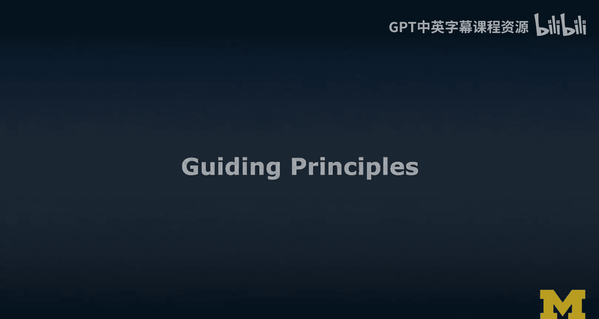
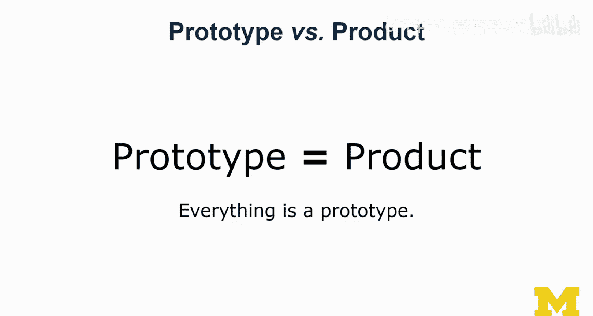
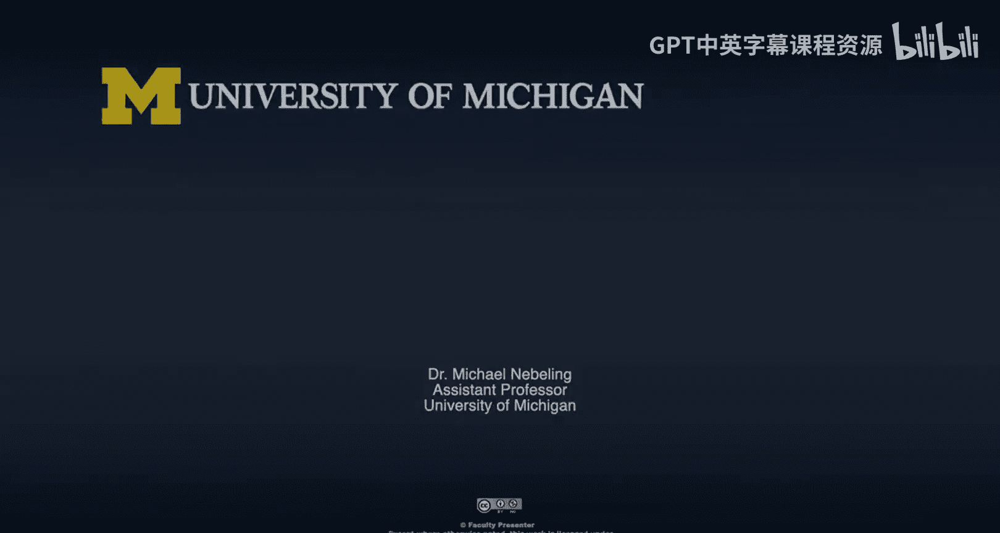

# 面向所有人的扩展现实：12：设计指导原则 🧭




在本节课中，我们将学习四个核心的设计指导原则。这些原则旨在帮助你建立正确的设计思维，特别是在扩展现实（XR）领域，创造出有意义且以用户为中心的体验。

设计思维的核心在于一种心态：与用户建立共情，准确定义问题，并以有意义的方式进行创新。在XR领域，“有意义”这一点尤为重要。基于我在计算机科学、人机交互以及用户体验教学与研究中的经验，我提炼出了四个原则，希望能融入你的设计思考中。

## 原则一：用户不是你 👤

作为设计师，首要挑战是必须从用户视角思考问题，而非你自己的视角。你不能仅考虑什么对你来说容易实现、什么计算上更高效或什么手势识别更准确。设计的出发点必须是用户的需求、能力和局限。

## 原则二：知识难以“卸载” 🧠

这个原则提醒我们，一旦学会了某些知识，就很难再回到初学者的状态去理解问题。这就像看一个经典的“年轻女士与年老女士”双关图。在你被告知图中存在两种解读之前，你可能只能看到其中一种。但一旦你“学会”了同时看到两者，你就再也无法回到最初只能看到一种的状态了。

**公式：** `设计师的认知状态 ≠ 新手用户的认知状态`

因此，当用户提出在你看来“简单”或“显而易见”的问题时，请记住，这只是因为你已经掌握了相关知识。这种“知识的诅咒”会让你难以真正站在新手用户的立场思考，这是设计过程中需要时刻警惕的。

## 原则三：探索多种路径，而非一条直线 🛤️

初级设计师与资深设计师的一个关键区别在于他们探索解决方案的方式。

以下是两者的典型路径对比：

*   **初级设计师路径**：倾向于认定一条从问题到解决方案的“直线”路径，并沿着这条路径进行有限的迭代，最终可能固守一个想法，得到次优的解决方案。
    ```
    问题A -> 想法1 -> 迭代1 -> 迭代2 -> 解决方案A（可能欠佳）
    ```
*   **资深设计师路径**：会主动探索多种不同的设计方案（分支路径），评估其潜力，推进有希望的方向，甚至可能回溯并探索“替代方案的替代方案”，最终找到一个更优的解决方案。
    ```
    问题A -> 想法1 -> 迭代1.1 -> ...
               -> 想法2 -> 迭代2.1 -> 回溯 -> 想法2.1 -> 最终方案
               -> 想法3（放弃）
    ```

你应该像资深设计师一样，在设计中积极探索多种可能性，而不是过早地锁定单一方向。

## 原则四：万物皆原型 📦

这是我的最后一条原则，尤其需要向学生强调：不要严格区分“原型”和“产品”。我认为，**一切皆是原型**。即使是你手中最新的、被广告宣传为成熟产品的XR设备，它依然是一个原型。我们距离将XR体验无缝融入日常生活、真正丰富我们活动的最终愿景还很遥远。



**代码描述此心态：**
```python
# 不要这样做：
if is_prototype(thing):
    process_prototype(thing)
else: # 是产品
    process_product(thing)

# 应该这样做：
process_as_prototype(thing) # 始终以原型心态对待
```

“原型”与“产品”的界限更多在于投入：产品通常伴随着大量的服务、营销和广告投入，而原型则没有。原型应该是可以随时被抛弃的，一个“可抛弃的原型”仍然是好原型；但一个“失败的产品”则不是我们想要的。因此，请拥抱用于创造原型的各种方法与工具。

---




本节课中，我们一起学习了四个重要的设计指导原则：**用户不是你**、**知识难以“卸载”**、**探索多种路径**以及**万物皆原型**。希望这些原则能帮助你建立更强大的设计思维，在XR及其他设计领域，创造出真正有用、适用且有意义的设计方案。