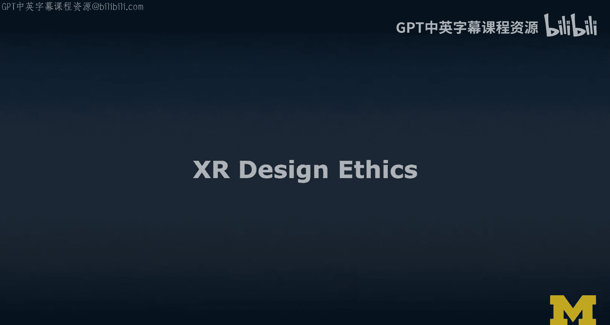
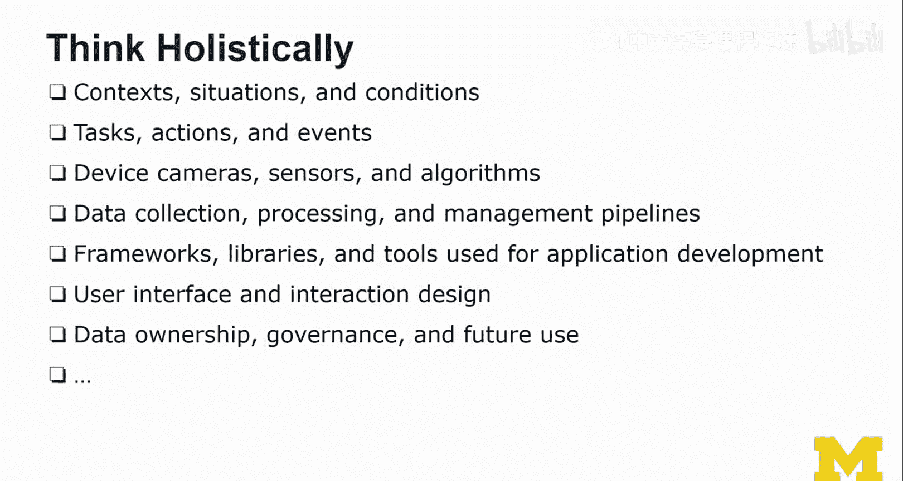
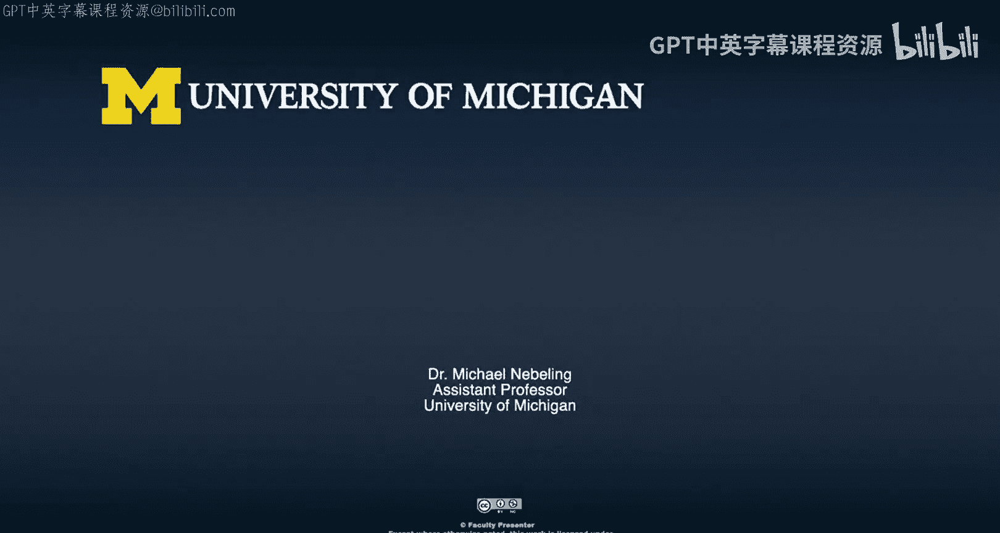

# 密歇根大学《面向所有人的扩展现实（介绍⧸设计⧸开发）｜Extended Reality for Everybody Specialization》中英字幕 p50 13_XR设计伦理.zh_en -BV1jM4m1k73q_p50-

In this video， we're going to talk about XR design ethics。 Now design ethics is really。

 really important。 we need to really think about it in the space of XR ethical and responsible design。

 you have actually a great responsibility as you're designing a virtual reality around your users。

 you have to make sure that they are safe that they are protected。😊，And that's hard。

 especially given that you don't know much about the environment in which the users are using your applications and when it comes to AR as well。

 you have to really make a lot of tradeoffs in terms of how much do you need to know about the environment。

 the people around the users about the users themselves。

 the devices that they're using the context where they're using this and so when you have all that information though you really make use of it does it really significantly improve the design of your application now in many cases you won't have access to all that data just because technology isn't there yet。

 and we always feel like， oh yeah， we need all that information but we should really think about how much information we need in order to provide a compelling design and our rationale or our goal should be to work with the minimum data rather than trying to you know get it all。

And then see what we can do with it。You really have to figure out how to minimize the risk and how to maximize the safety of your users and as I was designing this lecture。

 I was thinking about these following questions。What when users can't tell what's real and what's virtualcher anymore。

What is the role and responsibility of the X designer， How do we hold X designers accountable。

What happens when users go against your intended design。

 All these things combined I was thinking what are good ethics principles of XR design？

This is a space that I'm just thinking about a lot and there are not so many really good guidelines。

 so there's not like a list of 10 things to follow and it'll be perfect No there's an intuition that you have to develop as a designer you really have to know the technologies。

 you really have to understand the design space and then you have to make really。

 really good choices in the interest of the users。So I wanted to start with design ethics principles。

 And quite fundamentally， there are like three autonomy。So the user is in control at all times。

 transparency。 the user is informed about how to control or be in control and stay in control and safety。

 the user is protected from danger， risk and injury。 So autonomy， transparency and safety。

 these are like the really high principles。 And if you look at existing design guidelines like from all the main vendors。

 safety， and that is both the physical， but also the psychological safety。

 those are really values that are held up very highs highly， it's really emphasized。

 but it's hard to find concrete guidelines that help you make good decisions。 and unfortunately。

 it is often through misuse of a design that we learn about the negative consequences of our design。

 and by misuse， I just mean that something maybe you haven't considered in your design process。

 So we have to think about how we approach design more。

icallySo one way to think about design or responsible design in this case is to not just focus on how to best use your solution。

 so improve and optimize the design of your solution so that is really good for users。

And following design patterns， established design patterns or helping by creating new designs and shaping new design patterns。

No， we should also consider how your solution could be misused， so the dark patterns of design。

So now， the problem with both design patterns and dark patterns is that they're both still really emerging。

 Now， there's not like a list of these patterns and then these dark patterns and be careful。

's it's not like that。 I mean， here's here's a way to think about it。

 And you need to think holistically。So you need to think about the context。

 the situations and the conditions in which the users are and in which your experience。

 that the one that you are designing will be run by the users。

 you need to think about the tasks that you want your users to be able to do。

 what kinds of actions or interactions can they do。

 what other kinds of the events that might be generated by the system and how might users respond to those kinds of events。

Then obviously， you need to really think about the device cameras as the sensors and the algorithms。

 Now， as a designer， you're designing for kind of like a device and you could say that you are actually a user of that device since you're not necessarily improving the algorithms on these devices and platforms。

 but you can still be careful and you can still make good decisions in terms of the devices that you build on。

So we also need to think about data collection processing and management pipelines。

 especially as a researcher， you really aim to get as much data as possible。

 also obviously as a designer working for a business because information is key。

 but here I would really encourage you to think about do we really need all that data。😊。

So frameworks， libraries， and tools that you are using for application development。

 that is really something that you are making active choices。And so you should again。

 know what's going on behind the scenes and make informed decisions。

Then obviously the user interfaces interaction design。

 This whole course is really focused on user interfaces interaction design but this is not the only place where we really need to pay attention and make sure that we。

 for example， not endangering our users， not promoting weird interactions and then not only at the user interface。

 but obviously also at the data level， we really need to think about data ownership the governance So really what happens with this data once collected where it's stored how it's being processed and then also and this is really important future use of that data。

 I mean just because a user might agree to give you the information so that they can run that exc session and place a couple of objects in their living room or kitchen or bedroom。

Doesn't mean that you should be using that data in the future。

 you as the designer vendor these are things to think about and there may be many more。

 but this is actually what I come up with as I think about both the design and the development of a UXR application and a user experience that I think is safe and potentially helpful and useful to users so what I'd like to do now is actually bring in a different perspective as a researcher often have like new ideas and some of them might be crazy and a little bit borderline right some of them may involve deception and that's something that's okay in research as long as you debrief and also get informed consent from users。

 Now that is something that I'd like to emphasize a little bit。

 but I really find interesting that in research and scientific research。

 at least in North America and。

Wwhichch is what I'm most familiar with at the moment。

 we do have established ethical review processes， but it's really important that you navigate all these things so to actually so that actually users rights So participants study participants rights are protective。

 Well， one way to think about the ethical review process is that it's really a risk assessment are they users are the users or the participants in this case。

 are they exposed to risk that is more than what they are usually encountering in daily life and so it is a very interesting lens that may help us or maybe you as a designer also to better understand what could be ethical design。

