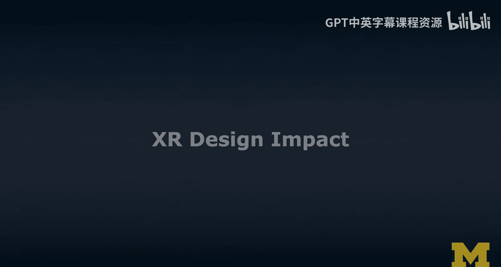
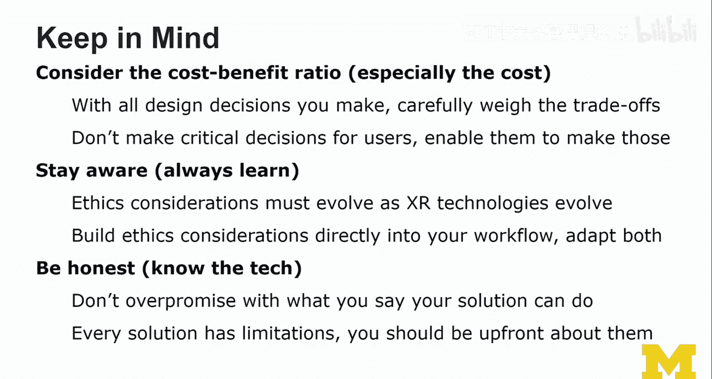
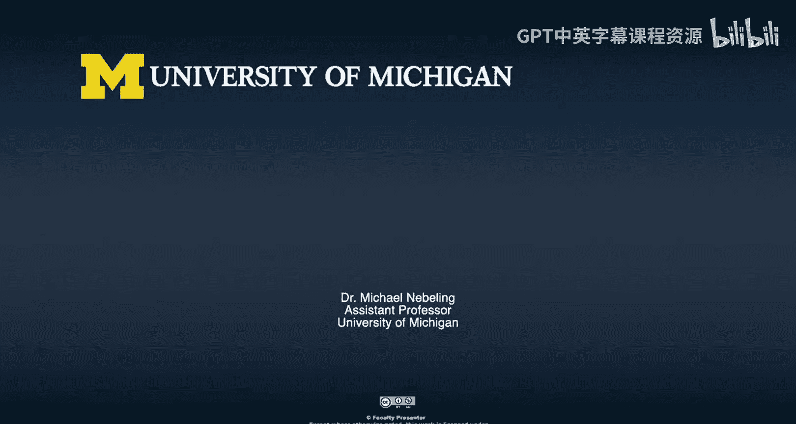

# 密歇根大学《面向所有人的扩展现实（介绍⧸设计⧸开发）｜Extended Reality for Everybody Specialization》中英字幕 p52 15_XR设计影响力评估.zh_en -BV1jM4m1k73q_p52-

So the last thing I wanted to throw in is the consideration of design impact。

 And that's something you have to consider at different stages。 So you have to think about it before。

 during and after the users are experiencing your。Experience So your application。 So before。

 and this could already be in the app store。 if that's the distribution channel。

 you should really set the expectations of the users for that new reality。

 So whatever it is that you're porting them into some。

Fancy or scary virtual world or how you may change， manipulate， modify。

 diminish whatever you do to their real world in an augmented reality version of your application。

And so you need to prepare them so that they know。 And then obviously， during the experience。

 you really need to balance the realism， comfort and safety。

And the tradeoff should really be around the realism and what you want to maximize as safety。

 comfort。 and then maybe realism。 You didn't even see that。 So maybe realism is there。Finally。

 you need to think about what happens after they have tried all your experience。

 so the impact of your experience afterwards it may actually shape the next kinds of interactions that they encounter in daily life or with another kind of XR experience and yes。

 okay， maybe you feel like your responsibility ends there。

 but you really need to think about that as well， So help users transition back to the old reality。😊。

And this could be through some kind of debriefing or even during the experience。

 asking them to take breaks to remind them of the real world。

 because being addicted while it might be good for revenue is not really good from a design perspective。

 especially from an ethical design perspective Okay and now I wanted to give three examples from my own research。

 And two of these examples are actually about projects that I've worked on。

 but we had to make very interesting design ethics decision。

 And the third example is one where I decided not to pursue it。

Just because from an ethical perspective， I really didn't feel this was a good thing to do。

The first example is from a mixed reality crisis simulation and triage training app and I'm not going to show any pictures here。

 but we really had to design how realistic should we make the injuries now that was an interesting project we were working with a professional in nursing also a professor here at the University of Michigan really understood all that and she actually helped us create the virtual injuries by using a mannequin in some kind of like blood and then taking realistically looking photographs and sending me all these pictures basically the task that I said the students was like placed these injuries so that they appear realistic anatomically correct。

😊，And so I'm not going to actually show any of these materials here as I said。

 but I really thought we need to trigger warnings even as I was working with my students and we really had to make the tradeoff between making it super realistic and making it just help informed the triage decision making which follows a specific protocol so going so we were designing two levels of injuries and we allowed users to pick it and one important consideration here though is that if you're a medicine student the further you along in your studies the more things you have seen and now with our design。

 what we could enable is early students in their career as well as more advanced students who have obviously a higher threshold now work together and that app was still supposed to invoke some stress to make it a realistic scenario because in a disaster you really need to be。

Harm， and that is something you need to train。 and if we just show kind of like comic style injuries。

You're not going to feel stressed， and so that was a very interesting scenario to navigate。

And the second example is from a master thesis recently completed in my lab。

 and that was with a really cool student who came from Columbia and also wanted to do a little bit of a field study there in a museum of memory and the idea of this project was to build empathy but avoid revictization as theyre using augmented reality to bring some of these stories and the narrative of those stories closer to the users。

Now， without going into too much detail that is a， really difficult to do that is a really difficult thing to do。

 And in this project， we really work together with the staff of that museum of memory who has significant experience。

 and the important thing is we didn't want to design this naive AR application or is it like plays images everywhere make it immersive as much as possible。

 No， this is really something where you have to understand the technology very well。

 That's why I was so fascinated by the project and we had to make very。

 very careful decisions in the end， it was a very， very complex project and we are still processing some of these research findings and thinking about how to communicate that research to the community but I wanted to include it here because obviously it was a recent project and work that my student did and I was very proud of her and that work and so I wanted to mention it here。

The third project is one that I did not pursue Student walks into my office， really great student。

 we both learned from each other that we had lost loved ones。

 actually deceased family members and what if we could bring them back How could we how could we even bring them back。

 What would it be like to bring back a deceased family member N VR and that is a project that I was like。

Wow。Okay， I mean。I can probably do this。I mean， I can think about the technology and is it going to be 360 or is it going to be virtual reality or is it going to be augmented reality。

 and what are the consequences of mixing that experience of bringing back the deceased person and making them appear in real life。

 So in augmented reality。And yeah， so I didn't want to do this。And I think。

 and the student understood， and we made the decision together。 And I think that is fine。 Now。

 we have not done this。 but as I said， somebody else has。

 And now I feel like somebody else has to live with that decision。

And the other way to look at this is like， had we done it。

 Maybe we could have explored that project in a really good way and make very good。

 ethical decisions and then inform or somehow influenced that other project that happened without us。

 So that's maybe the one regret that I have here。 So this last part of the lecture was a little。

You know。Thinking about things and a hope that you understand。

The importance of the topic of ethics I hope that you forgive that it's not like this checklist it's not that easy。

 and so I want to go to my last slide the things we should keep in mind as we think about design ethics and extra design ethics specifically so in every decision you have to make consider the cost benefit ratio to the users okay and especially the cost。

So with all design decisions， you make carefullyva the tradeoffs。

 don't make critical decisions for users。 enable them to make those。

 So you should really think about how do you actually provide for a customization support。

 How do you communicate customization options to users and how do you。😊。

Enable and empower your users to make those decisions rather than you making all the decisions around the immersion and the level of realism and how you blend objects into their environment and the kinds of information and hand gesture and speech and whether you identify all the people around them and what you do with that information。

No， you think about how to communicate that users。 And that is actually a really。

 really difficult design problem。 And now we're talking。Alright。

 obviously then you need to stay aware， so always learn and these ethics considerations must evolve as Xxile technologies evolve so in a few months or years from now we may know better and maybe I have to really redo that lecture。

 but this is the best I could do at this stage now think a little bit about my background I'm a computer scientist I am trained in human computer interaction but more on the ethical side and if somebody else has a very different opinion about Ex design ethics and I would have really like to talk to that person I'm sure they are both good elements in what I talked about and elements that you could critique and I'm open to critique。

But I hope that I provide at least some kind of thought framework for you to navigate that space。

 which is a really difficult space。 So build these ethics considerations directly into your workflow。

 adapt both。 So really not an afterthought， okay。Directly part of your process。

 Embed it in every decision you make。And then finally。

 and this is more like speaking to you guys out there developing technology and then you guys out there designing for this technology。

 you really have to know the tech and don't over promiseise with what you say your solution can do。

 I've been in so many discussions around the things that devices see and how tracking actually works and while it's very scary so for example to use a VR device like that in the background with all the cameras that it has for inside out tracking while that may be very。

 very scary for passes by the average person that may not fully grasp the reality of these devices and understand what's going on technically。

😊，You have that responsibility to inform the users and then non-users around that device that something is going on and this idea of like some kind of red blinking light so that you know that we are recording and the device is seeing something。

 that is the most naive way to approach this topic so that is not the solution。

And the other thing you really have to be clear about。

 I've seen and the other thing I wanted to touch on is like I've seen so many promotional videos that really annoy me just because they don't advertise the product correctly。

 the device can actually not see anything when you have your hands down here and the feudal view is like this rather than like that whatever they suggest in how they have composed that video。

😊，And， yeah。There's also something wrong there from an ethics perspective。 and yeah。

 so don't over promiseise。And then as a researcher， this is really clear。

 I will never get my stuff published unless I really talk about the limitations and in order to talk about the limitations you have to explore the limitations。

 so every solution has limitations and you really need to learn about them and then you need to be upfront about them you can't fix them all some of these limitations may have to do with the technology that you're choosing or somewhere deep down in some kind of framework that you're relying on or some platform and yeah。

 so it's just important that you know and that you consider this。

And so this is where I end with my lecture on X and design ethics。

 so this is really a topic that is evolving。 a lot of people have talked about it from the user perspective。

 realism and you know all the kinds of side effects and is it good for some kind of therapy and what are the long-term use effects and what are the effects on children and I wanted to do a lecture that helps us as designers think through this No I probably didn't get this super right。

 but if I accomplish something I made you think more about the design decisions that you're making and also trying to hold them up to some kind of ethics standard a code of conduct that we really still have to develop together in this field。

And I hope that some of my efforts and then obviously all the other amazing people out there that are working on accessibility and other kinds of issues around privacy and security that we all coming together in this。

 and we're finding really good ethical frameworks that help us think through those things and avoid making mistakes when it comes to design decisions。

