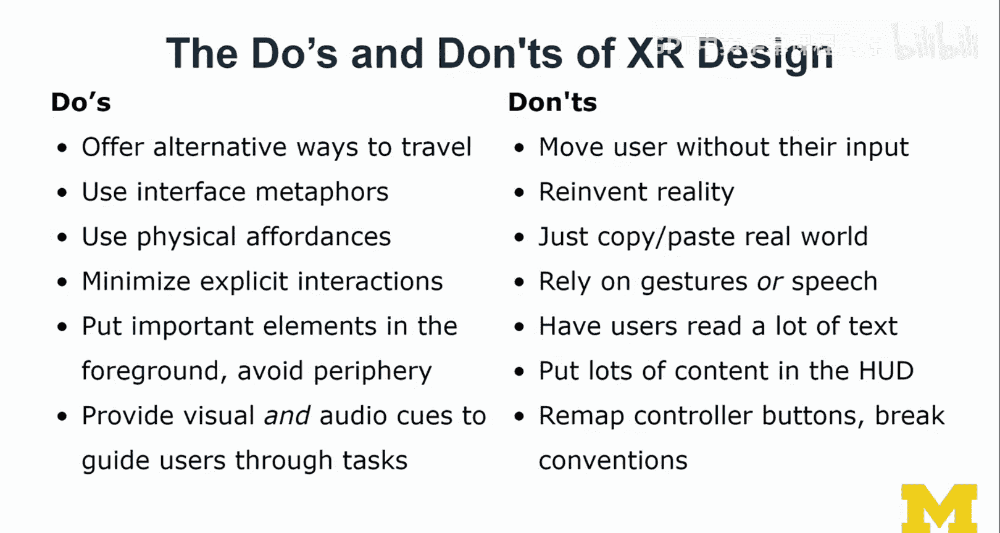

# 密歇根大学《面向所有人的扩展现实（介绍⧸设计⧸开发）｜Extended Reality for Everybody Specialization》中英字幕 p55 18_XR设计最佳实践.zh_en -BV1jM4m1k73q_p55-

So over the past few years， I've really worked on quite a few AR and VR projects and I was thinking about what kinds of guidelines could I share with you。

 my attempt of making it concrete and hopefully useful and less vendor and platform specific and more focused on really the issues that I see in X design。

 and I've classified it into the do's and the dons。And we're going to go over them， so here they are。

 really it's like a list， you can just explore it and I'll walk it over each of these issues。

So first， I talk about offer alternative ways to travel。 So what I mean by this is like， for example。

 allowing users to go to travel to places through a menu or through gaze based interaction by clicking locations in the world and landmarks or different kinds of teleportation。

 But what you should really try to avoid is to move users without their input。

 So you should really not。Move them unless they indicated they want to be moved。

 it will feel really awkward。 The other thing that's also weird is if the virtual character is moving and the user is actually sitting So it really conflicts with proprieception。

 So our understanding of what our nerves and sensors are actually doing。

I think you should use interface metaphors as much as possible。

 but you should also pay attention to using modern interface metaphors and it's really important not to try to reinvent reality。

 So I know the idea of virtual reality is sometimes to port you into this completely different space。

 but if that space doesn't adhere to physics and any kinds of things that we know from the real world what's the point of calling it a virtual reality。

 Now you can actually change gravity in all those kinds of aspects。

 but the basic laws of physics should still apply， it should still feel like a world that is known to us and familiar to us。

 I think you should also make as much use as possible of physical affordances to really communicate to users how they can pick up an object and whether an object can be moved rotate and scaled or not I think after pick up obviously providing feedback but these initial。

😊，Physical affordances are really important to allow users to confidently explore an AR of your scene。

I would caution and advice against this idea of making it a copy of the real world。

 So an example I share with you later is stairs。 So I've really thought a lot about why we have stairs in virtual reality。

 for example， I mean we can teleport We can use a menu to get to places Why do we have stairs。

 and I think it has to do with this idea of physical affordances to communicate to us there is actually a level that you can go up or down and just helps us read the space and understand the environment。

 So I get that but really think about the amount of stairs。

 we need to navigate and that stairs are actually really not accessible in in the virtual world and also not in the physical world as you know you should minimize or reduce the amount of required explicit interactions So a user doesn't really want to like have to speak a lot a lot of voice commands or repeatedly perform a very specific。

set of gestures。 I think the hand interaction example I just showed from the Hollens mixture reality toolkit too。

 I think it's great because there's a lot of implicit camerabased interactions and then like grabbing a slider and then moving it but being able to like going out of that positions and not having to hold it and just continue I think those are great examples of reducing ergonomic effort on users。

 So I think that is really important。 Also don't rely on gestures or speech。

 So I've seen a lot of user interfaces where everything was gesturebased and no way of using speech or the other way around where everything was voicebased commands。

 and then some of the more traditional gestures that you would expect for scaling。

 rotating etc elements。😊，Didn't work so the challenge is really to find the balance between explicit and implicit interactions and then also within the explicit interaction space。

 the amount of gestures， speech and multimod so I think that's still quite a challenge。

So here's a relatively standone， but I think it's important。

 put important elements in the foreground， avoid the periphery and so many people talk about this。

 I really just think it's like you know， 2D screen based design。

 you put everything that's important above the fold。

 you lose people and the more they have to scroll in interfaces and this applies to ARVR as well。😊。

Really don't have users read a lot of text and I'm going come back to that one because I think it's fundamental and I'll show you examples of how bad this actually is in AR and VR。

 provide visual and audio cues to guide users through tasks， don't just rely on one sense。

 really use this mix I've seen a lot of VR experiences that are really visual and no audio and audio makes such a big difference on the AR side if you're working on a smartphone users often choose to maybe mute their phones。

 So maybe not as important。 but in general， I think you should aim again for this mix and having both types of cues really influence how users navigate and interface and operate in interface。

 And finally， but this one should be relatively clear anyway。 but it still happens。

 I've seen it in a lot of interfaces So don't remap the controller buttons just because the interfaces now in a different mode。

 It's really difficult for users to relearn。the functions and then remember which mode they're in and really try to avoid breaking any kinds of design conventions or going against mainstream unless you're really confident about your design choice。

 in which case I would encourage you to go about it and maybe you revolutionize design that way。

 but most of the time it really doesn't actually support design and makes it really hard for users as well。

