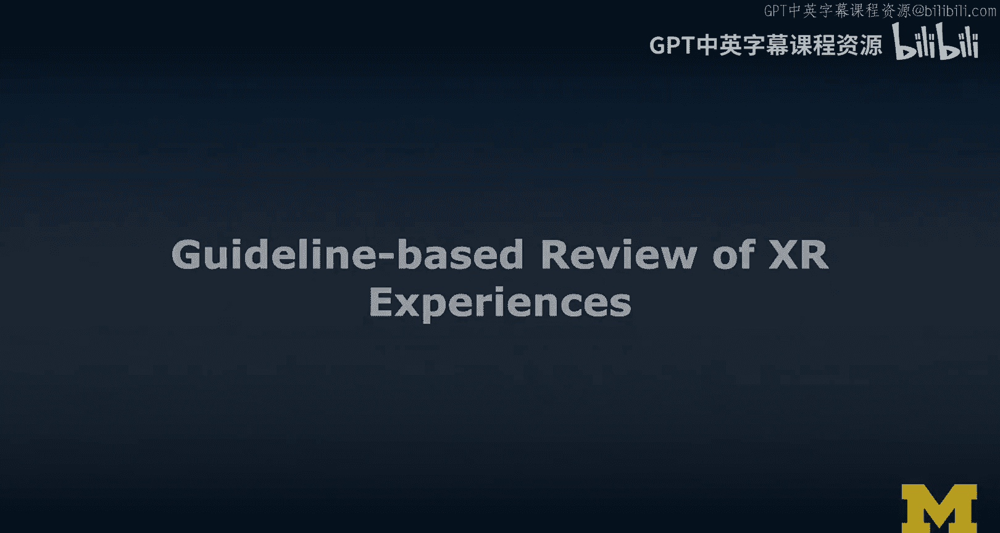
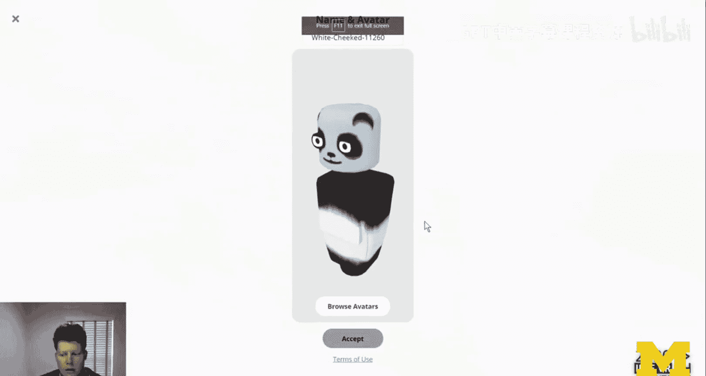
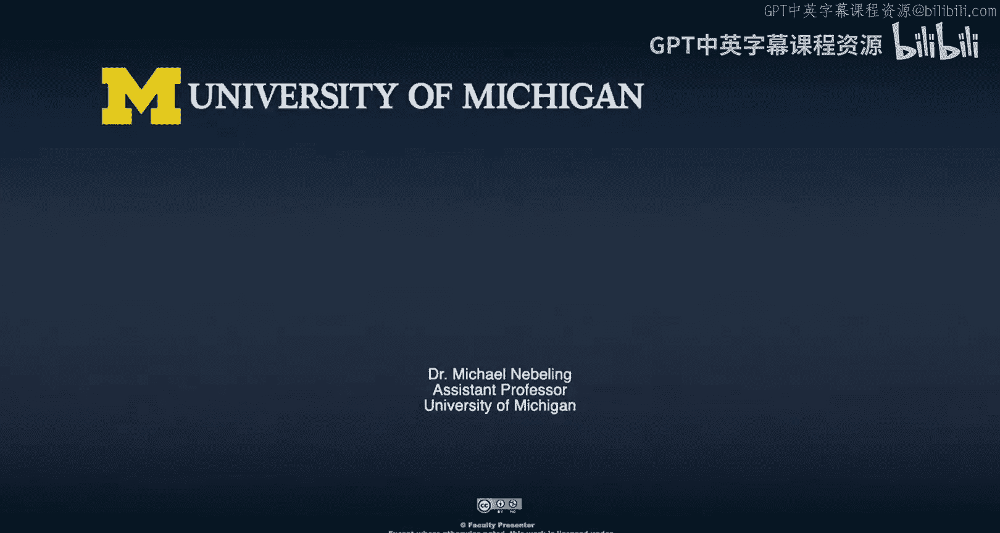

# 密歇根大学《面向所有人的扩展现实（介绍⧸设计⧸开发）｜Extended Reality for Everybody Specialization》中英字幕 p56 19_基于规范的XR体验评审.zh_en -BV1jM4m1k73q_p56-

So we've covered a lot of the dos and dons based on my experience and that experience is coming from doing a lot of research in that space and then also teaching a lot of students about XR design and obviously operating a lot of AR VR applications myself。

 but while I strongly believe that these are a good guidelines its just the starting point just based on my experience and maybe there are people out there that disagree。

 but overall as a starting point I think you can apply those guidelines。

 look at your designs and then look at these guidelines as a checklist and see how many dos you have done and how many dons you have done and then think about ways of avoiding the dons which I think might be a good way to improve design。

So still thinking about design guidelines， I wanted to look at an example and I chose a recent experience that I had when I was attending the IAE virtual reality conference in 2020 and which was supposed to happen in Atlanta but due to COVID-19 had to move to remote and online and we're going to look at some of their spaces that they have created some of the virtual environments that they have created and I have invited my student here Schta。

 who is going to join me in some of these discussions and explorations as well and a couple of the things we're gonna to do is we're going to climb some which I think these two interesting issues we're going to explore the world going for a walk together and then you will also see me picking avatars and looking at a lot of text and then we're going to review some of the design decisions and I'm going to compile a few more tips and maybe guidelines if you will to also avoid those。

Things in the future。So here I'm looking down the venue。

 this is the stage that they have and I'm waiting for my student Trida there she is and I see her and I can see how she is。

Essentially trying to make her way up so they have designed this stage so that you start in the back where you have a little bit of privacy in some sense you don't hear the speakers and can have a chat and then others won't hear in that area if they're up here on that stage so that's good but you then actually have to plan those stairs and these stairs are really not accessible no matter whether using keyboard and mouse like I do here in this example or a VR headset which I'll do in some of the other examples in the future so stairs really is an interesting issue to me and something we should think about more and potentially avoid as much as possible。

And so then I was thinking， okay， let's explore a little bit more of this venue and I decided we were attending this conference for a while and then I said to Shada。

 hey， why don't we go for a walk and explore some of their？😊，Bigger virtual spaces。

 And so we ended up on this Georgia Tech campus。 Now I haven't actually been to the Georgia Tech campus so I don't know how much it really resembles reality but I could imagine that unless they had a major investment it probably doesn't look like this。

 So in many ways they reinvented reality here with and that makes sense。 I mean， I guess I mean。

 the big Be and and some of these virtual screens floating around。

 So it's an interesting mix of I this is a selfie from Blair one of the organizers and a friend who I hope doesn't mind it critique and review this a little bit to look at our guidelines and which of these can apply and then。

We were going for a walk and there were some issues again， it's a ramp here。 it's not stairs。

 but I could teleport with my mouse pretty easily and then。

Shuweda was using a MacBook and didn't have right click so she couldn't actually navigate the space with mouse and teleport so had to walk all the way and for a novice user。

 Schhuda is not an novice user， but for somebody who explores such a world and VR for the first time figuring out how to move in a space when it's unclear and that you have this option potentially of teleporting if it's available。

 that is actually really quite an important step and obviously the more experience you have in these spaces。

 the more of that experience translatelights between spaces and experiences and so maybe it won't be so much of an issue later。

But onboarding is really quite difficult， though。And then this is really。

 it's an interesting example because I really don't get a good sense of what the Georgia Tech campus looks like apart from a few billboards and then text here and。

Now that text is okay， the way it's placed is actually quite well done， it's on a billboard。

 it has sufficient contrast， if not just floating， I'll have another example later that I think is pretty bad。

Then we were walking around a little bit more exploring some of the other spaces。

 ending up at a campfire which was really quite an interesting atmosphere and the way you navigate those spaces was interesting so one of these tiles was actually a portal into a different world so there's a little bit of inconsistency here in terms of the content that you see on the walls。

 some of it is actually video， some of it is text and some of this can be played I guess or not so it's really quite a lot of stuff going on and then as I said one of those tiles actually functions as a portal into different spaces so。

I do like that they illustrate a lot of the content here and some of the hard work that really went behind creating this experience and this online conference essentially so why do I pick this example because I think it really allows us to review some of guidelines this idea of not really copy pasting reality offering alternative ways of navigating。

 making use of established interface metaphors and limiting the amount of access interaction and I was really stuck on the stairs example and the platform that I was talking about just because it while it was good in terms of physical affordances that understood that I I can get to a different part of this virtual world and I can navigate up and down or further away it really reintroduced all these known accessibility issues from the physical world。

And that's just like a big problem in an experience like this。

So when you go to a conference like this， you really want to learn what kinds of things are actually available。

 what sessions are on and。Also here they kind of replicated the real world。

Wwhich usually you have some kind of handout or some kind of boards and somebody from the community created this room essentially putting these program information sheets into into the virtual world here but it's really a lot of text and hard to navigate to the extent that I'm like almost bumping into it and it really wasn't that helpful after all。

 the main purpose was not to have to leave the virtual reality experience。

 it was a quick fix because a lot of people felt like oh always have to jump back to the virtual reality website and but I just want this information in VR。

 so decisioning in and out of VR is still an issue and it's very disruptive to the user experience so I get it but the way we deal with text here is not ideal。

So why do I say this I want to show you two examples and one is in VR and one is in AR and we're going to talk about the format and the layout of the text and I'm just using some standard text with as little format and layout as possible and then I'll show you the different experiences in VR and AR。

So my first example is Laurem Ipsenarm caseholder a text in VR and I just really placed it into the scene and you can see it in stereoscopic view here and it's really hard for me to actually view it at any one time then this idea of using your hands and fingers as reading aid only partially works with this really big VR controller here now that may improve a little bit of hand tracking but it's still kind of an issue so here I'm showing you an augmented reality example where I inserted the same text in the studio and there happens to be this light source that I obviously need to lit the scene and make sure that you can see me on camera and this could be just the sun in the real world it really introduces a lot of issues with reading this text and just seeing it so really you need to pay attention to the environment both the virtual and the physical that this。

of the text is kind of okay I put it at1 m away。 It shouldn't be further away than2 m。

 is what people say The scale is still a little big for my taste。 But if I'm scale it down。

 it really introduces new issues。 So text in general。

 there is no really good solution it would need to be adaptive I guess and know a lot about the user and maybe the prescription and all kinds of things。

 So just try to avoid it and again， reading aids here like using my finger my finger appears behind the screen just because we don't actually in this example have fingerbased or a hand occlusion and fingerbased occlusion。

 getting there in improving some of this， but it's not available on all platforms。

 and even then I don't think this part of improving the technology would actually solve the issue。

 So my last example is avatars。 So let's think about the design space that we have in terms of ourtaar I show two examples here。

 one is with。mission from my friend Jeremy Nelson who appears in his kind of like reconstructed avatar all he did was upload a photo to spatial and meeting kind of software。

 So that's what you see on the right and then on the left you see some of the avatars that I used for example in Mozilla Has and those are the ones that I chose from when I was actually going to the I EVR conference。

 So when you compare those types of avatars you definitely see that the ones on the left are more abstract but appear to be more consistent and the one on the right and more realistic。

 but there were some issues with the scale in the position of Jeremy So he appeared in my desk for example。

 and I always look down on him which normally isn't the case we are almost the same height so it was a little disturbing and confusing now these things will probably be improved in the future。

 but sometimes the more abstract avatars。are actually just good enough and we don't necessarily need to see and need to recreate the whole reality just because we have all these tracking issues which are then even worse the closer you are into reality。

 the higher your expectations are and the more disruptive the user experience is if something goes wrong。

You know， if this little avatar on the left doesn't move properly， it's weird， but it's okay。

 But if Jeremy's arms or legs bend in the weird way， you know， when I imagine that。

 So here I'm gonna show an example of where I chose my avatar and wasn't happy initially。

 I was going to this conference。 It was a little funny because I did spend quite some time on my outfit and choosing there was one particular character I was looking for。

 it was kind of like this ironman looking metal guy。 And I think I found him on the last page。😊。

But this was probably the closest or it wasn't available。

 That was also disappointing that an avatar that I used to use was not available in this specific experience。

 And so it really， in terms of consistency was a little disruptive。

So these were some of the examples that I put together for you to illustrate some of the guidelines。

 I didn't have an example for each and every guideline but take a look at them。

 explore them a little bit more detail and again as I said。

 use them as a checklist to understand and identifyent opportunities for improvement to your XR designs and again treat them as a starting point maybe you disagree that's fine maybe you have a particular example where this guideline doesn't really apply so the rule doesn't apply but I think it's important that we have some kind of guidelines。

 these are the ones that formed in my head over a few years of working with novice designers particular students and then also based on my own experience like going to this Irop EVR conference and I't want to be too negative obviously it was a cool experience but as a designer when you look at some of the artifacts created。

Like the virtual environments that we looked at and really they didn't have a lot of time。

 they had to put this together very quickly and I assume little user testing and then working with this new medium and VR for conferences is still pretty new so all that is obviously clear so I'm not attacking them in that way it's just a great example to study how much do you want to push the realism and the tradeoff between making it like a reality and then all the issues that come with it when you don't actually live up to that expectation when you actually break the illusions be it through your design and some shortcomings of it or maybe issues with the technology like limited tracking or other kinds of issues so I'm going to leave this video a little bit more open-ended just because I do think that these guidelines don't need to evolve and at least now we have a way to think about guidelines and how to assess the source of guidelines and when they apply。

And don't apply。So I'm going to leave you there and think about the stairs。But still。

 I think it is fascinating to me and if you get into this。

 if you get to this stage where you start obsessing about some of these design decisions and why things are there。

 so questioning some of the design decisions， then I think it shows that you're starting to think critically about design and that is a really good thing and that would make me proud if that's what I have accomplished today with this lecture。

😊。

