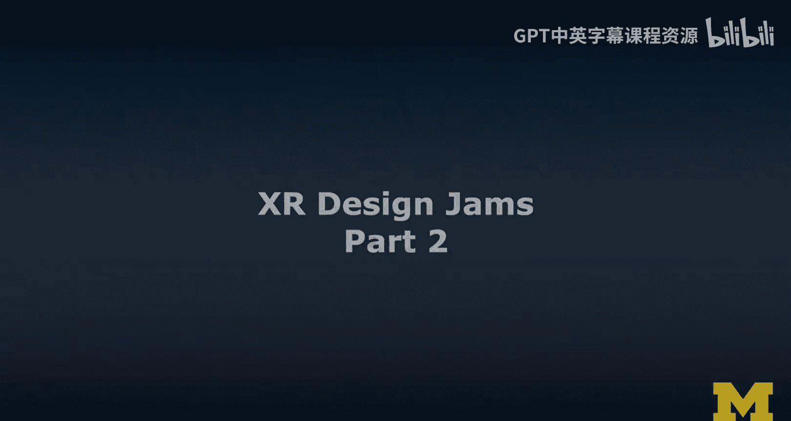
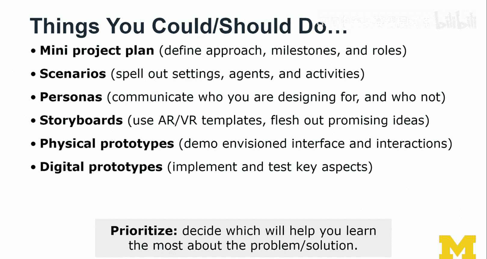
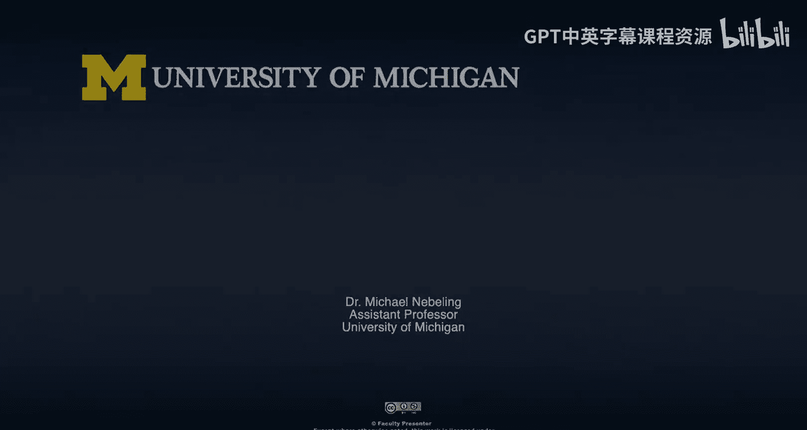

# 密歇根大学《面向所有人的扩展现实（介绍⧸设计⧸开发）｜Extended Reality for Everybody Specialization》中英字幕 p58 21_XR设计研讨会第二部分.zh_en -BV1jM4m1k73q_p58-

So now we're switching perspectives。 and now we're thinking about participating in design gems。

Here's a few tips that I usually give my students in my classes because obviously these theres a lot of design jams out there。

 a lot of companies run design jams and especially in the ARVR space and its sometimes as I said。

 used as a recruitment tool as well So you really want to do well here。

 And so here I've collected a few tips through my own observations over the years。

 running lots of design jams， as I said， in research in my lab and then also in teaching in the classroom。

😊，I'm going to go quickly over each of these principles and almost read them out to you。

 but I think they should basically stand for themselves。Making a plan is crucial。

 So really distribute the rules and let them evolve these rules。 Okay。

 sketch to brainstorm Don't just brainstorm sketch。 It's very important。

 I've seen a enough of design gems where basically you just talk， talk， talk and nothing happens。

 Nothing comes to paper。 but paper is such an important medium to communicate ideas。

 So I really always emphasize this idea of sketching to ideate。

 not just brainstorming and thinking bubbles， which I cannot really see。Make use of space。

 So this is be physical， be visual， be creative。Divide the workload。

 so not everything has to be done in peril， try to identify opportunities to divide the labor and then maybe take turns so that nobody gets bored and really use the facilitator so one person that really pushes the team because most design jams are time limited and structured into several sections so it helps to move forward and actually be efficient as a team。

And then the key deliverable is something you should really decide on。

 so I'll list a few examples here， but not each of them are important。

 And if you have taken standard user experience design or interaction design classes。

 you really start with scenarios， personas， competitors。 And yes， I've talked about that as well。

 But I think really just get down to sketching， quickly sort out your storyboards。

 maybe prototype something physically， if you have the time， do a digital prototype。

 if that is something that would be of benefit and seems doable to you， but really be creative。

 and then as I said， in most of my design gems， usually the product is a video。 and that video。

 if you have a little bit of time for editing and cutting， not so much the music。

 but like really focusing on the details of cutting off the things that would be distracting。

 don't focus on nice video overlays and title slides and all this kind of stuff。 No。

 keep it kind of so。😊，It's like ad hoc， you feel like you're there， you're part of that experience。

 you see that prototype for yourself， even though it's just a video。

And so keep it dynamic and don't make it too professional。And then throughout the design jam。

 one of the really， really important things I cannot emphasize enough is that you should really experiment。

 try out alternative design ideas。 you can do this through parallel prototyping and then maybe choose some of the best ideas but don't judge immediately let everybody see a little bit and come together So these are some of the best ways I've seen teams organize themselves and then when it comes to documenting design you should really think of documenting the evolution so don't just take the pictures at the end when you're really proud of what you've accomplished and maybe you've won something and reasons to celebrate even if you haven't won。

 there's always reasons to celebrate So don't just take pictures at the end。😊。

And then this is like from the heart， but because I know that companies increasingly see value in design gems。

 So for example， at Umiish and in my lab specifically lots of companies approach us and want to work with me and my students and the only way to really do well in these design jams is to practice practice practice so participate in as many design gems as possible and then in these design gems don't treat it so much as a competitive kind of activity treat it as something collaborative and fun and try to feel for the boundaries or you know the end of the envelope if you will by soliciting feedback from other teams basically your competitors or maybe even some of the organizers I think this can lead to really cool discussions。

 I usually observe it with students that they seem to be just focused on their teams and but it's really actually cool to take a break and look around and see what others are working on because a lot of。

😊，The value from these design gems and the best results in these design gems don't just come from sticking within your team and within and sticking to that specific idea of yours。

 but kind of like seeing what the others are doing and incorporating some of these elements。

 even though it feels like cheating and it's boring and it's creative。

 And so I wouldn't totally discourage it。So in summary， as a participant。

 here are a few things you could or really should do。 So before you get started。

 make a little bit of a plan。 Think about the time that you have， define your approach。

 maybe the roles in the team， and then also the milestones。

 your interpretation of the goals and deliverables。😊，We do think about the scenarios。

 but maybe don't spend too much time writing them just like try to agree verbally or implicitly in some way with your team。

 so be clear on the users， the agents and what they are doing And then another thing that are often observe is then a lot of design prompt and design activities seem a little vague and they're subject to interpretation。

 so rather than getting frustrated about that， you should see it as an opportunity to make decisions not assumptions。

 but decisions and then clearly articulate why you have design something this way。

 because you were designing for this type of persona or for this type of context。

 namely physical environment， etc。 So make decisions in your scenarios and throughout all the activities。

Yes， you could use personas and if you do， then obviously they would just be used as a tool to communicate who you are designing for and importantly who you are not designing for。

Storyboards， I think are really key for that and I'll show you in some of the physical prototyping activities we actually have specific ARVR templates and I think it's often a good idea to use some templates。

 but then don't just fill in those templates， break out of those templates if it's justified by your design ideas and push that creativity and novelty edge a little bit。

😊，Flelash out the most promising ideas and then really quickly transition into something that is more tangible like a physical prototype or maybe even a digital prototype The physical prototypes would allow you to quickly demo the envisioned interface and associated interactions and the digital prototype will demonstrate feasibility if you're good with the tools but I wouldn't just always jump into the digital prototyping because it's often quite unrealistic to get a really robust and useful prototype I would often favor the physical over the digital especially in those design jams。

So these were just a few concrete ideas and examples of what you could or should be doing。

 I think you should decide for yourself and with your team， which of these you want to prioritize。

 usually can't do all of them but pick those that really help you learn the most about the problem and then also the solution。

 So the last thing I would like to say I said I've used design gems a lot in my research and every design gem has been different。

 and there is some kind of really creative part about that methodology that I like。

 it's very different from a lab-based user study or some kind of controlled experiment and I really like that creative component both in terms of like what the participants produce but also how you run it I think that a very valuable part and I think lots of interesting kinds of data usually come out of these design gems So both the kinds of prototypes that participants have created。

 we've analyzed a lot of different ways and learn。

wayWhat kinds of gestures， interactions， speech commands。

 How do they think about Ma model interaction， How do they think about VR。

 How do they think about AR， Should our prototype really be an AR or VR prototype So all these kinds of things you can really get out of these design gems。

 It's very， very useful。 So think of them as a tool embed them early and throughout the design of your project。

 I really can't get enough of design gems。 And I hope that's a joy and a passion that you will share with me。

😊。

